# 🥈 Tutorial 02: Silver Layer

> **[🏠 Home](../../README.md)** > **[📖 Tutorials](../README.md)** > **🥈 Silver Layer**

---

<div align="center">

## Tutorial 02: Silver Layer - Data Cleansing & Transformation

| | |
|---|---|
| **Difficulty** | ⭐⭐ Intermediate |
| **Time** | ⏱️ 60-90 minutes |
| **Layer** | 🥈 Silver (Cleansed Data) |

</div>

---

### 📍 Progress Tracker

```
┌────────┬────────┬────────┬────────┬────────┬────────┬────────┬────────┬────────┬────────┐
│   00   │   01   │   02   │   03   │   04   │   05   │   06   │   07   │   08   │   09   │
│ SETUP  │ BRONZE │ SILVER │  GOLD  │  RT    │  PBI   │ PIPES  │  GOV   │ MIRROR │  AI/ML │
├────────┼────────┼────────┼────────┼────────┼────────┼────────┼────────┼────────┼────────┤
│   ✓    │   ✓    │  ▶▶▶   │        │        │        │        │        │        │        │
└────────┴────────┴────────┴────────┴────────┴────────┴────────┴────────┴────────┴────────┘
                     ▲
                     │
                YOU ARE HERE
```

| Navigation | |
|---|---|
| ⬅️ **Previous** | [01-Bronze Layer](../01-bronze-layer/README.md) |
| ➡️ **Next** | [03-Gold Layer](../03-gold-layer/README.md) |

---

## 📖 Overview

This tutorial covers implementing the **Silver layer** - the heart of data cleansing, validation, and transformation. The Silver layer transforms raw Bronze data into validated, high-quality datasets ready for business use.

```mermaid
flowchart LR
    subgraph Bronze["🥉 Bronze Layer"]
        B1[Raw Slot Data]
        B2[Raw Player Data]
        B3[Raw Financial Data]
    end

    subgraph Silver["🥈 Silver Layer"]
        S1[Cleansed Slots]
        S2[Player Master<br/>SCD Type 2]
        S3[Validated Transactions]
    end

    B1 -->|Cleanse & Validate| S1
    B2 -->|Dedupe & Track| S2
    B3 -->|Reconcile & Verify| S3

    style Silver fill:#C0C0C0,stroke:#808080,stroke-width:2px
```



---

## 🎯 Learning Objectives

By the end of this tutorial, you will be able to:

- [ ] Understand Silver layer principles and data quality concepts
- [ ] Implement comprehensive data quality checks
- [ ] Apply SCD Type 2 for historical player tracking
- [ ] Perform deduplication using window functions
- [ ] Enforce schemas with Delta Lake
- [ ] Calculate data quality scores

---

## 🥈 Silver Layer Principles

The Silver layer transforms raw data into validated, cleansed datasets:

| Principle | Description | Example |
|-----------|-------------|---------|
| **Cleansed** | Remove/fix invalid data | Remove null event_ids |
| **Validated** | Apply business rules | Verify event types are valid |
| **Deduplicated** | Remove duplicate records | Keep latest by ingestion time |
| **Conformed** | Standardize formats | Consistent date formats |
| **Enriched** | Add derived columns | Calculate net_win, hold_percentage |

### Data Quality Dimensions


---

## 📋 Prerequisites

Before starting this tutorial, ensure you have:

- [x] Completed [Tutorial 01: Bronze Layer](../01-bronze-layer/README.md)
- [x] Bronze tables populated with sample data
- [x] Access to `lh_silver` Lakehouse
- [x] Understanding of PySpark basics

> **💡 Tip:** Verify your Bronze layer is ready by running the verification notebook from Tutorial 01.

---

## 🛠️ Step 1: Slot Machine Data Cleansing

### Create Notebook: `01_silver_slot_cleansed`

This notebook demonstrates comprehensive data cleansing for slot machine telemetry.

```python
# Cell 1: Configuration
from pyspark.sql import SparkSession
from pyspark.sql.functions import *
from pyspark.sql.types import *
from delta.tables import DeltaTable
from datetime import datetime

# Configuration
BRONZE_TABLE = "lh_bronze.bronze_slot_telemetry"
SILVER_TABLE = "silver_slot_cleansed"

print("=" * 60)
print("🥈 SILVER LAYER - Slot Machine Data Cleansing")
print("=" * 60)
print(f"Source: {BRONZE_TABLE}")
print(f"Target: {SILVER_TABLE}")
```

```python
# Cell 2: Read Bronze Data
df_bronze = spark.table(BRONZE_TABLE)

print(f"\n📊 Bronze Layer Statistics:")
print(f"  Records: {df_bronze.count():,}")
print(f"  Columns: {len(df_bronze.columns)}")
df_bronze.printSchema()
```

```python
# Cell 3: Data Quality Checks
print("\n🔍 Data Quality Analysis:")
print("-" * 40)

# Rule 1: event_id not null and unique
null_event_ids = df_bronze.filter(col("event_id").isNull()).count()
print(f"❌ Null event_ids: {null_event_ids}")

# Rule 2: Valid event types
valid_events = [
    "GAME_PLAY", "JACKPOT", "METER_UPDATE", "DOOR_OPEN", "DOOR_CLOSE",
    "BILL_ACCEPTED", "TICKET_PRINTED", "HAND_PAY", "TILT", "POWER_OFF", "POWER_ON"
]
invalid_events = df_bronze.filter(~col("event_type").isin(valid_events)).count()
print(f"❌ Invalid event types: {invalid_events}")

# Rule 3: coin_in >= 0 when present
negative_coin_in = df_bronze.filter(col("coin_in") < 0).count()
print(f"❌ Negative coin_in: {negative_coin_in}")

# Rule 4: event_timestamp within expected range
future_events = df_bronze.filter(col("event_timestamp") > current_timestamp()).count()
print(f"❌ Future timestamps: {future_events}")

# Rule 5: Valid denomination values
valid_denoms = [0.01, 0.05, 0.25, 0.50, 1.00, 5.00, 25.00, 100.00]
invalid_denoms = df_bronze.filter(
    col("denomination").isNotNull() & ~col("denomination").isin(valid_denoms)
).count()
print(f"❌ Invalid denominations: {invalid_denoms}")

# Summary
total_issues = null_event_ids + invalid_events + negative_coin_in + future_events
total_records = df_bronze.count()
quality_score = ((total_records - total_issues) / total_records) * 100 if total_records > 0 else 0
print("-" * 40)
print(f"📈 Initial Quality Score: {quality_score:.2f}%")
```

> **⚠️ Warning:** Records failing quality checks will be filtered out. Consider logging rejected records to a quarantine table for investigation.

```python
# Cell 4: Apply Cleansing Transformations
print("\n🧹 Applying Cleansing Transformations...")

df_cleansed = df_bronze \
    .filter(col("event_id").isNotNull()) \
    .filter(col("event_type").isin(valid_events)) \
    .filter(col("event_timestamp") <= current_timestamp()) \
    .withColumn("coin_in", when(col("coin_in") < 0, 0).otherwise(col("coin_in"))) \
    .withColumn("coin_out", when(col("coin_out") < 0, 0).otherwise(col("coin_out"))) \
    .withColumn("denomination",
        when(col("denomination").isNull(), 0.01)
        .when(~col("denomination").isin(valid_denoms), 0.01)
        .otherwise(col("denomination")))

records_after = df_cleansed.count()
records_removed = df_bronze.count() - records_after
print(f"  Records removed: {records_removed:,}")
print(f"  Records remaining: {records_after:,}")
```

### Transformation Mapping

| Source Column | Transformation | Target Column |
|---------------|----------------|---------------|
| `event_id` | Filter NULLs | `event_id` |
| `event_type` | Filter invalid | `event_type` |
| `coin_in` | Replace negative with 0 | `coin_in` |
| `coin_out` | Replace negative with 0 | `coin_out` |
| `denomination` | Default to 0.01 if invalid | `denomination` |
| `event_timestamp` | Filter future dates | `event_timestamp` |

```python
# Cell 5: Deduplication
from pyspark.sql.window import Window

print("\n🔄 Removing Duplicates...")

# Remove duplicates based on event_id (keep latest ingestion)
window_spec = Window.partitionBy("event_id").orderBy(col("_bronze_ingested_at").desc())

df_deduped = df_cleansed \
    .withColumn("_row_num", row_number().over(window_spec)) \
    .filter(col("_row_num") == 1) \
    .drop("_row_num")

duplicates_removed = df_cleansed.count() - df_deduped.count()
print(f"  Duplicates removed: {duplicates_removed:,}")
print(f"  Unique records: {df_deduped.count():,}")
```

```python
# Cell 6: Add Silver Metadata & Derived Columns
print("\n✨ Adding Derived Columns...")

df_silver = df_deduped \
    .withColumn("_silver_processed_at", current_timestamp()) \
    .withColumn("_silver_batch_id", lit(datetime.now().strftime("%Y%m%d_%H%M%S"))) \
    .withColumn("event_date", to_date(col("event_timestamp"))) \
    .withColumn("event_hour", hour(col("event_timestamp"))) \
    .withColumn("event_day_of_week", dayofweek(col("event_timestamp"))) \
    .withColumn("net_win", col("coin_in") - col("coin_out")) \
    .withColumn("hold_percentage",
        when(col("coin_in") > 0,
             round((col("coin_in") - col("coin_out")) / col("coin_in") * 100, 2))
        .otherwise(0)) \
    .withColumn("is_jackpot", col("event_type") == "JACKPOT") \
    .withColumn("is_game_play", col("event_type") == "GAME_PLAY")

print("  Added columns:")
print("    - _silver_processed_at (metadata)")
print("    - _silver_batch_id (metadata)")
print("    - event_date, event_hour, event_day_of_week (time dimensions)")
print("    - net_win, hold_percentage (financial KPIs)")
print("    - is_jackpot, is_game_play (flags)")
```

```python
# Cell 7: Write to Silver Table
print("\n💾 Writing to Silver Table...")

df_silver.write \
    .format("delta") \
    .mode("overwrite") \
    .partitionBy("event_date") \
    .saveAsTable(SILVER_TABLE)

print(f"✅ Wrote {df_silver.count():,} records to {SILVER_TABLE}")
```

```python
# Cell 8: Verify Silver Table
df_verify = spark.table(SILVER_TABLE)

print("\n" + "=" * 60)
print("✅ VERIFICATION COMPLETE")
print("=" * 60)
print(f"\n📊 Silver Table Statistics:")
print(f"  Total Records: {df_verify.count():,}")
print(f"  Partitions (dates): {df_verify.select('event_date').distinct().count()}")

print(f"\n🔍 Data Quality Check:")
print(f"  Null event_ids: {df_verify.filter(col('event_id').isNull()).count()}")
print(f"  Negative coin_in: {df_verify.filter(col('coin_in') < 0).count()}")
print(f"  Future timestamps: {df_verify.filter(col('event_timestamp') > current_timestamp()).count()}")

# Display sample
print("\n📋 Sample Records:")
display(df_verify.limit(5))
```

---

## 🛠️ Step 2: Player Master with SCD Type 2

### Understanding SCD Type 2

Slowly Changing Dimension Type 2 maintains a complete history of changes to player records. This is critical for:

- **Regulatory compliance**: Track when tier status changed
- **Analytics**: Analyze player behavior over time
- **Marketing**: Understand loyalty progression

```mermaid
sequenceDiagram
    participant Source as Bronze Data
    participant Target as Silver SCD2

    Note over Source,Target: Player "P001" enrolls
    Source->>Target: Insert (is_current=true)

    Note over Source,Target: Player tier changes Bronze→Silver
    Source->>Target: Update existing (is_current=false, effective_to=now)
    Source->>Target: Insert new version (is_current=true)

    Note over Target: Both versions preserved!
```



### Create Notebook: `02_silver_player_master`

```python
# Cell 1: Configuration
from pyspark.sql import SparkSession
from pyspark.sql.functions import *
from delta.tables import DeltaTable
from datetime import datetime

BRONZE_TABLE = "lh_bronze.bronze_player_profile"
SILVER_TABLE = "silver_player_master"

# SCD Type 2 configuration
BUSINESS_KEY = "player_id"
TRACKED_COLUMNS = [
    "loyalty_tier", "points_balance", "tier_credits",
    "communication_preference", "marketing_opt_in", "account_status"
]

print("=" * 60)
print("🥈 SILVER LAYER - Player Master (SCD Type 2)")
print("=" * 60)
print(f"Business Key: {BUSINESS_KEY}")
print(f"Tracked Columns: {', '.join(TRACKED_COLUMNS)}")
```

```python
# Cell 2: Read Bronze Data
df_bronze = spark.table(BRONZE_TABLE)

print(f"\n📊 Source Statistics:")
print(f"  Total Records: {df_bronze.count():,}")
print(f"  Unique Players: {df_bronze.select('player_id').distinct().count():,}")
```

```python
# Cell 3: Prepare Source Data with Change Detection Hash
print("\n🔐 Creating Change Detection Hash...")

# Create hash of tracked columns for efficient change detection
df_source = df_bronze \
    .withColumn("_record_hash",
        sha2(concat_ws("|", *[coalesce(col(c).cast("string"), lit("")) for c in TRACKED_COLUMNS]), 256)) \
    .withColumn("_effective_from", current_timestamp()) \
    .withColumn("_effective_to", lit(None).cast("timestamp")) \
    .withColumn("_is_current", lit(True)) \
    .withColumn("_silver_processed_at", current_timestamp())

print("  Added SCD2 columns:")
print("    - _record_hash (change detection)")
print("    - _effective_from (version start)")
print("    - _effective_to (version end)")
print("    - _is_current (active flag)")
```

```python
# Cell 4: Check if Silver table exists
table_exists = spark.catalog.tableExists(SILVER_TABLE)
print(f"\n🔍 Silver table exists: {table_exists}")
```

```python
# Cell 5: Initial Load or SCD Type 2 Merge
if not table_exists:
    # Initial load - simple insert
    print("\n📥 Performing Initial Load...")

    df_source.write \
        .format("delta") \
        .mode("overwrite") \
        .saveAsTable(SILVER_TABLE)

    print(f"✅ Initial load complete: {df_source.count():,} records")

else:
    # SCD Type 2 Merge
    print("\n🔄 Performing SCD Type 2 Merge...")

    delta_table = DeltaTable.forName(spark, SILVER_TABLE)

    # Step 1: Expire changed records
    delta_table.alias("target").merge(
        df_source.alias("source"),
        f"target.{BUSINESS_KEY} = source.{BUSINESS_KEY} AND target._is_current = true"
    ).whenMatchedUpdate(
        condition="target._record_hash != source._record_hash",
        set={
            "_effective_to": "source._effective_from",
            "_is_current": "false"
        }
    ).whenNotMatchedInsertAll().execute()

    # Step 2: Insert new versions for changed records
    # Get records that were just expired
    df_expired = spark.table(SILVER_TABLE) \
        .filter(col("_is_current") == False) \
        .filter(col("_effective_to").isNotNull()) \
        .select(BUSINESS_KEY)

    # Insert new current versions
    df_new_versions = df_source.join(df_expired, BUSINESS_KEY, "inner")

    if df_new_versions.count() > 0:
        df_new_versions.write \
            .format("delta") \
            .mode("append") \
            .saveAsTable(SILVER_TABLE)
        print(f"  Inserted {df_new_versions.count():,} new versions")

    print("✅ SCD Type 2 merge complete")
```

> **💡 Tip:** For production systems, consider using a staging table approach for better performance and atomicity.

```python
# Cell 6: Verify SCD History
df_history = spark.table(SILVER_TABLE)

print("\n" + "=" * 60)
print("✅ PLAYER MASTER VERIFICATION")
print("=" * 60)
print(f"\n📊 Statistics:")
print(f"  Total Records: {df_history.count():,}")
print(f"  Current Records: {df_history.filter(col('_is_current')).count():,}")
print(f"  Historical Records: {df_history.filter(~col('_is_current')).count():,}")

# Show sample player with history
sample_player = df_history.select("player_id").first()[0]
print(f"\n📋 Sample History for Player: {sample_player}")
display(
    df_history
    .filter(col("player_id") == sample_player)
    .select("player_id", "loyalty_tier", "points_balance",
            "_effective_from", "_effective_to", "_is_current")
    .orderBy("_effective_from")
)
```

---

## 🛠️ Step 3: Financial Transaction Reconciliation

### Create Notebook: `03_silver_financial_reconciled`

Financial transactions require special validation for regulatory compliance (CTR, SAR reporting).

```python
# Cell 1: Configuration
from pyspark.sql import SparkSession
from pyspark.sql.functions import *
from datetime import datetime

BRONZE_TABLE = "lh_bronze.bronze_financial_txn"
SILVER_TABLE = "silver_financial_reconciled"

# Regulatory thresholds
CTR_THRESHOLD = 10000  # Currency Transaction Report threshold
SAR_REVIEW_LOW = 8000  # Suspicious Activity Review lower bound
SAR_REVIEW_HIGH = 9999 # Suspicious Activity Review upper bound

print("=" * 60)
print("🥈 SILVER LAYER - Financial Transaction Reconciliation")
print("=" * 60)
print(f"CTR Threshold: ${CTR_THRESHOLD:,}")
print(f"SAR Review Range: ${SAR_REVIEW_LOW:,} - ${SAR_REVIEW_HIGH:,}")
```

```python
# Cell 2: Read and Cleanse
df_bronze = spark.table(BRONZE_TABLE)

print(f"\n📊 Source Statistics:")
print(f"  Total Transactions: {df_bronze.count():,}")

df_cleansed = df_bronze \
    .filter(col("transaction_id").isNotNull()) \
    .filter(col("amount") > 0) \
    .filter(col("transaction_timestamp").isNotNull())

removed = df_bronze.count() - df_cleansed.count()
print(f"  Records Removed: {removed:,}")
print(f"  Valid Records: {df_cleansed.count():,}")
```

```python
# Cell 3: Regulatory Validation
print("\n🔍 Regulatory Compliance Validation...")

df_validated = df_cleansed \
    .withColumn("ctr_threshold_check",
        when((col("amount") >= CTR_THRESHOLD) & (~col("ctr_required")), "FAIL")
        .otherwise("PASS")) \
    .withColumn("amount_validated", col("amount") > 0) \
    .withColumn("structuring_risk",
        when(col("amount").between(SAR_REVIEW_LOW, SAR_REVIEW_HIGH), "REVIEW")
        .when(col("amount") >= CTR_THRESHOLD, "CTR_REQUIRED")
        .otherwise("CLEAR"))

# Log validation results
ctr_failures = df_validated.filter(col("ctr_threshold_check") == "FAIL").count()
structuring_reviews = df_validated.filter(col("structuring_risk") == "REVIEW").count()

print(f"  CTR Validation Failures: {ctr_failures}")
print(f"  Structuring Reviews Needed: {structuring_reviews}")
```

> **⚠️ Warning:** CTR validation failures should be investigated immediately. These may indicate data quality issues or compliance gaps.

```python
# Cell 4: Add Reconciliation Columns
print("\n✨ Adding Reconciliation Metadata...")

df_silver = df_validated \
    .withColumn("_silver_processed_at", current_timestamp()) \
    .withColumn("_silver_batch_id", lit(datetime.now().strftime("%Y%m%d_%H%M%S"))) \
    .withColumn("transaction_date", to_date(col("transaction_timestamp"))) \
    .withColumn("transaction_hour", hour(col("transaction_timestamp"))) \
    .withColumn("is_cash_transaction",
        col("transaction_type").isin(["CASH_IN", "CASH_OUT", "CHIP_PURCHASE", "CHIP_REDEMPTION"])) \
    .withColumn("is_reportable", col("amount") >= CTR_THRESHOLD) \
    .withColumn("needs_review",
        (col("suspicious_activity_flag")) |
        (col("amount").between(SAR_REVIEW_LOW, SAR_REVIEW_HIGH))) \
    .withColumn("compliance_status",
        when(col("ctr_threshold_check") == "FAIL", "NON_COMPLIANT")
        .when(col("needs_review"), "PENDING_REVIEW")
        .otherwise("COMPLIANT"))
```

```python
# Cell 5: Write Silver Table
print("\n💾 Writing to Silver Table...")

df_silver.write \
    .format("delta") \
    .mode("overwrite") \
    .partitionBy("transaction_date") \
    .saveAsTable(SILVER_TABLE)

print(f"✅ Wrote {df_silver.count():,} records to {SILVER_TABLE}")
```

```python
# Cell 6: Verification and Compliance Summary
df_verify = spark.table(SILVER_TABLE)

print("\n" + "=" * 60)
print("✅ FINANCIAL RECONCILIATION SUMMARY")
print("=" * 60)

# Compliance breakdown
print("\n📊 Compliance Status Breakdown:")
display(
    df_verify
    .groupBy("compliance_status")
    .agg(
        count("*").alias("transaction_count"),
        sum("amount").alias("total_amount"),
        avg("amount").alias("avg_amount")
    )
    .orderBy("compliance_status")
)
```

---

## 🛠️ Step 4: Remaining Silver Tables

Create similar notebooks for the remaining data domains:

| Notebook | Source | Target | Key Transformations |
|----------|--------|--------|---------------------|
| `04_silver_table_enriched` | bronze_table_games | silver_table_enriched | Dealer/game joins, session calc |
| `05_silver_security_enriched` | bronze_security_events | silver_security_enriched | Event correlation, severity |
| `06_silver_compliance_validated` | bronze_compliance | silver_compliance_validated | Threshold validation, status |

> **💡 Tip:** Use the patterns established in Steps 1-3 as templates for these notebooks.

---

## 🛠️ Step 5: Silver Layer Verification

### Create Notebook: `99_silver_verification`

```python
# Silver Layer Verification
from pyspark.sql.functions import *

tables = [
    "silver_slot_cleansed",
    "silver_player_master",
    "silver_financial_reconciled",
    "silver_table_enriched",
    "silver_security_enriched",
    "silver_compliance_validated"
]

print("=" * 70)
print("🥈 SILVER LAYER VERIFICATION REPORT")
print("=" * 70)
print(f"Timestamp: {datetime.now().strftime('%Y-%m-%d %H:%M:%S')}")
print("-" * 70)

total_records = 0
passed = 0
failed = 0

for table in tables:
    try:
        df = spark.table(table)
        count = df.count()
        total_records += count

        # Verify required metadata columns
        has_processed = "_silver_processed_at" in df.columns
        has_batch = "_silver_batch_id" in df.columns or "_record_hash" in df.columns

        if has_processed:
            status = "✅ PASS"
            passed += 1
        else:
            status = "⚠️ WARN"

        print(f"{status} {table:40} {count:>12,} records")

    except Exception as e:
        print(f"❌ FAIL {table:40} NOT FOUND")
        failed += 1

print("-" * 70)
print(f"{'SUMMARY':40} {total_records:>12,} total records")
print(f"{'Tables Passed:':40} {passed}/{len(tables)}")
if failed > 0:
    print(f"{'Tables Failed:':40} {failed}/{len(tables)}")
print("=" * 70)
```

---

## 📊 Data Quality Framework

### Define Quality Rules Configuration

```python
# quality_rules.py - Data Quality Rule Definitions
QUALITY_RULES = {
    "slot_telemetry": {
        "completeness": {
            "required_fields": ["event_id", "machine_id", "event_type", "event_timestamp"],
            "threshold": 0.99  # 99% completeness required
        },
        "validity": {
            "coin_in": {"rule": "value >= 0", "description": "Coin-in must be non-negative"},
            "coin_out": {"rule": "value >= 0", "description": "Coin-out must be non-negative"},
            "denomination": {
                "rule": "value in [0.01, 0.05, 0.25, 0.50, 1.00, 5.00, 25.00, 100.00]",
                "description": "Valid denomination values"
            }
        },
        "uniqueness": {
            "primary_key": ["event_id"],
            "threshold": 1.0  # 100% unique
        },
        "timeliness": {
            "rule": "event_timestamp <= current_timestamp",
            "max_age_days": 7
        }
    },
    "player_profile": {
        "completeness": {
            "required_fields": ["player_id", "loyalty_number"],
            "threshold": 0.99
        },
        "validity": {
            "loyalty_tier": {
                "rule": "value in ['Bronze', 'Silver', 'Gold', 'Platinum', 'Diamond']",
                "description": "Valid loyalty tiers"
            },
            "points_balance": {"rule": "value >= 0", "description": "Non-negative points"}
        },
        "uniqueness": {
            "primary_key": ["player_id"],
            "threshold": 1.0
        }
    },
    "financial_txn": {
        "completeness": {
            "required_fields": ["transaction_id", "amount", "transaction_type"],
            "threshold": 0.999  # 99.9% for financial data
        },
        "validity": {
            "amount": {"rule": "value > 0", "description": "Positive transaction amount"},
            "ctr_compliance": {
                "rule": "if amount >= 10000 then ctr_required = true",
                "description": "CTR threshold compliance"
            }
        },
        "uniqueness": {
            "primary_key": ["transaction_id"],
            "threshold": 1.0
        }
    }
}
```

### Data Quality Score Calculation

```python
def calculate_quality_score(df, rules):
    """
    Calculate overall data quality score based on multiple dimensions.

    Returns a score from 0-100 where:
    - 95-100: Excellent quality
    - 85-94:  Good quality
    - 70-84:  Acceptable quality
    - <70:    Needs attention
    """
    total_records = df.count()
    if total_records == 0:
        return 0.0

    scores = []

    # Completeness score
    if "completeness" in rules:
        null_counts = [df.filter(col(f).isNull()).count()
                       for f in rules["completeness"]["required_fields"]]
        completeness = 1 - (sum(null_counts) / (total_records * len(null_counts)))
        scores.append(completeness * 100)

    # Uniqueness score
    if "uniqueness" in rules:
        unique_count = df.select(rules["uniqueness"]["primary_key"]).distinct().count()
        uniqueness = unique_count / total_records
        scores.append(uniqueness * 100)

    # Return weighted average
    return sum(scores) / len(scores) if scores else 0.0
```

---

## ✅ Validation Checklist

Before proceeding to the Gold layer, verify:

| Check | Status | Notes |
|-------|--------|-------|
| All 6 Silver tables created | ☐ | Run verification notebook |
| Data quality checks passing | ☐ | Score > 95% |
| Deduplication applied | ☐ | No duplicate primary keys |
| SCD Type 2 working | ☐ | History tracked for player master |
| Silver metadata columns present | ☐ | `_silver_processed_at`, `_silver_batch_id` |
| Partitioning configured | ☐ | Date-based partitions |

---

## 💡 Best Practices

### Incremental Processing Pattern

```python
# Get watermark from last successful run
last_processed = spark.sql(f"""
    SELECT MAX(_bronze_ingested_at) as watermark
    FROM {SILVER_TABLE}
""").first()["watermark"]

# Process only new records (incremental)
df_incremental = df_bronze.filter(
    col("_bronze_ingested_at") > last_processed
)

print(f"Processing {df_incremental.count():,} new records since {last_processed}")
```

### Data Quality Logging Pattern

```python
# Log quality metrics to monitoring table
from datetime import datetime

quality_metrics = {
    "table_name": SILVER_TABLE,
    "processed_at": datetime.now().isoformat(),
    "records_processed": df_silver.count(),
    "records_rejected": failures,
    "quality_score": round((df_silver.count() - failures) / df_silver.count() * 100, 2),
    "batch_id": BATCH_ID
}

# Write to monitoring table
spark.createDataFrame([quality_metrics]).write \
    .format("delta") \
    .mode("append") \
    .saveAsTable("data_quality_log")

print(f"📊 Quality Score: {quality_metrics['quality_score']}%")
```

### Quarantine Pattern for Failed Records

```python
# Separate good records from bad
df_good = df_bronze.filter(quality_conditions)
df_bad = df_bronze.filter(~quality_conditions)

# Write bad records to quarantine for investigation
if df_bad.count() > 0:
    df_bad \
        .withColumn("_quarantine_reason", lit("Quality check failed")) \
        .withColumn("_quarantine_timestamp", current_timestamp()) \
        .write \
        .format("delta") \
        .mode("append") \
        .saveAsTable("quarantine_slot_telemetry")

    print(f"⚠️ Quarantined {df_bad.count():,} records for investigation")
```

---

## 🔧 Troubleshooting

### Schema Mismatch Between Bronze and Silver

```python
# Compare schemas to identify differences
bronze_cols = set(df_bronze.columns)
silver_cols = set(spark.table(SILVER_TABLE).columns)

new_columns = bronze_cols - silver_cols
removed_columns = silver_cols - bronze_cols

print(f"New columns in Bronze: {new_columns}")
print(f"Columns only in Silver: {removed_columns}")

# Enable schema evolution if needed
df.write \
    .option("mergeSchema", "true") \
    .saveAsTable(SILVER_TABLE)
```

### SCD Type 2 Not Tracking History

If historical records are not being created:

1. **Verify hash is changing**: Check `_record_hash` values
2. **Check merge condition**: Ensure `_is_current = true` filter is correct
3. **Verify business key match**: Confirm `player_id` matches correctly
4. **Test with known changes**: Manually update a Bronze record and rerun

```python
# Debug SCD2: Check for hash changes
df_current = spark.table(SILVER_TABLE).filter(col("_is_current"))
df_new = df_source

df_comparison = df_current.alias("curr").join(
    df_new.alias("new"),
    col("curr.player_id") == col("new.player_id"),
    "inner"
).select(
    col("curr.player_id"),
    col("curr._record_hash").alias("current_hash"),
    col("new._record_hash").alias("new_hash"),
    (col("curr._record_hash") != col("new._record_hash")).alias("has_changed")
)

print(f"Records with changes: {df_comparison.filter(col('has_changed')).count()}")
```

### Performance Issues

- **Large Bronze tables**: Use incremental processing with watermarks
- **Slow deduplication**: Ensure Bronze table is optimized (`OPTIMIZE table`)
- **Memory errors**: Increase Spark executor memory or use partitioned processing

---

## 🎉 Summary

Congratulations! You have successfully implemented the Silver layer:

| Achievement | Description |
|-------------|-------------|
| ✅ Data Cleansing | Implemented comprehensive quality checks for slot telemetry |
| ✅ SCD Type 2 | Created historical tracking for player master data |
| ✅ Regulatory Compliance | Validated financial transactions for CTR/SAR reporting |
| ✅ Deduplication | Removed duplicate records using window functions |
| ✅ Data Quality Framework | Established rules and scoring for ongoing monitoring |

---

## ➡️ Next Steps

Continue to **[Tutorial 03: Gold Layer](../03-gold-layer/README.md)** to learn:

- Creating business-ready aggregations and KPIs
- Building the Player 360 view
- Implementing star schema design
- Optimizing for Direct Lake mode

---

## 📚 Resources

| Resource | Description |
|----------|-------------|
| [Delta Lake Merge](https://docs.delta.io/latest/delta-update.html) | Official Delta Lake merge documentation |
| [SCD Type 2 Patterns](https://learn.microsoft.com/fabric/data-engineering/tutorial-lakehouse-data-engineering) | Microsoft Fabric SCD implementation |
| [Data Quality in Fabric](https://learn.microsoft.com/fabric/data-engineering/lakehouse-overview) | Lakehouse data quality best practices |
| [PySpark Window Functions](https://spark.apache.org/docs/latest/api/python/reference/pyspark.sql/window.html) | Window function reference |

---

## 🧭 Navigation

| ⬅️ Previous | ⬆️ Up | ➡️ Next |
|-------------|-------|---------|
| [01-Bronze Layer](../01-bronze-layer/README.md) | [Tutorials Index](../README.md) | [03-Gold Layer](../03-gold-layer/README.md) |

---

<div align="center">

**Questions or issues?** Open an issue in the [GitHub repository](https://github.com/your-repo/issues).

---

*🥈 Silver Layer - Where raw data becomes refined*

</div>
