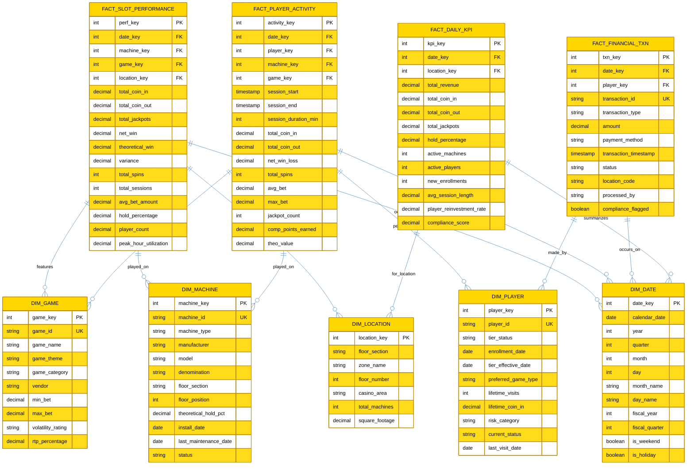

# 🥇 Tutorial 03: Gold Layer

> **[🏠 Home](../../README.md)** > **[📖 Tutorials](../README.md)** > **🥇 Gold Layer**

---

<div align="center">


</div>

---

<div align="center">

## Tutorial 03: Gold Layer - Business-Ready Aggregations

| | |
|---|---|
| **Difficulty** | ⭐⭐ Intermediate |
| **Time** | ⏱️ 60-90 minutes |
| **Layer** | 🥇 Gold (Business Ready) |

</div>

---

### 📍 Progress Tracker

<div align="center">

<table>
<thead>
<tr>
<th align="center" width="10%">Tutorial</th>
<th align="left" width="45%">Name</th>
<th align="center" width="15%">Status</th>
<th align="center" width="15%">Duration</th>
<th align="center" width="15%">Difficulty</th>
</tr>
</thead>
<tbody>
<tr>
<td align="center">00</td>
<td><a href="../00-environment-setup/README.md">⚙️ Environment Setup</a></td>
<td align="center"></td>
<td align="center">45-60 min</td>
<td align="center">⭐ Beginner</td>
</tr>
<tr>
<td align="center">01</td>
<td><a href="../01-bronze-layer/README.md">🥉 Bronze Layer</a></td>
<td align="center"></td>
<td align="center">60-90 min</td>
<td align="center">⭐ Beginner</td>
</tr>
<tr>
<td align="center">02</td>
<td><a href="../02-silver-layer/README.md">🥈 Silver Layer</a></td>
<td align="center"></td>
<td align="center">60-90 min</td>
<td align="center">⭐⭐ Intermediate</td>
</tr>
<tr style="background-color: #e8f5e9;">
<td align="center"><strong>03</strong></td>
<td><strong>👉 <a href="../03-gold-layer/README.md">🥇 Gold Layer</a></strong></td>
<td align="center"></td>
<td align="center">90-120 min</td>
<td align="center">⭐⭐ Intermediate</td>
</tr>
<tr>
<td align="center">04</td>
<td><a href="../04-real-time-analytics/README.md">⚡ Real-Time Analytics</a></td>
<td align="center"></td>
<td align="center">90-120 min</td>
<td align="center">⭐⭐⭐ Advanced</td>
</tr>
<tr>
<td align="center">05</td>
<td><a href="../05-direct-lake-powerbi/README.md">📊 Direct Lake & Power BI</a></td>
<td align="center"></td>
<td align="center">60-90 min</td>
<td align="center">⭐⭐ Intermediate</td>
</tr>
<tr>
<td align="center">06</td>
<td><a href="../06-data-pipelines/README.md">🔄 Data Pipelines</a></td>
<td align="center"></td>
<td align="center">60-90 min</td>
<td align="center">⭐⭐ Intermediate</td>
</tr>
<tr>
<td align="center">07</td>
<td><a href="../07-governance-purview/README.md">🛡️ Governance & Purview</a></td>
<td align="center"></td>
<td align="center">60-90 min</td>
<td align="center">⭐⭐ Intermediate</td>
</tr>
<tr>
<td align="center">08</td>
<td><a href="../08-database-mirroring/README.md">🔄 Database Mirroring</a></td>
<td align="center"></td>
<td align="center">60-90 min</td>
<td align="center">⭐⭐ Intermediate</td>
</tr>
<tr>
<td align="center">09</td>
<td><a href="../09-advanced-ai-ml/README.md">🤖 Advanced AI/ML</a></td>
<td align="center"></td>
<td align="center">90-120 min</td>
<td align="center">⭐⭐⭐ Advanced</td>
</tr>
</tbody>
</table>

<p><em>💡 Tip: Click any tutorial name to jump directly to it</em></p>

</div>

---

| Navigation | |
|---|---|
| ⬅️ **Previous** | [02-Silver Layer](../02-silver-layer/README.md) |
| ➡️ **Next** | [04-Real-Time Analytics](../04-real-time-analytics/README.md) |

---

## 📖 Overview

This tutorial covers implementing the **Gold layer** - the crown jewel of the medallion architecture. The Gold layer provides business-ready aggregations, pre-computed KPIs, and star schema structures optimized for analytics and reporting.

### Medallion Architecture in Microsoft Fabric

The Gold layer represents the business-ready, aggregated data tier in the medallion lakehouse architecture:


*Source: [Implement medallion lakehouse architecture in Fabric](https://learn.microsoft.com/en-us/fabric/onelake/onelake-medallion-lakehouse-architecture)*


---

## 📊 Visual Overview

The following ERD illustrates the Gold layer star schema design for casino analytics, showing fact tables and their relationships with dimension tables optimized for Power BI Direct Lake mode.



**Star Schema Benefits:**
- **Optimized Queries**: Denormalized dimensions for fast aggregations
- **Direct Lake Ready**: Designed for Power BI Direct Lake mode
- **Business-Aligned**: Dimensions match business reporting needs
- **Pre-Aggregated**: Fact tables contain computed KPIs for performance

**Key Design Patterns:**
- **Conformed Dimensions**: DIM_DATE and DIM_PLAYER shared across all facts
- **Gaming KPIs**: Coin-in, coin-out, hold percentage, theoretical win
- **Surrogate Keys**: Integer keys (*_key) for optimal join performance
- **SCD Type 2**: Player and Machine dimensions track historical changes
- **Grain Definition**: Daily aggregations in FACT_SLOT_PERFORMANCE, session-level in FACT_PLAYER_ACTIVITY

**Casino-Specific Metrics:**
- **Hold Percentage**: (Coin-In - Coin-Out) / Coin-In × 100
- **Theoretical Win**: Expected casino win based on game math
- **Variance**: Actual win vs. theoretical win
- **Player Reinvestment Rate**: Percentage of winnings replayed

---

## 🎯 Learning Objectives

By the end of this tutorial, you will be able to:

- [ ] Understand Gold layer principles and business alignment
- [ ] Create slot machine performance metrics with gaming KPIs
- [ ] Build a comprehensive Player 360 view with churn scoring
- [ ] Implement compliance reporting tables
- [ ] Design star schema with dimension tables
- [ ] Optimize for Direct Lake mode in Power BI

---

## 🥇 Gold Layer Principles

The Gold layer provides business-ready, aggregated data optimized for consumption:

| Principle | Description | Example |
|-----------|-------------|---------|
| **Business-Aligned** | Organized by business domain | Slots, Players, Compliance |
| **Aggregated** | Pre-computed KPIs and metrics | Daily Theo Win, Hold % |
| **Optimized** | Designed for query performance | Partitioned, Z-ordered |
| **Star Schema** | Fact and dimension tables | Fact_SlotPerformance + Dim_Date |
| **Direct Lake Ready** | Optimized for Power BI | Proper data types, column ordering |

### Gaming Industry KPIs


---

## 📋 Prerequisites

Before starting this tutorial, ensure you have:

- [x] Completed [Tutorial 02: Silver Layer](../02-silver-layer/README.md)
- [x] All Silver tables populated and verified
- [x] Access to `lh_gold` Lakehouse
- [x] Understanding of dimensional modeling concepts

> **💡 Tip:** Run the Silver layer verification notebook before starting to ensure all source tables are ready.

---

## 🛠️ Step 1: Slot Performance Metrics

### Understanding Gaming KPIs

Before building the Gold table, let's understand key gaming metrics:

| KPI | Formula | Description |
|-----|---------|-------------|
| **Coin-In** | Sum of all wagers | Total money wagered |
| **Coin-Out** | Sum of all payouts | Total money paid out |
| **Net Win** | Coin-In - Coin-Out | Casino's actual profit |
| **Theo Win** | Coin-In × Theoretical Hold % | Expected casino profit |
| **Hold %** | Net Win / Coin-In × 100 | Actual hold percentage |
| **Hold Variance** | Actual Hold % - Theoretical Hold % | Performance vs expectation |

### Create Notebook: `01_gold_slot_performance`

```python
# Cell 1: Configuration
from pyspark.sql import SparkSession
from pyspark.sql.functions import *
from pyspark.sql.types import *
from datetime import datetime

SILVER_TABLE = "lh_silver.silver_slot_cleansed"
GOLD_TABLE = "gold_slot_performance"

print("=" * 60)
print("🥇 GOLD LAYER - Slot Machine Performance Metrics")
print("=" * 60)
print(f"Source: {SILVER_TABLE}")
print(f"Target: {GOLD_TABLE}")
```

```python
# Cell 2: Read Silver Data
df_silver = spark.table(SILVER_TABLE)

print(f"\n📊 Silver Layer Statistics:")
print(f"  Total Records: {df_silver.count():,}")
print(f"  Date Range: {df_silver.agg(min('event_date'), max('event_date')).first()}")
print(f"  Unique Machines: {df_silver.select('machine_id').distinct().count():,}")
```

```python
# Cell 3: Calculate Daily Machine Performance Aggregations
print("\n📈 Building Daily Aggregations...")

df_daily = df_silver \
    .filter(col("event_type") == "GAME_PLAY") \
    .groupBy(
        col("machine_id"),
        col("event_date").alias("business_date"),
        col("zone"),
        col("machine_type"),
        col("denomination"),
        col("manufacturer"),
        col("game_theme")
    ) \
    .agg(
        # Volume Metrics
        count("*").alias("total_games"),
        countDistinct("player_id").alias("unique_players"),
        countDistinct("session_id").alias("total_sessions"),

        # Financial Metrics (in cents, will convert to dollars)
        sum("coin_in").alias("total_coin_in"),
        sum("coin_out").alias("total_coin_out"),
        sum("jackpot_amount").alias("total_jackpots"),

        # Performance Metrics
        avg("coin_in").alias("avg_bet"),
        max("coin_in").alias("max_bet"),
        avg("theoretical_hold").alias("avg_theoretical_hold"),

        # Time Metrics
        min("event_timestamp").alias("first_play"),
        max("event_timestamp").alias("last_play")
    )

print(f"  Daily aggregations created: {df_daily.count():,} rows")
```

### KPI Calculations

```python
# Cell 4: Calculate Gaming KPIs
print("\n🎰 Calculating Gaming KPIs...")

df_kpis = df_daily \
    .withColumn("net_win",
        col("total_coin_in") - col("total_coin_out")) \
    .withColumn("actual_hold_pct",
        when(col("total_coin_in") > 0,
             round((col("total_coin_in") - col("total_coin_out")) / col("total_coin_in") * 100, 2))
        .otherwise(0)) \
    .withColumn("theo_win",
        round(col("total_coin_in") * col("avg_theoretical_hold"), 2)) \
    .withColumn("hold_variance",
        round(col("actual_hold_pct") - (col("avg_theoretical_hold") * 100), 2)) \
    .withColumn("hold_performance",
        when(col("hold_variance") > 2, "OVER_PERFORMING")
        .when(col("hold_variance") < -2, "UNDER_PERFORMING")
        .otherwise("ON_TARGET")) \
    .withColumn("avg_session_length_games",
        when(col("total_sessions") > 0,
             round(col("total_games") / col("total_sessions"), 1))
        .otherwise(0)) \
    .withColumn("games_per_player",
        when(col("unique_players") > 0,
             round(col("total_games") / col("unique_players"), 1))
        .otherwise(0)) \
    .withColumn("jackpot_hit_rate",
        when(col("total_games") > 0,
             round(col("total_jackpots") / col("total_games"), 4))
        .otherwise(0)) \
    .withColumn("revenue_per_player",
        when(col("unique_players") > 0,
             round(col("net_win") / col("unique_players"), 2))
        .otherwise(0))

print("  KPIs calculated:")
print("    - net_win, actual_hold_pct, theo_win")
print("    - hold_variance, hold_performance")
print("    - avg_session_length_games, games_per_player")
print("    - jackpot_hit_rate, revenue_per_player")
```

> **💡 Tip:** Hold variance is a critical metric for slot operations. Machines consistently outside the -2% to +2% range may need investigation.

```python
# Cell 5: Add Gold Metadata and Finalize Schema
print("\n✨ Finalizing Gold Table Schema...")

df_gold = df_kpis \
    .withColumn("_gold_processed_at", current_timestamp()) \
    .withColumn("_gold_batch_id", lit(datetime.now().strftime("%Y%m%d")))

# Reorder columns for clarity and Direct Lake optimization
column_order = [
    # Keys (frequently filtered - put first for Direct Lake)
    "business_date", "machine_id", "zone", "machine_type", "denomination",
    "manufacturer", "game_theme",

    # Volume Metrics
    "total_games", "unique_players", "total_sessions",

    # Financial Metrics
    "total_coin_in", "total_coin_out", "net_win", "total_jackpots",

    # Performance KPIs
    "actual_hold_pct", "avg_theoretical_hold", "theo_win", "hold_variance",
    "hold_performance",

    # Player Metrics
    "avg_bet", "max_bet", "avg_session_length_games", "games_per_player",
    "jackpot_hit_rate", "revenue_per_player",

    # Time
    "first_play", "last_play",

    # Metadata
    "_gold_processed_at", "_gold_batch_id"
]

df_gold = df_gold.select(column_order)
```

```python
# Cell 6: Write to Gold Table with Optimization
print("\n💾 Writing to Gold Table...")

df_gold.write \
    .format("delta") \
    .mode("overwrite") \
    .partitionBy("business_date") \
    .saveAsTable(GOLD_TABLE)

# Optimize for query performance
spark.sql(f"OPTIMIZE {GOLD_TABLE} ZORDER BY (machine_id, zone)")

print(f"✅ Wrote {df_gold.count():,} records to {GOLD_TABLE}")
print("✅ Applied Z-ORDER optimization on (machine_id, zone)")
```

```python
# Cell 7: Verify and Analyze
df_verify = spark.table(GOLD_TABLE)

print("\n" + "=" * 60)
print("✅ SLOT PERFORMANCE VERIFICATION")
print("=" * 60)

print(f"\n📊 Gold Table Statistics:")
print(f"  Total Records: {df_verify.count():,}")
date_range = df_verify.agg(min('business_date'), max('business_date')).first()
print(f"  Date Range: {date_range[0]} to {date_range[1]}")

print("\n🏆 Top 10 Machines by Net Win:")
display(
    df_verify
    .groupBy("machine_id", "machine_type", "zone")
    .agg(
        sum("net_win").alias("total_net_win"),
        avg("actual_hold_pct").alias("avg_hold_pct"),
        sum("total_games").alias("total_games")
    )
    .orderBy(col("total_net_win").desc())
    .limit(10)
)

print("\n📉 Machines with Hold Variance Issues:")
display(
    df_verify
    .filter(abs(col("hold_variance")) > 3)
    .groupBy("machine_id", "zone", "hold_performance")
    .agg(
        avg("hold_variance").alias("avg_variance"),
        count("*").alias("days_with_variance")
    )
    .orderBy(col("days_with_variance").desc())
    .limit(10)
)
```

---

## 🛠️ Step 2: Player 360 View

### Understanding Player 360

The Player 360 view combines data from multiple sources to create a complete picture of each player:


### Create Notebook: `02_gold_player_360`

```python
# Cell 1: Configuration
from pyspark.sql import SparkSession
from pyspark.sql.functions import *
from datetime import datetime

SILVER_PLAYER = "lh_silver.silver_player_master"
SILVER_SLOTS = "lh_silver.silver_slot_cleansed"
SILVER_TABLES = "lh_silver.silver_table_enriched"
SILVER_FINANCIAL = "lh_silver.silver_financial_reconciled"
GOLD_TABLE = "gold_player_360"

print("=" * 60)
print("🥇 GOLD LAYER - Player 360 View")
print("=" * 60)
```

```python
# Cell 2: Get Current Player Profile Data
print("\n👤 Loading Player Profile Data...")

df_player = spark.table(SILVER_PLAYER) \
    .filter(col("_is_current") == True) \
    .select(
        "player_id", "loyalty_number", "loyalty_tier",
        "enrollment_date", "total_visits", "total_theo",
        "preferred_game", "vip_flag", "self_excluded", "account_status",
        "date_of_birth", "city", "state"
    )

# Calculate age
df_player = df_player.withColumn("age",
    floor(datediff(current_date(), col("date_of_birth")) / 365.25))

print(f"  Active Players: {df_player.count():,}")
print(f"  VIP Players: {df_player.filter(col('vip_flag')).count():,}")
```

```python
# Cell 3: Calculate Slot Gaming Activity
print("\n🎰 Aggregating Slot Activity...")

df_slot_activity = spark.table(SILVER_SLOTS) \
    .filter(col("player_id").isNotNull()) \
    .filter(col("event_type") == "GAME_PLAY") \
    .groupBy("player_id") \
    .agg(
        count("*").alias("slot_games_played"),
        sum("coin_in").alias("slot_coin_in"),
        sum("coin_out").alias("slot_coin_out"),
        countDistinct("machine_id").alias("unique_machines"),
        countDistinct("event_date").alias("slot_visit_days"),
        max("event_timestamp").alias("last_slot_play"),
        avg("coin_in").alias("avg_slot_bet"),
        max("coin_in").alias("max_slot_bet"),
        # Favorite denomination
        mode("denomination").alias("preferred_denomination")
    )

print(f"  Players with slot activity: {df_slot_activity.count():,}")
```

```python
# Cell 4: Calculate Table Gaming Activity
print("\n🃏 Aggregating Table Activity...")

df_table_activity = spark.table(SILVER_TABLES) \
    .filter(col("player_id").isNotNull()) \
    .groupBy("player_id") \
    .agg(
        sum("average_bet").alias("table_total_wagered"),
        sum("theoretical_win").alias("table_theo_win"),
        sum("actual_win_loss").alias("table_actual_wl"),
        sum("hours_played").alias("table_hours_played"),
        countDistinct("event_date").alias("table_visit_days"),
        max("event_timestamp").alias("last_table_play"),
        avg("average_bet").alias("avg_table_bet"),
        mode("game_type").alias("preferred_table_game")
    )

print(f"  Players with table activity: {df_table_activity.count():,}")
```

```python
# Cell 5: Calculate Financial Activity
print("\n💰 Aggregating Financial Activity...")

df_financial = spark.table(SILVER_FINANCIAL) \
    .filter(col("player_id").isNotNull()) \
    .groupBy("player_id") \
    .agg(
        sum(when(col("transaction_type") == "CASH_IN", col("amount"))).alias("total_cash_in"),
        sum(when(col("transaction_type") == "CASH_OUT", col("amount"))).alias("total_cash_out"),
        sum(when(col("transaction_type") == "MARKER_ISSUE", col("amount"))).alias("total_markers_issued"),
        sum(when(col("transaction_type") == "MARKER_PAYMENT", col("amount"))).alias("total_markers_paid"),
        count("*").alias("total_transactions"),
        countDistinct("transaction_date").alias("financial_visit_days")
    )

print(f"  Players with financial activity: {df_financial.count():,}")
```

```python
# Cell 6: Join All Sources
print("\n🔗 Creating Unified Player View...")

df_360 = df_player \
    .join(df_slot_activity, "player_id", "left") \
    .join(df_table_activity, "player_id", "left") \
    .join(df_financial, "player_id", "left")

# Fill nulls for numeric columns
numeric_cols = [
    "slot_games_played", "slot_coin_in", "slot_coin_out", "unique_machines",
    "slot_visit_days", "avg_slot_bet", "max_slot_bet",
    "table_total_wagered", "table_theo_win", "table_actual_wl", "table_hours_played",
    "table_visit_days", "avg_table_bet",
    "total_cash_in", "total_cash_out", "total_markers_issued", "total_markers_paid",
    "total_transactions", "financial_visit_days"
]
df_360 = df_360.fillna(0, subset=numeric_cols)

print(f"  Combined Player Records: {df_360.count():,}")
```

### Player Value and Risk Scoring

```python
# Cell 7: Calculate Player KPIs and Scores
print("\n📊 Calculating Player KPIs...")

df_gold = df_360 \
    .withColumn("total_gaming_activity",
        col("slot_coin_in") + col("table_total_wagered")) \
    .withColumn("slot_theo_win",
        col("slot_coin_in") * 0.08) \
    .withColumn("total_theo_win",
        col("slot_theo_win") + coalesce(col("table_theo_win"), lit(0))) \
    .withColumn("slot_net_win",
        col("slot_coin_in") - col("slot_coin_out")) \
    .withColumn("total_net_win",
        col("slot_net_win") + coalesce(col("table_actual_wl"), lit(0))) \
    .withColumn("net_cash_position",
        coalesce(col("total_cash_in"), lit(0)) - coalesce(col("total_cash_out"), lit(0))) \
    .withColumn("outstanding_markers",
        coalesce(col("total_markers_issued"), lit(0)) - coalesce(col("total_markers_paid"), lit(0))) \
    .withColumn("last_activity_date",
        greatest(col("last_slot_play"), col("last_table_play"))) \
    .withColumn("days_since_visit",
        datediff(current_date(), col("last_activity_date"))) \
    .withColumn("total_visit_days",
        col("slot_visit_days") + col("table_visit_days"))
```

```python
# Cell 8: Calculate Risk and Value Indicators
print("\n⚠️ Calculating Risk Indicators...")

df_gold = df_gold \
    .withColumn("churn_risk",
        when(col("days_since_visit") > 90, "HIGH")
        .when(col("days_since_visit") > 60, "MEDIUM_HIGH")
        .when(col("days_since_visit") > 30, "MEDIUM")
        .when(col("days_since_visit") > 14, "LOW")
        .otherwise("ACTIVE")) \
    .withColumn("player_value_tier",
        when(col("total_theo_win") >= 10000, "WHALE")
        .when(col("total_theo_win") >= 5000, "HIGH_VALUE")
        .when(col("total_theo_win") >= 1000, "MEDIUM_VALUE")
        .when(col("total_theo_win") >= 100, "LOW_VALUE")
        .otherwise("MINIMAL")) \
    .withColumn("player_value_score",
        # Composite score: Theo Win + Visit Frequency + Loyalty Tier bonus
        (col("total_theo_win") / 100) +
        (col("total_visit_days") * 10) +
        when(col("loyalty_tier") == "Diamond", 500)
        .when(col("loyalty_tier") == "Platinum", 200)
        .when(col("loyalty_tier") == "Gold", 100)
        .when(col("loyalty_tier") == "Silver", 50)
        .otherwise(10)) \
    .withColumn("engagement_score",
        # Based on recency and frequency
        when(col("days_since_visit") <= 7, 100)
        .when(col("days_since_visit") <= 14, 80)
        .when(col("days_since_visit") <= 30, 60)
        .when(col("days_since_visit") <= 60, 40)
        .when(col("days_since_visit") <= 90, 20)
        .otherwise(0) +
        least(col("total_visit_days"), lit(100))) \
    .withColumn("credit_risk",
        when(col("outstanding_markers") > 10000, "HIGH")
        .when(col("outstanding_markers") > 5000, "MEDIUM")
        .when(col("outstanding_markers") > 0, "LOW")
        .otherwise("NONE")) \
    .withColumn("_gold_processed_at", current_timestamp())
```

> **⚠️ Warning:** Player value scores and risk indicators should be reviewed by marketing and compliance teams before use in campaigns.

```python
# Cell 9: Write Player 360 Gold Table
print("\n💾 Writing Player 360 Gold Table...")

df_gold.write \
    .format("delta") \
    .mode("overwrite") \
    .saveAsTable(GOLD_TABLE)

# No partitioning for dimension-like table, but optimize
spark.sql(f"OPTIMIZE {GOLD_TABLE} ZORDER BY (loyalty_tier, churn_risk)")

print(f"✅ Wrote {df_gold.count():,} player 360 records")
```

```python
# Cell 10: Verify and Analyze
print("\n" + "=" * 60)
print("✅ PLAYER 360 VERIFICATION")
print("=" * 60)

df_verify = spark.table(GOLD_TABLE)

print("\n📊 Player Distribution by Value Tier:")
display(
    df_verify
    .groupBy("player_value_tier")
    .agg(
        count("*").alias("player_count"),
        round(avg("total_theo_win"), 2).alias("avg_theo_win"),
        round(avg("total_visit_days"), 1).alias("avg_visits")
    )
    .orderBy(col("avg_theo_win").desc())
)

print("\n⚠️ Churn Risk Analysis:")
display(
    df_verify
    .groupBy("churn_risk", "loyalty_tier")
    .agg(
        count("*").alias("player_count"),
        round(sum("total_theo_win"), 2).alias("total_theo_at_risk")
    )
    .orderBy("churn_risk", col("total_theo_at_risk").desc())
)

print("\n🏆 Top 20 Players by Value Score:")
display(
    df_verify
    .select(
        "player_id", "loyalty_tier", "player_value_tier",
        "total_theo_win", "total_visit_days", "churn_risk",
        "player_value_score", "engagement_score"
    )
    .orderBy(col("player_value_score").desc())
    .limit(20)
)
```

---

## 🛠️ Step 3: Compliance Reporting

### Create Notebook: `03_gold_compliance_reporting`

```python
# Cell 1: Configuration
from pyspark.sql import SparkSession
from pyspark.sql.functions import *
from datetime import datetime

SILVER_TABLE = "lh_silver.silver_compliance_validated"
GOLD_TABLE = "gold_compliance_reporting"

print("=" * 60)
print("🥇 GOLD LAYER - Compliance Reporting")
print("=" * 60)
```

```python
# Cell 2: Read and Aggregate Daily Compliance Summary
df_silver = spark.table(SILVER_TABLE)

print("\n📋 Building Daily Compliance Summary...")

df_daily = df_silver \
    .withColumn("report_date", to_date(col("filing_date"))) \
    .groupBy("report_date", "report_type", "status") \
    .agg(
        count("*").alias("report_count"),
        sum("transaction_amount").alias("total_amount"),
        avg("transaction_amount").alias("avg_amount"),
        countDistinct("player_id").alias("unique_patrons"),
        countDistinct("transaction_id").alias("unique_transactions")
    )

print(f"  Daily summaries: {df_daily.count():,}")
```

```python
# Cell 3: Pivot by Report Type for Dashboard View
print("\n📊 Creating Pivoted Report View...")

df_pivot = df_silver \
    .withColumn("report_date", to_date(col("filing_date"))) \
    .groupBy("report_date") \
    .pivot("report_type", ["CTR", "SAR", "W2G", "MTLAP", "CTRC"]) \
    .agg(
        count("*").alias("count"),
        sum("transaction_amount").alias("amount")
    )

# Clean up column names
for col_name in df_pivot.columns:
    if col_name != "report_date":
        new_name = col_name.lower().replace(" ", "_")
        df_pivot = df_pivot.withColumnRenamed(col_name, new_name)

df_pivot = df_pivot.fillna(0)
```

```python
# Cell 4: Add Compliance KPIs and Alert Levels
print("\n⚠️ Calculating Compliance KPIs...")

df_gold = df_pivot \
    .withColumn("total_filings",
        coalesce(col("ctr_count"), lit(0)) +
        coalesce(col("sar_count"), lit(0)) +
        coalesce(col("w2g_count"), lit(0)) +
        coalesce(col("mtlap_count"), lit(0)) +
        coalesce(col("ctrc_count"), lit(0))) \
    .withColumn("total_reportable_amount",
        coalesce(col("ctr_amount"), lit(0)) +
        coalesce(col("sar_amount"), lit(0)) +
        coalesce(col("w2g_amount"), lit(0))) \
    .withColumn("ctr_compliance_status",
        when(col("ctr_count") > 0, "FILINGS_PRESENT")
        .otherwise("NO_FILINGS")) \
    .withColumn("sar_alert_level",
        when(col("sar_count") > 10, "CRITICAL")
        .when(col("sar_count") > 5, "HIGH")
        .when(col("sar_count") > 2, "ELEVATED")
        .when(col("sar_count") > 0, "NORMAL")
        .otherwise("NONE")) \
    .withColumn("w2g_jackpot_activity",
        when(col("w2g_amount") > 100000, "VERY_HIGH")
        .when(col("w2g_amount") > 50000, "HIGH")
        .when(col("w2g_amount") > 10000, "MODERATE")
        .otherwise("NORMAL")) \
    .withColumn("daily_compliance_score",
        # Higher score = better compliance posture
        100 -
        (when(col("sar_alert_level") == "CRITICAL", 30)
         .when(col("sar_alert_level") == "HIGH", 20)
         .when(col("sar_alert_level") == "ELEVATED", 10)
         .otherwise(0))) \
    .withColumn("_gold_processed_at", current_timestamp())
```

> **⚠️ Warning:** SAR (Suspicious Activity Report) counts at "CRITICAL" level require immediate review by the compliance department.

```python
# Cell 5: Write Compliance Gold Table
print("\n💾 Writing Compliance Reporting Gold Table...")

df_gold.write \
    .format("delta") \
    .mode("overwrite") \
    .partitionBy("report_date") \
    .saveAsTable(GOLD_TABLE)

print(f"✅ Wrote {df_gold.count():,} compliance summary records")
```

```python
# Cell 6: Verification
print("\n" + "=" * 60)
print("✅ COMPLIANCE REPORTING VERIFICATION")
print("=" * 60)

df_verify = spark.table(GOLD_TABLE)

print("\n📊 Filing Summary by Type:")
display(
    df_verify
    .agg(
        sum("ctr_count").alias("total_ctr"),
        sum("sar_count").alias("total_sar"),
        sum("w2g_count").alias("total_w2g"),
        round(sum("ctr_amount"), 2).alias("ctr_amount"),
        round(sum("w2g_amount"), 2).alias("w2g_amount")
    )
)

print("\n⚠️ Days with Elevated SAR Activity:")
display(
    df_verify
    .filter(col("sar_alert_level").isin(["CRITICAL", "HIGH", "ELEVATED"]))
    .select("report_date", "sar_count", "sar_alert_level", "daily_compliance_score")
    .orderBy(col("sar_count").desc())
    .limit(10)
)
```

---

## 🛠️ Step 4: Create Dimension Tables

### Star Schema Design

A proper star schema requires dimension tables for efficient filtering and slicing:


### Date Dimension

```python
# Create Date Dimension
from pyspark.sql.functions import *

print("📅 Creating Date Dimension...")

# Generate date range (2 years of history + 1 year future)
start_date = "2023-01-01"
end_date = "2026-12-31"

df_dates = spark.sql(f"""
    SELECT explode(sequence(to_date('{start_date}'), to_date('{end_date}'))) as date_key
""")

df_dim_date = df_dates \
    .withColumn("year", year("date_key")) \
    .withColumn("quarter", quarter("date_key")) \
    .withColumn("month", month("date_key")) \
    .withColumn("month_name", date_format("date_key", "MMMM")) \
    .withColumn("month_abbr", date_format("date_key", "MMM")) \
    .withColumn("week", weekofyear("date_key")) \
    .withColumn("day_of_month", dayofmonth("date_key")) \
    .withColumn("day_of_week", dayofweek("date_key")) \
    .withColumn("day_name", date_format("date_key", "EEEE")) \
    .withColumn("day_abbr", date_format("date_key", "EEE")) \
    .withColumn("is_weekend", dayofweek("date_key").isin([1, 7])) \
    .withColumn("is_weekday", ~dayofweek("date_key").isin([1, 7])) \
    .withColumn("year_month", date_format("date_key", "yyyy-MM")) \
    .withColumn("year_quarter", concat(year("date_key"), lit("-Q"), quarter("date_key"))) \
    .withColumn("fiscal_year",
        when(month("date_key") >= 10, year("date_key") + 1)
        .otherwise(year("date_key"))) \
    .withColumn("fiscal_quarter",
        when(quarter("date_key") >= 4, quarter("date_key") - 3)
        .otherwise(quarter("date_key") + 1)) \
    .withColumn("fiscal_month",
        when(month("date_key") >= 10, month("date_key") - 9)
        .otherwise(month("date_key") + 3))

df_dim_date.write.format("delta").mode("overwrite").saveAsTable("dim_date")
print(f"✅ Created dim_date with {df_dim_date.count():,} dates")
```

### Machine Dimension

```python
# Create Machine Dimension
print("🎰 Creating Machine Dimension...")

df_dim_machine = spark.table("lh_silver.silver_slot_cleansed") \
    .select(
        "machine_id", "asset_number", "location_id", "zone",
        "machine_type", "manufacturer", "game_theme", "denomination",
        "par_percentage", "max_bet", "progressive_flag"
    ) \
    .distinct() \
    .withColumn("machine_key", monotonically_increasing_id()) \
    .withColumn("denomination_display",
        concat(lit("$"), format_number(col("denomination"), 2))) \
    .withColumn("machine_category",
        when(col("machine_type").contains("VIDEO"), "Video")
        .when(col("machine_type").contains("REEL"), "Reel")
        .when(col("progressive_flag"), "Progressive")
        .otherwise("Standard"))

df_dim_machine.write.format("delta").mode("overwrite").saveAsTable("dim_machine")
print(f"✅ Created dim_machine with {df_dim_machine.count():,} machines")
```

### Zone Dimension

```python
# Create Zone Dimension
print("📍 Creating Zone Dimension...")

df_dim_zone = spark.table("lh_silver.silver_slot_cleansed") \
    .select("zone", "location_id") \
    .distinct() \
    .withColumn("zone_key", monotonically_increasing_id()) \
    .withColumn("zone_type",
        when(col("zone").contains("VIP"), "VIP")
        .when(col("zone").contains("HIGH"), "High Limit")
        .when(col("zone").contains("SMOKE"), "Smoking")
        .otherwise("General")) \
    .withColumn("floor_level",
        when(col("zone").contains("LEVEL_1"), 1)
        .when(col("zone").contains("LEVEL_2"), 2)
        .when(col("zone").contains("LEVEL_3"), 3)
        .otherwise(1))

df_dim_zone.write.format("delta").mode("overwrite").saveAsTable("dim_zone")
print(f"✅ Created dim_zone with {df_dim_zone.count():,} zones")
```

---

## 🛠️ Step 5: Gold Layer Verification

```python
# Gold Layer Complete Verification
from pyspark.sql.functions import *
from datetime import datetime

# All Gold tables
gold_tables = [
    ("gold_slot_performance", "Fact"),
    ("gold_player_360", "Aggregate"),
    ("gold_compliance_reporting", "Aggregate"),
    ("gold_table_analytics", "Fact"),
    ("gold_financial_summary", "Aggregate"),
    ("dim_date", "Dimension"),
    ("dim_machine", "Dimension"),
    ("dim_zone", "Dimension")
]

print("=" * 70)
print("🥇 GOLD LAYER VERIFICATION REPORT")
print("=" * 70)
print(f"Timestamp: {datetime.now().strftime('%Y-%m-%d %H:%M:%S')}")
print("-" * 70)

total_records = 0
passed = 0
failed = 0

for table, table_type in gold_tables:
    try:
        df = spark.table(table)
        count = df.count()
        total_records += count

        # Check for Gold metadata
        has_gold_meta = "_gold_processed_at" in df.columns or table.startswith("dim_")
        status = "✅" if has_gold_meta else "⚠️"
        passed += 1

        print(f"{status} [{table_type:10}] {table:30} {count:>12,} records")

    except Exception as e:
        print(f"❌ [{table_type:10}] {table:30} NOT FOUND")
        failed += 1

print("-" * 70)
print(f"{'SUMMARY':45} {total_records:>12,} total records")
print(f"{'Tables Passed:':45} {passed}/{len(gold_tables)}")
if failed > 0:
    print(f"{'Tables Failed:':45} {failed}/{len(gold_tables)}")
print("=" * 70)
```

---

## ⚡ Direct Lake Optimization

Direct Lake mode connects Power BI directly to Delta tables in OneLake for the best of both import and DirectQuery modes:


*Source: [Direct Lake overview](https://learn.microsoft.com/en-us/fabric/get-started/direct-lake-overview)*

For optimal Power BI Direct Lake performance, follow these guidelines:

### 1. Column Ordering

Place frequently filtered columns first in the table schema:

```python
# Good: Keys and filter columns first
df.select(
    "business_date",    # Primary filter
    "machine_id",       # Common filter
    "zone",             # Common filter
    "total_coin_in",    # Measure
    "net_win",          # Measure
    ...
)
```

### 2. Data Types

Use appropriate types that Direct Lake handles efficiently:

```python
df = df \
    .withColumn("amount", col("amount").cast("decimal(18,2)")) \
    .withColumn("percentage", col("percentage").cast("decimal(5,2)")) \
    .withColumn("is_active", col("is_active").cast("boolean")) \
    .withColumn("count", col("count").cast("integer"))
```

### 3. Partitioning Strategy

Partition fact tables by date for time-series queries:

```python
# Fact tables: Partition by date
df.write \
    .partitionBy("business_date") \
    .saveAsTable("gold_slot_performance")

# Dimension tables: No partitioning (small, frequently joined)
df.write \
    .saveAsTable("dim_machine")
```

### 4. Table Optimization

Run optimization after writes:

```python
# Z-ORDER by commonly filtered columns
spark.sql(f"OPTIMIZE gold_slot_performance ZORDER BY (machine_id, zone)")

# VACUUM to remove old files (retain 7 days for time travel)
spark.sql(f"VACUUM gold_slot_performance RETAIN 168 HOURS")
```

### 5. V-Order (Fabric-Specific)

Enable V-Order for maximum Direct Lake performance:

```python
# V-Order is automatically applied in Fabric
# Verify with:
spark.sql("DESCRIBE DETAIL gold_slot_performance").show()
```

---

## ✅ Validation Checklist

Before moving to the next tutorial, verify:

- [ ] **All Gold Tables Created** - Fact and dimension tables exist in `lh_gold`
- [ ] **Star Schema Correct** - Relationships between facts and dimensions verified
- [ ] **Aggregations Work** - KPIs calculating correctly (hold %, theo win, etc.)
- [ ] **Dimension Tables Populated** - Date, machine, zone dimensions complete
- [ ] **Partitioning Applied** - Date-based partitions on fact tables
- [ ] **Optimization Complete** - Z-ORDER and VACUUM executed successfully

<details>
<summary>🔍 How to verify each item</summary>

### All Gold Tables Created
```python
# List all Gold tables
tables = spark.sql("SHOW TABLES IN lh_gold").collect()
table_names = [row.tableName for row in tables]

expected_tables = [
    "gold_slot_performance",
    "gold_player_360",
    "gold_compliance_reporting",
    "dim_date",
    "dim_machine",
    "dim_zone"
]

for table in expected_tables:
    status = "✅" if table in table_names else "❌"
    count = spark.table(f"lh_gold.{table}").count() if table in table_names else 0
    print(f"{status} {table:30} {count:>10,} rows")
```

### Star Schema Correct
```sql
-- Verify fact table can join to all dimensions
SELECT 
    f.business_date,
    d.date_name,
    m.machine_name,
    z.zone_name,
    f.total_coin_in,
    f.net_win
FROM lh_gold.gold_slot_performance f
JOIN lh_gold.dim_date d ON f.business_date = d.date_key
JOIN lh_gold.dim_machine m ON f.machine_id = m.machine_id
JOIN lh_gold.dim_zone z ON m.zone_id = z.zone_id
LIMIT 10;

-- Should return results without errors
```

### Aggregations Work
```python
# Verify KPI calculations
df = spark.table("lh_gold.gold_slot_performance")

# Check hold percentage calculation
df.select(
    "machine_id",
    "business_date",
    "total_coin_in",
    "total_coin_out",
    "net_win",
    "actual_hold_pct",
    ((col("total_coin_in") - col("total_coin_out")) / col("total_coin_in") * 100).alias("calculated_hold_pct")
).show(5)

# Verify actual_hold_pct matches calculated_hold_pct
```

### Dimension Tables Populated
```python
# Check date dimension coverage
df_date = spark.table("lh_gold.dim_date")
print(f"Date dimension rows: {df_date.count():,}")
print(f"Date range: {df_date.agg({'date_key': 'min'}).collect()[0][0]} to {df_date.agg({'date_key': 'max'}).collect()[0][0]}")

# Check machine dimension
df_machine = spark.table("lh_gold.dim_machine")
print(f"\nMachine dimension rows: {df_machine.count():,}")
df_machine.groupBy("zone_id").count().show()

# Check zone dimension
df_zone = spark.table("lh_gold.dim_zone")
print(f"\nZone dimension rows: {df_zone.count():,}")
df_zone.show()
```

### Partitioning Applied
```python
# Check if tables are partitioned
from delta.tables import DeltaTable

table_name = "lh_gold.gold_slot_performance"
delta_table = DeltaTable.forName(spark, table_name)

# Get table details
details = delta_table.detail().select("partitionColumns").collect()[0]
print(f"Partition columns: {details['partitionColumns']}")

# Should show ['business_date'] or similar date partition
```

### Optimization Complete
```python
# Check when tables were last optimized
from delta.tables import DeltaTable

table_name = "lh_gold.gold_slot_performance"
delta_table = DeltaTable.forName(spark, table_name)

# Check history for OPTIMIZE operations
history = delta_table.history(10)
optimize_ops = history.filter(col("operation") == "OPTIMIZE")

print("Recent optimization history:")
optimize_ops.select("timestamp", "operation", "operationMetrics").show(truncate=False)

# Also check for VACUUM operations
vacuum_ops = history.filter(col("operation") == "VACUUM END")
print("\nRecent vacuum history:")
vacuum_ops.select("timestamp", "operation", "operationMetrics").show(truncate=False)
```

### KPI Validation
```sql
-- Verify key metrics are calculating correctly
SELECT 
    business_date,
    COUNT(DISTINCT machine_id) as machine_count,
    SUM(total_coin_in) as total_coin_in,
    SUM(total_coin_out) as total_coin_out,
    SUM(net_win) as net_win,
    AVG(actual_hold_pct) as avg_hold_pct,
    SUM(theoretical_win) as total_theo
FROM lh_gold.gold_slot_performance
WHERE business_date >= DATEADD(day, -7, GETDATE())
GROUP BY business_date
ORDER BY business_date DESC;

-- Metrics should be positive and hold % between 5-15%
```

</details>

---

## 🎉 Summary

Congratulations! You have successfully implemented the Gold layer:

| Achievement | Description |
|-------------|-------------|
| ✅ Slot Performance | Created daily machine KPIs with gaming-specific metrics |
| ✅ Player 360 | Built comprehensive player view with value and risk scoring |
| ✅ Compliance Reporting | Implemented regulatory reporting summaries |
| ✅ Star Schema | Created dimension tables for efficient analytics |
| ✅ Direct Lake Ready | Optimized tables for Power BI consumption |

---

## ➡️ Next Steps

Continue to **[Tutorial 04: Real-Time Analytics](../04-real-time-analytics/README.md)** to learn:

- Implementing Eventstream for real-time data ingestion
- Building KQL queries for streaming analytics
- Creating real-time dashboards
- Alerting on anomalies

---

## 📚 Resources

| Resource | Description |
|----------|-------------|
| [Gold Layer Best Practices](https://learn.microsoft.com/fabric/data-engineering/lakehouse-overview) | Microsoft Fabric medallion patterns |
| [Direct Lake Mode](https://learn.microsoft.com/fabric/data-warehouse/direct-lake-mode) | Power BI Direct Lake optimization |
| [Star Schema Design](https://learn.microsoft.com/power-bi/guidance/star-schema) | Dimensional modeling guidance |
| [Delta Lake Optimization](https://docs.delta.io/latest/optimizations.html) | OPTIMIZE and Z-ORDER |
| [Gaming Analytics KPIs](https://www.unlv.edu/international-gaming-institute) | Industry standard metrics |

---

## 🧭 Navigation

| ⬅️ Previous | ⬆️ Up | ➡️ Next |
|-------------|-------|---------|
| [02-Silver Layer](../02-silver-layer/README.md) | [Tutorials Index](../README.md) | [04-Real-Time Analytics](../04-real-time-analytics/README.md) |

---

<div align="center">

**Questions or issues?** Open an issue in the [GitHub repository](https://github.com/your-repo/issues).

---

*🥇 Gold Layer - Business-ready insights at your fingertips*

</div>
