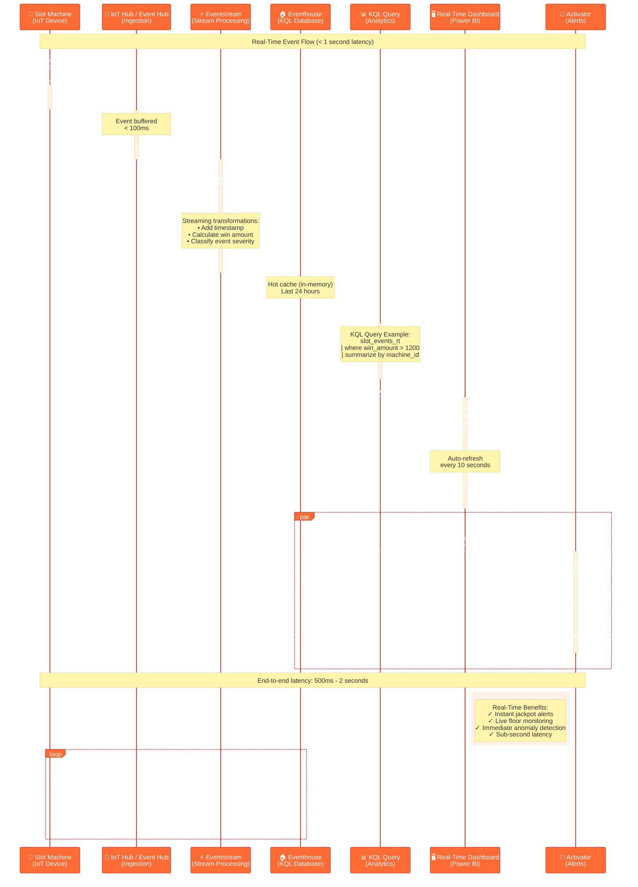
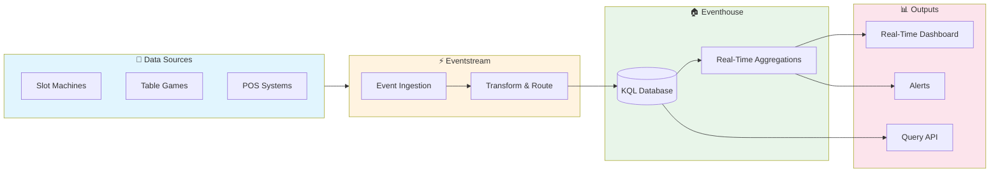
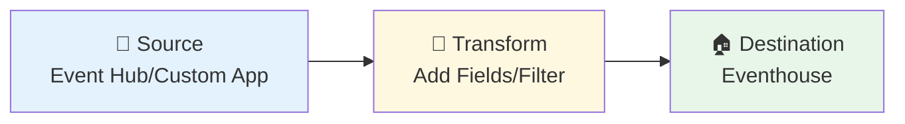

# ⚡ Tutorial 04: Real-Time Analytics

> **🏠 [Home](../../README.md)** > **📖 [Tutorials](../README.md)** > **⚡ Real-Time Analytics**

---

<div align="center">


</div>

---

## ⚡ Tutorial 04: Real-Time Analytics - Live Floor Monitoring

| Attribute | Details |
|-----------|---------|
| **Difficulty** | ⭐⭐ Intermediate |
| **Time Estimate** | ⏱️ 60-75 minutes |
| **Focus Area** | Real-Time Intelligence |
| **Key Skills** | Eventhouse, Eventstreams, KQL, Real-Time Dashboards |

---

### 📊 Progress Tracker

```
┌────────┬────────┬────────┬────────┬────────┬────────┬────────┬────────┬────────┬────────┐
│   00   │   01   │   02   │   03   │   04   │   05   │   06   │   07   │   08   │   09   │
│ SETUP  │ BRONZE │ SILVER │  GOLD  │   RT   │  PBI   │ PIPES  │  GOV   │ MIRROR │  AI/ML │
├────────┼────────┼────────┼────────┼────────┼────────┼────────┼────────┼────────┼────────┤
│   ✓    │   ✓    │   ✓    │   ✓    │  ⚡    │   ○    │   ○    │   ○    │   ○    │   ○    │
└────────┴────────┴────────┴────────┴────────┴────────┴────────┴────────┴────────┴────────┘
                                        ▲
                                        │
                                   YOU ARE HERE
```

| Navigation | Link |
|------------|------|
| ⬅️ **Previous** | [03-Gold Layer](../03-gold-layer/README.md) |
| ➡️ **Next** | [05-Direct Lake & Power BI](../05-direct-lake-powerbi/README.md) |

---

## 📋 Overview

This tutorial covers implementing real-time analytics for casino floor monitoring using **Fabric Real-Time Intelligence**. You will create streaming pipelines that process slot machine events in near real-time, enabling instant visibility into floor operations, jackpots, and machine performance.

> **💡 Why Real-Time Analytics?**
>
> Casino operations require immediate awareness of floor activity for:
> - **Jackpot verification** - Instant notification when hand pays are needed
> - **Floor optimization** - Identify hot/cold zones in real-time
> - **Security monitoring** - Detect unusual patterns immediately
> - **Compliance** - Track large transactions as they happen

---

## 📊 Visual Overview

The following sequence diagram illustrates the real-time event flow from slot machines through Eventstream, Eventhouse, KQL queries, to live dashboards for instant casino floor monitoring.



**Key Components:**

1. **Event Generation**: Slot machines emit events (spins, wins, errors) in real-time
2. **Eventstream**: Ingests, transforms, and routes events with low latency (< 100ms)
3. **Eventhouse**: High-performance KQL database optimized for time-series analytics
4. **KQL Queries**: Lightning-fast analytical queries with automatic caching
5. **Real-Time Dashboard**: Auto-refreshing Power BI dashboard (10-second refresh)
6. **Activator Alerts**: Intelligent alerting for critical events (jackpots, errors)

**Performance Characteristics:**
- **Ingestion Rate**: 100,000+ events/second per Eventstream
- **End-to-End Latency**: 500ms - 2 seconds from event to dashboard
- **Query Performance**: Sub-second response for billions of events
- **Hot Cache**: Last 24 hours in-memory for instant queries
- **Auto-Refresh**: Configurable dashboard refresh (default: 10 seconds)

**Casino Use Cases:**
- 🎰 **Jackpot Monitoring**: Instant alerts when hand pays are required ($1,200+)
- 📍 **Floor Heat Maps**: Live visualization of hot/cold machine zones
- 🚨 **Anomaly Detection**: Detect unusual win patterns or machine errors
- 💰 **Compliance Tracking**: Real-time monitoring of large transactions (CTR/SAR)
- 📊 **Performance Metrics**: Live coin-in, hold percentage, player count

---

## 🎯 Learning Objectives

By the end of this tutorial, you will be able to:

- [ ] Create an Eventhouse with KQL database for streaming data
- [ ] Configure Eventstreams for real-time data ingestion
- [ ] Write KQL queries for casino floor monitoring
- [ ] Build auto-refreshing real-time dashboards
- [ ] Set up alerts for critical events (jackpots, anomalies)

---

## 🏗️ Real-Time Intelligence Architecture



| Component | Purpose |
|-----------|---------|
| **Eventstream** | Ingests and routes streaming data from multiple sources |
| **Eventhouse** | High-performance analytics store with KQL database |
| **KQL Database** | Stores time-series data optimized for analytics queries |
| **Real-Time Dashboard** | Auto-refreshing visualizations of live data |

---

## 📋 Prerequisites

Before starting this tutorial, ensure you have:

- [ ] ✅ Completed [Tutorial 03: Gold Layer](../03-gold-layer/README.md)
- [ ] ✅ Access to Fabric workspace with **Real-Time Intelligence** capacity
- [ ] ✅ Understanding of basic SQL concepts
- [ ] ✅ (Optional) Azure Event Hub or sample data source

> **⚠️ Capacity Requirements**
>
> Real-Time Intelligence requires F2 or higher Fabric capacity. If using a trial, ensure Real-Time Intelligence is enabled in your workspace settings.

---

## 🛠️ Step 1: Create Eventhouse

An **Eventhouse** is a high-performance analytics store optimized for streaming and time-series data.

### 1.1 Create Eventhouse in Fabric Portal

1. Open your workspace (`casino-fabric-poc`)
2. Click **+ New** > **Eventhouse**
3. Configure the Eventhouse:

| Setting | Value | Description |
|---------|-------|-------------|
| **Name** | `eh_casino_realtime` | Descriptive name for the Eventhouse |
| **OneLake availability** | ✅ Enabled | Allows data to be queried via OneLake |

4. Click **Create**

> **💡 Tip: OneLake Availability**
>
> Enabling OneLake availability allows your real-time data to be accessible via Spark notebooks and other Fabric services, enabling hybrid batch/real-time analytics.

### 1.2 Create KQL Database

After the Eventhouse is created:

1. Click on the Eventhouse to open it
2. Click **+ New database**
3. Configure:

| Setting | Value |
|---------|-------|
| **Database name** | `casino_floor_monitoring` |
| **Retention period** | 365 days (default) |
| **Cache period** | 31 days (default) |

4. Click **Create**

> **ℹ️ Retention vs. Cache**
>
> - **Retention period**: How long data is kept before automatic deletion
> - **Cache period**: How much recent data is kept in hot storage for fastest queries

---

## 🛠️ Step 2: Define KQL Tables

### 2.1 Open KQL Query Editor

1. Click on your database (`casino_floor_monitoring`)
2. Click **Explore your data** or **Query** to open the KQL editor

### 2.2 Create Slot Events Table

This is the primary table for streaming slot machine telemetry.

```kql
// Create table for real-time slot events
.create table SlotEvents (
    event_id: string,
    machine_id: string,
    zone: string,
    event_type: string,
    event_timestamp: datetime,
    coin_in: real,
    coin_out: real,
    jackpot_amount: real,
    player_id: string,
    denomination: real,
    ingestion_time: datetime
)
```

### 2.3 Create Ingestion Mapping

Create a JSON mapping for the Eventstream to map incoming data to table columns.

```kql
// Create mapping for JSON ingestion
.create table SlotEvents ingestion json mapping 'SlotEventsMapping'
'['
'    {"column": "event_id", "path": "$.event_id", "datatype": "string"},'
'    {"column": "machine_id", "path": "$.machine_id", "datatype": "string"},'
'    {"column": "zone", "path": "$.zone", "datatype": "string"},'
'    {"column": "event_type", "path": "$.event_type", "datatype": "string"},'
'    {"column": "event_timestamp", "path": "$.event_timestamp", "datatype": "datetime"},'
'    {"column": "coin_in", "path": "$.coin_in", "datatype": "real"},'
'    {"column": "coin_out", "path": "$.coin_out", "datatype": "real"},'
'    {"column": "jackpot_amount", "path": "$.jackpot_amount", "datatype": "real"},'
'    {"column": "player_id", "path": "$.player_id", "datatype": "string"},'
'    {"column": "denomination", "path": "$.denomination", "datatype": "real"},'
'    {"column": "ingestion_time", "path": "$.ingestion_time", "datatype": "datetime"}'
']'
```

### 2.4 Create Security Events Table

For tracking security incidents in real-time.

```kql
// Create table for security events
.create table SecurityEvents (
    event_id: string,
    event_type: string,
    event_timestamp: datetime,
    zone: string,
    severity: string,
    description: string,
    responding_officer: string,
    resolution_status: string
)

// Create ingestion mapping
.create table SecurityEvents ingestion json mapping 'SecurityEventsMapping'
'['
'    {"column": "event_id", "path": "$.event_id"},'
'    {"column": "event_type", "path": "$.event_type"},'
'    {"column": "event_timestamp", "path": "$.event_timestamp"},'
'    {"column": "zone", "path": "$.zone"},'
'    {"column": "severity", "path": "$.severity"},'
'    {"column": "description", "path": "$.description"},'
'    {"column": "responding_officer", "path": "$.responding_officer"},'
'    {"column": "resolution_status", "path": "$.resolution_status"}'
']'
```

### 2.5 Create Floor Activity Summary Table

Pre-aggregated data for dashboard performance.

```kql
// Create table for aggregated floor activity
.create table FloorActivity (
    timestamp: datetime,
    zone: string,
    active_machines: int,
    active_players: int,
    coin_in_rate: real,
    jackpot_count: int
)
```

> **💡 Best Practice: Pre-Aggregation**
>
> For high-volume streaming data, create update policies to automatically aggregate data into summary tables. This dramatically improves dashboard query performance.

---

## 🛠️ Step 3: Configure Eventstream

An **Eventstream** captures, transforms, and routes streaming data to destinations.

### 3.1 Create Eventstream

1. In your workspace, click **+ New** > **Eventstream**
2. Name: `es_slot_telemetry`
3. Click **Create**

> 📸 **Screenshot**: Eventstream Creation
> 
> _To be added: Navigate to workspace > + New > Eventstream and capture the Eventstream designer canvas showing the source node, transformation node, and Eventhouse destination connected together_

### 3.2 Add Data Source

Choose the appropriate source for your scenario:

#### Option A: Azure Event Hub (Production)

For production environments connecting to real slot systems:

1. Click **Add source** > **External sources** > **Azure Event Hubs**
2. Configure:

| Setting | Value |
|---------|-------|
| **Connection** | Create new or select existing |
| **Event Hub namespace** | Your Event Hub namespace |
| **Event Hub** | Your Event Hub name |
| **Consumer group** | `$Default` or dedicated group |
| **Data format** | JSON |

3. Click **Add**

#### Option B: Custom App (Development/Testing)

For testing with simulated data:

1. Click **Add source** > **Custom app**
2. Copy the **Connection string** - you'll need this for the Python producer (Step 6)
3. Click **Add**

> **⚠️ Important**
>
> Store the connection string securely. Never commit it to source control.

### 3.3 Add Transformation (Optional)

Add a transformation to enrich or filter events:

1. Click **Add transformation** > **Manage fields**
2. Configure:
   - Add computed column: `processing_time = now()`
   - Filter: `event_type != 'HEARTBEAT'` (exclude heartbeat events)

### 3.4 Add Eventhouse Destination

1. Click **Add destination** > **Eventhouse**
2. Configure:

| Setting | Value |
|---------|-------|
| **Eventhouse** | `eh_casino_realtime` |
| **Database** | `casino_floor_monitoring` |
| **Table** | `SlotEvents` |
| **Input data format** | JSON |
| **Ingestion mapping** | `SlotEventsMapping` |

3. Click **Add**

### 3.5 Activate Eventstream

1. Review the data flow diagram - verify source, transformation, and destination are connected
2. Click **Publish** to activate the stream



---

## 🛠️ Step 4: KQL Queries for Monitoring

Now write KQL queries to analyze the streaming data.

> 📸 **Screenshot**: Eventhouse with KQL Query
> 
> _To be added: Open the casino_floor_monitoring database in Eventhouse, run a KQL query (e.g., SlotEvents | take 10), and capture the query editor showing both the query and the results table with slot machine events_

### 4.1 Real-Time Slot Activity by Zone

```kql
// Last 5 minutes of slot activity by zone
SlotEvents
| where event_timestamp > ago(5m)
| where event_type == "GAME_PLAY"
| summarize
    total_games = count(),
    total_coin_in = sum(coin_in),
    total_coin_out = sum(coin_out),
    unique_players = dcount(player_id),
    active_machines = dcount(machine_id)
by zone
| extend net_win = total_coin_in - total_coin_out
| extend hold_pct = round((net_win / total_coin_in) * 100, 2)
| order by total_coin_in desc
```

### 4.2 Jackpot Alerts (Real-Time)

```kql
// Recent jackpots (last 15 minutes) - for floor alerts
SlotEvents
| where event_timestamp > ago(15m)
| where event_type in ("JACKPOT", "HAND_PAY")
| where jackpot_amount > 0
| project
    event_timestamp,
    machine_id,
    zone,
    jackpot_amount,
    player_id,
    time_ago = datetime_diff('minute', now(), event_timestamp)
| extend alert_level = case(
    jackpot_amount >= 10000, "🔴 HIGH",
    jackpot_amount >= 5000, "🟡 MEDIUM",
    "🟢 NORMAL"
)
| order by event_timestamp desc
| take 20
```

### 4.3 Machine Performance Trends

```kql
// Hourly slot performance trend (last 24 hours)
SlotEvents
| where event_timestamp > ago(24h)
| where event_type == "GAME_PLAY"
| summarize
    total_coin_in = sum(coin_in),
    total_coin_out = sum(coin_out),
    games = count()
by bin(event_timestamp, 1h), zone
| extend hold_rate = round((total_coin_in - total_coin_out) / total_coin_in * 100, 2)
| render timechart
```

### 4.4 Hot/Cold Machine Detection

```kql
// Machines with unusual hold rates (last hour)
// Use for identifying machines needing attention
SlotEvents
| where event_timestamp > ago(1h)
| where event_type == "GAME_PLAY"
| summarize
    coin_in = sum(coin_in),
    coin_out = sum(coin_out),
    games = count()
by machine_id, zone
| where coin_in > 100  // Minimum activity threshold
| extend hold_pct = round((coin_in - coin_out) / coin_in * 100, 2)
| extend machine_status = case(
    hold_pct > 15, "🔥 HOT - High Hold",
    hold_pct < -5, "❄️ COLD - Paying Out",
    "✅ NORMAL"
)
| where machine_status != "✅ NORMAL"
| order by hold_pct desc
```

### 4.5 Floor Heatmap Data

```kql
// Zone activity scores for heatmap visualization
SlotEvents
| where event_timestamp > ago(30m)
| summarize
    activity_score = count(),
    coin_in = sum(coin_in),
    players = dcount(player_id),
    machines = dcount(machine_id)
by zone
| extend activity_level = case(
    activity_score > 1000, "🔴 Very High",
    activity_score > 500, "🟠 High",
    activity_score > 100, "🟡 Medium",
    "🟢 Low"
)
| extend coin_in_formatted = format_number(coin_in, "C")
| order by activity_score desc
```

### 4.6 Player Session Tracking

```kql
// Active player sessions (last 30 minutes)
SlotEvents
| where event_timestamp > ago(30m)
| where isnotempty(player_id)
| summarize
    session_start = min(event_timestamp),
    session_end = max(event_timestamp),
    total_coin_in = sum(coin_in),
    total_coin_out = sum(coin_out),
    games_played = count(),
    machines_used = dcount(machine_id)
by player_id
| extend
    session_duration_min = datetime_diff('minute', session_end, session_start),
    net_result = total_coin_out - total_coin_in
| order by total_coin_in desc
| take 50
```

> **💡 Query Performance Tips**
>
> - Always include a time filter (`where event_timestamp > ago(...)`)
> - Use `take N` during development to limit results
> - Pre-aggregate data for dashboard queries
> - Use `dcount()` sparingly on high-cardinality columns

---

## 🛠️ Step 5: Create Real-Time Dashboard

### 5.1 Create Dashboard

1. In your workspace, click **+ New** > **Real-Time Dashboard**
2. Name: `Casino Floor Monitor`
3. Click **Create**

> 📸 **Screenshot**: Real-Time Dashboard
> 
> _To be added: Open the "Casino Floor Monitor" real-time dashboard and capture the dashboard showing stat cards (active machines, players, games/minute), an area chart of zone activity, a jackpot table, and auto-refresh enabled (visible in top toolbar)_

### 5.2 Configure Dashboard Tiles

#### Tile 1: Active Floor Summary (Stat Cards)

**Query:**
```kql
SlotEvents
| where event_timestamp > ago(5m)
| summarize
    active_machines = dcount(machine_id),
    active_players = dcount(player_id),
    games_per_minute = round(count() / 5.0, 0),
    total_coin_in = round(sum(coin_in), 2)
```

**Configuration:**
- Tile type: **Stat**
- Display: 4 values in a row
- Formatting: Currency for coin_in, Number for others

#### Tile 2: Zone Activity Chart

**Query:**
```kql
SlotEvents
| where event_timestamp > ago(1h)
| summarize coin_in = sum(coin_in) by bin(event_timestamp, 5m), zone
| render areachart
```

**Configuration:**
- Tile type: **Area chart**
- X-axis: event_timestamp
- Y-axis: coin_in
- Series: zone

#### Tile 3: Recent Jackpots Table

**Query:**
```kql
SlotEvents
| where event_timestamp > ago(1h)
| where jackpot_amount > 0
| project
    Time = format_datetime(event_timestamp, 'HH:mm:ss'),
    Machine = machine_id,
    Zone = zone,
    Amount = format_number(jackpot_amount, "C")
| order by Time desc
| take 10
```

**Configuration:**
- Tile type: **Table**
- Enable row highlighting for amounts > $5,000

#### Tile 4: Alert Panel

**Query:**
```kql
// Combine multiple alert conditions
let hot_machines = SlotEvents
| where event_timestamp > ago(30m)
| where event_type == "GAME_PLAY"
| summarize ci = sum(coin_in), co = sum(coin_out) by machine_id
| where ci > 0
| extend hold = round((ci - co) / ci * 100, 1)
| where hold > 20
| project
    alert_type = "🔥 Hot Machine",
    detail = machine_id,
    value = strcat(tostring(hold), "%"),
    severity = "Warning";
let big_jackpots = SlotEvents
| where event_timestamp > ago(30m)
| where jackpot_amount > 10000
| project
    alert_type = "🎰 Big Jackpot",
    detail = machine_id,
    value = format_number(jackpot_amount, "C"),
    severity = "Info";
let cold_machines = SlotEvents
| where event_timestamp > ago(30m)
| where event_type == "GAME_PLAY"
| summarize ci = sum(coin_in), co = sum(coin_out) by machine_id
| where ci > 100
| extend hold = round((ci - co) / ci * 100, 1)
| where hold < -10
| project
    alert_type = "❄️ Cold Machine",
    detail = machine_id,
    value = strcat(tostring(hold), "%"),
    severity = "Warning";
union hot_machines, big_jackpots, cold_machines
| order by severity asc, alert_type asc
```

**Configuration:**
- Tile type: **Table**
- Enable conditional formatting by severity

### 5.3 Set Auto-Refresh

1. Click **⚙️ Settings** on the dashboard
2. Configure:

| Setting | Value |
|---------|-------|
| **Auto refresh** | ✅ Enabled |
| **Refresh interval** | 30 seconds |

3. Click **Save**

### 5.4 Dashboard Layout Example

```
┌─────────────────────────────────────────────────────────────────────────┐
│  🎰 CASINO FLOOR MONITOR                    🔄 Auto-refresh: 30s       │
├────────────┬────────────┬────────────┬────────────────────────────────┤
│   🎮       │   👥       │   ⚡       │   💰                           │
│   456      │   892      │   127/min  │   $45,230                      │
│  Machines  │  Players   │   Games    │   Coin In (5m)                 │
├────────────┴────────────┴────────────┴────────────────────────────────┤
│                    📈 ZONE ACTIVITY (Last Hour)                        │
│  ████████████████████████████████████████████████████████████████     │
│  [Area chart showing coin-in by zone over time]                        │
├─────────────────────────────────┬──────────────────────────────────────┤
│  🎰 RECENT JACKPOTS             │  ⚠️ ALERTS                           │
│  ┌────────┬────────┬────────┐   │  ┌─────────┬────────┬────────┐      │
│  │ Time   │Machine │ Amount │   │  │ Type    │ Detail │ Value  │      │
│  ├────────┼────────┼────────┤   │  ├─────────┼────────┼────────┤      │
│  │ 14:32  │SM-0234 │ $5,200 │   │  │🔥 Hot   │SM-0156│  22.5% │      │
│  │ 14:28  │SM-0089 │ $2,100 │   │  │🎰 JP    │SM-0234│ $5,200 │      │
│  │ 14:15  │SM-0445 │ $8,900 │   │  │❄️ Cold  │SM-0301│ -15.2% │      │
│  └────────┴────────┴────────┘   │  └─────────┴────────┴────────┘      │
└─────────────────────────────────┴──────────────────────────────────────┘
```

---

## 🛠️ Step 6: Streaming Data Producer (Testing)

For testing without real Event Hub data, use this Python script to simulate slot machine telemetry.

### 6.1 Create Event Producer

Create file: `data-generation/generators/streaming/event_producer.py`

```python
"""
Real-Time Event Producer
Sends simulated slot events to Eventstream for testing
"""

import json
import time
import random
from datetime import datetime
from azure.eventhub import EventHubProducerClient, EventData

# ============================================================
# CONFIGURATION - Update with your Eventstream connection string
# ============================================================
CONNECTION_STRING = "YOUR_EVENTSTREAM_CONNECTION_STRING"
EVENTHUB_NAME = "es_slot_telemetry"

# Simulated casino configuration
MACHINES = [f"SM-{i:05d}" for i in range(1, 501)]
ZONES = ["Main Floor", "High Limit", "VIP", "Penny Palace", "Non-Smoking"]
DENOMINATIONS = [0.01, 0.05, 0.25, 1.00, 5.00]

# Event type distribution (90% gameplay, 2% jackpots, 8% meter updates)
EVENT_TYPES = ["GAME_PLAY", "JACKPOT", "METER_UPDATE"]
EVENT_WEIGHTS = [0.90, 0.02, 0.08]


def generate_event() -> dict:
    """Generate a single slot machine event."""
    machine_id = random.choice(MACHINES)
    event_type = random.choices(EVENT_TYPES, EVENT_WEIGHTS)[0]
    zone = random.choice(ZONES)

    event = {
        "event_id": f"EVT-{datetime.now().strftime('%Y%m%d%H%M%S%f')}",
        "machine_id": machine_id,
        "zone": zone,
        "event_type": event_type,
        "event_timestamp": datetime.utcnow().isoformat() + "Z",
        "denomination": random.choice(DENOMINATIONS),
        "ingestion_time": datetime.utcnow().isoformat() + "Z",
        "coin_in": 0,
        "coin_out": 0,
        "jackpot_amount": 0,
        "player_id": None
    }

    if event_type == "GAME_PLAY":
        # Generate realistic gameplay
        coin_in = round(random.uniform(0.25, 50), 2)

        # House edge ~8% on average
        if random.random() > 0.08:
            coin_out = round(coin_in * random.uniform(0, 2), 2)
        else:
            coin_out = 0

        event["coin_in"] = coin_in
        event["coin_out"] = coin_out

        # 60% of plays have a player card inserted
        if random.random() < 0.6:
            event["player_id"] = f"PLY-{random.randint(1, 10000):06d}"

    elif event_type == "JACKPOT":
        # Generate jackpot win
        jackpot = round(random.uniform(1200, 50000), 2)
        event["jackpot_amount"] = jackpot
        event["player_id"] = f"PLY-{random.randint(1, 10000):06d}"

    return event


def main():
    """Main producer loop."""
    producer = EventHubProducerClient.from_connection_string(
        conn_str=CONNECTION_STRING,
        eventhub_name=EVENTHUB_NAME
    )

    print("=" * 50)
    print("🎰 Casino Event Producer Started")
    print("=" * 50)
    print(f"Target: {EVENTHUB_NAME}")
    print(f"Machines: {len(MACHINES)}")
    print(f"Zones: {len(ZONES)}")
    print("Press Ctrl+C to stop")
    print("=" * 50)

    events_sent = 0
    jackpots_sent = 0
    start_time = time.time()

    try:
        while True:
            # Create batch
            event_batch = producer.create_batch()

            # Generate 10-50 events per batch
            batch_size = random.randint(10, 50)
            batch_jackpots = 0

            for _ in range(batch_size):
                event = generate_event()
                event_batch.add(EventData(json.dumps(event)))
                if event["event_type"] == "JACKPOT":
                    batch_jackpots += 1

            # Send batch
            producer.send_batch(event_batch)
            events_sent += batch_size
            jackpots_sent += batch_jackpots

            # Calculate rate
            elapsed = time.time() - start_time
            rate = events_sent / elapsed if elapsed > 0 else 0

            print(f"\r📤 Events: {events_sent:,} | 🎰 Jackpots: {jackpots_sent} | ⚡ {rate:.1f}/sec", end="")

            # ~100 events/second throughput
            time.sleep(0.1)

    except KeyboardInterrupt:
        elapsed = time.time() - start_time
        print(f"\n\n{'=' * 50}")
        print("🛑 Producer Stopped")
        print(f"Total events sent: {events_sent:,}")
        print(f"Total jackpots: {jackpots_sent}")
        print(f"Duration: {elapsed:.1f} seconds")
        print(f"Average rate: {events_sent/elapsed:.1f} events/second")
        print("=" * 50)
    finally:
        producer.close()


if __name__ == "__main__":
    main()
```

### 6.2 Install Dependencies and Run

```bash
# Install Azure Event Hub SDK
pip install azure-eventhub

# Run the producer
python data-generation/generators/streaming/event_producer.py
```

> **⚠️ Security Note**
>
> Never commit the connection string to source control. Use environment variables or Azure Key Vault in production:
> ```python
> import os
> CONNECTION_STRING = os.environ.get("EVENTSTREAM_CONNECTION_STRING")
> ```

---

## 🛠️ Step 7: Configure Alerts (Optional)

Set up alerts to notify floor staff of critical events.

### 7.1 Create Alert Rule in Eventhouse

1. In your KQL database, click **Alerts** > **New alert rule**
2. Configure:

| Setting | Value |
|---------|-------|
| **Name** | `Big Jackpot Alert` |
| **Query** | See below |
| **Frequency** | Every 1 minute |
| **Condition** | Count > 0 |

**Alert Query:**
```kql
SlotEvents
| where event_timestamp > ago(1m)
| where event_type == "JACKPOT"
| where jackpot_amount >= 10000
| project machine_id, zone, jackpot_amount, event_timestamp
```

### 7.2 Configure Alert Actions

1. Add action: **Email notification**
   - Recipients: floor-supervisors@casino.com

2. Add action: **Teams webhook** (optional)
   - Webhook URL: Your Teams incoming webhook

### 7.3 Additional Alert Ideas

| Alert | Query Condition | Notification |
|-------|-----------------|--------------|
| **Machine offline** | No events for 10+ minutes | Operations team |
| **High hold variance** | Hold > 20% or < -10% | Slot supervisor |
| **Security event** | Severity = "High" | Security team |
| **VIP player arrival** | VIP player card inserted | Host team |

---

## ✅ Validation Checklist

Before moving to the next tutorial, verify:

- [ ] **Eventstream Running** - Status shows "Running" with no errors
- [ ] **Eventhouse Connected** - KQL database accessible and receiving data
- [ ] **Tables Populated** - Real-time tables contain recent events
- [ ] **KQL Queries Work** - All monitoring queries return expected results
- [ ] **Dashboard Live** - Real-time dashboard auto-refreshes with current data
- [ ] **Latency Acceptable** - Events appear within 1-5 seconds of generation

<details>
<summary>🔍 How to verify each item</summary>

### Eventstream Running
```
1. Navigate to workspace > Eventstreams
2. Click on your Eventstream
3. Verify:
   - Status badge shows "Running" (green)
   - No error messages in activity log
   - Event flow diagram shows data moving
```

### Eventhouse Connected
```kql
// In KQL Queryset, test basic connectivity
.show database schema

// Should list all tables in your Eventhouse
// Expected tables: SlotEvents, JackpotEvents, etc.
```

### Tables Populated
```kql
// Check each table for recent data
SlotEvents
| count

// Should return count > 0

// Check data recency
SlotEvents
| summarize 
    LatestEvent = max(event_timestamp),
    OldestEvent = min(event_timestamp),
    EventCount = count()

// LatestEvent should be within last few minutes
```

### KQL Queries Work
```kql
// Test all key monitoring queries

// 1. Active machines
SlotEvents
| where event_timestamp > ago(5m)
| summarize by machine_id
| count

// 2. Event type distribution
SlotEvents
| where event_timestamp > ago(1h)
| summarize count() by event_type

// 3. Real-time metrics
SlotEvents
| where event_timestamp > ago(10m)
| summarize 
    TotalCoinIn = sum(coin_in),
    TotalWins = sum(coin_out),
    SpinCount = count()
| extend HoldPct = (TotalCoinIn - TotalWins) / TotalCoinIn * 100

// All queries should return results without errors
```

### Dashboard Live
```
1. Open your Real-Time Dashboard
2. Verify auto-refresh is enabled (check settings)
3. Watch for data updates:
   - Event count should increment
   - Timestamps should update
   - Charts should redraw with new data
4. Test drill-down interactions
5. Verify all tiles show data (no blank/error tiles)
```

### Latency Check
```python
# Send a test event and measure latency
from datetime import datetime
import time

# 1. Generate test event with current timestamp
test_event = {
    "event_id": f"test_{int(time.time())}",
    "machine_id": "TEST_001",
    "event_type": "spin",
    "event_timestamp": datetime.utcnow().isoformat(),
    "coin_in": 1.00
}

# 2. Send to event hub/stream
# (use your event producer code)

# 3. Query Eventhouse for the test event
start_time = time.time()
```

```kql
// In KQL Queryset, check for test event
SlotEvents
| where machine_id == "TEST_001"
| where event_timestamp > ago(1m)
| take 1
```

```python
# 4. Calculate latency
latency = time.time() - start_time
print(f"End-to-end latency: {latency:.2f} seconds")
# Should be < 5 seconds for real-time requirements
```

### Verify Real-Time Aggregations
```kql
// Check real-time aggregation accuracy
SlotEvents
| where event_timestamp > ago(1h)
| summarize 
    SpinCount = count(),
    TotalCoinIn = sum(coin_in),
    TotalCoinOut = sum(coin_out),
    NetWin = sum(coin_in) - sum(coin_out),
    HoldPct = (sum(coin_in) - sum(coin_out)) / sum(coin_in) * 100
| project 
    SpinCount,
    TotalCoinIn = round(TotalCoinIn, 2),
    TotalCoinOut = round(TotalCoinOut, 2),
    NetWin = round(NetWin, 2),
    HoldPct = round(HoldPct, 2)

// Verify metrics look reasonable:
// - Hold % should be 5-15% for slots
// - SpinCount > 0
// - NetWin should be positive (casino advantage)
```

### Alert Configuration (Optional)
```
If you configured Activator alerts:

1. Trigger a test alert condition:
   - Simulate jackpot event
   - Or manually insert test data

2. Verify alert fires:
   - Check email/Teams notification
   - Check Activator activity log
   - Confirm alert shows in dashboard

3. Test alert clearing:
   - Resolve the condition
   - Verify alert clears automatically
```

</details>

---

## 🔧 Troubleshooting

### Issue: No Data in Tables

| Symptom | Cause | Solution |
|---------|-------|----------|
| Tables empty | Eventstream not running | Check Eventstream status, click **Publish** |
| Tables empty | Source not connected | Verify Event Hub connection or Custom App |
| Partial data | Mapping mismatch | Verify JSON paths match incoming data structure |

**Debug Steps:**
1. In Eventstream, check **Data preview** to see incoming events
2. Verify the ingestion mapping columns match your data
3. Check **Ingestion failures** in the KQL database

### Issue: Query Performance Issues

| Symptom | Cause | Solution |
|---------|-------|----------|
| Slow queries | No time filter | Always include `where event_timestamp > ago(...)` |
| Timeouts | Too much data | Add `take N` or narrow time range |
| High latency | Complex aggregations | Pre-aggregate with update policies |

### Issue: Dashboard Not Updating

| Symptom | Cause | Solution |
|---------|-------|----------|
| Stale data | Auto-refresh disabled | Enable in dashboard settings |
| No data | Query error | Test query directly in KQL editor |
| Blank tiles | Connection issue | Verify Eventhouse is accessible |

---

## 🎉 Summary

Congratulations! You have successfully implemented real-time analytics for casino floor monitoring.

### What You Accomplished

- ✅ Created an **Eventhouse** with KQL database for streaming analytics
- ✅ Defined **KQL tables** with appropriate schemas and mappings
- ✅ Configured **Eventstreams** for real-time data ingestion
- ✅ Built **KQL queries** for floor monitoring, jackpots, and machine performance
- ✅ Created **auto-refreshing dashboards** for operations visibility
- ✅ (Optional) Configured **alerts** for critical events

### Key Takeaways

| Concept | Key Point |
|---------|-----------|
| **Eventhouse** | High-performance store optimized for time-series and streaming data |
| **Eventstream** | Captures, transforms, and routes streaming data to multiple destinations |
| **KQL** | Powerful query language for real-time analytics with time-based operations |
| **Real-Time Dashboard** | Auto-refreshing visualizations with sub-second latency |

---

## 🚀 Next Steps

Continue your learning journey:

**Next Tutorial:** [Tutorial 05: Direct Lake & Power BI](../05-direct-lake-powerbi/README.md) - Build executive dashboards using Direct Lake semantic models

**Optional Deep Dives:**
- Add more sophisticated alerting rules
- Create materialized views for common aggregations
- Integrate real-time data with Gold layer batch analytics

---

## 📚 Resources

| Resource | Link |
|----------|------|
| Real-Time Intelligence Overview | [Microsoft Learn](https://learn.microsoft.com/fabric/real-time-intelligence/) |
| KQL Quick Reference | [KQL Docs](https://learn.microsoft.com/azure/data-explorer/kusto/query/) |
| Eventstreams Documentation | [Eventstreams Guide](https://learn.microsoft.com/fabric/real-time-intelligence/event-streams/) |
| Real-Time Dashboard | [Dashboard Docs](https://learn.microsoft.com/fabric/real-time-intelligence/dashboard-real-time-create) |

---

## 🧭 Navigation

| Previous | Up | Next |
|:---------|:--:|-----:|
| [⬅️ 03-Gold Layer](../03-gold-layer/README.md) | [📖 Tutorials Index](../README.md) | [05-Direct Lake & Power BI ➡️](../05-direct-lake-powerbi/README.md) |

---

<div align="center">

**Questions or issues?** Open an issue in the [GitHub repository](https://github.com/your-repo/issues)

*Tutorial 04 of 10 in the Microsoft Fabric Casino POC Series*

</div>
