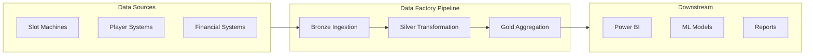
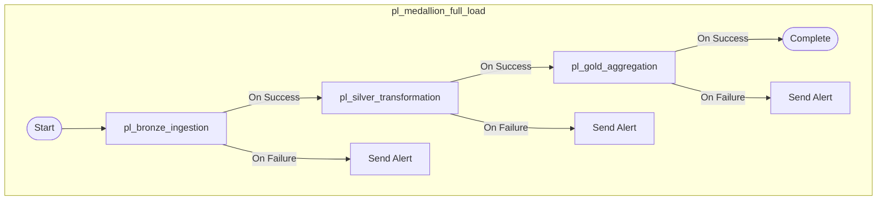
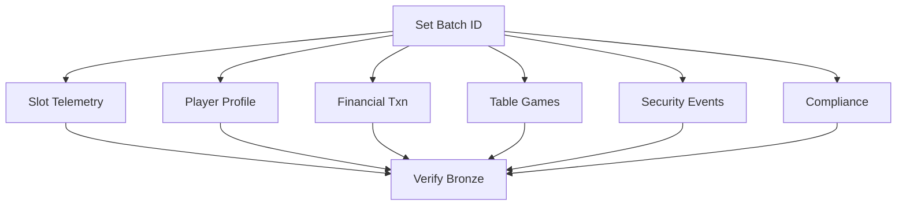
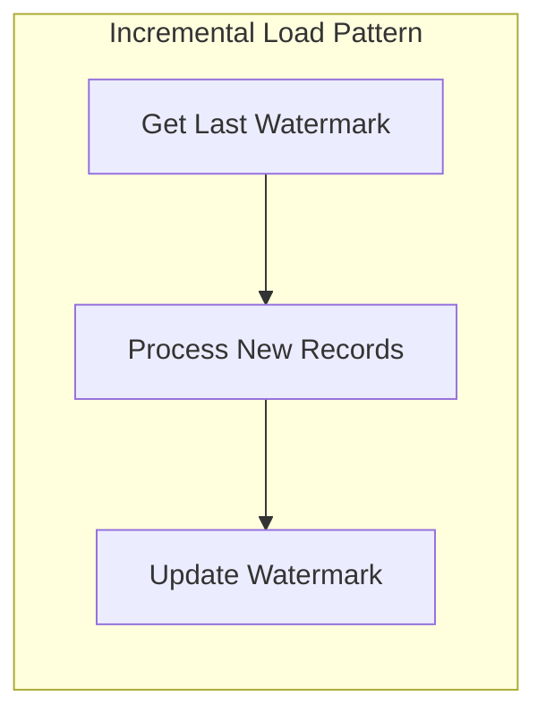
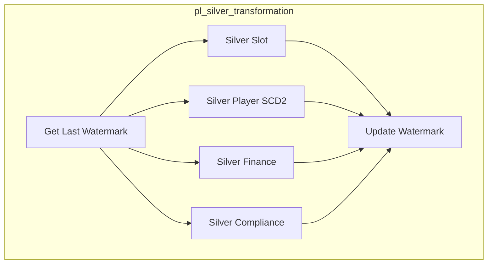
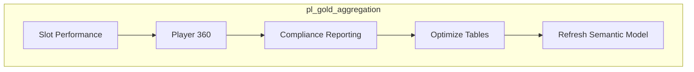
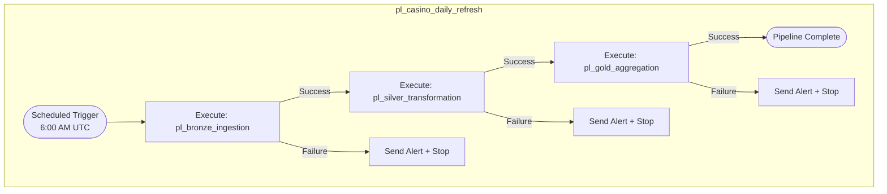

# 🔧 Tutorial 06: Data Pipelines

> **🏠 [Home](../../index.md)** > **📖 [Tutorials](../index.md)** > **🔧 Data Pipelines**

---

<div align="center">


</div>

---

## 🔧 Tutorial 06: Data Pipelines - Orchestrated ETL

| | |
|---|---|
| **Difficulty** | Intermediate |
| **Time** | 60-75 minutes |
| **Focus** | Data Orchestration |

---

### Progress Tracker

```
+--------+--------+--------+--------+--------+--------+--------+--------+--------+--------+
|   00   |   01   |   02   |   03   |   04   |   05   |   06   |   07   |   08   |   09   |
| SETUP  | BRONZE | SILVER |  GOLD  |  RT    |  PBI   | PIPES  |  GOV   | MIRROR |  AI/ML |
+--------+--------+--------+--------+--------+--------+--------+--------+--------+--------+
                                                          ^
                                                          |
                                                     YOU ARE HERE
```

| Navigation | |
|---|---|
| **Previous** | [05-Direct Lake & Power BI](../05-direct-lake-powerbi/README.md) |
| **Next** | [07-Governance & Purview](../07-governance-purview/README.md) |

---

## Overview

This tutorial covers creating orchestrated data pipelines in Microsoft Fabric. You will build end-to-end pipelines that automate the Bronze-Silver-Gold data flow with error handling, monitoring, and alerting.

### Data Factory in Microsoft Fabric

Microsoft Fabric Data Factory provides data integration capabilities to orchestrate your data workflows:


*Source: [What is Data Factory in Microsoft Fabric](https://learn.microsoft.com/en-us/fabric/data-factory/data-factory-overview)*



---

## Learning Objectives

By the end of this tutorial, you will be able to:

- [ ] Create Data Factory pipelines in Microsoft Fabric
- [ ] Orchestrate notebook execution across medallion layers
- [ ] Implement incremental loading with watermark patterns
- [ ] Handle errors with retry logic and alerting
- [ ] Schedule automated pipeline runs
- [ ] Monitor pipeline execution and performance

---

## Prerequisites

- [ ] Completed Tutorials 01-05 (Bronze, Silver, Gold, Real-Time, Power BI)
- [ ] Notebooks created for each medallion layer
- [ ] Access to Fabric workspace with Data Factory capability
- [ ] Email configured for alerts (optional)

> **Note:** If you haven't completed the previous tutorials, you'll need the Bronze, Silver, and Gold layer notebooks to orchestrate.

---

## Data Factory Pipeline Concepts

Before building pipelines, understand these key concepts:

| Concept | Description |
|---------|-------------|
| **Pipeline** | A logical grouping of activities that performs a unit of work |
| **Activity** | A processing step within a pipeline (e.g., Copy, Notebook, Script) |
| **Trigger** | Defines when a pipeline runs (schedule, event, manual) |
| **Parameter** | Runtime values passed to pipelines for flexibility |
| **Variable** | Pipeline-scoped values for storing intermediate results |
| **Dependency** | Defines execution order (On Success, On Failure, On Completion) |

---

## Step 1: Create Master Pipeline

### 1.1 In Fabric Portal


*The Fabric Data Factory integration stack showing connectors, orchestration, and OneLake. Source: [Data Factory overview](https://learn.microsoft.com/en-us/fabric/data-factory/data-factory-overview)*

1. Open workspace `casino-fabric-poc`
2. Click **+ New** > **Data pipeline**
3. Name: `pl_medallion_full_load`
4. Click **Create**

### 1.2 Pipeline Architecture

The master pipeline orchestrates the entire medallion architecture flow:



> **Tip:** Design pipelines in a modular fashion. Each layer should be its own sub-pipeline for reusability and easier debugging.

---

## Step 2: Create Bronze Pipeline

### 2.1 Create Pipeline

1. **+ New** > **Data pipeline**
2. Name: `pl_bronze_ingestion`
3. Click **Create**

### 2.2 Add Variables

First, define pipeline variables:

1. Click on canvas background
2. In **Variables** tab at bottom, add:
   - Name: `batch_id`, Type: String
   - Name: `process_date`, Type: String
   - Name: `status`, Type: String

### 2.3 Add Activities

#### Activity 1: Set Batch ID

1. From Activities pane, drag **Set variable** to canvas
2. Name: `Set Batch ID`
3. Configure in Settings tab:
   - **Variable name:** `batch_id`
   - **Value:** `@concat(formatDateTime(utcnow(), 'yyyyMMdd_HHmmss'))`

#### Activity 2: Execute Slot Telemetry Notebook

1. Drag **Notebook** activity to canvas
2. Name: `Bronze - Slot Telemetry`
3. Connect from `Set Batch ID` (green checkmark = On Success)
4. Configure Settings:
   - **Notebook:** `01_bronze_slot_telemetry`
   - **Lakehouse:** `lh_bronze`
   - **Base parameters:**

```json
{
  "batch_id": "@variables('batch_id')",
  "source_path": "Files/landing/slot_telemetry/"
}
```

#### Activity 3-7: Additional Bronze Notebooks

Add parallel notebooks for remaining Bronze tables:

| Activity Name | Notebook | Description |
|---------------|----------|-------------|
| Bronze - Player Profile | `02_bronze_player_profile` | Player master data |
| Bronze - Financial Txn | `03_bronze_financial_txn` | Financial transactions |
| Bronze - Table Games | `04_bronze_table_games` | Table game data |
| Bronze - Security Events | `05_bronze_security_events` | Security events |
| Bronze - Compliance | `06_bronze_compliance` | Compliance records |

### 2.4 Configure Parallel Execution

1. Select all Bronze notebook activities
2. Connect each from `Set Batch ID` with **On Success**
3. All notebooks will execute in parallel

### 2.5 Add Verification Activity

1. Add another **Notebook** activity
2. Name: `Verify Bronze Load`
3. Connect from ALL Bronze notebooks (wait for all to complete)
4. Notebook: `99_bronze_verification`

### 2.6 Complete Bronze Pipeline



> **Warning:** Parallel execution increases resource consumption. Monitor your Fabric capacity CUs during development.

---

## Step 3: Create Silver Pipeline

### 3.1 Create Pipeline

Name: `pl_silver_transformation`

### 3.2 Implement Watermark Pattern

The watermark pattern enables incremental processing by tracking the last processed record.



#### Activity 1: Get Last Watermark

1. Add **Lookup** activity
2. Name: `Get Last Watermark`
3. Configure:
   - **Source dataset:** Create inline dataset pointing to watermark table
   - **Use query:** Yes
   - **Query:**

```sql
SELECT
    table_name,
    MAX(last_processed) as watermark,
    MAX(last_batch_id) as last_batch
FROM watermarks
WHERE table_name = 'silver_slot'
GROUP BY table_name
```

#### Activity 2: Silver Slot Transformation

1. Add **Notebook** activity
2. Name: `Silver - Slot Cleansed`
3. Connect from `Get Last Watermark`
4. **Base parameters:**

```json
{
  "watermark": "@activity('Get Last Watermark').output.firstRow.watermark",
  "batch_id": "@variables('batch_id')"
}
```

#### Activity 3: Silver Player (SCD Type 2)

For slowly changing dimensions:

1. Add **Notebook** activity
2. Name: `Silver - Player Master (SCD2)`
3. This notebook implements Type 2 SCD logic for player dimension

#### Activity 4: Update Watermark

1. Add **Script** activity
2. Name: `Update Watermark`
3. Connect from all Silver notebooks
4. **Script:**

```sql
MERGE INTO watermarks AS target
USING (SELECT 'silver_slot' as table_name,
              CURRENT_TIMESTAMP() as last_processed,
              '@{variables('batch_id')}' as last_batch_id) AS source
ON target.table_name = source.table_name
WHEN MATCHED THEN UPDATE SET
    last_processed = source.last_processed,
    last_batch_id = source.last_batch_id
WHEN NOT MATCHED THEN INSERT
    (table_name, last_processed, last_batch_id)
    VALUES (source.table_name, source.last_processed, source.last_batch_id);
```

### 3.3 Complete Silver Pipeline



---

## Step 4: Create Gold Pipeline

### 4.1 Create Pipeline

Name: `pl_gold_aggregation`

### 4.2 Gold Activities Sequence

Gold aggregations often have dependencies, so we use sequential execution:



#### Activity 1: Slot Performance Aggregation

1. Add **Notebook** activity
2. Name: `Gold - Slot Performance`
3. Notebook: `01_gold_slot_performance`

#### Activity 2: Player 360 View

1. Add **Notebook** activity
2. Name: `Gold - Player 360`
3. Connect from Slot Performance (sequential)
4. Notebook: `02_gold_player_360`

#### Activity 3: Compliance Reporting

1. Add **Notebook** activity
2. Name: `Gold - Compliance Reporting`
3. Notebook: `03_gold_compliance_reporting`

#### Activity 4: Table Optimization

1. Add **Script** activity
2. Name: `Optimize Gold Tables`
3. **Script:**

```sql
-- Optimize Gold tables for query performance
OPTIMIZE gold_slot_performance ZORDER BY (machine_id, business_date);
OPTIMIZE gold_player_360 ZORDER BY (player_id);
OPTIMIZE gold_compliance_reporting ZORDER BY (report_date);

-- Vacuum old versions (retain 7 days = 168 hours)
VACUUM gold_slot_performance RETAIN 168 HOURS;
VACUUM gold_player_360 RETAIN 168 HOURS;
VACUUM gold_compliance_reporting RETAIN 168 HOURS;
```

> **Tip:** ZORDER improves query performance by co-locating related data. Choose columns frequently used in WHERE clauses.

#### Activity 5: Refresh Semantic Model (Optional)

1. Add **Web** activity (or use REST API)
2. Name: `Refresh Semantic Model`
3. Configure to trigger Power BI dataset refresh via API

---

## Step 5: Error Handling

### 5.1 Retry Configuration

For each notebook activity:

1. Click on the activity
2. Go to **Settings** tab
3. Expand **Advanced**
4. Configure retry:
   - **Retry count:** 3
   - **Retry interval (seconds):** 30
   - **Exponential backoff:** Yes (if available)

### 5.2 Error Logging

Create an error logging notebook that captures failures:

```python
# error_logger.py - Notebook for logging pipeline errors

from pyspark.sql import SparkSession
from pyspark.sql.functions import current_timestamp, lit
from datetime import datetime

def log_error(pipeline_name: str, activity_name: str,
              error_message: str, run_id: str):
    """Log pipeline error to Delta table"""

    error_record = {
        "pipeline_name": pipeline_name,
        "activity_name": activity_name,
        "error_message": error_message,
        "run_id": run_id,
        "error_timestamp": datetime.utcnow().isoformat(),
        "severity": "ERROR"
    }

    df = spark.createDataFrame([error_record])

    df.write \
        .format("delta") \
        .mode("append") \
        .saveAsTable("lh_bronze.pipeline_error_log")

    return error_record
```

### 5.3 Add Error Handler Activities

For critical failures, add an error handler:

1. Add **If Condition** activity after notebooks
2. Name: `Check Status`
3. **Condition:** `@equals(activity('Bronze - Slot Telemetry').Status, 'Failed')`
4. **If True:** Execute error logging and alerting

### 5.4 Send Alert on Failure

1. Add **Web** activity (or **Office 365 Outlook** if available)
2. Name: `Send Alert Email`
3. Configure to send email/Teams notification on failure

```json
{
  "message": {
    "subject": "Pipeline Failure Alert: @{pipeline().Pipeline}",
    "body": "Pipeline @{pipeline().Pipeline} failed at @{utcnow()}\n\nActivity: @{activity('Bronze - Slot Telemetry').ActivityName}\nError: @{activity('Bronze - Slot Telemetry').Error.Message}",
    "to": ["data-team@casino.com"]
  }
}
```

---

## Step 6: Master Orchestration Pipeline

### 6.1 Create Master Pipeline

Name: `pl_casino_daily_refresh`

This master pipeline orchestrates all sub-pipelines:



### 6.2 Add Execute Pipeline Activities

1. Add **Execute pipeline** activity
2. Name: `Execute Bronze Pipeline`
3. Settings:
   - **Invoked pipeline:** `pl_bronze_ingestion`
   - **Wait on completion:** Yes
4. Repeat for Silver and Gold pipelines

### 6.3 Configure Dependencies

Connect activities with appropriate conditions:
- **On Success** (green): Continue to next layer
- **On Failure** (red): Execute alert and stop

---

## Step 7: Schedule Pipeline

### 7.1 Create Scheduled Trigger

1. Open `pl_casino_daily_refresh`
2. Click **Add trigger** > **New/Edit**
3. Click **+ New**
4. Configure:

| Setting | Value |
|---------|-------|
| **Name** | `tr_daily_refresh` |
| **Type** | Schedule |
| **Recurrence** | Daily |
| **Start time** | 6:00 AM |
| **Time zone** | UTC (or your timezone) |

> **Tip:** Schedule after gaming day ends (typically 6 AM) when casino operations are lowest.

### 7.2 Activate Trigger

1. Review trigger configuration
2. Click **OK** to save
3. Toggle trigger to **Started**

### 7.3 Monitor Pipeline Runs

1. Go to **Monitor** hub in Fabric
2. Select **Pipeline runs**
3. Filter by pipeline name
4. View:
   - Run status (Succeeded, Failed, Running)
   - Duration
   - Activity details
   - Error messages

---

## Pipeline Parameters

### 8.1 Define Pipeline Parameters

Make pipelines reusable with parameters:

1. Click on pipeline canvas
2. Go to **Parameters** tab
3. Add parameters:

| Name | Type | Default Value |
|------|------|---------------|
| `environment` | String | `dev` |
| `date_override` | String | ` ` (empty) |
| `full_refresh` | Bool | `false` |

### 8.2 Use Parameters in Activities

Reference parameters in notebook base parameters:

```json
{
  "environment": "@pipeline().parameters.environment",
  "process_date": "@if(empty(pipeline().parameters.date_override), formatDateTime(utcnow(), 'yyyy-MM-dd'), pipeline().parameters.date_override)",
  "is_full_refresh": "@pipeline().parameters.full_refresh"
}
```

### 8.3 Manual Run with Parameters

To run with custom parameters:

1. Click **Add trigger** > **Trigger now**
2. Enter parameter values
3. Click **OK**

---

## ✅ Validation Checklist

Before moving to the next tutorial, verify:

- [ ] **Bronze Pipeline Runs Successfully** - All notebooks execute in parallel without errors
- [ ] **Silver Pipeline Implements Watermark** - Incremental load working correctly
- [ ] **Gold Pipeline Completes** - Aggregations and optimizations finish successfully
- [ ] **Master Pipeline Orchestrates** - All sub-pipelines coordinate correctly
- [ ] **Schedule Trigger Active** - Daily refresh configured and enabled
- [ ] **Error Handling Works** - Retry logic and alerts configured
- [ ] **Monitoring Accessible** - Pipeline runs visible in Monitor hub

<details>
<summary>🔍 How to verify each item</summary>

### Bronze Pipeline Runs Successfully
```
1. Navigate to workspace > Pipelines
2. Open "pl_bronze_ingestion"
3. Click "Run" button (or use existing run)
4. Monitor execution:
   ✅ "Set Batch ID" activity completes
   ✅ All 6 Bronze notebook activities run in parallel
   ✅ All complete with green checkmarks (success)
   ✅ "Verify Bronze Load" activity runs last
   ✅ Total run time < 10 minutes

5. Click on "Output" tab of any notebook activity
6. Verify: "status": "Succeeded"
```

### Silver Pipeline Implements Watermark
```
1. Open "pl_silver_transformation"
2. Check pipeline structure:
   ✅ "Get Last Watermark" activity exists
   ✅ Lookup activity queries watermark table
   ✅ Notebook activities receive watermark parameter
   ✅ "Update Watermark" activity runs last

3. Run the pipeline
4. Check watermark table:
```

```sql
SELECT * FROM watermarks
WHERE table_name LIKE 'silver_%'
ORDER BY last_processed DESC;

-- Should show recent timestamps for all Silver tables
```

### Gold Pipeline Completes
```
1. Open "pl_gold_aggregation"
2. Verify pipeline structure:
   ✅ Sequential execution order
   ✅ Slot Performance → Player 360 → Compliance
   ✅ Optimization activity at end
   ✅ Optional: Semantic model refresh

3. Run the pipeline
4. Check outputs:
```

```python
# Verify Gold tables updated
from pyspark.sql.functions import max as spark_max

tables = ["gold_slot_performance", "gold_player_360", "gold_compliance_reporting"]
for table in tables:
    df = spark.table(f"lh_gold.{table}")
    last_update = df.select(spark_max("_gold_computed_at")).collect()[0][0]
    print(f"✅ {table}: Last updated at {last_update}")
```

### Master Pipeline Orchestrates
```
1. Open "pl_casino_daily_refresh" (or your master pipeline)
2. Verify structure:
   ✅ "Execute Bronze Pipeline" activity
   ✅ "Execute Silver Pipeline" activity
   ✅ "Execute Gold Pipeline" activity
   ✅ Dependencies: Bronze → Silver → Gold (sequential)
   ✅ Error paths to alert activities

3. Test full run:
   - Click "Run" or "Add trigger" > "Trigger now"
   - Provide parameters if needed
   - Monitor in Monitor hub

4. Verify:
   ✅ Bronze pipeline executes first
   ✅ Silver pipeline waits for Bronze to complete
   ✅ Gold pipeline waits for Silver to complete
   ✅ Total end-to-end runtime reasonable (< 30 min)
```

### Schedule Trigger Active
```
1. Open master pipeline
2. Click "Add trigger" > "New/Edit"
3. Verify trigger configuration:
   ✅ Trigger name: "tr_daily_refresh" (or similar)
   ✅ Type: Schedule
   ✅ Recurrence: Daily at 6:00 AM (or your time)
   ✅ Status: Started (toggle should be ON)

4. Check trigger history:
   - Go to Monitor hub > Pipeline runs
   - Filter by pipeline name
   - Look for runs with "Trigger" type = "tr_daily_refresh"
   - Should see scheduled runs if time has passed
```

### Error Handling Works
```
Test error handling and retry logic:

1. Introduce intentional error:
   - Edit a Bronze notebook
   - Add: raise Exception("Test error")
   - Save notebook

2. Run Bronze pipeline
3. Verify error handling:
   ✅ Activity fails (red X)
   ✅ Retry attempts (if configured)
   ✅ Error path activates
   ✅ Alert activity runs
   ✅ Error logged

4. Check pipeline output:
```

```json
{
  "status": "Failed",
  "error": {
    "errorCode": "NotebookExecutionFailed",
    "message": "Test error",
    "failureType": "UserError"
  }
}
```

```
5. Remove test error and re-run to verify recovery
```

### Monitoring Accessible
```
1. Navigate to Monitor hub (left navigation)
2. Click "Pipeline runs"
3. Verify you can see:
   ✅ All recent pipeline runs
   ✅ Status (Succeeded, Failed, Running)
   ✅ Start and end times
   ✅ Duration
   ✅ Run ID

4. Click on a run to see details:
   ✅ Activity-level status
   ✅ Input/Output for each activity
   ✅ Error messages (for failures)

5. Test filtering:
   - Filter by pipeline name
   - Filter by status
   - Filter by date range
```

### Parameter Passing Verification
```
Test parameter functionality:

1. Open Bronze pipeline
2. Define a test parameter (if not exists):
   - Parameter name: "test_date"
   - Default value: "2024-01-01"

3. Use parameter in notebook:
```

```python
# In notebook, get parameter
test_date = ""  # Will be overridden by pipeline
print(f"Received parameter: test_date = {test_date}")
```

```
4. Run pipeline:
   - "Add trigger" > "Trigger now"
   - Enter custom value: "2024-12-31"
   - Click OK

5. Check notebook output:
   - Should print: "Received parameter: test_date = 2024-12-31"
```

### Performance Validation
```
Check pipeline performance metrics:

1. In Monitor hub, select a completed pipeline run
2. Review metrics:
   ✅ Bronze pipeline: < 10 minutes
   ✅ Silver pipeline: < 15 minutes
   ✅ Gold pipeline: < 10 minutes
   ✅ Master pipeline total: < 35 minutes

3. If performance is slow:
   - Check Fabric capacity utilization
   - Review notebook Spark configurations
   - Consider parallelization opportunities
   - Check table sizes and partitioning
```

### Alert Verification (If Configured)
```
If you configured email/Teams alerts:

1. Trigger a test failure
2. Wait for alert notification
3. Verify:
   ✅ Email/Teams message received
   ✅ Message includes pipeline name
   ✅ Error details included
   ✅ Link to Monitor hub (if applicable)

4. Fix the error and re-run
5. Optional: Configure success alerts too
```

</details>

---

## Best Practices

### Pipeline Design

| Practice | Description |
|----------|-------------|
| **Modular Design** | Separate pipelines for each layer |
| **Fail Fast** | Stop early on critical errors |
| **Idempotent** | Safe to re-run without side effects |
| **Parameterized** | Use parameters for flexibility |
| **Documented** | Add descriptions to activities |

### Performance

| Practice | Description |
|----------|-------------|
| **Parallel Execution** | Run independent activities simultaneously |
| **Incremental Load** | Process only new/changed data |
| **Optimize Tables** | ZORDER and VACUUM regularly |
| **Monitor CUs** | Track capacity utilization |

### Operational

| Practice | Description |
|----------|-------------|
| **Alerting** | Notify on failures immediately |
| **Logging** | Capture all execution metadata |
| **Retry Logic** | Handle transient failures |
| **Testing** | Test in dev before prod |

---

## Troubleshooting

### Common Issues

| Issue | Cause | Solution |
|-------|-------|----------|
| Pipeline stuck | Activity timeout | Increase timeout setting |
| Notebook fails | Missing lakehouse | Verify lakehouse connection |
| Watermark not updating | Transaction issue | Check watermark table permissions |
| Alert not sending | Credential issue | Verify email/webhook configuration |
| Schedule not triggering | Trigger inactive | Check trigger status is Started |

### Debugging Steps

1. **Check Monitor** - Review activity-level status
2. **View Logs** - Click on failed activity for details
3. **Test Notebook** - Run notebook manually to reproduce
4. **Check Parameters** - Verify parameter values passed correctly
5. **Review Capacity** - Ensure sufficient CUs available

---

## Summary

Congratulations! You have successfully:

- Built orchestrated pipelines for the medallion architecture
- Implemented watermark-based incremental processing
- Configured error handling with retry logic and alerting
- Scheduled automated daily refreshes
- Set up monitoring for pipeline health

Your data pipelines now automate the entire Bronze-Silver-Gold flow with production-ready error handling and monitoring.

---

## Next Steps

Continue to **[Tutorial 07: Governance & Purview](../07-governance-purview/README.md)** to implement data cataloging, lineage tracking, and compliance controls.

---

## Resources

| Resource | Link |
|----------|------|
| Data Factory in Fabric | [Microsoft Docs](https://learn.microsoft.com/fabric/data-factory/) |
| Pipeline Activities | [Activity Overview](https://learn.microsoft.com/fabric/data-factory/activity-overview) |
| Orchestration Patterns | [Pipeline Runs](https://learn.microsoft.com/fabric/data-factory/pipeline-runs) |
| Monitoring | [Monitor Hub](https://learn.microsoft.com/fabric/admin/monitoring-hub) |

---

## Navigation

| Previous | Up | Next |
|----------|-----|------|
| [05-Direct Lake & Power BI](../05-direct-lake-powerbi/README.md) | [Tutorials Index](../index.md) | [07-Governance & Purview](../07-governance-purview/README.md) |

---

> **Questions or issues?** Open an issue in the [GitHub repository](https://github.com/frgarofa/Suppercharge_Microsoft_Fabric/issues).
