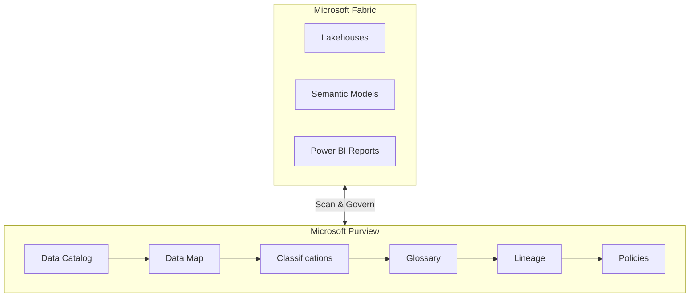
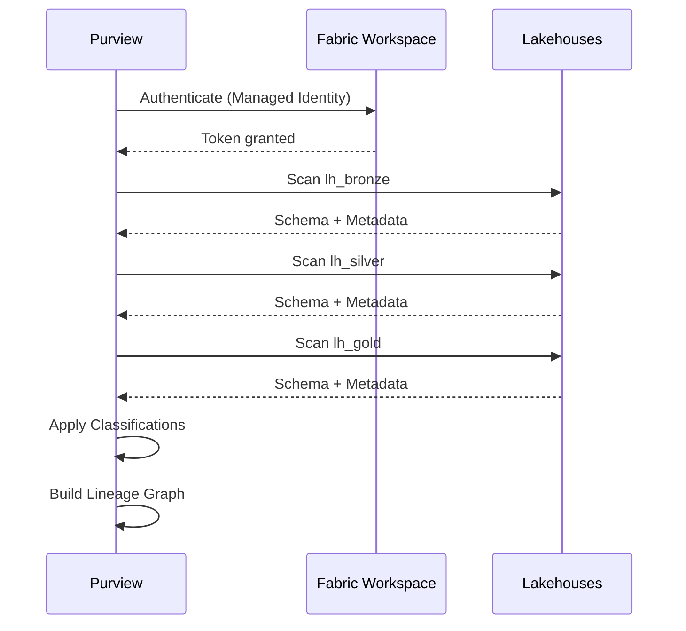
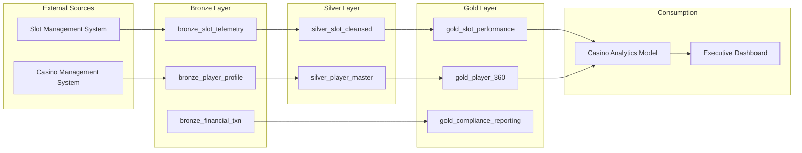

# 🛡️ Tutorial 07: Governance & Purview

> **🏠 [Home](../../README.md)** > **📖 [Tutorials](../README.md)** > **🛡️ Governance & Purview**

---

<div align="center">


</div>

---

## 🛡️ Tutorial 07: Governance & Purview - Data Catalog & Lineage

| | |
|---|---|
| **Difficulty** | Advanced |
| **Time** | 60-75 minutes |
| **Focus** | Data Governance |

---

### Progress Tracker

```
+--------+--------+--------+--------+--------+--------+--------+--------+--------+--------+
|   00   |   01   |   02   |   03   |   04   |   05   |   06   |   07   |   08   |   09   |
| SETUP  | BRONZE | SILVER |  GOLD  |  RT    |  PBI   | PIPES  |  GOV   | MIRROR |  AI/ML |
+--------+--------+--------+--------+--------+--------+--------+--------+--------+--------+
                                                                    ^
                                                                    |
                                                               YOU ARE HERE
```

| Navigation | |
|---|---|
| **Previous** | [06-Data Pipelines](../06-data-pipelines/README.md) |
| **Next** | [08-Database Mirroring](../08-database-mirroring/README.md) |

---

## Overview

This tutorial covers implementing data governance using Microsoft Purview integration with Fabric. You will catalog data assets, apply classifications, track data lineage, and establish compliance controls for the regulated casino/gaming environment.

### Microsoft Purview Hub in Fabric

The Purview hub in Fabric provides centralized governance capabilities for your data estate:


*Source: [Use Microsoft Purview hub in Fabric](https://learn.microsoft.com/en-us/fabric/governance/use-microsoft-purview-hub)*



---

## Learning Objectives

By the end of this tutorial, you will be able to:

- [ ] Connect Microsoft Purview to Fabric workspace
- [ ] Scan and catalog all data assets
- [ ] Apply classifications and sensitivity labels
- [ ] Create business glossary terms for casino domain
- [ ] View and analyze data lineage
- [ ] Configure data access policies
- [ ] Generate compliance reports

---

## Why Governance Matters for Casino Data

Casino and gaming operations handle highly regulated data:

| Data Type | Regulatory Requirement | Risk Level |
|-----------|----------------------|------------|
| Player PII | GDPR, CCPA, State Privacy Laws | High |
| Financial Transactions | BSA/AML, FinCEN | Critical |
| CTR Filings | 31 CFR 1021.311 ($10K+ cash) | Critical |
| SAR Filings | Suspicious Activity Reports | Critical |
| W-2G Jackpots | IRS Reporting ($1,200+) | High |
| Gaming Data | State Gaming Commission | Medium |

> **Warning:** Failure to properly govern casino data can result in regulatory fines, license revocation, and criminal penalties.

---

## Microsoft Purview Capabilities

Microsoft Purview provides unified data governance:

| Capability | Description |
|------------|-------------|
| **Data Catalog** | Discover and understand data assets |
| **Data Map** | Unified view of entire data estate |
| **Classifications** | Automatic identification of sensitive data |
| **Lineage** | Track data flow and transformations |
| **Glossary** | Business terminology definitions |
| **Access Policies** | Govern data access controls |
| **Insights** | Data estate health dashboards |

---

## Prerequisites

- [ ] Completed Tutorials 01-06 (Medallion architecture + Pipelines)
- [ ] Microsoft Purview account deployed in your Azure subscription
- [ ] Purview Data Curator role or higher
- [ ] Fabric workspace admin access
- [ ] Azure AD permissions for service principal (optional)

> **Note:** Purview is included with Microsoft 365 E5 or can be provisioned separately in Azure.

---

## Step 1: Connect Purview to Fabric

### 1.1 Register Fabric as a Data Source

1. Open [Microsoft Purview Portal](https://purview.microsoft.com)
2. Navigate to **Data Map** > **Sources**
3. Click **Register** > **Microsoft Fabric**
4. Configure registration:

| Setting | Value |
|---------|-------|
| **Name** | `Fabric-Casino-POC` |
| **Tenant** | Select your Azure AD tenant |
| **Workspace** | `casino-fabric-poc` |
| **Collection** | Root or create `Casino Data Estate` |

5. Click **Register**

### 1.2 Configure Scan Credentials

1. Go to **Management** > **Credentials**
2. Create new credential:
   - **Name:** `fabric-scan-credential`
   - **Authentication method:** Managed Identity (recommended) or Service Principal
3. Grant credential access to Fabric workspace

### 1.3 Create Scan

1. On the registered source, click **New Scan**
2. Configure scan settings:

| Setting | Value |
|---------|-------|
| **Name** | `fabric-casino-full-scan` |
| **Integration runtime** | Azure integration runtime |
| **Credential** | `fabric-scan-credential` |

3. **Scope your scan** - Select:
   - [x] `lh_bronze`
   - [x] `lh_silver`
   - [x] `lh_gold`
   - [x] Semantic models
   - [x] Reports

4. **Scan rule set:** System default (or create custom)
5. Click **Continue**

### 1.4 Set Scan Trigger

Configure recurring scans:

| Setting | Value |
|---------|-------|
| **Trigger type** | Recurring |
| **Frequency** | Weekly |
| **Day** | Sunday |
| **Time** | 2:00 AM (off-peak) |

Click **Save and Run** to start initial scan.



---

## Step 2: Review Scanned Assets

### 2.1 View Data Catalog

1. Go to **Data Catalog** > **Browse**
2. Filter by:
   - **Source type:** Microsoft Fabric
   - **Source:** `Fabric-Casino-POC`

You should see:
- Lakehouses (`lh_bronze`, `lh_silver`, `lh_gold`)
- Delta tables within each lakehouse
- Semantic models
- Power BI reports

### 2.2 Explore Table Details

Click on a table (e.g., `gold_slot_performance`):

#### Overview Tab
- Asset description
- Owner and steward
- Classifications applied
- Glossary terms linked

#### Schema Tab
- Column names and data types
- Column-level classifications
- Column descriptions

#### Lineage Tab
- Upstream data sources
- Downstream consumers
- Transformation steps

### 2.3 Asset Hierarchy View

```
Fabric-Casino-POC (Source)
├── lh_bronze (Lakehouse)
│   ├── bronze_slot_telemetry (Table)
│   ├── bronze_player_profile (Table)
│   ├── bronze_financial_txn (Table)
│   └── ...
├── lh_silver (Lakehouse)
│   ├── silver_slot_cleansed (Table)
│   ├── silver_player_master (Table)
│   └── ...
├── lh_gold (Lakehouse)
│   ├── gold_slot_performance (Table)
│   ├── gold_player_360 (Table)
│   └── gold_compliance_reporting (Table)
├── Casino Analytics Model (Semantic Model)
└── Casino Executive Dashboard (Report)
```

---

## Step 3: Apply Classifications

### 3.1 Built-in Classifications

Purview includes 200+ built-in classifications for:

| Category | Examples |
|----------|----------|
| **Personal Information** | Name, Email, Phone, Address |
| **Financial** | Credit Card, Bank Account |
| **Government IDs** | SSN, Driver's License, Passport |
| **Healthcare** | Medical Record Numbers |
| **Geographic** | GPS Coordinates, IP Addresses |

### 3.2 Review Auto-Classifications

1. Navigate to table: `silver_player_master`
2. Click **Schema** tab
3. Review automatically detected classifications:

| Column | Auto-Classification |
|--------|---------------------|
| `ssn_hash` | Government ID (Hashed) |
| `email` | Email Address |
| `phone` | Phone Number |
| `date_of_birth` | Date of Birth |
| `address_line_1` | Street Address |
| `postal_code` | Postal Code |

> **Tip:** Auto-classification uses pattern matching and ML. Review for accuracy in your specific context.

### 3.3 Create Custom Classifications

For casino-specific data patterns:

1. Go to **Data Map** > **Classifications**
2. Click **+ New**
3. Create custom classifications:

#### Classification: Casino Player ID

| Setting | Value |
|---------|-------|
| **Name** | `Casino - Player ID` |
| **Description** | Unique identifier for casino loyalty members |
| **Pattern (Regex)** | `PLY[0-9]{8}` |
| **Classification type** | Custom |

#### Classification: Gaming Transaction

| Setting | Value |
|---------|-------|
| **Name** | `Casino - Gaming Transaction` |
| **Description** | Gaming metrics including coin-in, coin-out, jackpot amounts |
| **Keywords** | `coin_in`, `coin_out`, `jackpot`, `wager`, `payout` |

#### Classification: Regulatory Filing

| Setting | Value |
|---------|-------|
| **Name** | `Casino - Regulatory Filing` |
| **Description** | BSA/AML compliance filing data (CTR, SAR, W-2G) |
| **Keywords** | `ctr_`, `sar_`, `w2g_`, `bsa_`, `aml_` |

### 3.4 Apply Classifications to Assets

1. Open table `silver_player_master`
2. Click **Edit**
3. Under **Classifications**, add:
   - `Casino - Player PII`
   - `Confidential`
4. Click **Save**

For compliance tables:
1. Open `gold_compliance_reporting`
2. Add classifications:
   - `Casino - Regulatory Filing`
   - `Highly Confidential`
   - `Regulatory - BSA/AML`

---

## Step 4: Create Business Glossary

### 4.1 Navigate to Glossary

1. Go to **Data Catalog** > **Glossary**
2. Create a hierarchical structure for casino terms

### 4.2 Create Term Hierarchy

```
Casino Glossary (Root)
├── Gaming Operations
│   ├── Slot Metrics
│   │   ├── Coin In
│   │   ├── Coin Out
│   │   ├── Net Win
│   │   └── Hold Percentage
│   └── Table Games
│       ├── Drop
│       └── Handle
├── Player Management
│   ├── Player Value
│   │   ├── Theoretical Win
│   │   └── ADT (Average Daily Theo)
│   └── Loyalty Tiers
├── Compliance & Regulatory
│   ├── CTR (Currency Transaction Report)
│   ├── SAR (Suspicious Activity Report)
│   └── W-2G (Gambling Winnings)
└── Financial
    └── Cash Handling
```

### 4.3 Create Business Terms

#### Term: Coin In

```yaml
Name: Coin In
Definition: |
  Total amount wagered by players on a gaming device.
  Represents the handle or total bets placed, regardless of outcome.
  This is the primary volume metric for slot operations.

Acronym: CI
Status: Approved
Owner: Slot Operations Manager

Related Terms:
  - Coin Out
  - Net Win
  - Hold Percentage

Formula: Sum of all wagers placed

Regulatory Reference: NIGC MICS Section 543.24

Resources:
  - Gaming Commission Handbook
  - Internal Slot Accounting Manual
```

#### Term: Theoretical Win (Theo)

```yaml
Name: Theoretical Win
Definition: |
  The statistical expected win from a player or device based on
  the mathematical house advantage and total wagers.
  Used for player rating and marketing decisions.

Synonyms:
  - Theoretical
  - Expected Win
  - Theo

Formula: Theo = Coin In x House Edge

Example: |
  If player wagers $10,000 on a slot with 8% hold:
  Theo = $10,000 x 0.08 = $800

Status: Approved
Owner: Player Development

Related Terms:
  - Hold Percentage
  - Actual Win
  - Player Value Score
```

#### Term: Currency Transaction Report (CTR)

```yaml
Name: Currency Transaction Report
Definition: |
  Federal filing required for cash transactions of $10,000 or more
  in a single gaming day. Must be filed within 15 days of transaction.
  Casinos must aggregate multiple transactions by same person.

Acronym: CTR
Status: Approved
Owner: Compliance Officer

Regulatory Reference: 31 CFR 1021.311

Filing Requirements:
  - Amount: $10,000 or more in cash
  - Timeframe: Single gaming day
  - Deadline: 15 calendar days
  - Form: FinCEN Form 112

Related Terms:
  - SAR
  - BSA
  - Gaming Day
  - AML
```

#### Term: Hold Percentage

```yaml
Name: Hold Percentage
Definition: |
  The percentage of total wagers retained by the casino.
  Calculated as Net Win divided by Coin In.
  Primary profitability metric for slot operations.

Synonyms:
  - Hold
  - Win Percentage
  - House Edge (theoretical)

Formula: Hold % = (Coin In - Coin Out) / Coin In x 100

Typical Ranges:
  - Slots: 6-12%
  - Video Poker: 2-6%
  - Table Games: 2-5%

Status: Approved
Owner: Finance

Monitoring: |
  Significant deviations from expected hold may indicate:
  - Machine malfunction
  - Cheating/fraud
  - Statistical variance (short term)
```

### 4.4 Assign Terms to Data Assets

1. Open table `gold_slot_performance`
2. Click **Edit**
3. Map glossary terms to columns:

| Column | Glossary Term |
|--------|---------------|
| `total_coin_in` | Coin In |
| `total_coin_out` | Coin Out |
| `net_win` | Net Win |
| `actual_hold_pct` | Hold Percentage |
| `theoretical_win` | Theoretical Win |

4. Click **Save**

> **Best Practice:** Assign glossary terms at both table and column level for complete documentation.

---

## Step 5: View Data Lineage

### 5.1 Navigate to Lineage

1. Open any Gold table (e.g., `gold_slot_performance`)
2. Click **Lineage** tab
3. View the data flow visualization

### 5.2 Understanding Lineage View



### 5.3 Complete Lineage for Slot Performance

View the full transformation chain:

```
Slot Management System (External)
        │
        ▼
bronze_slot_telemetry
  • Raw event data
  • Added: _bronze_ingested_at, _bronze_batch_id
        │
        ▼
silver_slot_cleansed
  • Data quality validation
  • Null handling
  • Type standardization
  • Added: _silver_processed_at
        │
        ▼
gold_slot_performance
  • Daily aggregation by machine
  • Calculated metrics (hold %, theo)
  • Added: _gold_computed_at
        │
        ▼
Casino Analytics Model (Semantic Model)
  • DAX measures
  • Relationships
        │
        ▼
Casino Executive Dashboard (Report)
  • Visualizations
  • KPIs
```

### 5.4 Impact Analysis

Use lineage for change impact assessment:

1. On `silver_slot_cleansed`, click **View Lineage**
2. Right-click on a downstream asset
3. Click **Impact Analysis**
4. View all dependent assets

**Example Impact Report:**

If `silver_slot_cleansed` schema changes:
- gold_slot_performance (IMPACTED)
- Casino Analytics Model (IMPACTED)
- Executive Dashboard (IMPACTED)
- 3 additional reports (IMPACTED)

> **Warning:** Always run impact analysis before making schema changes to understand downstream effects.

---

## Step 6: Sensitivity Labels and Data Policies

### 6.1 Apply Sensitivity Labels

1. In Purview, go to **Information Protection**
2. Configure labels for Fabric assets:

| Label | Apply To | Description |
|-------|----------|-------------|
| **Public** | Aggregated reports | No restrictions |
| **Internal** | Operational data | Internal use only |
| **Confidential** | Player data | Limited access |
| **Highly Confidential** | Compliance/Financial | Strict access controls |

3. Apply to specific tables:

| Table | Sensitivity Label |
|-------|-------------------|
| `gold_slot_performance` | Internal |
| `silver_player_master` | Confidential |
| `gold_player_360` | Confidential |
| `gold_compliance_reporting` | Highly Confidential |

### 6.2 Configure Data Access Policies

1. Go to **Data Policy** > **Data access policies**
2. Create policy for analysts:

| Setting | Value |
|---------|-------|
| **Name** | `Casino Data Access - Analysts` |
| **Data resources** | `lh_gold/*` |
| **Principals** | `Casino Analysts` (AD group) |
| **Permissions** | Read |
| **Conditions** | Exclude `*compliance*` tables |

3. Create policy for compliance team:

| Setting | Value |
|---------|-------|
| **Name** | `Compliance Full Access` |
| **Data resources** | `*compliance*`, `*ctr*`, `*sar*` |
| **Principals** | `Compliance Officers` (AD group) |
| **Permissions** | Read, Write |

### 6.3 PII Handling and Masking

For player PII, implement data masking:

```python
# Example: Mask PII in Silver layer
from pyspark.sql.functions import sha2, concat, lit, regexp_replace

def mask_pii(df):
    """Apply PII masking for non-authorized users"""
    return df \
        .withColumn("ssn_hash", sha2(col("ssn"), 256)) \
        .withColumn("email_masked",
            regexp_replace(col("email"), "^(.{2}).*@", "$1***@")) \
        .withColumn("phone_masked",
            concat(lit("***-***-"), substring(col("phone"), -4, 4))) \
        .drop("ssn", "email", "phone")
```

---

## Step 7: Monitoring and Compliance Reporting

### 7.1 Data Estate Insights

1. Go to **Data Estate Insights**
2. Review key dashboards:

| Dashboard | Metrics |
|-----------|---------|
| **Asset Distribution** | Count by type, source, classification |
| **Classification Coverage** | % of assets classified |
| **Glossary Adoption** | Terms assigned to assets |
| **Scan History** | Scan success/failure rates |
| **Data Stewardship** | Assets with owners assigned |

### 7.2 Generate Compliance Report

For regulatory audits:

1. Go to **Data Catalog** > **Browse**
2. Apply filters:
   - Classification = `Casino - Regulatory Filing`
   - Classification = `Highly Confidential`
3. Export asset list
4. Include in compliance documentation

**Sample Compliance Report Structure:**

```markdown
# Casino Data Governance Compliance Report
## Period: Q4 2024

### 1. Data Inventory
- Total cataloged assets: 45
- Tables with PII: 12
- Compliance-related tables: 8

### 2. Classification Coverage
- Assets with sensitivity labels: 100%
- Assets with glossary terms: 85%
- Assets with assigned owners: 100%

### 3. Access Controls
- Data access policies: 5
- Users with compliance data access: 8
- Access reviews completed: Quarterly

### 4. Lineage Documentation
- End-to-end lineage mapped: Yes
- Source systems documented: Yes
- Transformation logic documented: Yes

### 5. Audit Trail
- Scan frequency: Weekly
- Last successful scan: [Date]
- Classification rule updates: [List]
```

### 7.3 Audit Trail Export

1. Go to **Monitoring** > **Diagnostics**
2. Review and export:
   - Scan history
   - Classification changes
   - Policy changes
   - Access requests

```python
# Using Purview REST API for audit export
import requests

endpoint = "https://your-purview.purview.azure.com"
headers = {"Authorization": f"Bearer {token}"}

# Get all assets with regulatory classification
response = requests.post(
    f"{endpoint}/catalog/api/atlas/v2/search/advanced",
    headers=headers,
    json={
        "keywords": "*",
        "filter": {
            "and": [
                {"classification": "Casino - Regulatory Filing"},
                {"entityType": "azure_datalake_gen2_path"}
            ]
        },
        "limit": 100
    }
)

regulatory_assets = response.json()
```

---

## ✅ Validation Checklist

Before moving to the next tutorial, verify:

- [ ] **Purview Catalog Populated** - All Fabric assets scanned and cataloged
- [ ] **Lineage Visible** - End-to-end data flow mapped from Bronze to Reports
- [ ] **Classifications Applied** - Auto and custom classifications on sensitive data
- [ ] **Glossary Terms Created** - Casino business terminology defined (min 10 terms)
- [ ] **Access Policies Active** - Data access policies configured and enforced
- [ ] **Compliance Report Generated** - Regulatory assets documented

<details>
<parameter name="summary">🔍 How to verify each item

## Best Practices

### Governance Framework

| Practice | Description |
|----------|-------------|
| **Define Data Domains** | Organize by business function before cataloging |
| **Establish Glossary First** | Get business buy-in on terminology |
| **Automate Classification** | Use patterns and rules for consistency |
| **Regular Lineage Review** | Validate lineage after pipeline changes |
| **Monitor Data Quality** | Track classification coverage metrics |

### Casino/Gaming Specific

| Practice | Description |
|----------|-------------|
| **Classify Compliance Data** | Tag all CTR, SAR, W-2G related tables |
| **Tag PII Columns** | Ensure all player PII is classified |
| **Document Regulations** | Link glossary terms to regulatory references |
| **Track Financial Lineage** | Critical for BSA/AML audits |
| **Quarterly Access Reviews** | Review who has access to sensitive data |

---

## Troubleshooting

### Common Issues

| Issue | Cause | Solution |
|-------|-------|----------|
| Scan fails | Authentication issue | Check credential permissions |
| Missing tables | Scope not configured | Expand scan scope to include all assets |
| Classification incorrect | Pattern mismatch | Adjust custom classification patterns |
| Lineage incomplete | Missing intermediate steps | Ensure notebooks are scanned |
| Policies not applying | Propagation delay | Wait 15-30 minutes and verify |

### Debugging Steps

1. **Check Scan Logs** - Review detailed scan status
2. **Verify Credentials** - Test credential connectivity
3. **Review Classification Rules** - Check pattern matching
4. **Validate Permissions** - Ensure service principal has required roles
5. **Contact Support** - For persistent issues, open support ticket

---

## Summary

Congratulations! You have successfully:

- Connected Microsoft Purview to your Fabric workspace
- Cataloged and classified all casino data assets
- Created a comprehensive business glossary with gaming terminology
- Mapped end-to-end data lineage for compliance
- Implemented sensitivity labels and access policies
- Generated compliance reports for regulatory audits

Your data estate is now governed with enterprise-grade controls suitable for the regulated casino/gaming industry.

---

## Next Steps

Continue to **[Tutorial 08: Database Mirroring](../08-database-mirroring/README.md)** to learn how to replicate operational databases into Fabric for near-real-time analytics.

---

## Resources

| Resource | Link |
|----------|------|
| Microsoft Purview Documentation | [Microsoft Docs](https://learn.microsoft.com/purview/) |
| Fabric + Purview Integration | [Governance Guide](https://learn.microsoft.com/fabric/governance/) |
| Data Governance Best Practices | [Purview Best Practices](https://learn.microsoft.com/purview/concept-best-practices) |
| Classification Reference | [Built-in Classifications](https://learn.microsoft.com/purview/supported-classifications) |
| Sensitivity Labels | [Information Protection](https://learn.microsoft.com/purview/information-protection) |

---

## Navigation

| Previous | Up | Next |
|----------|-----|------|
| [06-Data Pipelines](../06-data-pipelines/README.md) | [Tutorials Index](../README.md) | [08-Database Mirroring](../08-database-mirroring/README.md) |

---

> **Questions or issues?** Open an issue in the [GitHub repository](https://github.com/your-repo/issues).
