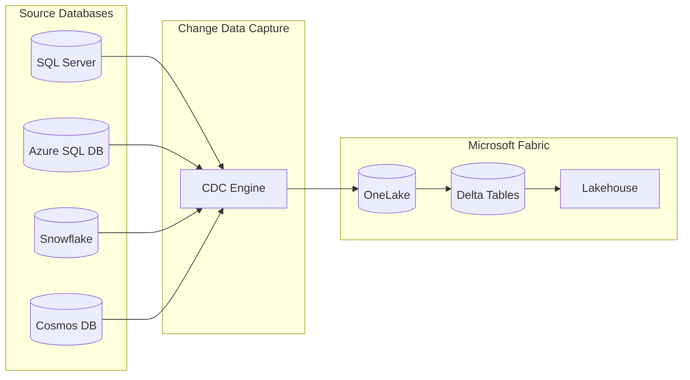
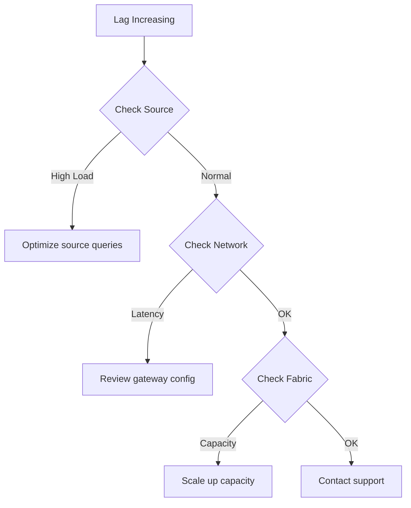
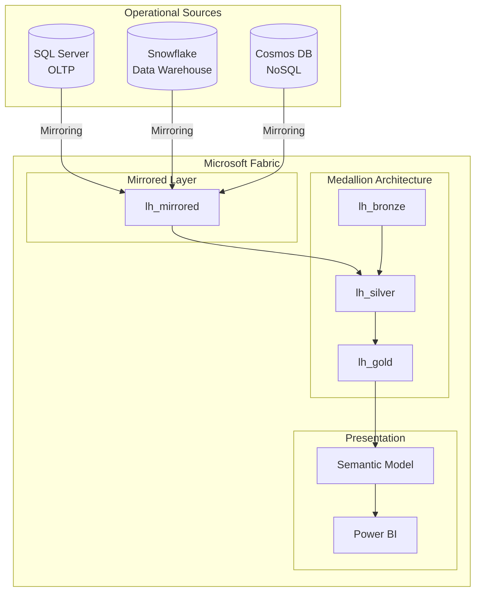

# 🔄 Tutorial 08: Database Mirroring

> **🏠 [Home](../../README.md)** > **📖 [Tutorials](../README.md)** > **🔄 Database Mirroring**

---

<div align="center">


</div>

---

## 🔄 Tutorial 08: Database Mirroring - Real-Time Replication

| | |
|---|---|
| **Difficulty** | ⭐⭐⭐ Advanced |
| **Time** | ⏱️ 60-75 minutes |
| **Focus** | Data Integration |

---

### 📊 Progress Tracker

```
┌────────┬────────┬────────┬────────┬────────┬────────┬────────┬────────┬────────┬────────┐
│   00   │   01   │   02   │   03   │   04   │   05   │   06   │   07   │   08   │   09   │
│ SETUP  │ BRONZE │ SILVER │  GOLD  │  RT    │  PBI   │ PIPES  │  GOV   │ MIRROR │  AI/ML │
├────────┼────────┼────────┼────────┼────────┼────────┼────────┼────────┼────────┼────────┤
│   ✅   │   ✅   │   ✅   │   ✅   │   ✅   │   ✅   │   ✅   │   ✅   │  🔵   │   ⬚   │
└────────┴────────┴────────┴────────┴────────┴────────┴────────┴────────┴────────┴────────┘
                                                                           ▲
                                                                      YOU ARE HERE
```

| Navigation | |
|---|---|
| ⬅️ **Previous** | [07-Governance & Purview](../07-governance-purview/README.md) |
| ➡️ **Next** | [09-Advanced AI/ML](../09-advanced-ai-ml/README.md) |

---

## 📖 Overview

This tutorial covers implementing **Database Mirroring** to replicate data from external sources into Microsoft Fabric. You will set up near real-time replication from operational databases directly into OneLake, enabling unified analytics across your entire data estate.

Database Mirroring is a game-changer for casino operations, allowing you to bring in data from slot management systems, player tracking databases, and compliance systems without writing complex ETL code.

---

## 🎯 Learning Objectives

By the end of this tutorial, you will be able to:

- [ ] Understand Database Mirroring concepts and architecture
- [ ] Configure Azure SQL Database/SQL Server mirroring
- [ ] Set up Snowflake mirroring
- [ ] Configure Azure Cosmos DB mirroring
- [ ] Monitor replication status and latency
- [ ] Query mirrored data with Spark and SQL
- [ ] Troubleshoot common mirroring issues

---

## 🔄 Database Mirroring Overview

Database Mirroring provides **near real-time replication** of data into Fabric OneLake using Change Data Capture (CDC) technology.



### 🌟 Key Benefits

| Benefit | Description |
|---------|-------------|
| **Near Real-Time** | Data available within minutes of source changes |
| **No ETL Code** | Automatic replication without custom development |
| **Schema Sync** | Automatic schema synchronization and evolution |
| **Delta Format** | Data stored in optimized Delta Lake format |
| **Query Flexibility** | Access via Spark, T-SQL, or Power BI |

### 🎰 Supported Data Sources

| Source | Version Requirements | CDC Method |
|--------|---------------------|------------|
| **SQL Server** | 2016+ | Native CDC |
| **Azure SQL Database** | All versions | Native CDC |
| **Azure Cosmos DB** | All versions | Change Feed |
| **Snowflake** | All editions | Streams |

---

## 📋 Prerequisites

Before starting this tutorial, ensure you have:

- [ ] Completed [Tutorial 00: Environment Setup](../00-environment-setup/README.md)
- [ ] Completed [Tutorial 01-03: Medallion Architecture](../01-bronze-layer/README.md)
- [ ] Fabric workspace with sufficient capacity (F64+ recommended)
- [ ] Source database with appropriate permissions
- [ ] Network connectivity between Fabric and source databases

> 💡 **Tip:** For testing, you can use Azure SQL Database with sample data. No on-premises infrastructure is required for this tutorial.

---

## 🛠️ Step 1: SQL Server / Azure SQL Database Mirroring

### Requirements

- SQL Server 2016+ or Azure SQL Database
- CDC (Change Data Capture) enabled on source
- Network access from Fabric to source database
- `db_owner` or `sysadmin` role on source database

### 1.1 Enable CDC on Source Database

> ⚠️ **Warning:** Enabling CDC requires `db_owner` privileges and may impact database performance slightly. Test in non-production environments first.

Connect to your source SQL Server database and enable CDC:

```sql
-- Enable CDC at the database level
EXEC sys.sp_cdc_enable_db;
GO

-- Verify CDC is enabled
SELECT name, is_cdc_enabled
FROM sys.databases
WHERE name = DB_NAME();
GO
```

### 1.2 Enable CDC on Tables

Enable CDC on each table you want to mirror:

```sql
-- Enable CDC on slot_transactions table
EXEC sys.sp_cdc_enable_table
    @source_schema = N'gaming',
    @source_name = N'slot_transactions',
    @role_name = NULL,
    @supports_net_changes = 1;
GO

-- Enable CDC on player_sessions table
EXEC sys.sp_cdc_enable_table
    @source_schema = N'gaming',
    @source_name = N'player_sessions',
    @role_name = NULL,
    @supports_net_changes = 1;
GO

-- Enable CDC on cage_operations table
EXEC sys.sp_cdc_enable_table
    @source_schema = N'gaming',
    @source_name = N'cage_operations',
    @role_name = NULL,
    @supports_net_changes = 1;
GO

-- Verify CDC is enabled on tables
SELECT t.name AS table_name, ct.capture_instance
FROM sys.tables t
JOIN cdc.change_tables ct ON t.object_id = ct.source_object_id;
GO
```

> 💡 **Tip:** The `@supports_net_changes` parameter enables net change queries, which return only the final state of changed rows rather than all intermediate changes.

### 1.3 Create Mirrored Database in Fabric

1. Open your workspace `casino-fabric-poc`
2. Click **+ New** > **Mirrored database**
3. Select **Azure SQL Database** or **SQL Server**


### 1.4 Configure Connection

| Setting | Azure SQL Database | SQL Server (On-Premises) |
|---------|-------------------|-------------------------|
| **Server** | `your-server.database.windows.net` | `your-server.domain.com` |
| **Database** | `CasinoOperational` | `CasinoOperational` |
| **Authentication** | Azure AD or SQL Auth | SQL Auth |
| **Gateway** | Not required | On-Premises Data Gateway |

1. Enter connection details
2. Click **Test connection** to verify connectivity
3. Select tables to mirror:
   - `gaming.slot_transactions`
   - `gaming.player_sessions`
   - `gaming.cage_operations`
4. Click **Mirror database**

> ⚠️ **Warning:** For on-premises SQL Server, you must install and configure an On-Premises Data Gateway. Ensure the gateway service account has network access to both the SQL Server and the internet.

### 1.5 Monitor Initial Sync

1. Open the mirrored database in your workspace
2. View **Replication status** tab
3. Monitor:
   - **Initial snapshot progress** (percentage complete)
   - **Rows synchronized** (per table)
   - **Estimated completion time**

---

## 🛠️ Step 2: Snowflake Mirroring

### Requirements

- Snowflake account (any edition)
- `ACCOUNTADMIN` or appropriate privileges
- Network connectivity to Snowflake

### 2.1 Create Mirrored Database

1. Click **+ New** > **Mirrored database**
2. Select **Snowflake**

### 2.2 Configure Connection

```
Account: your-account.snowflakecomputing.com
Warehouse: COMPUTE_WH
Database: CASINO_DW
Schema: ANALYTICS
Authentication: User/Password or OAuth
```

| Setting | Description | Example |
|---------|-------------|---------|
| **Account** | Full Snowflake account URL | `org-account.snowflakecomputing.com` |
| **Warehouse** | Compute warehouse for queries | `COMPUTE_WH` |
| **Database** | Source database name | `CASINO_DW` |
| **Schema** | Schema containing tables | `ANALYTICS` |
| **Role** | Role with SELECT privileges | `FABRIC_READER` |

### 2.3 Select Tables

Choose tables to mirror from your Snowflake data warehouse:

- `ANALYTICS.DAILY_SLOT_SUMMARY`
- `ANALYTICS.PLAYER_METRICS`
- `ANALYTICS.COMPLIANCE_REPORTS`
- `ANALYTICS.JACKPOT_HISTORY`

### 2.4 Start Mirroring

1. Review configuration summary
2. Click **Start mirroring**
3. Monitor initial sync progress

> 💡 **Tip:** Snowflake mirroring uses Snowflake Streams under the hood. Ensure your Snowflake account has sufficient storage for stream metadata.

---

## 🛠️ Step 3: Azure Cosmos DB Mirroring

### Requirements

- Azure Cosmos DB account (Core/SQL API)
- Change feed enabled (default)
- Network connectivity from Fabric

### 3.1 Create Mirrored Database

1. Click **+ New** > **Mirrored database**
2. Select **Azure Cosmos DB**

### 3.2 Configure Connection

```
Account: your-cosmos-account.documents.azure.com
Database: casino-realtime
Containers:
  - player-activity
  - security-events
  - jackpot-alerts
```

### 3.3 Cosmos DB Considerations

> ⚠️ **Important:** Cosmos DB mirroring has specific data transformation behaviors:

| Source Structure | Destination Behavior |
|-----------------|---------------------|
| **Nested documents** | Flattened to columns |
| **Arrays** | Expanded to separate rows |
| **Polymorphic schemas** | Union of all properties |

Example transformation:

```json
// Source document in Cosmos DB
{
  "id": "evt-001",
  "player": {
    "id": "P123",
    "name": "John Doe"
  },
  "events": ["login", "play", "win"]
}

// Mirrored table structure
| id      | player_id | player_name | events  |
|---------|-----------|-------------|---------|
| evt-001 | P123      | John Doe    | login   |
| evt-001 | P123      | John Doe    | play    |
| evt-001 | P123      | John Doe    | win     |
```

---

## 🛠️ Step 4: Query Mirrored Data

### 4.1 Data Location in Lakehouse

Mirrored data automatically appears in a designated Lakehouse:

```
lh_mirrored/
├── Tables/
│   ├── slot_transactions/
│   ├── player_sessions/
│   ├── cage_operations/
│   └── _metadata/
└── Files/
    └── _delta_log/
```

### 4.2 Query with PySpark

```python
# Read mirrored slot transactions
df_slots = spark.table("lh_mirrored.slot_transactions")

# Show recent transactions
from pyspark.sql.functions import col, desc

df_slots.filter(col("transaction_time") > "2024-01-01") \
    .orderBy(desc("transaction_time")) \
    .show(10)

# Calculate daily statistics
df_slots.groupBy("machine_id", "transaction_date") \
    .agg(
        count("*").alias("spin_count"),
        sum("amount").alias("total_coin_in"),
        avg("amount").alias("avg_bet")
    ) \
    .orderBy(desc("transaction_date")) \
    .show()
```

### 4.3 Query with T-SQL

Access mirrored data through the SQL Analytics Endpoint:

```sql
-- Recent transaction summary
SELECT
    CAST(transaction_timestamp AS DATE) AS transaction_date,
    COUNT(*) AS transaction_count,
    SUM(amount) AS total_amount,
    AVG(amount) AS avg_amount
FROM lh_mirrored.slot_transactions
WHERE transaction_timestamp >= DATEADD(day, -7, GETDATE())
GROUP BY CAST(transaction_timestamp AS DATE)
ORDER BY transaction_date DESC;

-- Player session analysis
SELECT
    player_id,
    COUNT(DISTINCT session_id) AS session_count,
    SUM(DATEDIFF(minute, session_start, session_end)) AS total_minutes,
    AVG(DATEDIFF(minute, session_start, session_end)) AS avg_session_length
FROM lh_mirrored.player_sessions
WHERE session_start >= DATEADD(day, -30, GETDATE())
GROUP BY player_id
ORDER BY total_minutes DESC;
```

### 4.4 Join Mirrored Data with Gold Layer

```python
# Join mirrored operational data with Gold analytics
df_mirrored = spark.table("lh_mirrored.player_sessions")
df_gold = spark.table("lh_gold.gold_player_360")

# Enrich real-time sessions with player analytics
df_enriched = df_mirrored.join(
    df_gold,
    df_mirrored.player_id == df_gold.player_id,
    "left"
).select(
    df_mirrored["*"],
    df_gold.loyalty_tier,
    df_gold.player_value_score,
    df_gold.lifetime_value,
    df_gold.churn_risk_score
)

# Identify high-value players currently on floor
df_enriched.filter(
    (col("session_end").isNull()) &  # Active session
    (col("loyalty_tier").isin("Platinum", "Diamond"))
).show()
```

---

## 🛠️ Step 5: Monitor and Manage Replication

### 5.1 Replication Dashboard

1. Open your mirrored database
2. Navigate to **Monitor** tab
3. Review key metrics

### 5.2 Key Metrics

| Metric | Description | Target | Alert Threshold |
|--------|-------------|--------|-----------------|
| **Replication Lag** | Time behind source | < 5 minutes | > 15 minutes |
| **Throughput** | Rows synchronized/second | Varies | Sudden drop |
| **Error Rate** | Failed operations | 0% | > 1% |
| **Storage Used** | OneLake storage size | Monitor growth | 80% capacity |
| **CDC Capture Jobs** | Active capture processes | All running | Any stopped |

### 5.3 Handle Replication Issues

#### Lag Increasing



**Troubleshooting steps:**

1. **Check source database load** - High OLTP activity can delay CDC processing
2. **Verify network connectivity** - Test latency between source and Fabric
3. **Review table sizes** - Large tables may need partitioning
4. **Check Fabric capacity** - Ensure sufficient CUs available

#### Schema Changes Detected

When source schema changes:

| Change Type | Mirroring Behavior |
|-------------|-------------------|
| **New column** | Automatically added |
| **Column removed** | Marked as nullable |
| **Data type change** | May require restart |
| **Table renamed** | Requires reconfiguration |

```sql
-- Check for schema drift in source
SELECT
    c.name AS column_name,
    t.name AS data_type,
    c.is_nullable
FROM sys.columns c
JOIN sys.types t ON c.system_type_id = t.system_type_id
WHERE c.object_id = OBJECT_ID('gaming.slot_transactions')
ORDER BY c.column_id;
```

---

## 🛠️ Step 6: Integration Patterns

### 6.1 Hybrid Architecture



### 6.2 Casino Use Cases

| Use Case | Source | Mirroring Value |
|----------|--------|-----------------|
| **Real-time player tracking** | Cosmos DB | Sub-minute latency for floor operations |
| **Operational reporting** | SQL Server | Live slot performance data |
| **Historical analytics** | Snowflake | Consolidate enterprise data in Fabric |
| **Compliance monitoring** | SQL Server | Near real-time transaction auditing |
| **Marketing automation** | SQL Server | Live player eligibility for promotions |

---

## ✅ Validation Checklist

Before moving to the next tutorial, verify:

- [ ] **CDC Enabled** - Source database CDC enabled and verified
- [ ] **Mirrored Database Created** - Database exists in Fabric workspace
- [ ] **Initial Sync Complete** - 100% of data synchronized successfully
- [ ] **Replication Active** - Ongoing sync with lag < 5 minutes
- [ ] **Data Queryable via Spark** - Can read tables in PySpark notebooks
- [ ] **SQL Endpoint Working** - Can query via SQL Analytics Endpoint

<details>
<summary>🔍 Verification Commands</summary>

### Verify CDC Enabled on Source

```sql
-- Check CDC is enabled at database level
SELECT name, is_cdc_enabled
FROM sys.databases
WHERE name = DB_NAME();
-- Expected: is_cdc_enabled = 1

-- Verify CDC enabled on tables
SELECT
    t.name AS table_name,
    ct.capture_instance,
    ct.start_lsn
FROM sys.tables t
JOIN cdc.change_tables ct ON t.object_id = ct.source_object_id
ORDER BY t.name;
-- Expected: List of mirrored tables with capture instances
```

### Verify Mirrored Database Created

```python
# List all mirrored databases in workspace
# In Fabric UI: Navigate to workspace > Filter by "Mirrored database"
# Expected: Your mirrored database appears in the list
```

### Check Initial Sync Status

```python
# In Fabric portal:
# 1. Open mirrored database
# 2. Go to "Monitor" tab
# 3. Check "Initial sync status"
# Expected: All tables show 100% complete

# Or via notebook:
tables = ["slot_transactions", "player_sessions", "cage_operations"]
for table in tables:
    try:
        count = spark.table(f"lh_mirrored.{table}").count()
        print(f"✅ {table}: {count:,} rows")
    except Exception as e:
        print(f"❌ {table}: {e}")
```

### Verify Replication Lag

```python
# Check replication lag in Fabric portal
# Monitor tab > Replication lag metric
# Expected: < 5 minutes for all tables

# Compare timestamps
from pyspark.sql.functions import max as spark_max

df_mirrored = spark.table("lh_mirrored.slot_transactions")
latest_timestamp = df_mirrored.select(spark_max("transaction_timestamp")).collect()[0][0]
print(f"Latest mirrored transaction: {latest_timestamp}")
# Compare to current time - should be within 5 minutes
```

### Query Mirrored Data with Spark

```python
# Read mirrored table
df = spark.table("lh_mirrored.slot_transactions")

# Verify data
print(f"Row count: {df.count():,}")
print(f"Columns: {len(df.columns)}")

# Show sample
df.show(5)
# Expected: Data displays successfully
```

### Query via SQL Analytics Endpoint

```sql
-- Open SQL Analytics Endpoint in Fabric
-- Run test query
SELECT TOP 10
    transaction_id,
    machine_id,
    amount,
    transaction_timestamp
FROM lh_mirrored.slot_transactions
ORDER BY transaction_timestamp DESC;
-- Expected: Query returns recent transactions
```

### Test Join with Gold Layer

```python
# Join mirrored data with Gold analytics
df_mirrored = spark.table("lh_mirrored.player_sessions")
df_gold = spark.table("lh_gold.gold_player_360")

df_joined = df_mirrored.join(
    df_gold,
    df_mirrored.player_id == df_gold.player_id,
    "inner"
).select(
    df_mirrored.session_id,
    df_mirrored.player_id,
    df_gold.loyalty_tier,
    df_gold.lifetime_value
)

print(f"Joined records: {df_joined.count():,}")
df_joined.show(5)
# Expected: Successfully joined records display
```

</details>

---

## 🔧 Troubleshooting

### Initial Sync Fails

| Symptom | Possible Cause | Resolution |
|---------|----------------|------------|
| Connection timeout | Firewall blocking | Configure firewall rules |
| Authentication failed | Wrong credentials | Verify username/password |
| Table not found | Wrong schema | Check schema.table naming |
| Unsupported type | Data type incompatibility | Review supported types |

### Replication Stops

1. **Check source database status**
   ```sql
   -- Verify CDC jobs are running
   EXEC sys.sp_cdc_help_jobs;
   ```

2. **Review error logs in Fabric**
   - Navigate to mirrored database > Monitor > Errors

3. **Verify CDC is still enabled**
   ```sql
   SELECT is_cdc_enabled FROM sys.databases WHERE name = DB_NAME();
   ```

4. **Restart mirroring if needed**
   - Stop and restart from Fabric portal

### Data Inconsistency

```sql
-- Compare row counts
-- Source
SELECT COUNT(*) FROM gaming.slot_transactions;

-- Destination (Fabric SQL endpoint)
SELECT COUNT(*) FROM lh_mirrored.slot_transactions;
```

> 💡 **Tip:** Small differences are normal due to replication lag. Significant differences may indicate CDC capture issues.

---

## 📚 Best Practices

1. **Start Small** - Mirror critical tables first, expand gradually
2. **Monitor Lag** - Set up alerts for replication latency > 15 minutes
3. **Plan for Growth** - Consider storage costs and capacity needs
4. **Test Failover** - Document and practice restart procedures
5. **Document Dependencies** - Track downstream reports and notebooks
6. **Version Control** - Keep CDC enable scripts in source control
7. **Staging Environment** - Test schema changes in non-production first

---

## 🎉 Summary

Congratulations! You have successfully completed Tutorial 08. You have learned to:

- ✅ Configure Database Mirroring for SQL Server/Azure SQL
- ✅ Set up Snowflake and Cosmos DB replication
- ✅ Query mirrored data with Spark and SQL
- ✅ Join mirrored data with existing Gold layer analytics
- ✅ Monitor and troubleshoot replication health
- ✅ Understand hybrid architecture patterns

---

## ➡️ Next Steps

Continue to **[Tutorial 09: Advanced AI/ML](../09-advanced-ai-ml/README.md)** to build predictive models for player churn and fraud detection using Fabric Data Science.

---

## 📚 Additional Resources

- [Database Mirroring Overview](https://learn.microsoft.com/fabric/database/mirrored-database/)
- [Azure SQL Database Mirroring](https://learn.microsoft.com/fabric/database/mirrored-database/azure-sql-database)
- [SQL Server Mirroring](https://learn.microsoft.com/fabric/database/mirrored-database/sql-server)
- [Snowflake Mirroring](https://learn.microsoft.com/fabric/database/mirrored-database/snowflake)
- [Cosmos DB Mirroring](https://learn.microsoft.com/fabric/database/mirrored-database/cosmos-db)
- [Mirroring Troubleshooting Guide](https://learn.microsoft.com/fabric/database/mirrored-database/troubleshooting)

---

## 🧭 Navigation

| ⬅️ Previous | ⬆️ Up | ➡️ Next |
|------------|------|--------|
| [07-Governance & Purview](../07-governance-purview/README.md) | [Tutorials Index](../README.md) | [09-Advanced AI/ML](../09-advanced-ai-ml/README.md) |

---

> 💬 **Questions or issues?** Open an issue in the [GitHub repository](https://github.com/your-repo/issues).
