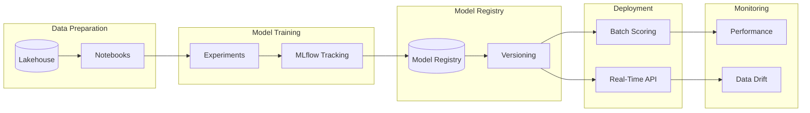
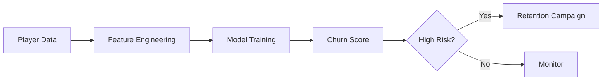
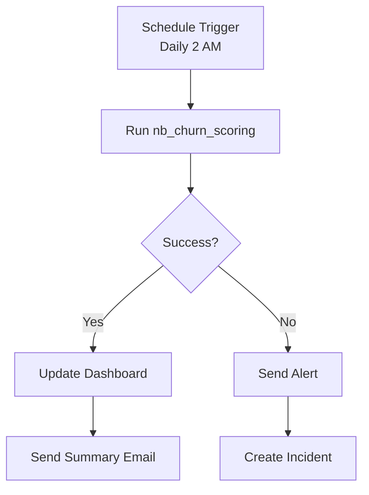

# 🤖 Tutorial 09: Advanced AI/ML


> 🏠 **[Home](../../README.md)** > 📖 **[Tutorials](../README.md)** > 🤖 **Advanced AI/ML**

---

## 🤖 Tutorial 09: Advanced AI/ML - Predictive Analytics

| | |
|---|---|
| **Difficulty** | ⭐⭐⭐ Advanced |
| **Time** | ⏱️ 90-120 minutes |
| **Focus** | Machine Learning |

---

### 📊 Progress Tracker

```
┌────────┬────────┬────────┬────────┬────────┬────────┬────────┬────────┬────────┬────────┐
│   00   │   01   │   02   │   03   │   04   │   05   │   06   │   07   │   08   │   09   │
│ SETUP  │ BRONZE │ SILVER │  GOLD  │  RT    │  PBI   │ PIPES  │  GOV   │ MIRROR │  AI/ML │
├────────┼────────┼────────┼────────┼────────┼────────┼────────┼────────┼────────┼────────┤
│   ✅   │   ✅   │   ✅   │   ✅   │   ✅   │   ✅   │   ✅   │   ✅   │   ✅   │  🔵   │
└────────┴────────┴────────┴────────┴────────┴────────┴────────┴────────┴────────┴────────┘
                                                                                    ▲
                                                                               FINAL TUTORIAL
```

| Navigation | |
|---|---|
| ⬅️ **Previous** | [08-Database Mirroring](../08-database-mirroring/README.md) |
| 🏁 **Next** | [POC Agenda](../../poc-agenda/README.md) - Workshop Preparation |

---

## 📖 Overview

This tutorial covers implementing **machine learning solutions** for casino analytics using Microsoft Fabric Data Science. You will build predictive models for player churn prediction, fraud detection, and jackpot forecasting, leveraging MLflow for experiment tracking and model management.

This is the **final tutorial** in the series, bringing together all previous concepts to deliver advanced predictive analytics capabilities for your casino/gaming analytics platform.

---

## 🎯 Learning Objectives

By the end of this tutorial, you will be able to:

- [ ] Set up ML experiments with MLflow tracking in Fabric
- [ ] Build a player churn prediction model using Spark ML
- [ ] Implement fraud detection using anomaly detection algorithms
- [ ] Create time series forecasting for jackpot predictions
- [ ] Register and version models in MLflow Model Registry
- [ ] Deploy models for batch scoring pipelines
- [ ] Understand responsible AI considerations for gaming

---

## 🤖 Fabric ML Capabilities Overview

Microsoft Fabric Data Science provides an integrated environment for the complete ML lifecycle:



### 🎰 ML Use Cases for Casino Analytics

| Use Case | Model Type | Business Value | Priority |
|----------|------------|----------------|----------|
| **Player Churn** | Classification | Retention campaigns, reduce attrition | High |
| **Fraud Detection** | Anomaly Detection | Loss prevention, compliance | Critical |
| **Player LTV** | Regression | Marketing optimization, VIP identification | High |
| **Jackpot Forecasting** | Time Series | Capacity planning, promotional timing | Medium |
| **Game Recommendation** | Collaborative Filtering | Player engagement, cross-sell | Medium |

---

## 📋 Prerequisites

Before starting this tutorial, ensure you have:

- [ ] Completed [Tutorial 03: Gold Layer](../03-gold-layer/README.md) - Gold tables populated
- [ ] Completed previous tutorials (Bronze, Silver, Gold data available)
- [ ] Fabric workspace with Data Science capabilities enabled
- [ ] Basic Python and PySpark knowledge
- [ ] Understanding of ML concepts (classification, regression)

> 💡 **Tip:** If you don't have sufficient data in Gold tables, you can generate synthetic data using the provided sample notebooks.

---

## 🛠️ Step 1: Set Up ML Environment

### 1.1 Create ML Notebook

1. Navigate to your workspace `casino-fabric-poc`
2. Click **+ New** > **Notebook**
3. Name: `nb_player_churn_model`
4. Attach to Lakehouse: `lh_gold`

### 1.2 Install Additional Libraries (if needed)

```python
# Most ML libraries are pre-installed in Fabric
# Install additional packages if required
%pip install shap xgboost imbalanced-learn

# Restart kernel after installation
# dbutils.library.restartPython()
```

### 1.3 Import Libraries

```python
# Data manipulation
import pandas as pd
import numpy as np
from datetime import datetime, timedelta

# PySpark
from pyspark.sql.functions import *
from pyspark.sql.types import *
from pyspark.sql.window import Window

# Spark ML
from pyspark.ml.feature import VectorAssembler, StandardScaler, StringIndexer, OneHotEncoder
from pyspark.ml.classification import (
    LogisticRegression,
    RandomForestClassifier,
    GBTClassifier
)
from pyspark.ml.evaluation import (
    BinaryClassificationEvaluator,
    MulticlassClassificationEvaluator
)
from pyspark.ml import Pipeline
from pyspark.ml.tuning import CrossValidator, ParamGridBuilder

# MLflow
import mlflow
import mlflow.spark
from mlflow.tracking import MlflowClient

# Visualization
import matplotlib.pyplot as plt
import seaborn as sns

print("Libraries imported successfully!")
print(f"MLflow version: {mlflow.__version__}")
```

---

## 🛠️ Step 2: Player Churn Prediction

### 2.1 Understanding Churn

> 💡 **Business Context:** In casino gaming, a "churned" player is typically defined as one who hasn't visited in 90+ days. Identifying at-risk players allows proactive retention campaigns.



### 2.2 Prepare Training Data

```python
# Read Gold player data
df = spark.table("lh_gold.gold_player_360")

print(f"Total players: {df.count()}")
df.printSchema()

# Define churn label (no visit in 90+ days)
df_ml = df.withColumn(
    "churned",
    when(col("days_since_visit") > 90, 1).otherwise(0)
)

# Check class distribution
print("\nChurn Distribution:")
df_ml.groupBy("churned").count().show()

# Calculate churn rate
total = df_ml.count()
churned = df_ml.filter(col("churned") == 1).count()
print(f"Churn Rate: {churned/total*100:.2f}%")
```

### 2.3 Feature Engineering

```python
# Define feature columns for the model
feature_columns = [
    # Gaming activity
    "total_gaming_activity",
    "total_theo_win",
    "slot_games_played",
    "slot_coin_in",
    "table_hours_played",

    # Visit patterns
    "total_visits",
    "avg_visits_per_month",

    # Financial behavior
    "total_cash_in",
    "total_markers",
    "avg_transaction_amount",

    # Calculated scores
    "player_value_score",
    "engagement_score"
]

# Handle missing values
for col_name in feature_columns:
    df_ml = df_ml.fillna(0, subset=[col_name])

# Index categorical feature: loyalty_tier
tier_indexer = StringIndexer(
    inputCol="loyalty_tier",
    outputCol="loyalty_tier_idx",
    handleInvalid="keep"
)

df_ml = tier_indexer.fit(df_ml).transform(df_ml)
feature_columns.append("loyalty_tier_idx")

print(f"Features: {feature_columns}")
print(f"Total features: {len(feature_columns)}")
```

### 2.4 Create ML Pipeline

```python
# Assemble features into vector
assembler = VectorAssembler(
    inputCols=feature_columns,
    outputCol="features_raw",
    handleInvalid="skip"
)

# Scale features
scaler = StandardScaler(
    inputCol="features_raw",
    outputCol="features",
    withStd=True,
    withMean=True
)

# Define classifier
gbt = GBTClassifier(
    labelCol="churned",
    featuresCol="features",
    maxIter=50,
    maxDepth=5,
    seed=42
)

# Create pipeline
pipeline = Pipeline(stages=[assembler, scaler, gbt])

print("Pipeline created with stages:", [stage.__class__.__name__ for stage in pipeline.getStages()])
```

### 2.5 Train/Test Split

```python
# Stratified split to maintain class distribution
train_df, test_df = df_ml.randomSplit([0.8, 0.2], seed=42)

print(f"Training set: {train_df.count()} records")
print(f"Test set: {test_df.count()} records")

# Verify distribution in both sets
print("\nTraining churn distribution:")
train_df.groupBy("churned").count().show()

print("Test churn distribution:")
test_df.groupBy("churned").count().show()
```

### 2.6 Train Model with MLflow Tracking

```python
# Set MLflow experiment
experiment_name = "/Experiments/player_churn_prediction"
mlflow.set_experiment(experiment_name)

with mlflow.start_run(run_name="gbt_churn_model_v1") as run:
    # Log parameters
    mlflow.log_param("algorithm", "GradientBoostedTrees")
    mlflow.log_param("max_depth", 5)
    mlflow.log_param("max_iter", 50)
    mlflow.log_param("features", feature_columns)
    mlflow.log_param("train_size", train_df.count())
    mlflow.log_param("test_size", test_df.count())

    # Train model
    print("Training model...")
    model = pipeline.fit(train_df)

    # Predictions
    predictions = model.transform(test_df)

    # Evaluate - AUC-ROC
    evaluator_auc = BinaryClassificationEvaluator(
        labelCol="churned",
        rawPredictionCol="rawPrediction",
        metricName="areaUnderROC"
    )
    auc = evaluator_auc.evaluate(predictions)

    # Evaluate - Accuracy
    evaluator_acc = MulticlassClassificationEvaluator(
        labelCol="churned",
        predictionCol="prediction",
        metricName="accuracy"
    )
    accuracy = evaluator_acc.evaluate(predictions)

    # Evaluate - Precision/Recall
    evaluator_precision = MulticlassClassificationEvaluator(
        labelCol="churned",
        predictionCol="prediction",
        metricName="weightedPrecision"
    )
    precision = evaluator_precision.evaluate(predictions)

    evaluator_recall = MulticlassClassificationEvaluator(
        labelCol="churned",
        predictionCol="prediction",
        metricName="weightedRecall"
    )
    recall = evaluator_recall.evaluate(predictions)

    # Log metrics
    mlflow.log_metric("auc_roc", auc)
    mlflow.log_metric("accuracy", accuracy)
    mlflow.log_metric("precision", precision)
    mlflow.log_metric("recall", recall)

    # Log model
    mlflow.spark.log_model(model, "churn_model")

    # Print results
    print(f"\n{'='*50}")
    print("MODEL PERFORMANCE METRICS")
    print(f"{'='*50}")
    print(f"AUC-ROC:   {auc:.4f}")
    print(f"Accuracy:  {accuracy:.4f}")
    print(f"Precision: {precision:.4f}")
    print(f"Recall:    {recall:.4f}")
    print(f"{'='*50}")

    run_id = run.info.run_id
    print(f"\nMLflow Run ID: {run_id}")
```

> 💡 **Tip:** View experiment results in the Fabric portal under Data Science > Experiments.

### 2.7 Feature Importance Analysis

```python
# Extract GBT model from pipeline
gbt_model = model.stages[-1]
importances = gbt_model.featureImportances.toArray()

# Create importance dataframe
importance_df = pd.DataFrame({
    "feature": feature_columns,
    "importance": importances
}).sort_values("importance", ascending=False)

print("\nFeature Importance (Top 10):")
print(importance_df.head(10).to_string(index=False))

# Visualize
fig, ax = plt.subplots(figsize=(10, 6))
sns.barplot(data=importance_df.head(10), x="importance", y="feature", ax=ax)
ax.set_title("Top 10 Feature Importance - Churn Prediction")
ax.set_xlabel("Importance")
ax.set_ylabel("Feature")
plt.tight_layout()

# Log plot to MLflow
mlflow.log_figure(fig, "feature_importance.png")
plt.show()
```

---

## 🛠️ Step 3: Fraud Detection (Anomaly Detection)

### 3.1 Understanding Casino Fraud Patterns

> ⚠️ **Compliance Note:** This model assists in identifying suspicious patterns for further human review. It does not make final determinations on fraud.

Common fraud patterns in casinos:

| Pattern | Description | Detection Approach |
|---------|-------------|-------------------|
| **Structuring** | Multiple transactions just below CTR threshold ($10K) | Transaction frequency + amount clustering |
| **Collusion** | Players working together to manipulate games | Network analysis + unusual win patterns |
| **Chip Walking** | Converting chips to cash without playing | Chip activity vs. gaming activity ratio |
| **Identity Fraud** | Using fake or stolen identities | Document verification + behavioral anomalies |

### 3.2 Prepare Transaction Data

```python
# Read financial transaction data
df_txn = spark.table("lh_silver.silver_financial_reconciled")

print(f"Total transactions: {df_txn.count()}")

# Aggregate by player per day
df_daily = df_txn.groupBy(
    "player_id",
    to_date("transaction_timestamp").alias("txn_date")
).agg(
    count("*").alias("transaction_count"),
    sum("amount").alias("total_amount"),
    avg("amount").alias("avg_amount"),
    max("amount").alias("max_amount"),
    min("amount").alias("min_amount"),
    stddev("amount").alias("stddev_amount"),
    countDistinct("cage_location").alias("unique_cages"),
    # Near-CTR transactions ($8,000 - $9,999)
    sum(when(col("amount").between(8000, 9999), 1).otherwise(0)).alias("near_ctr_count"),
    # Late night transactions (10 PM - 6 AM)
    sum(when(hour("transaction_timestamp").isin([22, 23, 0, 1, 2, 3, 4, 5]), 1).otherwise(0)).alias("late_night_count")
).fillna(0)

print(f"Aggregated records: {df_daily.count()}")
df_daily.show(5)
```

### 3.3 Isolation Forest for Anomaly Detection

```python
from sklearn.ensemble import IsolationForest
from sklearn.preprocessing import StandardScaler as SklearnScaler

# Convert to pandas for sklearn
pdf = df_daily.toPandas()

# Define features for anomaly detection
anomaly_features = [
    "transaction_count",
    "total_amount",
    "avg_amount",
    "max_amount",
    "unique_cages",
    "near_ctr_count",
    "late_night_count"
]

# Handle nulls
X = pdf[anomaly_features].fillna(0)

# Scale features
scaler_sk = SklearnScaler()
X_scaled = scaler_sk.fit_transform(X)

# Train Isolation Forest
iso_forest = IsolationForest(
    contamination=0.05,  # Expect ~5% anomalies
    random_state=42,
    n_estimators=100,
    max_samples='auto',
    bootstrap=True
)

# Fit and predict
pdf["anomaly_score"] = iso_forest.fit_predict(X_scaled)
pdf["anomaly_decision_score"] = iso_forest.decision_function(X_scaled)
pdf["is_anomaly"] = (pdf["anomaly_score"] == -1).astype(int)

# Results
anomalies = pdf[pdf["is_anomaly"] == 1]
print(f"\n{'='*50}")
print("ANOMALY DETECTION RESULTS")
print(f"{'='*50}")
print(f"Total records analyzed: {len(pdf)}")
print(f"Anomalies detected: {len(anomalies)}")
print(f"Anomaly rate: {len(anomalies) / len(pdf) * 100:.2f}%")
```

### 3.4 Analyze Suspicious Patterns

```python
# Review structuring patterns (multiple near-CTR transactions)
print("\n📊 Potential Structuring Patterns:")
print("Players with multiple near-CTR transactions in one day:")
structuring = anomalies[anomalies["near_ctr_count"] >= 2].sort_values("near_ctr_count", ascending=False)
print(structuring[["player_id", "txn_date", "transaction_count", "total_amount", "near_ctr_count"]].head(10))

# Review high activity across multiple cages
print("\n📊 Unusual Multi-Cage Activity:")
multi_cage = anomalies[anomalies["unique_cages"] >= 3].sort_values("unique_cages", ascending=False)
print(multi_cage[["player_id", "txn_date", "transaction_count", "total_amount", "unique_cages"]].head(10))

# High-value anomalies
print("\n📊 High-Value Anomalies:")
high_value = anomalies[anomalies["total_amount"] > anomalies["total_amount"].quantile(0.95)]
print(high_value[["player_id", "txn_date", "total_amount", "transaction_count"]].head(10))
```

### 3.5 Save Fraud Detection Results

```python
# Convert back to Spark DataFrame
df_fraud_scores = spark.createDataFrame(pdf)

# Save to Gold layer
df_fraud_scores.write \
    .format("delta") \
    .mode("overwrite") \
    .saveAsTable("lh_gold.ml_fraud_scores")

print("Fraud detection scores saved to lh_gold.ml_fraud_scores")
```

---

## 🛠️ Step 4: Jackpot Forecasting (Time Series)

### 4.1 Understanding Jackpot Patterns

> 💡 **Business Context:** Forecasting jackpot timing helps with capacity planning (staff scheduling when big wins expected) and promotional timing.

### 4.2 Prepare Time Series Data

```python
# Read jackpot history
df_jackpot = spark.table("lh_silver.silver_slot_enriched")

# Aggregate daily jackpot metrics
df_jackpot_ts = df_jackpot.filter(col("is_jackpot") == True) \
    .groupBy(to_date("spin_timestamp").alias("date")) \
    .agg(
        count("*").alias("jackpot_count"),
        sum("win_amount").alias("total_jackpot_amount"),
        avg("win_amount").alias("avg_jackpot_amount"),
        max("win_amount").alias("max_jackpot_amount")
    ) \
    .orderBy("date")

# Convert to pandas
pdf_ts = df_jackpot_ts.toPandas()
pdf_ts['date'] = pd.to_datetime(pdf_ts['date'])
pdf_ts = pdf_ts.set_index('date')

print(f"Time series data points: {len(pdf_ts)}")
pdf_ts.head(10)
```

### 4.3 Prophet Forecasting Model

```python
from prophet import Prophet

# Prepare data for Prophet
prophet_df = pdf_ts.reset_index()[['date', 'jackpot_count']].rename(
    columns={'date': 'ds', 'jackpot_count': 'y'}
)

# Initialize and fit Prophet model
model_prophet = Prophet(
    yearly_seasonality=True,
    weekly_seasonality=True,
    daily_seasonality=False,
    changepoint_prior_scale=0.05
)

# Add casino-specific seasonality (e.g., weekend effect)
model_prophet.add_seasonality(name='monthly', period=30.5, fourier_order=5)

model_prophet.fit(prophet_df)

# Create future dataframe (30 days)
future = model_prophet.make_future_dataframe(periods=30)
forecast = model_prophet.predict(future)

# Visualize forecast
fig1 = model_prophet.plot(forecast)
plt.title("Jackpot Count Forecast")
plt.xlabel("Date")
plt.ylabel("Daily Jackpots")
plt.tight_layout()
plt.show()

# Component analysis
fig2 = model_prophet.plot_components(forecast)
plt.show()
```

### 4.4 Save Forecast Results

```python
# Convert forecast to Spark DataFrame
forecast_spark = spark.createDataFrame(forecast[['ds', 'yhat', 'yhat_lower', 'yhat_upper']])

forecast_spark = forecast_spark.withColumnRenamed('ds', 'forecast_date') \
    .withColumnRenamed('yhat', 'predicted_jackpots') \
    .withColumnRenamed('yhat_lower', 'lower_bound') \
    .withColumnRenamed('yhat_upper', 'upper_bound')

# Save forecast
forecast_spark.write \
    .format("delta") \
    .mode("overwrite") \
    .saveAsTable("lh_gold.ml_jackpot_forecast")

print("Jackpot forecast saved to lh_gold.ml_jackpot_forecast")
```

---

## 🛠️ Step 5: Model Registry and Versioning

### 5.1 Register Churn Model

```python
# Register the churn model in MLflow Model Registry
client = MlflowClient()

# Model URI from earlier run
model_uri = f"runs:/{run_id}/churn_model"

# Register model
model_details = mlflow.register_model(
    model_uri=model_uri,
    name="PlayerChurnModel"
)

print(f"Model registered: {model_details.name}")
print(f"Version: {model_details.version}")
print(f"Status: {model_details.current_stage}")
```

### 5.2 Add Model Description

```python
# Update model with description
client.update_registered_model(
    name="PlayerChurnModel",
    description="""
    Player Churn Prediction Model

    Purpose: Identifies players at risk of churning (90+ days inactive)

    Features:
    - Gaming activity metrics
    - Visit patterns
    - Financial behavior
    - Loyalty tier

    Algorithm: Gradient Boosted Trees
    Performance: AUC-ROC ~0.85

    Owner: Data Science Team
    Last Updated: {date}
    """.format(date=datetime.now().strftime("%Y-%m-%d"))
)
```

### 5.3 Transition to Production

```python
# Transition model version to Production stage
client.transition_model_version_stage(
    name="PlayerChurnModel",
    version=model_details.version,
    stage="Production",
    archive_existing_versions=True
)

print(f"Model version {model_details.version} transitioned to Production")
```

> ⚠️ **Warning:** Always validate model performance in a staging environment before promoting to Production.

---

## 🛠️ Step 6: Batch Scoring Pipeline

### 6.1 Create Scoring Notebook

Create a new notebook `nb_churn_scoring` for batch predictions:

```python
# Load production model
model = mlflow.spark.load_model("models:/PlayerChurnModel/Production")

# Score all current players
df_current = spark.table("lh_gold.gold_player_360")

# Apply same preprocessing
tier_indexer = StringIndexer(
    inputCol="loyalty_tier",
    outputCol="loyalty_tier_idx",
    handleInvalid="keep"
)
df_scoring = tier_indexer.fit(df_current).transform(df_current)

# Handle nulls
for col_name in feature_columns:
    df_scoring = df_scoring.fillna(0, subset=[col_name])

# Make predictions
predictions = model.transform(df_scoring)

# Extract churn probability
scored_players = predictions.select(
    "player_id",
    "player_name",
    "loyalty_tier",
    "player_value_score",
    "days_since_visit",
    col("probability").getItem(1).alias("churn_probability"),
    col("prediction").cast("int").alias("churn_prediction")
).withColumn(
    "churn_risk_category",
    when(col("churn_probability") >= 0.8, "Critical")
    .when(col("churn_probability") >= 0.6, "High")
    .when(col("churn_probability") >= 0.4, "Medium")
    .otherwise("Low")
).withColumn(
    "scored_at",
    current_timestamp()
)

# Save scores
scored_players.write \
    .format("delta") \
    .mode("overwrite") \
    .option("overwriteSchema", "true") \
    .saveAsTable("lh_gold.ml_player_churn_scores")

print(f"Scored {scored_players.count()} players")

# Summary statistics
print("\nChurn Risk Distribution:")
scored_players.groupBy("churn_risk_category").count().orderBy("churn_risk_category").show()
```

### 6.2 High-Risk VIP Report

```python
# Identify high-risk VIP players for immediate attention
high_risk_vip = scored_players.filter(
    (col("churn_probability") > 0.7) &
    (col("player_value_score") > 100)
).orderBy(desc("churn_probability"), desc("player_value_score"))

print(f"\n{'='*60}")
print("🚨 HIGH-RISK VIP PLAYERS REQUIRING IMMEDIATE INTERVENTION")
print(f"{'='*60}")
print(f"Total high-risk VIPs: {high_risk_vip.count()}")
display(high_risk_vip.limit(20))

# Export to CSV for retention team
high_risk_vip.toPandas().to_csv(
    "/lakehouse/default/Files/exports/high_risk_vips.csv",
    index=False
)
```

---

## 🛠️ Step 7: ML Pipeline Automation

### 7.1 Parameterized Notebook

Add parameters at the top of your scoring notebook:

```python
# %% Parameters
# ||||||||||||||||||||||||||||||||||
process_date = ""  # Will be set by pipeline
full_retrain = False  # Force model retraining
min_auc_threshold = 0.80  # Minimum acceptable AUC
# ||||||||||||||||||||||||||||||||||

# Parse parameters
from datetime import datetime, timedelta

if not process_date:
    process_date = datetime.now().strftime("%Y-%m-%d")

print(f"Processing date: {process_date}")
print(f"Full retrain: {full_retrain}")
```

### 7.2 Model Retraining Logic

```python
# Check when model was last trained
last_train_date = spark.sql("""
    SELECT MAX(scored_at) as last_train
    FROM lh_gold.ml_player_churn_scores
""").first()["last_train"]

days_since_train = (datetime.now() - last_train_date).days if last_train_date else 999

print(f"Days since last model update: {days_since_train}")

# Retrain conditions:
# 1. Forced full retrain
# 2. More than 30 days since last training
# 3. Performance degradation detected
should_retrain = full_retrain or days_since_train > 30

if should_retrain:
    print("🔄 Retraining model...")
    # Execute training code from Step 2
else:
    print(f"✅ Using existing model (trained {days_since_train} days ago)")
    # Execute scoring only
```

### 7.3 Pipeline Integration

Create a Data Factory pipeline with the following activities:



**Pipeline Configuration:**

1. **Notebook Activity**: `nb_player_churn_model`
2. **Schedule**:
   - Weekly retraining (Sunday 2 AM)
   - Daily scoring (Daily 6 AM)
3. **Parameters**:
   - `process_date`: `@utcNow('yyyy-MM-dd')`
   - `full_retrain`: `@equals(dayOfWeek(utcNow()), 0)` (Sunday)
4. **On Failure**: Email/Teams notification to data science team

---

## 🛠️ Step 8: Responsible AI Considerations

### 8.1 Gaming Industry AI Ethics

> ⚠️ **Critical:** AI in gaming must balance business objectives with player protection and regulatory compliance.

| Consideration | Requirement | Implementation |
|---------------|-------------|----------------|
| **Transparency** | Players should know AI is used | Privacy policy disclosure |
| **Fairness** | No discrimination in marketing | Bias testing across demographics |
| **Problem Gambling** | Don't target vulnerable players | Exclude self-excluded players from churn campaigns |
| **Data Privacy** | Protect player information | Encryption, access controls, retention policies |
| **Auditability** | Regulatory review capability | Model lineage, decision logging |

### 8.2 Bias Testing

```python
# Test for demographic bias in churn predictions
# Group by loyalty tier and check prediction distribution
bias_check = scored_players.groupBy("loyalty_tier").agg(
    avg("churn_probability").alias("avg_churn_prob"),
    count("*").alias("player_count"),
    stddev("churn_probability").alias("stddev_churn_prob")
)

print("Bias Check - Churn Probability by Loyalty Tier:")
bias_check.show()

# Flag if significant disparity exists
# (e.g., if one tier has >20% higher average churn probability)
```

### 8.3 Model Monitoring

```python
# Track model performance over time
monitoring_df = spark.sql("""
    SELECT
        DATE(scored_at) as score_date,
        COUNT(*) as total_scored,
        AVG(churn_probability) as avg_churn_prob,
        SUM(CASE WHEN churn_prediction = 1 THEN 1 ELSE 0 END) as predicted_churners,
        SUM(CASE WHEN churn_risk_category = 'Critical' THEN 1 ELSE 0 END) as critical_risk
    FROM lh_gold.ml_player_churn_scores
    GROUP BY DATE(scored_at)
    ORDER BY score_date DESC
    LIMIT 30
""")

print("Model Performance Monitoring (Last 30 Days):")
display(monitoring_df)
```

---

## ✅ Validation Checklist

Verify your ML implementation is complete:

- [ ] MLflow experiment created and tracking runs
- [ ] Churn prediction model trained with AUC > 0.80
- [ ] Feature importance analysis completed
- [ ] Fraud detection model identifying anomalies
- [ ] Jackpot forecasting generating predictions
- [ ] Model registered in MLflow Model Registry
- [ ] Production stage model deployed
- [ ] Batch scoring pipeline operational
- [ ] Results saved to Gold layer tables
- [ ] Responsible AI considerations documented

---

## 📚 Best Practices

1. **Version Everything** - Data, code, models, and configurations
2. **Monitor Performance** - Track model drift and degradation
3. **Validate Predictions** - Compare to actual outcomes regularly
4. **Document Assumptions** - Business rules embedded in models
5. **Test Before Production** - A/B testing when possible
6. **Automate Retraining** - Schedule regular model updates
7. **Log Decisions** - Maintain audit trail for compliance
8. **Protect Privacy** - Minimize PII in model features

---

## 🔧 Troubleshooting

### Model Performance Degraded

| Symptom | Possible Cause | Resolution |
|---------|----------------|------------|
| AUC dropping | Data drift | Retrain with recent data |
| High false positives | Threshold too low | Adjust classification threshold |
| Slow predictions | Feature computation | Optimize feature engineering |

### Memory Issues

```python
# For large datasets, use Spark ML instead of sklearn
# Increase cluster size for training:
# - Navigate to Workspace Settings > Spark Compute
# - Increase node count or memory
```

### MLflow Errors

```python
# If MLflow tracking fails:
# 1. Check experiment exists
mlflow.set_experiment("/Experiments/player_churn_prediction")

# 2. Verify workspace permissions
# 3. Check for network connectivity
```

---

## 🎉 Summary

Congratulations! You have completed Tutorial 09 - the final tutorial in this series. You have successfully:

- ✅ Set up MLflow experiment tracking in Fabric
- ✅ Built a player churn prediction model with Spark ML
- ✅ Implemented fraud detection using Isolation Forest
- ✅ Created jackpot forecasting with Prophet
- ✅ Registered and versioned models in MLflow
- ✅ Deployed batch scoring pipelines
- ✅ Understood responsible AI considerations for gaming

---

## 🏆 Tutorial Series Complete!

You have now completed all **10 tutorials** in the Microsoft Fabric Casino/Gaming POC:

| # | Tutorial | Topic | Status |
|---|----------|-------|--------|
| 00 | [Environment Setup](../00-environment-setup/README.md) | Workspace & Infrastructure | ✅ Complete |
| 01 | [Bronze Layer](../01-bronze-layer/README.md) | Raw Data Ingestion | ✅ Complete |
| 02 | [Silver Layer](../02-silver-layer/README.md) | Data Cleansing & Validation | ✅ Complete |
| 03 | [Gold Layer](../03-gold-layer/README.md) | Business Aggregations | ✅ Complete |
| 04 | [Real-Time Analytics](../04-real-time/README.md) | Streaming with Eventstream | ✅ Complete |
| 05 | [Direct Lake & Power BI](../05-direct-lake-powerbi/README.md) | Semantic Models & Reports | ✅ Complete |
| 06 | [Data Pipelines](../06-data-pipelines/README.md) | Orchestration with Data Factory | ✅ Complete |
| 07 | [Governance & Purview](../07-governance-purview/README.md) | Data Governance & Lineage | ✅ Complete |
| 08 | [Database Mirroring](../08-database-mirroring/README.md) | Real-Time Replication | ✅ Complete |
| 09 | [Advanced AI/ML](../09-advanced-ai-ml/README.md) | Predictive Analytics | ✅ Complete |

---

## 🎊 Congratulations!

You have successfully completed the **Microsoft Fabric Casino/Gaming POC Tutorial Series**!

You now have hands-on experience with:

- 🏗️ **Medallion Architecture** - Bronze, Silver, and Gold layers
- ⚡ **Real-Time Intelligence** - Eventstream and KQL
- 📊 **Direct Lake & Power BI** - Zero-copy analytics
- 🔄 **Data Pipelines** - End-to-end orchestration
- 🛡️ **Data Governance** - Purview integration and lineage
- 🔌 **Database Mirroring** - Real-time replication
- 🤖 **Machine Learning** - MLflow and predictive models

### What's Next?

1. **Review the [POC Agenda](../../poc-agenda/README.md)** for workshop preparation
2. **Customize** the solution for your specific casino requirements
3. **Present** to stakeholders using the provided materials
4. **Scale** to production with enterprise governance

---

## ➡️ Next Steps

Review the **[POC Agenda](../../poc-agenda/README.md)** for workshop preparation, presentation materials, and stakeholder demonstrations.

---

## 📚 Additional Resources

### Microsoft Documentation
- [Fabric Data Science Overview](https://learn.microsoft.com/fabric/data-science/)
- [MLflow in Fabric](https://learn.microsoft.com/fabric/data-science/mlflow-autologging)
- [Model Training & Tracking](https://learn.microsoft.com/fabric/data-science/train-models)
- [Model Deployment](https://learn.microsoft.com/fabric/data-science/model-scoring)

### Machine Learning Resources
- [Spark MLlib Documentation](https://spark.apache.org/docs/latest/ml-guide.html)
- [scikit-learn User Guide](https://scikit-learn.org/stable/user_guide.html)
- [Prophet Forecasting](https://facebook.github.io/prophet/)
- [MLflow Documentation](https://mlflow.org/docs/latest/index.html)

### Responsible AI
- [Microsoft Responsible AI Principles](https://www.microsoft.com/ai/responsible-ai)
- [Fairness in ML](https://learn.microsoft.com/azure/machine-learning/concept-fairness-ml)

---

## 🧭 Navigation

| ⬅️ Previous | ⬆️ Up | 🏁 Next |
|------------|------|--------|
| [08-Database Mirroring](../08-database-mirroring/README.md) | [Tutorials Index](../README.md) | [POC Agenda](../../poc-agenda/README.md) |

---

> 💬 **Questions or issues?** Open an issue in the [GitHub repository](https://github.com/your-repo/issues).

---

## 🙏 Thank You!

Thank you for completing this comprehensive Microsoft Fabric learning journey. We hope these tutorials have equipped you with the skills and confidence to build world-class casino analytics solutions.

**Happy analyzing!** 🎰
