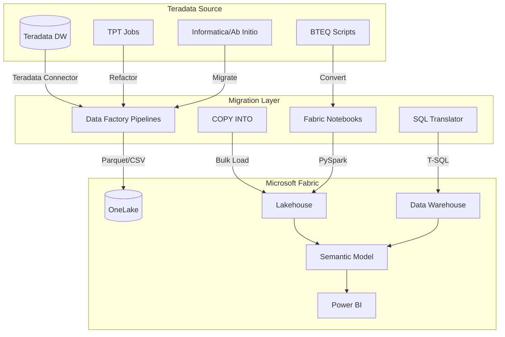
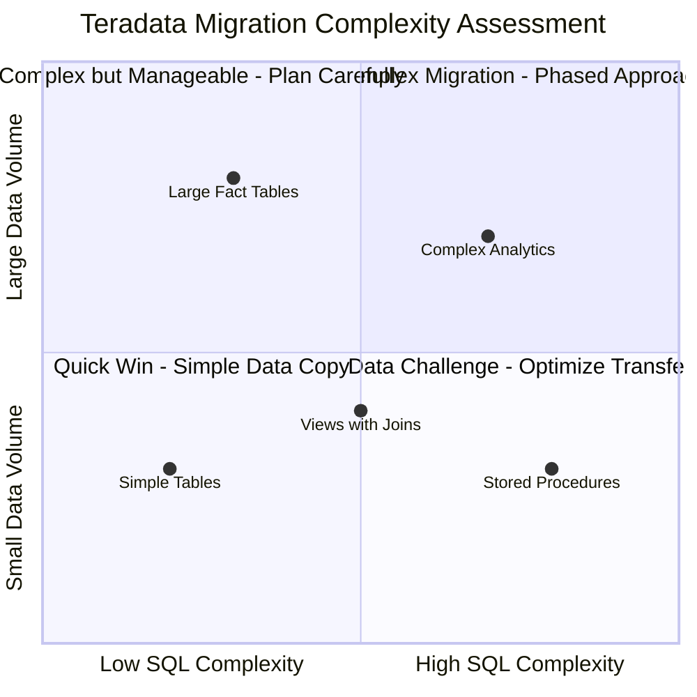
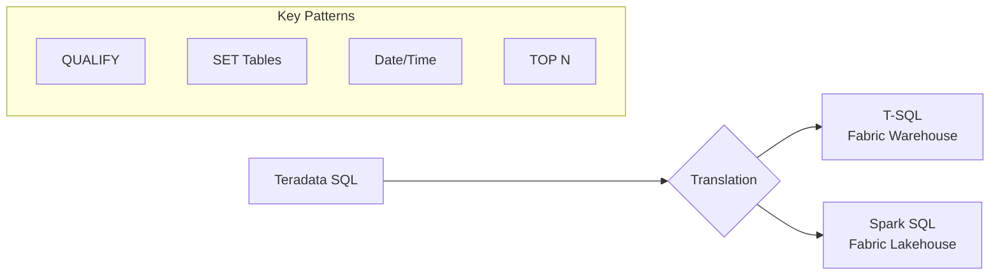
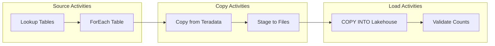
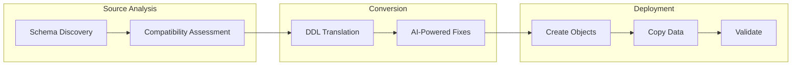
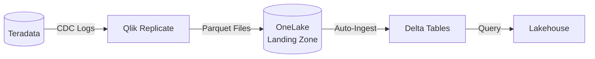

# 🔄 Tutorial 10: Teradata to Microsoft Fabric Migration

<div align="center">


</div>

> 🏠 **[Home](../../index.md)** > 📖 **[Tutorials](../index.md)** > 🔄 **Teradata Migration**

---

## 🔄 Tutorial 10: Teradata to Microsoft Fabric Migration

| | |
|---|---|
| **Difficulty** | ⭐⭐⭐ Advanced |
| **Time** | ⏱️ 120-180 minutes |
| **Focus** | Data Migration & Modernization |

---

### 📊 Progress Tracker

```
┌────────┬────────┬────────┬────────┬────────┬────────┬────────┬────────┬────────┬────────┬────────┬────────┐
│   00   │   01   │   02   │   03   │   04   │   05   │   06   │   07   │   08   │   09   │   10   │   11   │
│ SETUP  │ BRONZE │ SILVER │  GOLD  │  RT    │  PBI   │ PIPES  │  GOV   │ MIRROR │  AI/ML │TERADATA│  SAS   │
├────────┼────────┼────────┼────────┼────────┼────────┼────────┼────────┼────────┼────────┼────────┼────────┤
│   ✅   │   ✅   │   ✅   │   ✅   │   ✅   │   ✅   │   ✅   │   ✅   │   ✅   │   ✅   │  🔵   │   ⬚   │
└────────┴────────┴────────┴────────┴────────┴────────┴────────┴────────┴────────┴────────┴────────┴────────┘
                                                                                              ▲
                                                                                         YOU ARE HERE
```

| Navigation | |
|---|---|
| ⬅️ **Previous** | [09-Advanced AI/ML](../09-advanced-ai-ml/README.md) |
| ➡️ **Next** | [11-SAS Connectivity](../11-sas-connectivity/README.md) |

---

## 📖 Overview

This tutorial provides a comprehensive guide for migrating from **Teradata** data warehouse to **Microsoft Fabric**. You will learn migration strategies, SQL translation patterns, ETL conversion techniques, and best practices for a successful data warehouse modernization.

Teradata has been a leading enterprise data warehouse platform for decades. Microsoft Fabric provides a unified analytics platform that can serve as a modern replacement, offering:
- **Unified Data Lake** with OneLake and Delta Lake format
- **Lakehouse architecture** combining the best of data lakes and warehouses
- **Integrated analytics** from ingestion to Power BI reporting
- **Pay-per-use pricing** with capacity-based or consumption models

---

## 🎯 Learning Objectives

By the end of this tutorial, you will be able to:

- [ ] Understand Teradata to Fabric migration architecture
- [ ] Assess your Teradata workload for migration readiness
- [ ] Configure Teradata connectivity in Fabric Data Factory
- [ ] Translate Teradata SQL to Fabric T-SQL/Spark
- [ ] Migrate data using pipelines and COPY INTO
- [ ] Convert BTEQ scripts to Fabric notebooks
- [ ] Use Microsoft Migration Assistant for schema conversion
- [ ] Validate migrated data for accuracy
- [ ] Implement ongoing synchronization patterns

---

## 🏗️ Migration Architecture Overview



### Migration Approaches

| Approach | Description | Best For |
|----------|-------------|----------|
| **Lift and Shift** | Direct data copy with minimal changes | Quick migrations, testing |
| **Refactor** | Modernize SQL and processes | Long-term value, optimization |
| **Replatform** | Use Fabric-native features | Maximum Fabric benefits |
| **Hybrid** | Keep some data in Teradata | Phased migration |

---

## 📋 Prerequisites

Before starting this tutorial, ensure you have:

- [ ] Completed [Tutorial 00: Environment Setup](../00-environment-setup/README.md)
- [ ] Completed [Tutorials 01-03: Medallion Architecture](../01-bronze-layer/README.md)
- [ ] Fabric workspace with F64+ capacity (recommended for large migrations)
- [ ] Access to source Teradata environment
- [ ] Teradata user with SELECT privileges on migration scope
- [ ] Network connectivity between Fabric and Teradata (VPN/ExpressRoute for on-premises)
- [ ] [Teradata JDBC Driver](https://downloads.teradata.com/download/connectivity/jdbc-driver) (for custom tooling)

> 💡 **Tip:** For testing without a Teradata instance, you can use sample Teradata DDL scripts and synthetic data to practice SQL translation patterns.

---

## 🛠️ Step 1: Assess Your Teradata Environment

### 1.1 Inventory Assessment

Create a comprehensive inventory of objects to migrate:

```sql
-- Teradata: List all databases and sizes
SELECT
    DatabaseName,
    SUM(CurrentPerm) / 1024 / 1024 / 1024 AS SizeGB,
    COUNT(DISTINCT TableName) AS TableCount
FROM DBC.TableSizeV
WHERE DatabaseName NOT IN ('DBC', 'SYSLIB', 'SYSSPATIAL', 'TD_SYSFNLIB')
GROUP BY DatabaseName
ORDER BY SizeGB DESC;

-- List all tables with row counts
SELECT
    DatabaseName,
    TableName,
    TableKind,
    RowCount,
    CurrentPerm / 1024 / 1024 AS SizeMB
FROM DBC.TablesV t
LEFT JOIN DBC.TableSizeV s
    ON t.DatabaseName = s.DatabaseName
    AND t.TableName = s.TableName
WHERE t.DatabaseName = 'YOUR_DATABASE'
ORDER BY SizeMB DESC;
```

### 1.2 Identify Migration Complexity

| Complexity Factor | Assessment Query | Impact |
|-------------------|------------------|--------|
| **SET Tables** | Count tables using SET (unique rows only) | Requires DISTINCT handling |
| **MULTISET Tables** | Count MULTISET tables | Direct migration |
| **Primary Index** | Identify PI columns | Rethink distribution |
| **Partitioning** | Check partition expressions | Map to Fabric partitioning |
| **Stored Procedures** | Count procedures and UDFs | Manual conversion |
| **Views** | Catalog view dependencies | SQL translation |
| **BTEQ Scripts** | Inventory automation scripts | Notebook conversion |

```sql
-- Count SET vs MULTISET tables
SELECT
    TableKind,
    CASE WHEN TableKind = 'T' THEN 'Standard Table'
         WHEN TableKind = 'O' THEN 'SET Table (No Duplicates)'
         WHEN TableKind = 'V' THEN 'View'
         ELSE 'Other' END AS TableType,
    COUNT(*) AS TableCount
FROM DBC.TablesV
WHERE DatabaseName = 'YOUR_DATABASE'
GROUP BY TableKind;

-- List stored procedures
SELECT
    DatabaseName,
    ProcedureName,
    CreateTimeStamp
FROM DBC.ProceduresV
WHERE DatabaseName = 'YOUR_DATABASE';
```

### 1.3 Complexity Scoring Matrix



---

## 🛠️ Step 2: Configure Teradata Connectivity in Fabric

### 2.1 Create Teradata Connection in Data Factory

1. Open your Fabric workspace
2. Navigate to **Data Factory** > **Manage** > **Linked Services**
3. Click **+ New** > **Teradata**

### 2.2 Connection Configuration

| Setting | Description | Example |
|---------|-------------|---------|
| **Name** | Descriptive connection name | `ls_teradata_casino_dw` |
| **Server** | Teradata server hostname | `teradata.casino.com` |
| **Database** | Default database | `CASINO_DW` |
| **Authentication** | Auth method | `Basic` or `LDAP` |
| **Username** | Service account | `fabric_migration_user` |
| **Password** | Azure Key Vault reference | `@Microsoft.KeyVault(...)` |

### 2.3 Connection String Options

```json
{
    "name": "ls_teradata_casino_dw",
    "properties": {
        "type": "Teradata",
        "typeProperties": {
            "server": "teradata.casino.com",
            "authenticationType": "Basic",
            "username": "fabric_migration_user",
            "password": {
                "type": "AzureKeyVaultSecret",
                "store": {
                    "referenceName": "ls_keyvault",
                    "type": "LinkedServiceReference"
                },
                "secretName": "teradata-password"
            }
        },
        "connectVia": {
            "referenceName": "SelfHostedIR",
            "type": "IntegrationRuntimeReference"
        }
    }
}
```

> ⚠️ **Warning:** For on-premises Teradata, you must configure a Self-Hosted Integration Runtime. Install on a Windows server with network access to both Teradata and Azure.

### 2.4 Test Connection

```python
# Fabric Notebook: Test Teradata connectivity via Data Factory
from notebookutils import mssparkutils

# Test connection using Data Factory linked service
connection_result = mssparkutils.data.connect(
    linkedService="ls_teradata_casino_dw"
)
print(f"Connection Status: {connection_result}")
```

---

## 🛠️ Step 3: SQL Translation - Teradata to Fabric

### 3.1 Key SQL Differences

Teradata SQL is an ANSI SQL dialect with Teradata-specific extensions. Fabric supports T-SQL (for Warehouse) and Spark SQL (for Lakehouse).



### 3.2 QUALIFY Clause Translation

Teradata's `QUALIFY` clause filters window function results. Fabric requires a CTE approach.

**Teradata (Original):**
```sql
-- Get latest record per player using QUALIFY
SELECT
    player_id,
    session_timestamp,
    total_spend,
    loyalty_tier
FROM casino.player_sessions
QUALIFY ROW_NUMBER() OVER (
    PARTITION BY player_id
    ORDER BY session_timestamp DESC
) = 1;
```

**Fabric T-SQL (Converted):**
```sql
-- Use CTE with ROW_NUMBER and filter in WHERE
WITH ranked_sessions AS (
    SELECT
        player_id,
        session_timestamp,
        total_spend,
        loyalty_tier,
        ROW_NUMBER() OVER (
            PARTITION BY player_id
            ORDER BY session_timestamp DESC
        ) AS rn
    FROM casino.player_sessions
)
SELECT
    player_id,
    session_timestamp,
    total_spend,
    loyalty_tier
FROM ranked_sessions
WHERE rn = 1;
```

**Fabric Spark SQL (Alternative):**
```python
from pyspark.sql.functions import row_number, desc
from pyspark.sql.window import Window

df = spark.table("casino.player_sessions")

window_spec = Window.partitionBy("player_id").orderBy(desc("session_timestamp"))

df_latest = df.withColumn("rn", row_number().over(window_spec)) \
    .filter("rn = 1") \
    .drop("rn")
```

### 3.3 SET Table Migration (Duplicate Handling)

Teradata SET tables automatically eliminate duplicate rows. Fabric requires explicit handling.

**Teradata (Original):**
```sql
-- SET table - duplicates automatically rejected
CREATE SET TABLE casino.slot_events (
    event_id INTEGER,
    machine_id VARCHAR(50),
    event_type VARCHAR(20),
    event_timestamp TIMESTAMP
) PRIMARY INDEX (event_id);
```

**Fabric Options:**

**Option A: Add UNIQUE constraint (Warehouse)**
```sql
-- Fabric Warehouse with unique constraint
CREATE TABLE casino.slot_events (
    event_id INT NOT NULL,
    machine_id VARCHAR(50),
    event_type VARCHAR(20),
    event_timestamp DATETIME2,
    CONSTRAINT PK_slot_events PRIMARY KEY NONCLUSTERED (event_id)
);
```

**Option B: Deduplicate in pipeline/notebook (Lakehouse)**
```python
# PySpark: Remove duplicates during ingestion
df = spark.read.parquet("Files/raw/slot_events/")

# Remove exact duplicates
df_deduped = df.dropDuplicates()

# Or remove duplicates by key
df_deduped = df.dropDuplicates(["event_id"])

df_deduped.write.mode("overwrite").saveAsTable("casino.slot_events")
```

### 3.4 Date and Time Function Translation

| Teradata | Fabric T-SQL | Fabric Spark SQL |
|----------|--------------|------------------|
| `CURRENT_DATE` | `CAST(GETDATE() AS DATE)` | `current_date()` |
| `CURRENT_TIMESTAMP` | `GETDATE()` | `current_timestamp()` |
| `DATE '2024-01-15'` | `CAST('2024-01-15' AS DATE)` | `to_date('2024-01-15')` |
| `ADD_MONTHS(date, n)` | `DATEADD(MONTH, n, date)` | `add_months(date, n)` |
| `date + INTERVAL '7' DAY` | `DATEADD(DAY, 7, date)` | `date_add(date, 7)` |
| `EXTRACT(MONTH FROM date)` | `MONTH(date)` | `month(date)` |
| `date1 - date2` (days) | `DATEDIFF(DAY, date2, date1)` | `datediff(date1, date2)` |

### 3.5 TOP N and SAMPLE Translation

**Teradata (Original):**
```sql
-- Top 100 players by spend
SELECT TOP 100 WITH TIES
    player_id,
    SUM(total_spend) AS lifetime_spend
FROM casino.player_transactions
GROUP BY player_id
ORDER BY lifetime_spend DESC;

-- Random 1% sample
SELECT * FROM casino.large_table SAMPLE 0.01;
```

**Fabric T-SQL (Converted):**
```sql
-- TOP 100 WITH TIES equivalent using RANK
WITH ranked AS (
    SELECT
        player_id,
        SUM(total_spend) AS lifetime_spend,
        RANK() OVER (ORDER BY SUM(total_spend) DESC) AS rnk
    FROM casino.player_transactions
    GROUP BY player_id
)
SELECT player_id, lifetime_spend
FROM ranked
WHERE rnk <= 100;

-- TABLESAMPLE for random sampling
SELECT * FROM casino.large_table
TABLESAMPLE (1 PERCENT);
```

**Fabric Spark (Converted):**
```python
# Top 100 with ties
from pyspark.sql.functions import sum, rank
from pyspark.sql.window import Window

df = spark.table("casino.player_transactions")
df_agg = df.groupBy("player_id").agg(sum("total_spend").alias("lifetime_spend"))
window = Window.orderBy(desc("lifetime_spend"))
df_ranked = df_agg.withColumn("rnk", rank().over(window))
df_top = df_ranked.filter("rnk <= 100").drop("rnk")

# Random sample
df_sample = spark.table("casino.large_table").sample(0.01)
```

### 3.6 Common Function Mappings

| Teradata Function | Fabric T-SQL | Fabric Spark SQL |
|-------------------|--------------|------------------|
| `NVL(a, b)` | `ISNULL(a, b)` or `COALESCE(a, b)` | `coalesce(a, b)` |
| `NULLIFZERO(x)` | `NULLIF(x, 0)` | `nullif(x, 0)` |
| `ZEROIFNULL(x)` | `ISNULL(x, 0)` | `coalesce(x, 0)` |
| `TRIM(x)` | `TRIM(x)` | `trim(x)` |
| `SUBSTR(s, start, len)` | `SUBSTRING(s, start, len)` | `substring(s, start, len)` |
| `INDEX(s, pattern)` | `CHARINDEX(pattern, s)` | `locate(pattern, s)` |
| `OREPLACE(s, old, new)` | `REPLACE(s, old, new)` | `replace(s, old, new)` |
| `CAST(x AS FORMAT 'YYYY-MM-DD')` | `FORMAT(x, 'yyyy-MM-dd')` | `date_format(x, 'yyyy-MM-dd')` |

---

## 🛠️ Step 4: Migrate Data Using Data Factory Pipelines

### 4.1 Create Migration Pipeline



### 4.2 Pipeline JSON Definition

```json
{
    "name": "pl_teradata_migration_full",
    "properties": {
        "activities": [
            {
                "name": "Get Tables to Migrate",
                "type": "Lookup",
                "typeProperties": {
                    "source": {
                        "type": "TeradataSource",
                        "query": "SELECT DatabaseName, TableName FROM DBC.TablesV WHERE DatabaseName = 'CASINO_DW' AND TableKind = 'T'"
                    },
                    "dataset": {
                        "referenceName": "ds_teradata_query",
                        "type": "DatasetReference"
                    },
                    "firstRowOnly": false
                }
            },
            {
                "name": "ForEach Table",
                "type": "ForEach",
                "typeProperties": {
                    "items": {
                        "value": "@activity('Get Tables to Migrate').output.value",
                        "type": "Expression"
                    },
                    "isSequential": false,
                    "batchCount": 4,
                    "activities": [
                        {
                            "name": "Copy Table to Lakehouse",
                            "type": "Copy",
                            "typeProperties": {
                                "source": {
                                    "type": "TeradataSource",
                                    "query": {
                                        "value": "SELECT * FROM @{item().DatabaseName}.@{item().TableName}",
                                        "type": "Expression"
                                    }
                                },
                                "sink": {
                                    "type": "ParquetSink",
                                    "storeSettings": {
                                        "type": "AzureBlobFSWriteSettings"
                                    }
                                }
                            }
                        }
                    ]
                }
            }
        ]
    }
}
```

### 4.3 Incremental Migration Pattern

For large tables, use watermark-based incremental loads:

```python
# Fabric Notebook: Incremental Teradata Migration
from pyspark.sql import SparkSession
from pyspark.sql.functions import max as spark_max
from datetime import datetime

# Configuration
teradata_table = "CASINO_DW.SLOT_TRANSACTIONS"
fabric_table = "bronze.slot_transactions"
watermark_column = "transaction_timestamp"

# Get current watermark from Fabric
try:
    current_watermark = spark.table(fabric_table) \
        .select(spark_max(watermark_column)) \
        .collect()[0][0]
except:
    current_watermark = datetime(2020, 1, 1)  # Default start

print(f"Current watermark: {current_watermark}")

# Read incremental data from Teradata
query = f"""
SELECT * FROM {teradata_table}
WHERE {watermark_column} > TIMESTAMP '{current_watermark}'
ORDER BY {watermark_column}
"""

# Use JDBC connection (requires Teradata JDBC driver)
df_incremental = spark.read \
    .format("jdbc") \
    .option("url", "jdbc:teradata://teradata.casino.com/CASINO_DW") \
    .option("dbtable", f"({query}) AS subq") \
    .option("user", mssparkutils.credentials.getSecret("keyvault", "teradata-user")) \
    .option("password", mssparkutils.credentials.getSecret("keyvault", "teradata-password")) \
    .option("driver", "com.teradata.jdbc.TeraDriver") \
    .load()

# Append to Fabric table
row_count = df_incremental.count()
print(f"Rows to migrate: {row_count}")

if row_count > 0:
    df_incremental.write.mode("append").saveAsTable(fabric_table)
    print(f"Successfully migrated {row_count} rows")
```

### 4.4 Large Table Migration with Partitioning

```python
# Fabric Notebook: Partitioned Large Table Migration
from pyspark.sql.functions import col, year, month

# Configuration
teradata_table = "CASINO_DW.SLOT_TRANSACTIONS_HISTORY"
fabric_table = "bronze.slot_transactions_history"
partition_column = "transaction_date"

# Read with partition pruning
df = spark.read \
    .format("jdbc") \
    .option("url", "jdbc:teradata://teradata.casino.com/CASINO_DW") \
    .option("dbtable", teradata_table) \
    .option("user", dbutils.secrets.get("keyvault", "teradata-user")) \
    .option("password", dbutils.secrets.get("keyvault", "teradata-password")) \
    .option("partitionColumn", partition_column) \
    .option("lowerBound", "2020-01-01") \
    .option("upperBound", "2024-12-31") \
    .option("numPartitions", 48) \
    .option("fetchsize", 100000) \
    .load()

# Write with Fabric partitioning
df.write \
    .mode("overwrite") \
    .partitionBy("transaction_year", "transaction_month") \
    .format("delta") \
    .saveAsTable(fabric_table)

# Optimize the table
spark.sql(f"OPTIMIZE {fabric_table}")
```

---

## 🛠️ Step 5: Convert BTEQ Scripts to Fabric Notebooks

### 5.1 BTEQ to Notebook Mapping

| BTEQ Command | Fabric Notebook Equivalent |
|--------------|---------------------------|
| `.LOGON` | Spark JDBC connection or linked service |
| `.SET` variables | Notebook parameters or Python variables |
| `.EXPORT` | `df.write.csv()` or `df.write.parquet()` |
| `.IMPORT` | `spark.read.csv()` or COPY INTO |
| `.RUN FILE` | `%run` magic or modular notebooks |
| `.IF` / `.THEN` / `.ELSE` | Python if/else statements |
| `.REPEAT` | Python for loops |
| SQL statements | `spark.sql()` or DataFrame API |

### 5.2 BTEQ Script Conversion Example

**Original BTEQ Script:**
```sql
.LOGON teradata.casino.com/fabric_user,password
.SET WIDTH 65531

-- Daily slot summary extraction
SELECT
    CAST(transaction_date AS DATE) AS report_date,
    machine_id,
    COUNT(*) AS spin_count,
    SUM(coin_in) AS total_coin_in,
    SUM(coin_out) AS total_coin_out
FROM CASINO_DW.SLOT_TRANSACTIONS
WHERE transaction_date = CURRENT_DATE - 1
GROUP BY 1, 2
ORDER BY total_coin_in DESC;

.EXPORT DATA FILE=/data/exports/daily_slots.csv
SELECT * FROM tmp_daily_slots;

.LOGOFF
```

**Converted Fabric Notebook:**
```python
# Cell 1: Configuration
# ====================
from datetime import datetime, timedelta
from pyspark.sql.functions import col, count, sum as spark_sum

# Parameters
report_date = (datetime.now() - timedelta(days=1)).strftime('%Y-%m-%d')
export_path = f"Files/exports/daily_slots_{report_date}.csv"

print(f"Processing report for: {report_date}")

# Cell 2: Read Source Data
# ========================
# Option A: Read from already-migrated Lakehouse table
df_transactions = spark.table("bronze.slot_transactions")

# Option B: Read directly from Teradata (if still connected)
# df_transactions = spark.read.format("jdbc").option(...).load()

# Cell 3: Transform - Daily Slot Summary
# ======================================
df_daily_summary = df_transactions \
    .filter(col("transaction_date") == report_date) \
    .groupBy("machine_id") \
    .agg(
        count("*").alias("spin_count"),
        spark_sum("coin_in").alias("total_coin_in"),
        spark_sum("coin_out").alias("total_coin_out")
    ) \
    .withColumn("report_date", lit(report_date)) \
    .orderBy(col("total_coin_in").desc())

# Cell 4: Export to CSV
# =====================
df_daily_summary.coalesce(1) \
    .write \
    .mode("overwrite") \
    .option("header", "true") \
    .csv(export_path)

print(f"Exported {df_daily_summary.count()} rows to {export_path}")

# Cell 5: Save to Silver Layer
# ============================
df_daily_summary.write \
    .mode("append") \
    .saveAsTable("silver.daily_slot_summary")
```

### 5.3 BTEQ Export/Import Pattern Conversion

**BTEQ FastLoad Pattern:**
```sql
.LOGTABLE CASINO_DW.FL_LOG;
.LOGON teradata.casino.com/user,pwd;
.BEGIN LOADING CASINO_DW.LARGE_TABLE;

DEFINE
    col1 (VARCHAR(50)),
    col2 (INTEGER),
    col3 (DECIMAL(18,2))
FILE=/data/import/large_file.csv;

INSERT INTO CASINO_DW.LARGE_TABLE VALUES (:col1, :col2, :col3);

.END LOADING;
.LOGOFF;
```

**Fabric COPY INTO Equivalent:**
```sql
-- Fabric Warehouse: COPY INTO for high-performance bulk load
COPY INTO casino.large_table
FROM 'https://onelake.dfs.fabric.microsoft.com/workspace/lakehouse/Files/import/large_file.csv'
WITH (
    FILE_TYPE = 'CSV',
    FIRSTROW = 2,
    FIELDTERMINATOR = ',',
    ROWTERMINATOR = '\n',
    ENCODING = 'UTF8',
    MAXERRORS = 0
);
```

---

## 🛠️ Step 6: Use Microsoft Migration Assistant

### 6.1 Fabric Migration Assistant Overview

The **Fabric Migration Assistant** is a native tool for automating schema and data migration.



### 6.2 Supported Migration Sources

| Source | Native Support | Notes |
|--------|---------------|-------|
| **Azure Synapse Dedicated SQL Pool** | ✅ Full support | Schema + Data |
| **SQL Server** | ✅ Full support | OLAP workloads |
| **Teradata** | 🔶 Via third-party | See partner tools |
| **Snowflake** | 🔶 Via connectors | Data Factory |
| **Oracle** | 🔶 Via third-party | Partner solutions |

### 6.3 Third-Party Migration Tools for Teradata

#### Datometry (Network-Level Translation)

Datometry provides real-time SQL translation at the network layer, allowing Teradata applications to run on Fabric without code changes.

| Feature | Capability |
|---------|------------|
| **SQL Translation** | Automatic Teradata-to-T-SQL conversion |
| **Application Compatibility** | Existing apps work without modification |
| **Performance** | Query optimization for Fabric |
| **Migration Speed** | Up to 90% faster migrations |

#### Raven (Datametica/Onix)

Raven automates code conversion for SQL, ETL, and stored procedures.

| Feature | Capability |
|---------|------------|
| **SQL Conversion** | Teradata to Spark SQL / T-SQL |
| **ETL Migration** | Informatica/Ab Initio to Data Factory |
| **Stored Procedures** | Convert to notebooks/procedures |
| **Validation** | Automated testing framework |

#### X2X Suite (Travinto)

| Tool | Purpose |
|------|---------|
| **X2XConverter** | Automated code conversion |
| **X2XAnalyzer** | Assess migration complexity |
| **X2XValidator** | Post-migration validation |

---

## 🛠️ Step 7: Validate Migrated Data

### 7.1 Row Count Validation

```python
# Fabric Notebook: Row Count Validation
from pyspark.sql import SparkSession
import pandas as pd

# Tables to validate
validation_tables = [
    ("CASINO_DW.SLOT_TRANSACTIONS", "bronze.slot_transactions"),
    ("CASINO_DW.PLAYER_SESSIONS", "bronze.player_sessions"),
    ("CASINO_DW.CAGE_OPERATIONS", "bronze.cage_operations"),
]

results = []

for teradata_table, fabric_table in validation_tables:
    # Get Fabric count
    fabric_count = spark.table(fabric_table).count()

    # Get Teradata count (via JDBC)
    teradata_count_df = spark.read \
        .format("jdbc") \
        .option("url", "jdbc:teradata://teradata.casino.com/CASINO_DW") \
        .option("query", f"SELECT COUNT(*) AS cnt FROM {teradata_table}") \
        .load()
    teradata_count = teradata_count_df.collect()[0]["cnt"]

    # Calculate difference
    diff = abs(teradata_count - fabric_count)
    diff_pct = (diff / teradata_count * 100) if teradata_count > 0 else 0
    status = "✅ PASS" if diff_pct < 0.01 else "❌ FAIL"

    results.append({
        "Source Table": teradata_table,
        "Target Table": fabric_table,
        "Source Count": teradata_count,
        "Target Count": fabric_count,
        "Difference": diff,
        "Diff %": f"{diff_pct:.4f}%",
        "Status": status
    })

# Display results
df_results = pd.DataFrame(results)
display(df_results)
```

### 7.2 Data Checksum Validation

```python
# Fabric Notebook: Checksum Validation
from pyspark.sql.functions import sum as spark_sum, count, md5, concat_ws

def calculate_table_checksum(df, key_columns, numeric_columns):
    """Calculate a checksum for data validation."""
    return df.agg(
        count("*").alias("row_count"),
        *[spark_sum(col).alias(f"sum_{col}") for col in numeric_columns]
    ).collect()[0]

# Compare slot_transactions
df_fabric = spark.table("bronze.slot_transactions")
fabric_checksum = calculate_table_checksum(
    df_fabric,
    key_columns=["transaction_id"],
    numeric_columns=["coin_in", "coin_out", "jackpot_contribution"]
)

print("Fabric Checksum:")
print(f"  Row Count: {fabric_checksum['row_count']:,}")
print(f"  Sum Coin In: ${fabric_checksum['sum_coin_in']:,.2f}")
print(f"  Sum Coin Out: ${fabric_checksum['sum_coin_out']:,.2f}")

# Compare against Teradata (run equivalent query on source)
```

### 7.3 Sample Data Comparison

```python
# Fabric Notebook: Sample Row Comparison
from pyspark.sql.functions import col

# Get sample records from Fabric
df_fabric_sample = spark.table("bronze.slot_transactions") \
    .filter(col("transaction_date") == "2024-01-15") \
    .limit(100) \
    .toPandas()

# Get same sample from Teradata
query = """
SELECT * FROM CASINO_DW.SLOT_TRANSACTIONS
WHERE transaction_date = DATE '2024-01-15'
SAMPLE 100
"""
df_teradata_sample = spark.read.format("jdbc") \
    .option("query", query) \
    .load() \
    .toPandas()

# Compare schemas
print("Schema Comparison:")
print(f"Fabric columns: {list(df_fabric_sample.columns)}")
print(f"Teradata columns: {list(df_teradata_sample.columns)}")

# Merge and compare (on key column)
comparison = df_fabric_sample.merge(
    df_teradata_sample,
    on="transaction_id",
    how="outer",
    suffixes=("_fabric", "_teradata"),
    indicator=True
)

print(f"\nMatching records: {len(comparison[comparison['_merge'] == 'both'])}")
print(f"Fabric only: {len(comparison[comparison['_merge'] == 'left_only'])}")
print(f"Teradata only: {len(comparison[comparison['_merge'] == 'right_only'])}")
```

---

## 🛠️ Step 8: Ongoing Synchronization Options

### 8.1 Synchronization Patterns

| Pattern | Latency | Use Case | Implementation |
|---------|---------|----------|----------------|
| **One-time Migration** | N/A | Cutover | Data Factory full copy |
| **Daily Batch** | 24 hours | Reporting | Scheduled pipeline |
| **Hourly Incremental** | 1 hour | Near real-time | Watermark-based |
| **Real-time CDC** | Minutes | Live analytics | Open Mirroring + Qlik |

### 8.2 Open Mirroring with Qlik Replicate

For real-time Teradata replication to Fabric:



**Configuration Steps:**
1. Install Qlik Replicate with Teradata source connector
2. Configure OneLake as target (Open Mirroring landing zone)
3. Map Teradata schemas to Fabric tables
4. Enable CDC capture on Teradata tables
5. Start replication task

> 💡 **Tip:** Qlik Replicate supports 40+ heterogeneous sources including Teradata, providing a unified CDC solution for complex environments.

---

## ✅ Validation Checklist

Before considering migration complete, verify:

- [ ] **Schema Migrated** - All tables, views, and indexes recreated
- [ ] **Data Migrated** - Row counts match within acceptable tolerance
- [ ] **Checksums Validated** - Numeric column sums match
- [ ] **SQL Translated** - All queries tested and functional
- [ ] **ETL Converted** - BTEQ/TPT scripts converted to notebooks/pipelines
- [ ] **Performance Tested** - Key queries meet SLA requirements
- [ ] **Reports Validated** - Business reports produce correct results
- [ ] **Sync Established** - Ongoing synchronization (if required) working

<details>
<summary>🔍 Final Validation Queries</summary>

### Comprehensive Validation Script

```python
# Fabric Notebook: Final Migration Validation

import pandas as pd
from datetime import datetime

validation_report = {
    "Migration ID": f"MIG-{datetime.now().strftime('%Y%m%d-%H%M')}",
    "Source": "Teradata CASINO_DW",
    "Target": "Fabric casino-fabric-poc",
    "Validation Date": datetime.now().isoformat(),
    "Results": []
}

# 1. Table count validation
tables = spark.catalog.listTables("bronze")
validation_report["Results"].append({
    "Check": "Tables Created",
    "Expected": 15,  # Update with your expected count
    "Actual": len(tables),
    "Status": "✅ PASS" if len(tables) >= 15 else "❌ FAIL"
})

# 2. Total row count
total_rows = sum([spark.table(f"bronze.{t.name}").count() for t in tables])
validation_report["Results"].append({
    "Check": "Total Rows Migrated",
    "Expected": "> 1,000,000",
    "Actual": f"{total_rows:,}",
    "Status": "✅ PASS" if total_rows > 1000000 else "⚠️ REVIEW"
})

# 3. Key table validation
key_tables = ["slot_transactions", "player_sessions", "cage_operations"]
for table in key_tables:
    count = spark.table(f"bronze.{table}").count()
    validation_report["Results"].append({
        "Check": f"{table} Row Count",
        "Expected": "> 0",
        "Actual": f"{count:,}",
        "Status": "✅ PASS" if count > 0 else "❌ FAIL"
    })

# 4. Schema validation
df_slots = spark.table("bronze.slot_transactions")
required_columns = ["transaction_id", "machine_id", "coin_in", "coin_out", "transaction_timestamp"]
missing = [c for c in required_columns if c not in df_slots.columns]
validation_report["Results"].append({
    "Check": "Schema Completeness",
    "Expected": "All required columns present",
    "Actual": f"Missing: {missing}" if missing else "All present",
    "Status": "✅ PASS" if not missing else "❌ FAIL"
})

# Display report
print("=" * 60)
print(f"MIGRATION VALIDATION REPORT - {validation_report['Migration ID']}")
print("=" * 60)
print(f"Source: {validation_report['Source']}")
print(f"Target: {validation_report['Target']}")
print(f"Date: {validation_report['Validation Date']}")
print("-" * 60)

for result in validation_report["Results"]:
    print(f"{result['Status']} {result['Check']}")
    print(f"   Expected: {result['Expected']}")
    print(f"   Actual: {result['Actual']}")
    print()

# Overall status
all_passed = all("PASS" in r["Status"] for r in validation_report["Results"])
print("=" * 60)
print(f"OVERALL STATUS: {'✅ MIGRATION VALIDATED' if all_passed else '❌ ISSUES FOUND'}")
print("=" * 60)
```

</details>

---

## 🔧 Troubleshooting

### Common Issues

| Issue | Cause | Resolution |
|-------|-------|------------|
| **Connection timeout** | Firewall blocking | Configure VNet/ExpressRoute |
| **Authentication failed** | Wrong credentials | Verify Teradata user/password |
| **Out of memory** | Large table without partitioning | Add partition options to JDBC read |
| **SQL syntax error** | Untranslated Teradata syntax | Review SQL translation patterns |
| **Data type mismatch** | Incompatible types | Add explicit CAST operations |
| **Slow data transfer** | Single-threaded copy | Enable parallel copy in pipeline |
| **QUALIFY not supported** | Teradata-specific syntax | Convert to CTE with ROW_NUMBER |

### Performance Optimization

```python
# Optimized JDBC read settings for large tables
df = spark.read \
    .format("jdbc") \
    .option("url", jdbc_url) \
    .option("dbtable", table_name) \
    .option("partitionColumn", "date_column") \
    .option("lowerBound", "2020-01-01") \
    .option("upperBound", "2024-12-31") \
    .option("numPartitions", 48) \
    .option("fetchsize", 100000) \
    .option("batchsize", 100000) \
    .load()
```

---

## 📚 Best Practices

1. **Start with Assessment** - Thoroughly analyze Teradata workload before migration
2. **Prioritize by Complexity** - Migrate simple tables first, complex ones later
3. **Test SQL Translation** - Validate all translated SQL against known results
4. **Use Incremental Loads** - For large tables, use watermark-based incremental migration
5. **Parallelize Transfers** - Use Data Factory's parallel copy capabilities
6. **Validate Continuously** - Check row counts and checksums at each stage
7. **Document Mappings** - Maintain a translation guide for SQL and schemas
8. **Plan for Rollback** - Keep Teradata running until migration is validated
9. **Train Teams** - Ensure analysts and engineers learn Fabric-native patterns
10. **Optimize After Migration** - Use OPTIMIZE and Z-ORDER on Delta tables

---

## 🎉 Summary

Congratulations! You have completed the Teradata to Microsoft Fabric migration tutorial. You have learned to:

- ✅ Assess Teradata environments for migration readiness
- ✅ Configure Teradata connectivity in Fabric Data Factory
- ✅ Translate Teradata SQL to Fabric T-SQL and Spark SQL
- ✅ Migrate data using pipelines with incremental patterns
- ✅ Convert BTEQ scripts to Fabric notebooks
- ✅ Validate migrated data for accuracy
- ✅ Understand ongoing synchronization options

---

## ➡️ Next Steps

Continue to **[Tutorial 11: SAS Connectivity](../11-sas-connectivity/README.md)** to learn how to connect SAS to Microsoft Fabric using OLEDB and ODBC connectors.

---

## 📁 Included Resources

This tutorial includes the following supplementary files:

| Resource | Description |
|----------|-------------|
| [`scripts/teradata_migration_utils.py`](./scripts/teradata_migration_utils.py) | Python utilities for migration |
| [`scripts/sql_translation_templates.sql`](./scripts/sql_translation_templates.sql) | SQL translation examples |
| [`scripts/sample_teradata_ddl.sql`](./scripts/sample_teradata_ddl.sql) | Sample Teradata schema for practice |
| [`templates/migration_assessment.md`](./templates/migration_assessment.md) | Assessment template |
| [`templates/migration_checklist.md`](./templates/migration_checklist.md) | Migration checklist |
| [`diagrams/migration-architecture.md`](./diagrams/migration-architecture.md) | Architecture diagrams |

---

## 📚 Additional Resources

- [Microsoft Fabric Migration Guide](https://learn.microsoft.com/en-us/fabric/fundamentals/migration)
- [Teradata Database Connector](https://learn.microsoft.com/en-us/fabric/data-factory/connector-teradata-database)
- [Fabric Migration Assistant](https://learn.microsoft.com/en-us/fabric/data-warehouse/migration-assistant)
- [Teradata SQL to Fabric T-SQL Differences](https://millansanchez.medium.com/this-second-article-explores-the-fundamental-differences-between-teradata-sql-with-bteq-and-07a35413550e)
- [Data Migration ETL for Teradata](https://learn.microsoft.com/en-us/azure/synapse-analytics/migration-guides/teradata/2-etl-load-migration-considerations)
- [Third-Party Migration Tools](https://learn.microsoft.com/en-us/azure/synapse-analytics/migration-guides/teradata/6-microsoft-third-party-migration-tools)
- [Teradata AI Unlimited in Fabric](https://www.teradata.com/press-releases/2024/teradata-ai-unlimited-in-microsoft-fabric)

---

## 🧭 Navigation

| ⬅️ Previous | ⬆️ Up | ➡️ Next |
|------------|------|--------|
| [09-Advanced AI/ML](../09-advanced-ai-ml/README.md) | [Tutorials Index](../index.md) | [11-SAS Connectivity](../11-sas-connectivity/README.md) |

---

> 💬 **Questions or issues?** Open an issue in the [GitHub repository](https://github.com/frgarofa/Suppercharge_Microsoft_Fabric/issues).
