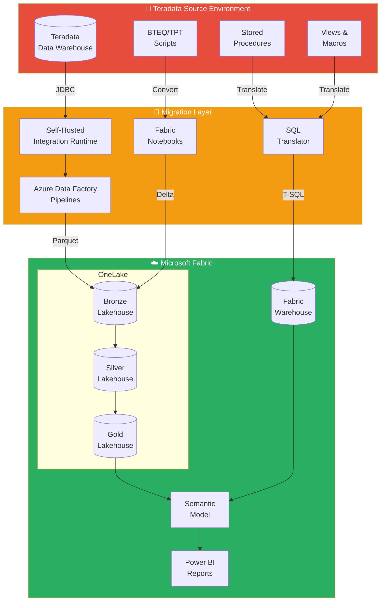
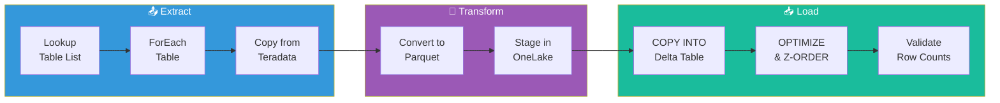
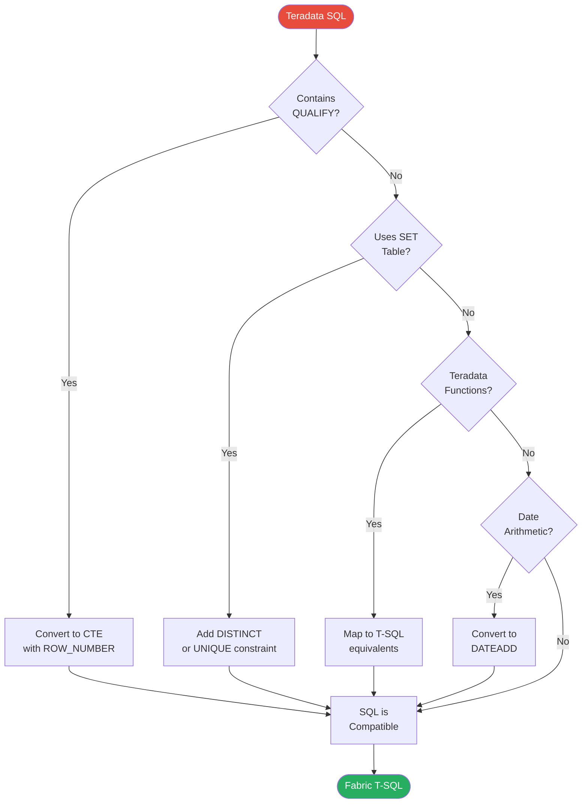
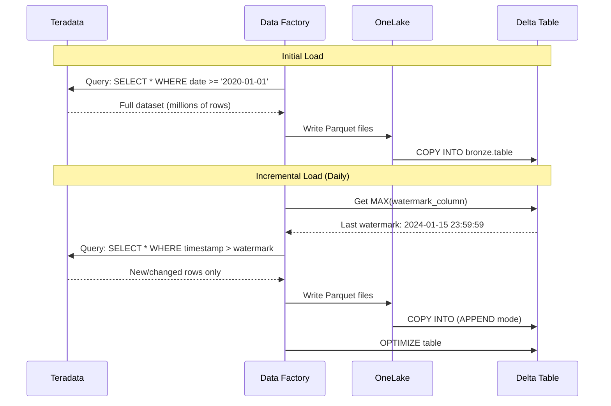
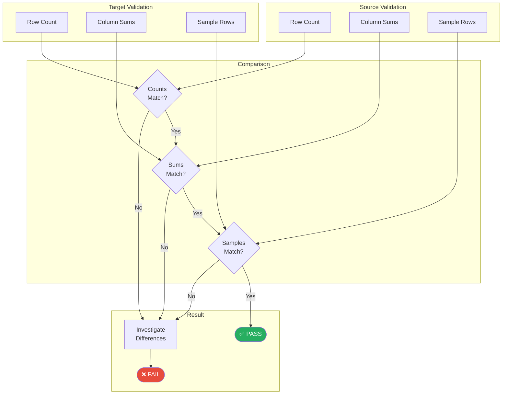
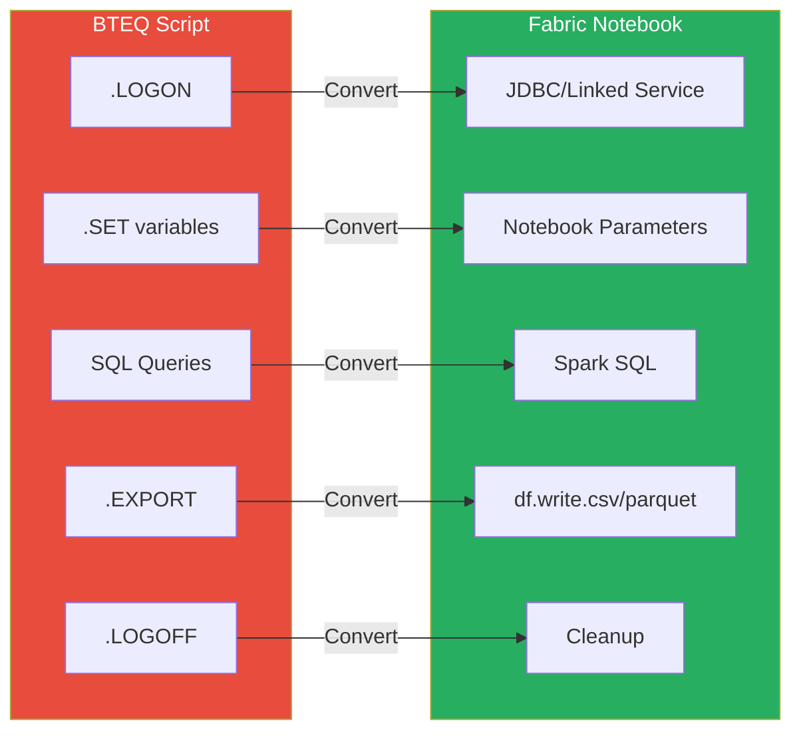
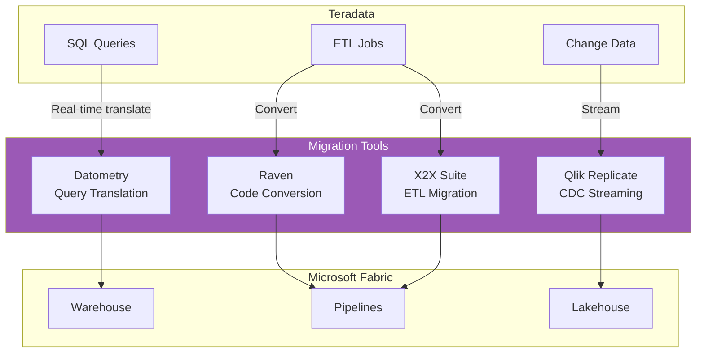
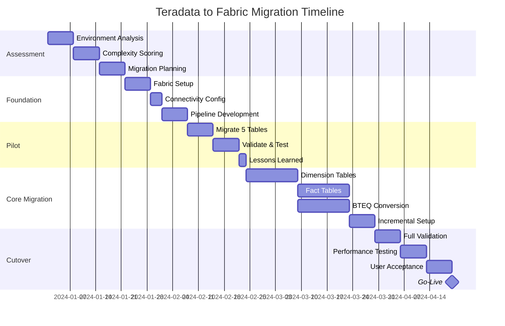
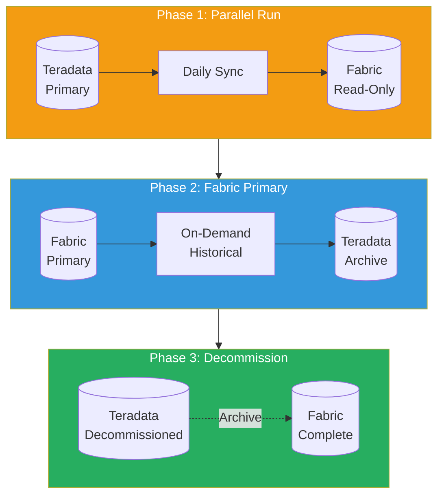
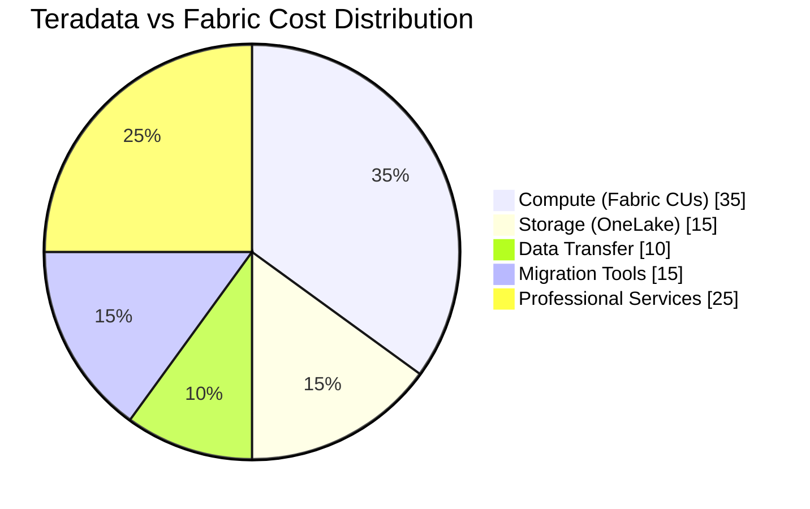

# Teradata to Microsoft Fabric Migration Diagrams

## 1. High-Level Migration Architecture



---

## 2. Data Migration Pipeline Flow



---

## 3. SQL Translation Decision Tree



---

## 4. Incremental Migration Pattern



---

## 5. Validation Workflow



---

## 6. BTEQ to Notebook Conversion



---

## 7. Third-Party Tool Integration



---

## 8. Migration Timeline



---

## 9. Hybrid Architecture (Phased Migration)



---

## 10. Cost Comparison Model



---

## Quick Reference Diagrams

### Function Mapping

```
┌─────────────────────────────────────────────────────────────┐
│              Teradata → Fabric Function Map                 │
├───────────────────────┬─────────────────────────────────────┤
│     TERADATA          │           FABRIC T-SQL              │
├───────────────────────┼─────────────────────────────────────┤
│ NVL(a, b)             │ COALESCE(a, b)                      │
│ NULLIFZERO(x)         │ NULLIF(x, 0)                        │
│ ZEROIFNULL(x)         │ ISNULL(x, 0)                        │
│ ADD_MONTHS(d, n)      │ DATEADD(MONTH, n, d)                │
│ CURRENT_DATE          │ CAST(GETDATE() AS DATE)             │
│ INDEX(s, p)           │ CHARINDEX(p, s)                     │
│ OREPLACE(s, o, n)     │ REPLACE(s, o, n)                    │
│ QUALIFY ROW_NUMBER()  │ CTE + WHERE rn = 1                  │
│ SAMPLE 0.01           │ TABLESAMPLE (1 PERCENT)             │
│ TOP N WITH TIES       │ RANK() <= N                         │
└───────────────────────┴─────────────────────────────────────┘
```
