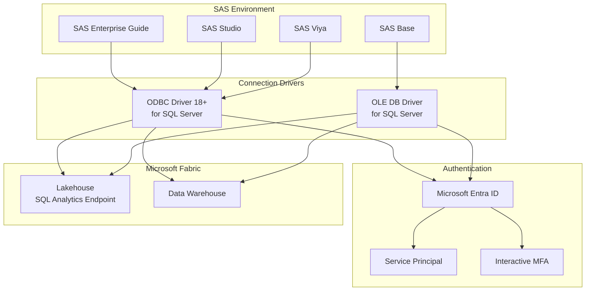
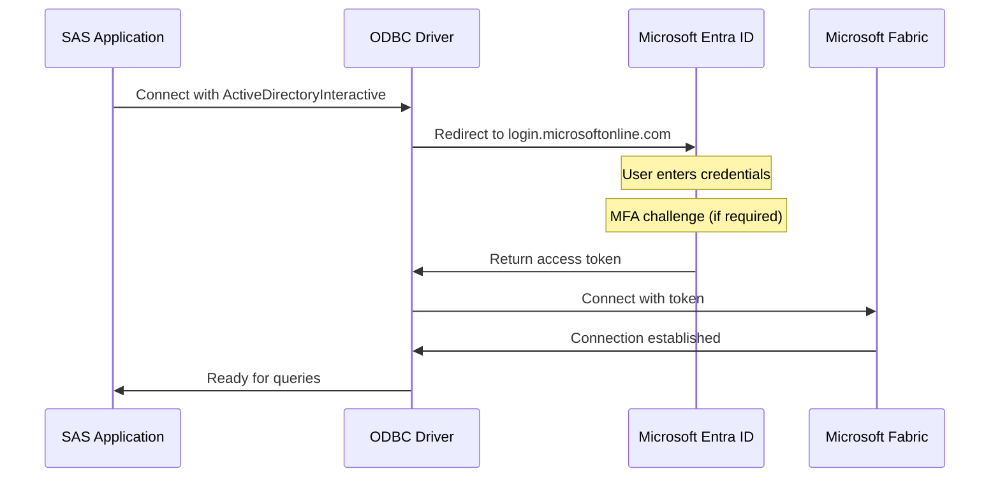
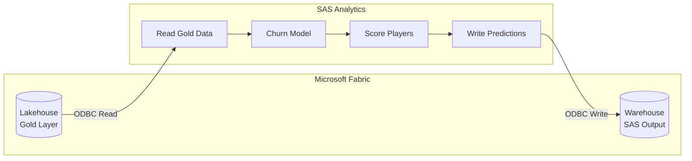

# 🔌 Tutorial 11: SAS Connectivity to Microsoft Fabric

<div align="center">


</div>

> 🏠 **[Home](../../README.md)** > 📖 **[Tutorials](../README.md)** > 🔌 **SAS Connectivity**

---

## 🔌 Tutorial 11: SAS Connectivity to Microsoft Fabric

| | |
|---|---|
| **Difficulty** | ⭐⭐ Intermediate |
| **Time** | ⏱️ 60-90 minutes |
| **Focus** | Data Integration & Connectivity |

---

### 📊 Progress Tracker

```
┌────────┬────────┬────────┬────────┬────────┬────────┬────────┬────────┬────────┬────────┬────────┬────────┐
│   00   │   01   │   02   │   03   │   04   │   05   │   06   │   07   │   08   │   09   │   10   │   11   │   12   │   13   │
│ SETUP  │ BRONZE │ SILVER │  GOLD  │  RT    │  PBI   │ PIPES  │  GOV   │ MIRROR │  AI/ML │TERADATA│  SAS   │  CI/CD │PLANNING│
├────────┼────────┼────────┼────────┼────────┼────────┼────────┼────────┼────────┼────────┼────────┼────────┼────────┼────────┤
│   ✅   │   ✅   │   ✅   │   ✅   │   ✅   │   ✅   │   ✅   │   ✅   │   ✅   │   ✅   │   ✅   │  🔵   │        │        │
└────────┴────────┴────────┴────────┴────────┴────────┴────────┴────────┴────────┴────────┴────────┴────────┴────────┴────────┘
                                                                                                      ▲
                                                                                                 YOU ARE HERE
```

| Navigation | |
|---|---|
| ⬅️ **Previous** | [10-Teradata Migration](../10-teradata-migration/README.md) |
| ➡️ **Next** | [12-CI/CD DevOps](../12-cicd-devops/README.md) |

---

## 📖 Overview

This tutorial provides a comprehensive guide for connecting **SAS** (Statistical Analysis System) to **Microsoft Fabric** using **OLEDB** and **ODBC** connectors. You will learn how to configure SAS to read and write data to Fabric Lakehouses and Warehouses, enabling seamless analytics integration.

SAS remains a critical analytics platform in many enterprises, especially in:
- **Financial services** - Risk modeling and regulatory reporting
- **Healthcare** - Clinical trials and outcomes analysis
- **Gaming/Casino** - Player analytics and compliance reporting
- **Insurance** - Claims analysis and fraud detection

Connecting SAS to Fabric enables you to leverage existing SAS analytics while modernizing your data platform.

---

## 🎯 Learning Objectives

By the end of this tutorial, you will be able to:

- [ ] Understand Fabric connectivity options (ODBC vs OLEDB)
- [ ] Configure ODBC drivers for Microsoft Fabric
- [ ] Set up Microsoft Entra ID authentication for SAS
- [ ] Create SAS LIBNAME statements for Fabric access
- [ ] Read Fabric Lakehouse data into SAS datasets
- [ ] Write SAS data to Fabric warehouses
- [ ] Implement pass-through SQL for optimal performance
- [ ] Troubleshoot common connectivity issues

---

## 🏗️ Connectivity Architecture



### Connectivity Options

| Method | Driver | SAS Products | Best For |
|--------|--------|--------------|----------|
| **ODBC** | ODBC Driver 18+ | All SAS products | Cross-platform, recommended |
| **OLE DB** | MSOLEDBSQL | SAS on Windows | Windows-only environments |
| **SAS/ACCESS** | SAS/ACCESS to ODBC | Enterprise deployments | Licensed SAS environments |

---

## 📋 Prerequisites

Before starting this tutorial, ensure you have:

- [ ] Completed [Tutorial 00: Environment Setup](../00-environment-setup/README.md)
- [ ] SAS software installed (Base SAS, Enterprise Guide, or SAS Viya)
- [ ] Microsoft Fabric workspace with Lakehouse or Warehouse
- [ ] Microsoft Entra ID (Azure AD) credentials
- [ ] Network connectivity to Fabric (port 1433)
- [ ] Administrator access to install ODBC/OLEDB drivers

> 💡 **Tip:** If testing without SAS, you can use other ODBC-compatible tools (Excel, DBeaver, Python) to validate the connection patterns.

---

## 🛠️ Step 1: Install and Configure ODBC Driver

### 1.1 Download ODBC Driver 18+

> ⚠️ **Important:** Microsoft Fabric requires **ODBC Driver 18 or higher**. Earlier versions will fail to connect.

**Windows:**
1. Download from [Microsoft ODBC Driver for SQL Server](https://learn.microsoft.com/en-us/sql/connect/odbc/download-odbc-driver-for-sql-server)
2. Run the installer (`msodbcsql18.msi`)
3. Complete the installation wizard

**Linux (RHEL/CentOS):**
```bash
# Add Microsoft repository
curl https://packages.microsoft.com/config/rhel/8/prod.repo > /etc/yum.repos.d/msprod.repo

# Install ODBC Driver 18
sudo ACCEPT_EULA=Y yum install -y msodbcsql18 mssql-tools18 unixODBC-devel
```

**Linux (Ubuntu/Debian):**
```bash
# Add Microsoft repository
curl https://packages.microsoft.com/keys/microsoft.asc | apt-key add -
curl https://packages.microsoft.com/config/ubuntu/20.04/prod.list > /etc/apt/sources.list.d/msprod.list

# Install ODBC Driver 18
sudo apt-get update
sudo ACCEPT_EULA=Y apt-get install -y msodbcsql18 mssql-tools18 unixodbc-dev
```

### 1.2 Verify ODBC Installation

**Windows:**
1. Open **ODBC Data Source Administrator** (64-bit)
2. Click the **Drivers** tab
3. Verify **ODBC Driver 18 for SQL Server** is listed

**Linux:**
```bash
# List installed ODBC drivers
odbcinst -q -d

# Expected output:
# [ODBC Driver 18 for SQL Server]
```

### 1.3 Get Fabric SQL Connection String

1. Open your Fabric workspace
2. Navigate to your **Lakehouse** or **Warehouse**
3. Click **Settings** (gear icon)
4. Copy the **SQL connection string**

**Lakehouse SQL Analytics Endpoint:**
```
Server: abc12345.datawarehouse.fabric.microsoft.com
Database: lh_casino_poc
```

**Warehouse:**
```
Server: xyz67890.datawarehouse.fabric.microsoft.com
Database: wh_casino_analytics
```

> 💡 **Tip:** The Lakehouse SQL endpoint is **read-only**. For write operations, use a Fabric Warehouse.

---

## 🛠️ Step 2: Configure ODBC Data Source Name (DSN)

### 2.1 Windows DSN Configuration

1. Open **ODBC Data Source Administrator** (64-bit)
2. Click **User DSN** or **System DSN** tab
3. Click **Add...**
4. Select **ODBC Driver 18 for SQL Server**
5. Click **Finish**

**DSN Configuration:**

| Field | Value |
|-------|-------|
| **Name** | `Fabric_Casino_Lakehouse` |
| **Description** | `Microsoft Fabric Lakehouse Connection` |
| **Server** | `abc12345.datawarehouse.fabric.microsoft.com` |
| **Database** | `lh_casino_poc` |

6. Click **Next**
7. Select **With Azure Active Directory Interactive** for authentication
8. Complete the wizard

### 2.2 Linux DSN Configuration (odbc.ini)

Edit `/etc/odbc.ini` or `~/.odbc.ini`:

```ini
[Fabric_Casino_Lakehouse]
Driver = ODBC Driver 18 for SQL Server
Server = abc12345.datawarehouse.fabric.microsoft.com
Database = lh_casino_poc
Authentication = ActiveDirectoryInteractive
Encrypt = yes
TrustServerCertificate = no
```

Edit `/etc/odbcinst.ini` (if not already configured):

```ini
[ODBC Driver 18 for SQL Server]
Description = Microsoft ODBC Driver 18 for SQL Server
Driver = /opt/microsoft/msodbcsql18/lib64/libmsodbcsql-18.3.so.2.1
UsageCount = 1
```

### 2.3 DSN-less Connection String

For programmatic connections without a DSN:

```
Driver={ODBC Driver 18 for SQL Server};
Server=abc12345.datawarehouse.fabric.microsoft.com;
Database=lh_casino_poc;
Authentication=ActiveDirectoryInteractive;
Encrypt=yes;
TrustServerCertificate=no;
```

---

## 🛠️ Step 3: Configure Microsoft Entra ID Authentication

### 3.1 Authentication Options

Microsoft Fabric supports multiple authentication methods via ODBC:

| Authentication Mode | Use Case | ODBC Keyword |
|---------------------|----------|--------------|
| **Interactive** | User context with browser popup | `ActiveDirectoryInteractive` |
| **Password** | Service account (deprecated) | `ActiveDirectoryPassword` |
| **Service Principal** | Automated/headless processes | `ActiveDirectoryServicePrincipal` |
| **Managed Identity** | Azure-hosted SAS | `ActiveDirectoryManagedIdentity` |

### 3.2 Service Principal Setup (Recommended for Production)

For automated SAS jobs, create a service principal:

**1. Create App Registration in Azure:**

```bash
# Azure CLI
az ad app create --display-name "SAS-Fabric-Connector"
az ad sp create --id <app-id>
az ad sp credential reset --id <app-id> --years 2
```

**2. Grant Fabric Permissions:**

1. Open your Fabric workspace
2. Click **Manage access**
3. Add the service principal with **Contributor** role

**3. Configure ODBC for Service Principal:**

```ini
[Fabric_Casino_SPN]
Driver = ODBC Driver 18 for SQL Server
Server = abc12345.datawarehouse.fabric.microsoft.com
Database = lh_casino_poc
Authentication = ActiveDirectoryServicePrincipal
UID = <application-client-id>
PWD = <client-secret>
Encrypt = yes
TrustServerCertificate = no
```

> ⚠️ **Security Warning:** Never hardcode secrets. Use environment variables or secret management systems.

### 3.3 Interactive Authentication Flow



---

## 🛠️ Step 4: SAS LIBNAME Configuration

### 4.1 Basic ODBC LIBNAME

```sas
/* SAS LIBNAME for Microsoft Fabric Lakehouse */
LIBNAME fabric ODBC
    DSN="Fabric_Casino_Lakehouse"
    SCHEMA="dbo"
    READBUFF=10000
    INSERTBUFF=10000;

/* Test connection */
PROC CONTENTS DATA=fabric._all_ NODS;
RUN;
```

### 4.2 DSN-less LIBNAME (Connection String)

```sas
/* DSN-less connection to Fabric Warehouse */
LIBNAME fabric_wh ODBC
    NOPROMPT="Driver={ODBC Driver 18 for SQL Server};
              Server=xyz67890.datawarehouse.fabric.microsoft.com;
              Database=wh_casino_analytics;
              Authentication=ActiveDirectoryInteractive;
              Encrypt=yes;
              TrustServerCertificate=no;"
    SCHEMA="casino"
    READBUFF=10000;

/* List available tables */
PROC SQL;
    SELECT *
    FROM dictionary.tables
    WHERE libname = 'FABRIC_WH';
QUIT;
```

### 4.3 Service Principal Authentication in SAS

```sas
/* Environment variables for security (set before SAS starts) */
/* SET SAS_FABRIC_CLIENT_ID=your-client-id */
/* SET SAS_FABRIC_SECRET=your-client-secret */

%LET client_id = %SYSGET(SAS_FABRIC_CLIENT_ID);
%LET client_secret = %SYSGET(SAS_FABRIC_SECRET);

LIBNAME fabric ODBC
    NOPROMPT="Driver={ODBC Driver 18 for SQL Server};
              Server=abc12345.datawarehouse.fabric.microsoft.com;
              Database=lh_casino_poc;
              Authentication=ActiveDirectoryServicePrincipal;
              UID=&client_id.;
              PWD=&client_secret.;
              Encrypt=yes;"
    SCHEMA="dbo";
```

### 4.4 LIBNAME Options for Performance

| Option | Value | Purpose |
|--------|-------|---------|
| `READBUFF=` | 10000-50000 | Rows to fetch per read |
| `INSERTBUFF=` | 10000 | Rows to batch per insert |
| `DBCOMMIT=` | 0 | Commit after all rows (0) |
| `BULKLOAD=YES` | YES | Enable bulk loading |
| `DIRECT_SQL=` | ALLOW | Enable pass-through SQL |
| `PRESERVE_COL_NAMES=YES` | YES | Keep original column names |
| `PRESERVE_TAB_NAMES=YES` | YES | Keep original table names |

```sas
/* Optimized LIBNAME for large data operations */
LIBNAME fabric ODBC
    DSN="Fabric_Casino_Lakehouse"
    SCHEMA="dbo"
    READBUFF=50000
    INSERTBUFF=10000
    DBCOMMIT=0
    DIRECT_SQL=ALLOW
    PRESERVE_COL_NAMES=YES
    PRESERVE_TAB_NAMES=YES;
```

---

## 🛠️ Step 5: Reading Data from Fabric

### 5.1 Read Lakehouse Table into SAS Dataset

```sas
/* Read slot_transactions from Fabric Lakehouse */
LIBNAME fabric ODBC DSN="Fabric_Casino_Lakehouse" SCHEMA="dbo";

/* Simple read - all data */
DATA work.slot_transactions;
    SET fabric.slot_transactions;
RUN;

PROC PRINT DATA=work.slot_transactions (OBS=10);
RUN;
```

### 5.2 Filtered Read with WHERE Clause

```sas
/* Read with filter - uses pass-through when possible */
DATA work.recent_transactions;
    SET fabric.slot_transactions (WHERE=(transaction_date >= '2024-01-01'));
RUN;

/* Verify SAS generated appropriate SQL */
OPTIONS SASTRACE=',,,d' SASTRACELOC=SASLOG NOSTSUFFIX;
DATA work.filtered;
    SET fabric.slot_transactions (WHERE=(coin_in > 100));
RUN;
OPTIONS SASTRACE=OFF;
```

### 5.3 Efficient Read with PROC SQL

```sas
/* PROC SQL with pass-through optimization */
PROC SQL;
    CREATE TABLE work.player_summary AS
    SELECT
        player_id,
        COUNT(*) AS session_count,
        SUM(coin_in) AS total_coin_in,
        AVG(session_duration) AS avg_duration
    FROM fabric.player_sessions
    WHERE session_date >= '2024-01-01'
    GROUP BY player_id
    HAVING SUM(coin_in) > 1000
    ORDER BY total_coin_in DESC;
QUIT;
```

### 5.4 Explicit Pass-Through SQL

For complex queries, use explicit pass-through to ensure optimal execution in Fabric:

```sas
/* Explicit pass-through SQL - executes entirely in Fabric */
PROC SQL;
    CONNECT USING fabric;

    CREATE TABLE work.complex_analysis AS
    SELECT * FROM CONNECTION TO fabric (
        WITH player_metrics AS (
            SELECT
                player_id,
                CAST(transaction_date AS DATE) AS play_date,
                SUM(coin_in) AS daily_coin_in,
                SUM(coin_out) AS daily_coin_out,
                COUNT(*) AS spin_count
            FROM casino.slot_transactions
            WHERE transaction_date >= DATEADD(DAY, -30, GETDATE())
            GROUP BY player_id, CAST(transaction_date AS DATE)
        ),
        player_ranked AS (
            SELECT *,
                ROW_NUMBER() OVER (
                    PARTITION BY player_id
                    ORDER BY daily_coin_in DESC
                ) AS rank_in_player
            FROM player_metrics
        )
        SELECT
            player_id,
            play_date,
            daily_coin_in,
            daily_coin_out,
            spin_count
        FROM player_ranked
        WHERE rank_in_player <= 3
    );

    DISCONNECT FROM fabric;
QUIT;
```

---

## 🛠️ Step 6: Writing Data to Fabric Warehouse

> ⚠️ **Important:** The Lakehouse SQL endpoint is **read-only**. To write data from SAS, you must connect to a **Fabric Warehouse** or use file-based ingestion.

### 6.1 Write SAS Dataset to Fabric Warehouse

```sas
/* Connect to Fabric Warehouse (not Lakehouse SQL endpoint) */
LIBNAME fabric_wh ODBC
    NOPROMPT="Driver={ODBC Driver 18 for SQL Server};
              Server=xyz67890.datawarehouse.fabric.microsoft.com;
              Database=wh_casino_analytics;
              Authentication=ActiveDirectoryInteractive;
              Encrypt=yes;"
    SCHEMA="sas_output"
    BULKLOAD=YES
    INSERTBUFF=10000;

/* Create sample SAS dataset */
DATA work.player_scores;
    INPUT player_id $ score segment $;
    DATALINES;
P001 85 HIGH
P002 72 MEDIUM
P003 45 LOW
P004 91 HIGH
P005 68 MEDIUM
;
RUN;

/* Write to Fabric Warehouse */
DATA fabric_wh.player_scores;
    SET work.player_scores;
RUN;

/* Verify write */
PROC SQL;
    SELECT COUNT(*) AS row_count FROM fabric_wh.player_scores;
QUIT;
```

### 6.2 Bulk Insert with PROC APPEND

```sas
/* Efficient bulk append for large datasets */
PROC APPEND
    BASE=fabric_wh.transaction_history
    DATA=work.new_transactions
    FORCE;
RUN;
```

### 6.3 Create Table with Explicit Schema

```sas
/* Create table with specific data types */
PROC SQL;
    CONNECT USING fabric_wh;

    EXECUTE (
        CREATE TABLE sas_output.player_analytics (
            player_id VARCHAR(50) NOT NULL,
            analysis_date DATE NOT NULL,
            churn_score DECIMAL(5,4),
            ltv_prediction DECIMAL(12,2),
            segment VARCHAR(20),
            model_version VARCHAR(10),
            created_at DATETIME2 DEFAULT GETDATE()
        )
    ) BY fabric_wh;

    DISCONNECT FROM fabric_wh;
QUIT;

/* Insert data */
DATA fabric_wh.player_analytics;
    SET work.model_output;
RUN;
```

### 6.4 Alternative: Write to OneLake Files

For Lakehouse data, SAS can write to OneLake Files (Parquet/CSV) which Fabric can then load:

```sas
/* Export to CSV for OneLake ingestion */
PROC EXPORT DATA=work.player_scores
    OUTFILE="/mnt/onelake/workspace/lakehouse/Files/sas_output/player_scores.csv"
    DBMS=CSV
    REPLACE;
RUN;

/* Note: Requires OneLake mounted or accessible via file path */
/* After export, use Fabric notebook to load into Delta table */
```

---

## 🛠️ Step 7: OLE DB Configuration (Windows Only)

### 7.1 Install OLE DB Driver

1. Download [Microsoft OLE DB Driver for SQL Server](https://learn.microsoft.com/en-us/sql/connect/oledb/download-oledb-driver-for-sql-server)
2. Install `msoledbsql.msi`
3. Verify installation in Windows registry

### 7.2 SAS OLEDB LIBNAME

```sas
/* OLE DB LIBNAME for Microsoft Fabric */
LIBNAME fabric OLEDB
    PROVIDER="MSOLEDBSQL"
    PROPERTIES=(
        "Data Source"="abc12345.datawarehouse.fabric.microsoft.com"
        "Initial Catalog"="lh_casino_poc"
        "Authentication"="ActiveDirectoryInteractive"
        "Encrypt"="yes"
    )
    SCHEMA="dbo";

/* Test connection */
PROC SQL;
    SELECT * FROM fabric.slot_transactions (OBS=5);
QUIT;
```

### 7.3 OLEDB vs ODBC Comparison

| Feature | ODBC | OLE DB |
|---------|------|--------|
| **Platform** | Cross-platform | Windows only |
| **SAS Support** | All SAS products | SAS on Windows |
| **Performance** | Excellent | Excellent |
| **Driver** | ODBC Driver 18+ | MSOLEDBSQL |
| **Recommendation** | Preferred | Legacy compatibility |

---

## 🛠️ Step 8: Common Use Cases and Patterns

### 8.1 Casino Player Analytics Integration



### 8.2 Daily Batch Analytics Job

```sas
/* Daily SAS job to score players and write back to Fabric */

/* Step 1: Connect to Fabric */
LIBNAME fabric ODBC DSN="Fabric_Casino_Lakehouse" SCHEMA="gold";
LIBNAME output ODBC DSN="Fabric_Casino_Warehouse" SCHEMA="sas_output"
    BULKLOAD=YES;

/* Step 2: Read player data from Gold layer */
PROC SQL;
    CREATE TABLE work.player_features AS
    SELECT *
    FROM fabric.gold_player_360
    WHERE last_activity_date >= DATEADD(DAY, -30, GETDATE());
QUIT;

/* Step 3: Apply churn prediction model */
PROC LOGISTIC INMODEL=saslib.churn_model;
    SCORE DATA=work.player_features
          OUT=work.player_scores;
RUN;

/* Step 4: Prepare output */
DATA work.predictions;
    SET work.player_scores;
    prediction_date = TODAY();
    churn_probability = P_1;
    churn_segment = IFC(P_1 > 0.7, 'HIGH_RISK',
                    IFC(P_1 > 0.4, 'MEDIUM_RISK', 'LOW_RISK'));
    KEEP player_id prediction_date churn_probability churn_segment;
RUN;

/* Step 5: Write predictions to Fabric Warehouse */
PROC SQL;
    DELETE FROM output.player_churn_predictions
    WHERE prediction_date = TODAY();
QUIT;

DATA output.player_churn_predictions;
    SET work.predictions;
RUN;

/* Step 6: Log results */
%PUT NOTE: Processed %NOBS(work.predictions) players;
%PUT NOTE: Predictions written to Fabric Warehouse;

/* Cleanup */
LIBNAME fabric CLEAR;
LIBNAME output CLEAR;
```

### 8.3 Real-Time Scoring API Pattern

For real-time scoring, SAS can query Fabric and return predictions:

```sas
/* Macro for on-demand player scoring */
%MACRO score_player(player_id);
    LIBNAME fabric ODBC DSN="Fabric_Casino_Lakehouse" SCHEMA="gold";

    PROC SQL NOPRINT;
        CREATE TABLE work.player_&player_id. AS
        SELECT *
        FROM fabric.gold_player_360
        WHERE player_id = "&player_id.";
    QUIT;

    /* Apply model */
    PROC LOGISTIC INMODEL=saslib.churn_model;
        SCORE DATA=work.player_&player_id.
              OUT=work.score_&player_id.;
    RUN;

    /* Return score */
    PROC SQL NOPRINT;
        SELECT P_1 INTO :churn_score
        FROM work.score_&player_id.;
    QUIT;

    %PUT Player &player_id. churn score: &churn_score.;

    LIBNAME fabric CLEAR;
%MEND;

/* Usage */
%score_player(P12345);
```

### 8.4 Compliance Reporting Integration

```sas
/* Generate CTR/SAR reports using Fabric data */
LIBNAME fabric ODBC DSN="Fabric_Casino_Lakehouse" SCHEMA="gold";

/* CTR: Transactions over $10,000 */
PROC SQL;
    CREATE TABLE work.ctr_report AS
    SELECT
        transaction_id,
        player_id,
        transaction_timestamp,
        amount,
        transaction_type,
        'CTR' AS report_type
    FROM fabric.gold_cage_operations
    WHERE amount >= 10000
      AND transaction_date = TODAY() - 1;
QUIT;

/* SAR: Suspicious patterns ($8K-$9.9K range) */
PROC SQL;
    CREATE TABLE work.sar_candidates AS
    SELECT
        player_id,
        COUNT(*) AS transaction_count,
        SUM(amount) AS total_amount,
        MIN(transaction_timestamp) AS first_txn,
        MAX(transaction_timestamp) AS last_txn
    FROM fabric.gold_cage_operations
    WHERE amount BETWEEN 8000 AND 9999
      AND transaction_date >= TODAY() - 7
    GROUP BY player_id
    HAVING COUNT(*) >= 3;  /* Multiple transactions in range */
QUIT;

/* Export reports */
ODS PDF FILE="/reports/compliance/daily_ctr_%sysfunc(today(), yymmddn8.).pdf";
PROC PRINT DATA=work.ctr_report;
    TITLE "Currency Transaction Report - %sysfunc(today(), date9.)";
RUN;
ODS PDF CLOSE;
```

---

## ✅ Validation Checklist

Before using SAS-Fabric connectivity in production, verify:

- [ ] **Driver Installed** - ODBC Driver 18+ installed and visible
- [ ] **DSN Configured** - Data Source Name created and tested
- [ ] **Authentication Working** - Entra ID authentication successful
- [ ] **LIBNAME Functional** - SAS LIBNAME connects without errors
- [ ] **Read Operations** - Can read tables from Fabric
- [ ] **Write Operations** - Can write to Fabric Warehouse (if needed)
- [ ] **Pass-Through SQL** - Complex queries execute in Fabric
- [ ] **Performance Acceptable** - Query times meet requirements

<details>
<summary>🔍 Verification Code</summary>

### Test ODBC Connection

```sas
/* Comprehensive connection test */
%MACRO test_fabric_connection(dsn=, schema=);
    %PUT === Testing Fabric Connection ===;
    %PUT DSN: &dsn.;
    %PUT Schema: &schema.;

    /* Attempt connection */
    LIBNAME test ODBC DSN="&dsn." SCHEMA="&schema.";

    /* Check LIBREF assignment */
    %IF %SYSFUNC(LIBREF(test)) = 0 %THEN %DO;
        %PUT SUCCESS: LIBNAME assigned successfully;

        /* List tables */
        PROC SQL NOPRINT;
            SELECT COUNT(*) INTO :table_count
            FROM dictionary.tables
            WHERE libname = 'TEST';
        QUIT;

        %PUT Tables accessible: &table_count.;

        /* Test query */
        PROC SQL NOPRINT;
            SELECT COUNT(*) INTO :row_count
            FROM test.slot_transactions (OBS=100);
        QUIT;

        %PUT Sample rows read: &row_count.;

        %PUT === Connection Test: PASSED ===;
    %END;
    %ELSE %DO;
        %PUT ERROR: LIBNAME assignment failed;
        %PUT ERROR: Check DSN, credentials, and network;
        %PUT === Connection Test: FAILED ===;
    %END;

    LIBNAME test CLEAR;
%MEND;

/* Run test */
%test_fabric_connection(dsn=Fabric_Casino_Lakehouse, schema=dbo);
```

### Verify Pass-Through SQL

```sas
/* Verify pass-through is working */
OPTIONS SASTRACE=',,,d' SASTRACELOC=SASLOG NOSTSUFFIX;

PROC SQL;
    CREATE TABLE work.test_passthrough AS
    SELECT TOP 10 *
    FROM fabric.slot_transactions
    WHERE transaction_date >= '2024-01-01'
    ORDER BY transaction_timestamp DESC;
QUIT;

OPTIONS SASTRACE=OFF;

/* Check log for "Prepared:" indicating pass-through */
/* You should see the SQL sent to Fabric, not SAS interpretation */
```

### Validate Write Capability

```sas
/* Test write to Fabric Warehouse */
LIBNAME fabric_wh ODBC DSN="Fabric_Casino_Warehouse" SCHEMA="sas_output";

DATA work.test_write;
    test_id = 1;
    test_value = 'SAS Connection Test';
    test_timestamp = DATETIME();
    FORMAT test_timestamp DATETIME20.;
RUN;

DATA fabric_wh.connection_test;
    SET work.test_write;
RUN;

PROC SQL;
    SELECT * FROM fabric_wh.connection_test;
QUIT;

/* Cleanup */
PROC SQL;
    DROP TABLE fabric_wh.connection_test;
QUIT;

LIBNAME fabric_wh CLEAR;
```

</details>

---

## 🔧 Troubleshooting

### Common Issues and Solutions

| Issue | Symptom | Solution |
|-------|---------|----------|
| **Driver not found** | `ERROR: CLI error trying to establish connection` | Install ODBC Driver 18+, verify in ODBC Administrator |
| **Authentication failed** | `Login failed for user` | Check Entra ID credentials, verify user has workspace access |
| **MFA required** | Connection hangs or times out | Use `ActiveDirectoryInteractive` in headless mode, or switch to Service Principal |
| **Network blocked** | `A network-related or instance-specific error` | Verify port 1433 is open, check firewall rules |
| **Table not found** | `Table not found in schema` | Verify schema name, use correct case (dbo vs DBO) |
| **Write permission denied** | `INSERT permission denied` | Connect to Warehouse, not Lakehouse SQL endpoint |
| **Performance slow** | Queries take too long | Use pass-through SQL, increase READBUFF, add filters |

### Debug Connection Issues

```sas
/* Enable detailed ODBC tracing */
OPTIONS SASTRACE=',,,d'
        SASTRACELOC=SASLOG
        NOSTSUFFIX
        MSGLEVEL=I;

/* Attempt connection with verbose logging */
LIBNAME debug ODBC
    NOPROMPT="Driver={ODBC Driver 18 for SQL Server};
              Server=abc12345.datawarehouse.fabric.microsoft.com;
              Database=lh_casino_poc;
              Authentication=ActiveDirectoryInteractive;
              Encrypt=yes;"
    SCHEMA="dbo";

/* Check log for detailed error messages */

/* Disable tracing */
OPTIONS SASTRACE=OFF;
LIBNAME debug CLEAR;
```

### Linux-Specific Issues

```bash
# Verify Kerberos configuration for Entra ID
kinit user@domain.onmicrosoft.com

# Test ODBC connection with isql
isql -v Fabric_Casino_Lakehouse

# Check library paths
ldd /opt/microsoft/msodbcsql18/lib64/libmsodbcsql-18.3.so.2.1
```

### Service Principal Token Issues

```sas
/* Debug service principal authentication */
%LET client_id = %SYSGET(SAS_FABRIC_CLIENT_ID);
%LET client_secret = %SYSGET(SAS_FABRIC_SECRET);

/* Check if variables are set */
%PUT Client ID length: %LENGTH(&client_id.);
%PUT Secret length: %LENGTH(&client_secret.);

%IF %LENGTH(&client_id.) = 0 %THEN %DO;
    %PUT ERROR: SAS_FABRIC_CLIENT_ID environment variable not set;
%END;
```

---

## 📚 Best Practices

### Performance Optimization

1. **Use Pass-Through SQL** for complex queries
2. **Set READBUFF=50000** for large reads
3. **Filter early** - push WHERE clauses to Fabric
4. **Aggregate in Fabric** - use PROC SQL pass-through for GROUP BY
5. **Limit columns** - select only needed columns
6. **Use BULKLOAD=YES** for writes

### Security

1. **Never hardcode credentials** in SAS code
2. **Use Service Principals** for automated jobs
3. **Store secrets in environment variables** or secret managers
4. **Use encrypted connections** (Encrypt=yes)
5. **Limit service principal permissions** to required workspace only

### Maintainability

1. **Create macros** for common connection patterns
2. **Centralize DSN management** using system DSNs
3. **Document data mappings** between SAS and Fabric
4. **Log all data operations** for audit trails
5. **Version control SAS programs** that interact with Fabric

---

## 🎉 Summary

Congratulations! You have completed the SAS Connectivity tutorial. You have learned to:

- ✅ Install and configure ODBC Driver 18+ for SQL Server
- ✅ Set up Microsoft Entra ID authentication (Interactive and Service Principal)
- ✅ Create SAS LIBNAME statements for Fabric connectivity
- ✅ Read data from Fabric Lakehouse into SAS datasets
- ✅ Write data from SAS to Fabric Warehouse
- ✅ Use pass-through SQL for optimal performance
- ✅ Implement casino-specific analytics patterns
- ✅ Troubleshoot common connectivity issues

---

## ➡️ Next Steps

Continue your learning journey with the next tutorials:

- **[Tutorial 12: CI/CD DevOps](../12-cicd-devops/README.md)** - Git integration, pipelines & deployment automation
- **[Tutorial 13: Migration Planning](../13-migration-planning/README.md)** - 6-month POC to Production enterprise migration

Or explore:

- **Review** [Tutorial Index](../README.md) for any missed content
- **Implement** the patterns in your own environment
- **Explore** advanced SAS/Fabric integration patterns
- **Share** feedback via GitHub issues

---

## 📁 Included Resources

This tutorial includes the following supplementary files:

| Resource | Description |
|----------|-------------|
| [`macros/fabric_connection_macros.sas`](./macros/fabric_connection_macros.sas) | Reusable SAS macros for Fabric connectivity |
| [`examples/casino_analytics_example.sas`](./examples/casino_analytics_example.sas) | Complete casino analytics workflow |
| [`templates/odbc_dsn_templates.md`](./templates/odbc_dsn_templates.md) | ODBC DSN configuration templates |
| [`diagrams/connectivity-architecture.md`](./diagrams/connectivity-architecture.md) | Connectivity architecture diagrams |

---

## 📚 Additional Resources

- [Microsoft Fabric Warehouse Connectivity](https://learn.microsoft.com/en-us/fabric/data-warehouse/connectivity)
- [Microsoft ODBC Driver for SQL Server](https://learn.microsoft.com/en-us/sql/connect/odbc/download-odbc-driver-for-sql-server)
- [Microsoft Entra ID with ODBC](https://learn.microsoft.com/en-us/sql/connect/odbc/using-azure-active-directory)
- [OLE DB Driver for SQL Server](https://learn.microsoft.com/en-us/sql/connect/oledb/oledb-driver-for-sql-server)
- [SAS/ACCESS Interface to ODBC](https://documentation.sas.com/doc/en/sasfs/v_007/acreldb/p0rknhjzwl0aosn1e2ux4cqovpgy.htm)
- [Fabric Community: ODBC/OLEDB Connections](https://community.fabric.microsoft.com/t5/Data-Engineering/ODBC-and-OLE-DB-connection-to-Microsoft-Fabric-through-Service/m-p/4303497)

---

## 🧭 Navigation

| ⬅️ Previous | ⬆️ Up | ➡️ Next |
|------------|------|--------|
| [10-Teradata Migration](../10-teradata-migration/README.md) | [Tutorials Index](../README.md) | [12-CI/CD DevOps](../12-cicd-devops/README.md) |

---

> 💬 **Questions or issues?** Open an issue in the [GitHub repository](https://github.com/your-repo/issues).
