# SAS to Microsoft Fabric Connectivity Diagrams

## 1. High-Level Connectivity Architecture

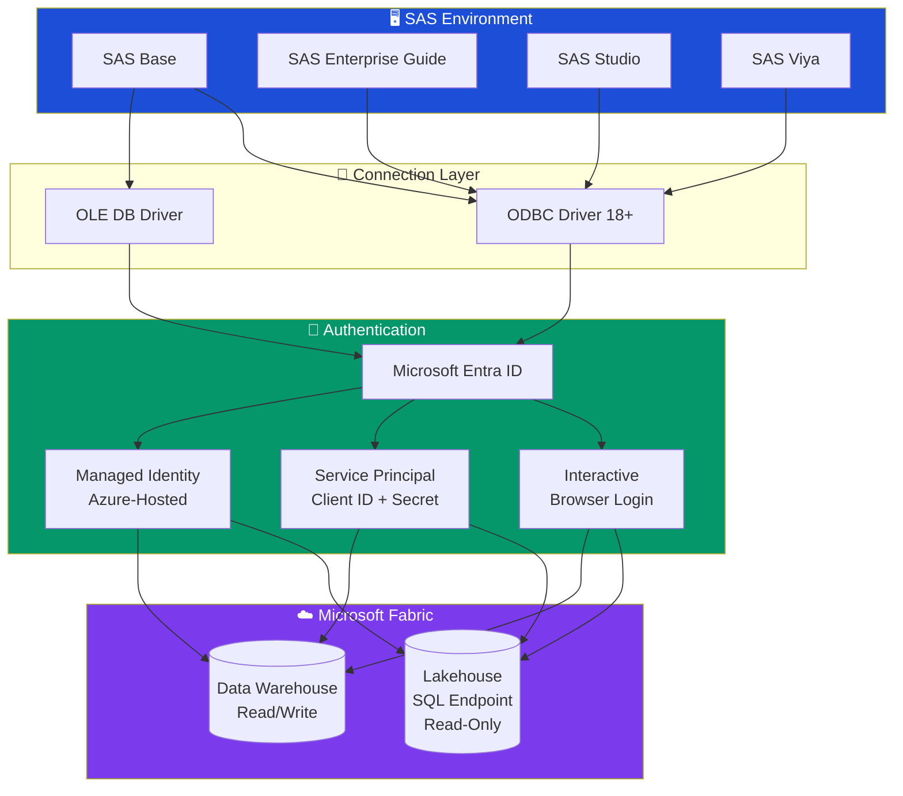

---

## 2. Authentication Flow Diagrams

### Interactive Authentication

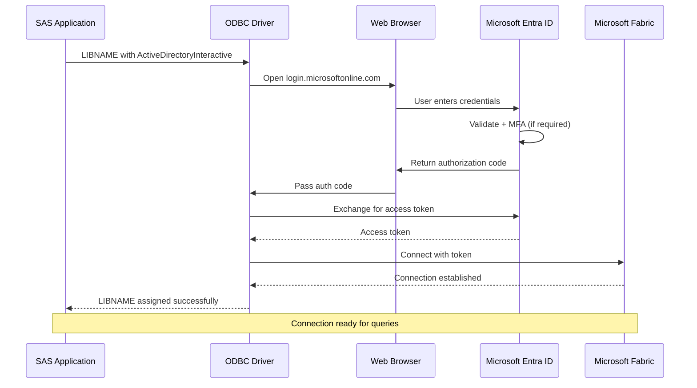

### Service Principal Authentication

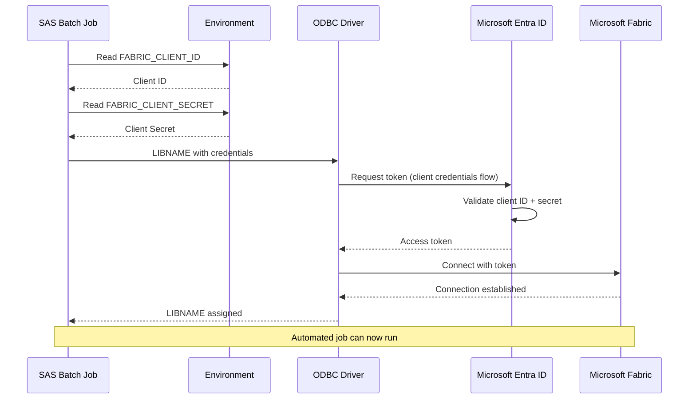

---

## 3. Data Flow Patterns

### Read Pattern (Lakehouse → SAS)

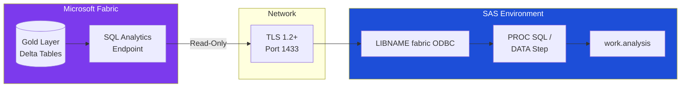

### Write Pattern (SAS → Warehouse)

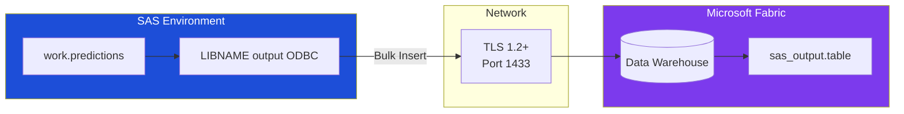

---

## 4. Casino Analytics Workflow

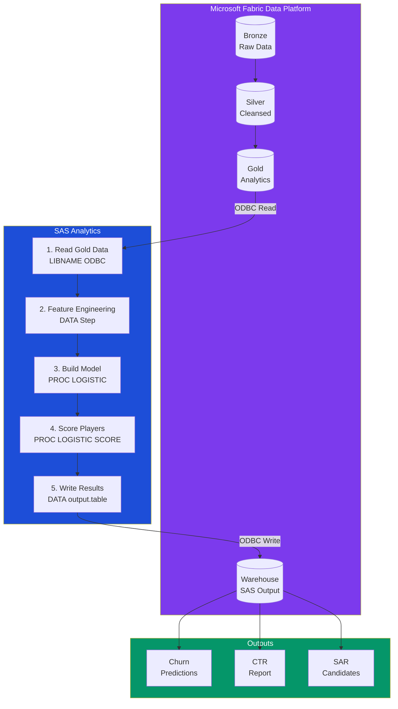

---

## 5. LIBNAME Configuration Matrix

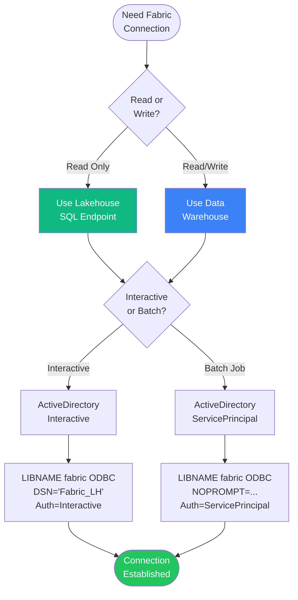

---

## 6. Pass-Through SQL Decision

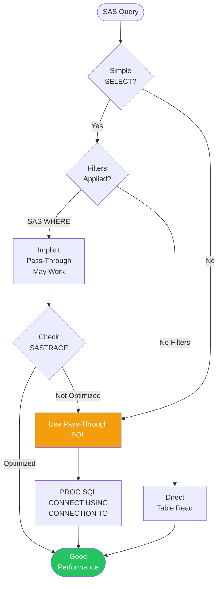

---

## 7. Troubleshooting Flowchart

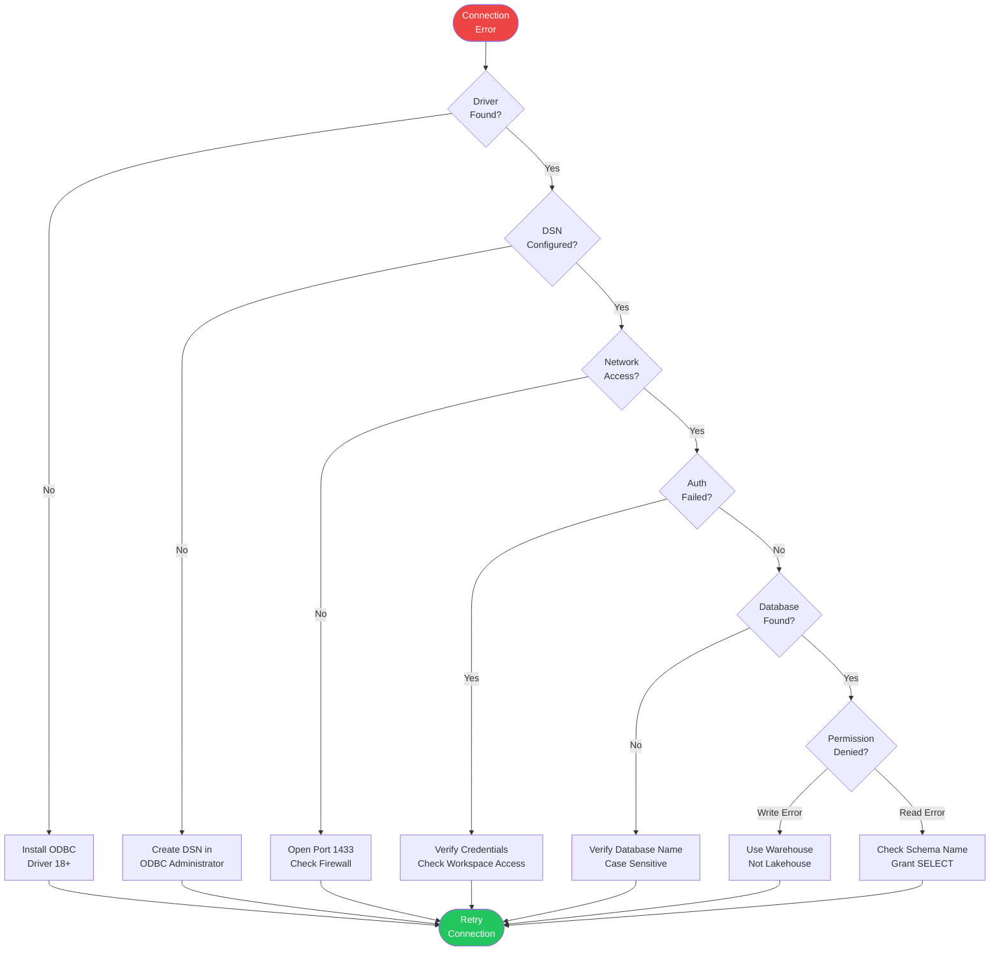

---

## 8. Performance Optimization

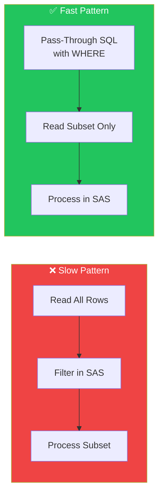

### Performance Settings

```
┌─────────────────────────────────────────────────────────────┐
│              SAS LIBNAME Performance Options                │
├─────────────────────┬───────────────────────────────────────┤
│     Option          │           Recommendation              │
├─────────────────────┼───────────────────────────────────────┤
│ READBUFF=           │ 10000-50000 (rows per fetch)          │
│ INSERTBUFF=         │ 10000 (rows per insert batch)         │
│ DBCOMMIT=           │ 0 (commit after all rows)             │
│ BULKLOAD=           │ YES (enable bulk operations)          │
│ DIRECT_SQL=         │ ALLOW (enable pass-through)           │
│ PRESERVE_COL_NAMES= │ YES (keep original names)             │
│ PRESERVE_TAB_NAMES= │ YES (keep original names)             │
└─────────────────────┴───────────────────────────────────────┘
```

---

## 9. Security Architecture

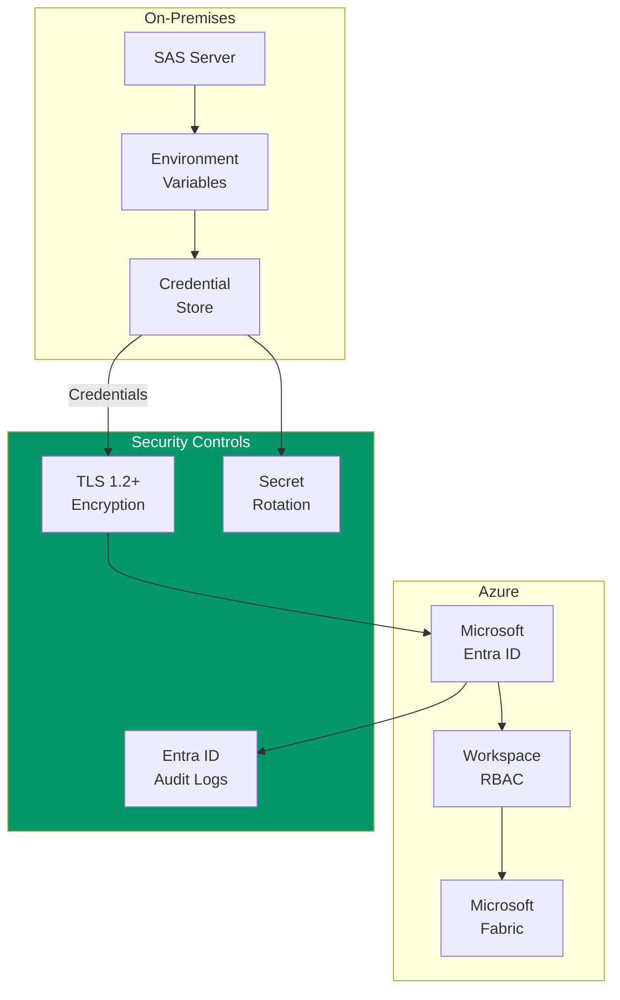

---

## 10. Complete Integration Example

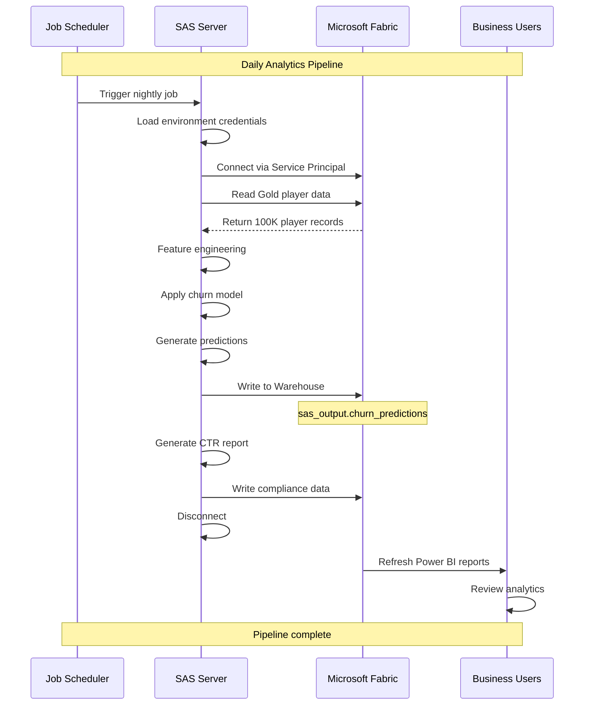
