# 🔄 Tutorial 12: CI/CD and DevOps for Microsoft Fabric

<div align="center">


</div>

> 🏠 **[Home](../../index.md)** > 📖 **[Tutorials](../index.md)** > 🔄 **CI/CD & DevOps**

---

## 🔄 Tutorial 12: CI/CD and DevOps for Microsoft Fabric

| | |
|---|---|
| **Difficulty** | ⭐⭐⭐ Advanced |
| **Time** | ⏱️ 180-240 minutes |
| **Focus** | DevOps, Automation, Deployment |

---

### 📊 Progress Tracker

```
┌────────┬────────┬────────┬────────┬────────┬────────┬────────┬────────┬────────┬────────┬────────┬────────┬────────┬────────┐
│   00   │   01   │   02   │   03   │   04   │   05   │   06   │   07   │   08   │   09   │   10   │   11   │   12   │   13   │
│ SETUP  │ BRONZE │ SILVER │  GOLD  │  RT    │  PBI   │ PIPES  │  GOV   │ MIRROR │  AI/ML │TERADATA│  SAS   │ CI/CD  │PLANNING│
├────────┼────────┼────────┼────────┼────────┼────────┼────────┼────────┼────────┼────────┼────────┼────────┼────────┼────────┤
│   ✅   │   ✅   │   ✅   │   ✅   │   ✅   │   ✅   │   ✅   │   ✅   │   ✅   │   ✅   │   ✅   │   ✅   │  🔵   │        │
└────────┴────────┴────────┴────────┴────────┴────────┴────────┴────────┴────────┴────────┴────────┴────────┴────────┴────────┘
                                                                                                              ▲
                                                                                                         YOU ARE HERE
```

| Navigation | |
|---|---|
| ⬅️ **Previous** | [11-SAS Connectivity](../11-sas-connectivity/README.md) |
| ➡️ **Next** | [13-Migration Planning](../13-migration-planning/README.md) |

---

## 📖 Overview

This tutorial provides a comprehensive guide to implementing **CI/CD (Continuous Integration/Continuous Deployment)** and **DevOps practices** for Microsoft Fabric. You'll learn how to automate deployments, manage environments, implement version control, and establish enterprise-grade deployment pipelines.

Microsoft Fabric supports multiple deployment approaches:
- **Fabric Deployment Pipelines** - Native Fabric deployment between environments
- **Git Integration** - Version control with Azure DevOps or GitHub
- **REST APIs** - Programmatic deployment automation
- **Terraform/Bicep** - Infrastructure as Code for capacity and workspace management

---

## 🎯 Learning Objectives

By the end of this tutorial, you will be able to:

- [ ] Configure Git integration for Fabric workspaces
- [ ] Set up Fabric Deployment Pipelines (Dev → Test → Prod)
- [ ] Implement Azure DevOps CI/CD pipelines for Fabric
- [ ] Create GitHub Actions workflows for Fabric deployments
- [ ] Automate notebook, pipeline, and semantic model deployments
- [ ] Implement environment-specific configurations
- [ ] Establish branching strategies and code review processes
- [ ] Set up automated testing and validation
- [ ] Monitor deployments and implement rollback procedures
- [ ] Integrate with enterprise change management processes

---

## 🏗️ CI/CD Architecture for Microsoft Fabric


*Source: [CI/CD for Pipelines in Data Factory in Microsoft Fabric](https://learn.microsoft.com/en-us/fabric/data-factory/cicd-pipelines)*


---

## 📋 Prerequisites

Before starting this tutorial, ensure you have:

- [ ] Completed [Tutorial 00-06](../00-environment-setup/README.md) (Foundation through Pipelines)
- [ ] Fabric workspace with Admin or Member permissions
- [ ] Azure DevOps organization OR GitHub account
- [ ] Fabric capacity with deployment pipelines enabled
- [ ] Understanding of Git basics (branches, commits, merges)
- [ ] Service Principal with Fabric API permissions

> 💡 **Tip:** You'll need at minimum two workspaces (Dev and Prod) to implement deployment pipelines. Three workspaces (Dev, Test, Prod) is recommended.

---

## 🛠️ Step 1: Configure Git Integration

### 1.1 Supported Git Providers

| Provider | Support Level | Features |
|----------|---------------|----------|
| **Azure DevOps** | Full | Repos, Pipelines, Boards integration |
| **GitHub** | Full | Actions, Issues, Projects integration |
| **Bitbucket** | Limited | Coming soon |
| **GitLab** | Limited | Coming soon |

### 1.2 Connect Workspace to Azure DevOps

1. Open your Fabric workspace
2. Click **Workspace settings** (gear icon)
3. Navigate to **Git integration**
4. Click **Connect**

**Configuration:**

| Setting | Value | Description |
|---------|-------|-------------|
| **Organization** | `your-org` | Azure DevOps organization |
| **Project** | `FabricAnalytics` | DevOps project name |
| **Repository** | `fabric-casino-poc` | Git repository |
| **Branch** | `main` | Branch to sync with |
| **Git folder** | `/fabric/dev` | Folder in repo for this workspace |

### 1.3 Connect Workspace to GitHub

1. Open workspace settings
2. Navigate to **Git integration**
3. Select **GitHub** as provider
4. Authenticate with GitHub

**Configuration:**

| Setting | Value |
|---------|-------|
| **Account** | `your-org` |
| **Repository** | `fabric-casino-poc` |
| **Branch** | `main` |
| **Git folder** | `/fabric/dev` |

### 1.4 Repository Structure

```
fabric-casino-poc/
├── fabric/
│   ├── dev/                          # Dev workspace items
│   │   ├── casino-lakehouse.Lakehouse/
│   │   │   └── .platform
│   │   ├── bronze-ingestion.Notebook/
│   │   │   ├── notebook-content.py
│   │   │   └── .platform
│   │   ├── daily-etl.DataPipeline/
│   │   │   ├── pipeline-content.json
│   │   │   └── .platform
│   │   └── casino-semantic.SemanticModel/
│   │       ├── model.bim
│   │       └── .platform
│   ├── test/                         # Test workspace items
│   └── prod/                         # Prod workspace items
├── scripts/
│   ├── deploy.ps1                    # Deployment scripts
│   └── validate.ps1                  # Validation scripts
├── tests/
│   ├── unit/                         # Unit tests
│   └── integration/                  # Integration tests
├── .github/
│   └── workflows/                    # GitHub Actions
├── azure-pipelines/
│   └── fabric-cicd.yml              # Azure DevOps pipelines
└── README.md
```

### 1.5 Git Sync Operations


---

## 🛠️ Step 2: Set Up Fabric Deployment Pipelines

### 2.1 Create Deployment Pipeline

1. Navigate to **Deployment pipelines** in Fabric portal
2. Click **+ New pipeline**
3. Enter pipeline name: `casino-analytics-pipeline`

### 2.2 Configure Stages

```mermaid
flowchart LR
    DEV[🔧 Development<br/>casino-dev-ws]
    TEST[🧪 Test<br/>casino-test-ws]
    PROD[🚀 Production<br/>casino-prod-ws]

    DEV -->|Deploy| TEST
    TEST -->|Deploy + Approval| PROD

    style DEV fill:#3b82f6,color:#fff
    style TEST fill:#f59e0b,color:#fff
    style PROD fill:#10b981,color:#fff
```



**Assign Workspaces:**

| Stage | Workspace | Purpose |
|-------|-----------|---------|
| **Development** | `casino-dev-ws` | Active development, feature testing |
| **Test** | `casino-test-ws` | Integration testing, UAT |
| **Production** | `casino-prod-ws` | Live production environment |

### 2.3 Configure Deployment Rules

**Item Deployment Settings:**

| Item Type | Deploy | Copy Data | Notes |
|-----------|--------|-----------|-------|
| **Lakehouses** | ✅ | ❌ | Schema only, no data |
| **Notebooks** | ✅ | N/A | Code deployment |
| **Pipelines** | ✅ | N/A | Pipeline definitions |
| **Semantic Models** | ✅ | N/A | Model schema |
| **Reports** | ✅ | N/A | Report definitions |
| **Dataflows** | ✅ | N/A | Dataflow definitions |

**Parameter Rules (Environment-Specific):**

```json
{
  "deployment_rules": [
    {
      "item_name": "daily-etl",
      "item_type": "DataPipeline",
      "parameter_name": "SourceConnectionString",
      "dev_value": "jdbc:teradata://dev-td.casino.com",
      "test_value": "jdbc:teradata://test-td.casino.com",
      "prod_value": "jdbc:teradata://prod-td.casino.com"
    },
    {
      "item_name": "casino-semantic",
      "item_type": "SemanticModel",
      "parameter_name": "LakehousePath",
      "dev_value": "casino-dev-ws/casino-lakehouse",
      "test_value": "casino-test-ws/casino-lakehouse",
      "prod_value": "casino-prod-ws/casino-lakehouse"
    }
  ]
}
```

### 2.4 Configure Approval Gates

1. Click on the stage (Test or Production)
2. Select **Deployment settings**
3. Enable **Pre-deployment approval**
4. Add approvers (users or groups)

**Approval Configuration:**

| Stage | Approval Required | Approvers | Timeout |
|-------|-------------------|-----------|---------|
| Development | No | N/A | N/A |
| Test | Optional | Dev Lead | 24 hours |
| Production | **Required** | Data Platform Team | 72 hours |

---

## 🛠️ Step 3: Azure DevOps CI/CD Pipeline

### 3.1 Service Connection Setup

Create a service connection to Fabric:

1. Azure DevOps → Project Settings → Service connections
2. New service connection → Azure Resource Manager
3. Select **Service Principal (manual)**

**Required Permissions:**
- Fabric API: `Workspace.ReadWrite.All`
- Power BI API: `Dataset.ReadWrite.All`, `Report.ReadWrite.All`

### 3.2 Azure DevOps Pipeline YAML

Create `azure-pipelines/fabric-cicd.yml`:

```yaml
# Azure DevOps CI/CD Pipeline for Microsoft Fabric
# Triggers on pushes to main and feature branches

trigger:
  branches:
    include:
      - main
      - feature/*
      - release/*
  paths:
    include:
      - fabric/**
      - scripts/**

pr:
  branches:
    include:
      - main
  paths:
    include:
      - fabric/**

variables:
  - group: fabric-variables  # Variable group with secrets
  - name: fabricWorkspaceId
    value: 'xxxxxxxx-xxxx-xxxx-xxxx-xxxxxxxxxxxx'
  - name: deploymentPipelineId
    value: 'yyyyyyyy-yyyy-yyyy-yyyy-yyyyyyyyyyyy'

stages:
  # ============================================
  # Stage 1: Build and Validate
  # ============================================
  - stage: Build
    displayName: 'Build & Validate'
    jobs:
      - job: ValidateFabricItems
        displayName: 'Validate Fabric Items'
        pool:
          vmImage: 'ubuntu-latest'
        steps:
          - checkout: self
            fetchDepth: 0

          - task: PowerShell@2
            displayName: 'Install Fabric Tools'
            inputs:
              targetType: 'inline'
              script: |
                Install-Module -Name MicrosoftPowerBIMgmt -Force -Scope CurrentUser
                Install-Module -Name Az.Accounts -Force -Scope CurrentUser

          - task: PowerShell@2
            displayName: 'Validate Notebook Syntax'
            inputs:
              filePath: 'scripts/validate-notebooks.ps1'
              arguments: '-Path fabric/dev'

          - task: PowerShell@2
            displayName: 'Validate Pipeline JSON'
            inputs:
              filePath: 'scripts/validate-pipelines.ps1'
              arguments: '-Path fabric/dev'

          - task: PowerShell@2
            displayName: 'Validate Semantic Model'
            inputs:
              filePath: 'scripts/validate-semantic-model.ps1'
              arguments: '-Path fabric/dev'

          - task: PublishBuildArtifacts@1
            displayName: 'Publish Fabric Artifacts'
            inputs:
              PathtoPublish: 'fabric'
              ArtifactName: 'fabric-items'

  # ============================================
  # Stage 2: Deploy to Test
  # ============================================
  - stage: DeployTest
    displayName: 'Deploy to Test'
    dependsOn: Build
    condition: and(succeeded(), eq(variables['Build.SourceBranch'], 'refs/heads/main'))
    jobs:
      - deployment: DeployToTest
        displayName: 'Deploy to Test Environment'
        pool:
          vmImage: 'ubuntu-latest'
        environment: 'fabric-test'
        strategy:
          runOnce:
            deploy:
              steps:
                - task: PowerShell@2
                  displayName: 'Authenticate to Fabric'
                  inputs:
                    targetType: 'inline'
                    script: |
                      $securePassword = ConvertTo-SecureString "$(servicePrincipalSecret)" -AsPlainText -Force
                      $credential = New-Object System.Management.Automation.PSCredential("$(servicePrincipalId)", $securePassword)
                      Connect-PowerBIServiceAccount -ServicePrincipal -Credential $credential -TenantId "$(tenantId)"

                - task: PowerShell@2
                  displayName: 'Trigger Deployment Pipeline - Dev to Test'
                  inputs:
                    filePath: 'scripts/deploy-fabric.ps1'
                    arguments: >
                      -PipelineId "$(deploymentPipelineId)"
                      -SourceStage "Development"
                      -TargetStage "Test"
                      -WaitForCompletion $true

                - task: PowerShell@2
                  displayName: 'Run Integration Tests'
                  inputs:
                    filePath: 'tests/integration/run-tests.ps1'
                    arguments: '-Environment Test'

  # ============================================
  # Stage 3: Deploy to Production
  # ============================================
  - stage: DeployProd
    displayName: 'Deploy to Production'
    dependsOn: DeployTest
    condition: succeeded()
    jobs:
      - deployment: DeployToProduction
        displayName: 'Deploy to Production Environment'
        pool:
          vmImage: 'ubuntu-latest'
        environment: 'fabric-production'  # Requires approval
        strategy:
          runOnce:
            deploy:
              steps:
                - task: PowerShell@2
                  displayName: 'Authenticate to Fabric'
                  inputs:
                    targetType: 'inline'
                    script: |
                      $securePassword = ConvertTo-SecureString "$(servicePrincipalSecret)" -AsPlainText -Force
                      $credential = New-Object System.Management.Automation.PSCredential("$(servicePrincipalId)", $securePassword)
                      Connect-PowerBIServiceAccount -ServicePrincipal -Credential $credential -TenantId "$(tenantId)"

                - task: PowerShell@2
                  displayName: 'Pre-Deployment Backup'
                  inputs:
                    filePath: 'scripts/backup-workspace.ps1'
                    arguments: '-WorkspaceId "$(prodWorkspaceId)"'

                - task: PowerShell@2
                  displayName: 'Trigger Deployment Pipeline - Test to Prod'
                  inputs:
                    filePath: 'scripts/deploy-fabric.ps1'
                    arguments: >
                      -PipelineId "$(deploymentPipelineId)"
                      -SourceStage "Test"
                      -TargetStage "Production"
                      -WaitForCompletion $true

                - task: PowerShell@2
                  displayName: 'Post-Deployment Validation'
                  inputs:
                    filePath: 'scripts/validate-deployment.ps1'
                    arguments: '-WorkspaceId "$(prodWorkspaceId)"'

                - task: PowerShell@2
                  displayName: 'Refresh Semantic Model'
                  inputs:
                    filePath: 'scripts/refresh-semantic-model.ps1'
                    arguments: '-WorkspaceId "$(prodWorkspaceId)" -DatasetName "casino-semantic"'
```

### 3.3 Deployment Script (PowerShell)

Create `scripts/deploy-fabric.ps1`:

```powershell
<#
.SYNOPSIS
    Triggers a Fabric Deployment Pipeline deployment.

.PARAMETER PipelineId
    The deployment pipeline GUID.

.PARAMETER SourceStage
    Source stage name (Development, Test).

.PARAMETER TargetStage
    Target stage name (Test, Production).

.PARAMETER WaitForCompletion
    Wait for deployment to complete.
#>

param(
    [Parameter(Mandatory=$true)]
    [string]$PipelineId,

    [Parameter(Mandatory=$true)]
    [ValidateSet("Development", "Test")]
    [string]$SourceStage,

    [Parameter(Mandatory=$true)]
    [ValidateSet("Test", "Production")]
    [string]$TargetStage,

    [Parameter(Mandatory=$false)]
    [bool]$WaitForCompletion = $true
)

# Stage order mapping
$stageOrder = @{
    "Development" = 0
    "Test" = 1
    "Production" = 2
}

$sourceStageOrder = $stageOrder[$SourceStage]
$targetStageOrder = $stageOrder[$TargetStage]

Write-Host "Starting deployment from $SourceStage to $TargetStage..."

# Get access token
$token = (Get-PowerBIAccessToken -AsString).Replace("Bearer ", "")

$headers = @{
    "Authorization" = "Bearer $token"
    "Content-Type" = "application/json"
}

# Build deployment request
$deployRequest = @{
    sourceStageOrder = $sourceStageOrder
    isBackwardDeployment = $false
    newWorkspace = $null
    options = @{
        allowCreateArtifact = $true
        allowOverwriteArtifact = $true
        allowOverwriteTargetArtifactLabel = $true
        allowPurgeData = $false
        allowSkipTilesWithMissingPrerequisites = $true
        allowTakeOver = $true
    }
}

$body = $deployRequest | ConvertTo-Json -Depth 10

# Trigger deployment
$deployUri = "https://api.fabric.microsoft.com/v1/deploymentPipelines/$PipelineId/deploy"

try {
    $response = Invoke-RestMethod -Uri $deployUri -Method Post -Headers $headers -Body $body
    $operationId = $response.id
    Write-Host "Deployment triggered. Operation ID: $operationId"
}
catch {
    Write-Error "Failed to trigger deployment: $_"
    exit 1
}

# Wait for completion if requested
if ($WaitForCompletion) {
    $maxWaitMinutes = 30
    $waitIntervalSeconds = 30
    $elapsed = 0

    Write-Host "Waiting for deployment to complete..."

    while ($elapsed -lt ($maxWaitMinutes * 60)) {
        Start-Sleep -Seconds $waitIntervalSeconds
        $elapsed += $waitIntervalSeconds

        $statusUri = "https://api.fabric.microsoft.com/v1/deploymentPipelines/$PipelineId/operations/$operationId"
        $status = Invoke-RestMethod -Uri $statusUri -Method Get -Headers $headers

        Write-Host "Status: $($status.state) ($(($elapsed/60).ToString('F1')) minutes elapsed)"

        if ($status.state -eq "Succeeded") {
            Write-Host "Deployment completed successfully!"
            exit 0
        }
        elseif ($status.state -eq "Failed") {
            Write-Error "Deployment failed!"
            Write-Error ($status.error | ConvertTo-Json -Depth 5)
            exit 1
        }
    }

    Write-Error "Deployment timed out after $maxWaitMinutes minutes"
    exit 1
}

Write-Host "Deployment triggered successfully"
```

---

## 🛠️ Step 4: GitHub Actions Workflow

### 4.1 GitHub Actions Workflow

Create `.github/workflows/fabric-cicd.yml`:

```yaml
# GitHub Actions CI/CD Pipeline for Microsoft Fabric

name: Fabric CI/CD

on:
  push:
    branches:
      - main
      - 'feature/**'
    paths:
      - 'fabric/**'
      - 'scripts/**'
      - '.github/workflows/**'
  pull_request:
    branches:
      - main
    paths:
      - 'fabric/**'

env:
  FABRIC_WORKSPACE_ID: ${{ secrets.FABRIC_WORKSPACE_ID }}
  DEPLOYMENT_PIPELINE_ID: ${{ secrets.DEPLOYMENT_PIPELINE_ID }}

jobs:
  # ============================================
  # Job 1: Validate
  # ============================================
  validate:
    name: Validate Fabric Items
    runs-on: ubuntu-latest
    steps:
      - name: Checkout Repository
        uses: actions/checkout@v4
        with:
          fetch-depth: 0

      - name: Setup Python
        uses: actions/setup-python@v5
        with:
          python-version: '3.11'

      - name: Install Dependencies
        run: |
          pip install pyspark pytest great-expectations
          pip install azure-identity msal

      - name: Validate Notebook Syntax
        run: |
          python scripts/validate_notebooks.py --path fabric/dev

      - name: Validate Pipeline JSON
        run: |
          python scripts/validate_pipelines.py --path fabric/dev

      - name: Run Unit Tests
        run: |
          pytest tests/unit/ -v --junitxml=test-results.xml

      - name: Upload Test Results
        uses: actions/upload-artifact@v4
        if: always()
        with:
          name: test-results
          path: test-results.xml

      - name: Upload Fabric Artifacts
        uses: actions/upload-artifact@v4
        with:
          name: fabric-items
          path: fabric/

  # ============================================
  # Job 2: Deploy to Test
  # ============================================
  deploy-test:
    name: Deploy to Test
    needs: validate
    if: github.ref == 'refs/heads/main' && github.event_name == 'push'
    runs-on: ubuntu-latest
    environment: test
    steps:
      - name: Checkout Repository
        uses: actions/checkout@v4

      - name: Download Artifacts
        uses: actions/download-artifact@v4
        with:
          name: fabric-items
          path: fabric/

      - name: Setup PowerShell
        uses: azure/powershell@v2
        with:
          azPSVersion: 'latest'
          inlineScript: |
            Install-Module -Name MicrosoftPowerBIMgmt -Force -Scope CurrentUser

      - name: Authenticate to Fabric
        uses: azure/powershell@v2
        with:
          azPSVersion: 'latest'
          inlineScript: |
            $securePassword = ConvertTo-SecureString "${{ secrets.SERVICE_PRINCIPAL_SECRET }}" -AsPlainText -Force
            $credential = New-Object System.Management.Automation.PSCredential("${{ secrets.SERVICE_PRINCIPAL_ID }}", $securePassword)
            Connect-PowerBIServiceAccount -ServicePrincipal -Credential $credential -TenantId "${{ secrets.TENANT_ID }}"

      - name: Deploy to Test
        uses: azure/powershell@v2
        with:
          azPSVersion: 'latest'
          inlineScript: |
            ./scripts/deploy-fabric.ps1 `
              -PipelineId "${{ secrets.DEPLOYMENT_PIPELINE_ID }}" `
              -SourceStage "Development" `
              -TargetStage "Test" `
              -WaitForCompletion $true

      - name: Run Integration Tests
        run: |
          python tests/integration/run_tests.py --environment test

  # ============================================
  # Job 3: Deploy to Production
  # ============================================
  deploy-production:
    name: Deploy to Production
    needs: deploy-test
    if: github.ref == 'refs/heads/main' && github.event_name == 'push'
    runs-on: ubuntu-latest
    environment: production  # Requires approval
    steps:
      - name: Checkout Repository
        uses: actions/checkout@v4

      - name: Setup PowerShell
        uses: azure/powershell@v2
        with:
          azPSVersion: 'latest'
          inlineScript: |
            Install-Module -Name MicrosoftPowerBIMgmt -Force -Scope CurrentUser

      - name: Authenticate to Fabric
        uses: azure/powershell@v2
        with:
          azPSVersion: 'latest'
          inlineScript: |
            $securePassword = ConvertTo-SecureString "${{ secrets.SERVICE_PRINCIPAL_SECRET }}" -AsPlainText -Force
            $credential = New-Object System.Management.Automation.PSCredential("${{ secrets.SERVICE_PRINCIPAL_ID }}", $securePassword)
            Connect-PowerBIServiceAccount -ServicePrincipal -Credential $credential -TenantId "${{ secrets.TENANT_ID }}"

      - name: Pre-Deployment Backup
        uses: azure/powershell@v2
        with:
          azPSVersion: 'latest'
          inlineScript: |
            ./scripts/backup-workspace.ps1 -WorkspaceId "${{ secrets.PROD_WORKSPACE_ID }}"

      - name: Deploy to Production
        uses: azure/powershell@v2
        with:
          azPSVersion: 'latest'
          inlineScript: |
            ./scripts/deploy-fabric.ps1 `
              -PipelineId "${{ secrets.DEPLOYMENT_PIPELINE_ID }}" `
              -SourceStage "Test" `
              -TargetStage "Production" `
              -WaitForCompletion $true

      - name: Post-Deployment Validation
        uses: azure/powershell@v2
        with:
          azPSVersion: 'latest'
          inlineScript: |
            ./scripts/validate-deployment.ps1 -WorkspaceId "${{ secrets.PROD_WORKSPACE_ID }}"

      - name: Notify on Success
        if: success()
        uses: slackapi/slack-github-action@v1
        with:
          payload: |
            {
              "text": "✅ Fabric deployment to Production completed successfully!"
            }
        env:
          SLACK_WEBHOOK_URL: ${{ secrets.SLACK_WEBHOOK }}

      - name: Notify on Failure
        if: failure()
        uses: slackapi/slack-github-action@v1
        with:
          payload: |
            {
              "text": "❌ Fabric deployment to Production failed! Check GitHub Actions for details."
            }
        env:
          SLACK_WEBHOOK_URL: ${{ secrets.SLACK_WEBHOOK }}
```

---

## 🛠️ Step 5: Branching Strategy

### 5.1 Recommended Git Flow for Fabric


### 5.2 Branch Policies

| Branch | Purpose | Protection Rules |
|--------|---------|------------------|
| `main` | Production-ready code | Require PR, require approvals, require status checks |
| `develop` | Integration branch | Require PR, require status checks |
| `feature/*` | Feature development | No protection, linked to Dev workspace |
| `release/*` | Release preparation | Require approvals |
| `hotfix/*` | Production fixes | Require approvals, fast-track process |

### 5.3 Workspace-Branch Mapping

| Workspace | Git Branch | Sync Mode |
|-----------|------------|-----------|
| `casino-dev-ws` | `develop` | Bidirectional |
| `casino-test-ws` | `release/*` | Pull only |
| `casino-prod-ws` | `main` | Pull only (via deployment pipeline) |

---

## 🛠️ Step 6: Automated Testing

### 6.1 Test Strategy


### 6.2 Notebook Validation Script

Create `scripts/validate_notebooks.py`:

```python
"""
Validate Fabric notebook syntax and structure.
"""

import os
import json
import argparse
import ast
from pathlib import Path
from typing import List, Tuple


def validate_python_syntax(code: str, filename: str) -> Tuple[bool, str]:
    """Validate Python syntax in notebook cells."""
    try:
        ast.parse(code)
        return True, ""
    except SyntaxError as e:
        return False, f"{filename}: Syntax error at line {e.lineno}: {e.msg}"


def validate_notebook(notebook_path: Path) -> List[str]:
    """Validate a Fabric notebook."""
    errors = []

    # Check for notebook content file
    content_file = notebook_path / "notebook-content.py"
    if not content_file.exists():
        # Try JSON format
        content_file = notebook_path / "notebook-content.json"

    if not content_file.exists():
        errors.append(f"{notebook_path}: Missing notebook content file")
        return errors

    # Validate Python syntax
    if content_file.suffix == ".py":
        with open(content_file, 'r', encoding='utf-8') as f:
            code = f.read()

        # Skip magic commands for syntax check
        lines = []
        for line in code.split('\n'):
            if not line.strip().startswith('%') and not line.strip().startswith('!'):
                lines.append(line)
            else:
                lines.append('')  # Preserve line numbers

        valid, error = validate_python_syntax('\n'.join(lines), str(content_file))
        if not valid:
            errors.append(error)

    # Check for .platform file
    platform_file = notebook_path / ".platform"
    if not platform_file.exists():
        errors.append(f"{notebook_path}: Missing .platform metadata file")

    return errors


def main():
    parser = argparse.ArgumentParser(description='Validate Fabric notebooks')
    parser.add_argument('--path', required=True, help='Path to fabric items')
    args = parser.parse_args()

    root_path = Path(args.path)
    all_errors = []

    # Find all notebook directories
    for item in root_path.iterdir():
        if item.is_dir() and item.name.endswith('.Notebook'):
            errors = validate_notebook(item)
            all_errors.extend(errors)

    if all_errors:
        print("Validation FAILED:")
        for error in all_errors:
            print(f"  ❌ {error}")
        exit(1)
    else:
        print("✅ All notebooks validated successfully")
        exit(0)


if __name__ == "__main__":
    main()
```

### 6.3 Data Quality Tests

Create `tests/integration/test_data_quality.py`:

```python
"""
Integration tests for Fabric data quality.
"""

import pytest
from great_expectations import DataContext
from pyspark.sql import SparkSession


class TestBronzeDataQuality:
    """Test Bronze layer data quality."""

    @pytest.fixture
    def spark(self):
        return SparkSession.builder.getOrCreate()

    def test_slot_transactions_not_empty(self, spark):
        """Verify slot_transactions has data."""
        df = spark.table("bronze.slot_transactions")
        assert df.count() > 0, "slot_transactions should not be empty"

    def test_slot_transactions_no_nulls_in_keys(self, spark):
        """Verify no null values in key columns."""
        df = spark.table("bronze.slot_transactions")
        null_count = df.filter(
            df.transaction_id.isNull() | df.machine_id.isNull()
        ).count()
        assert null_count == 0, f"Found {null_count} null values in key columns"

    def test_slot_transactions_valid_amounts(self, spark):
        """Verify coin_in and coin_out are non-negative."""
        df = spark.table("bronze.slot_transactions")
        invalid = df.filter((df.coin_in < 0) | (df.coin_out < 0)).count()
        assert invalid == 0, f"Found {invalid} records with negative amounts"


class TestSilverDataQuality:
    """Test Silver layer data quality."""

    @pytest.fixture
    def spark(self):
        return SparkSession.builder.getOrCreate()

    def test_silver_deduplication(self, spark):
        """Verify Silver layer has no duplicates."""
        df = spark.table("silver.slot_transactions")
        total = df.count()
        unique = df.dropDuplicates(["transaction_id"]).count()
        assert total == unique, f"Found {total - unique} duplicate records"

    def test_silver_data_completeness(self, spark):
        """Verify Silver layer has all required columns populated."""
        df = spark.table("silver.slot_transactions")

        required_columns = [
            "transaction_id", "player_id", "machine_id",
            "transaction_timestamp", "coin_in", "coin_out"
        ]

        for col in required_columns:
            null_pct = df.filter(df[col].isNull()).count() / df.count() * 100
            assert null_pct < 5, f"{col} has {null_pct:.1f}% null values"


class TestGoldDataQuality:
    """Test Gold layer data quality."""

    @pytest.fixture
    def spark(self):
        return SparkSession.builder.getOrCreate()

    def test_gold_player_360_complete(self, spark):
        """Verify Gold player 360 has all players."""
        bronze_players = spark.table("bronze.player_sessions") \
            .select("player_id").distinct().count()
        gold_players = spark.table("gold.gold_player_360") \
            .select("player_id").distinct().count()

        assert gold_players >= bronze_players * 0.95, \
            f"Gold layer missing players: {gold_players} vs {bronze_players}"

    def test_gold_metrics_reasonable(self, spark):
        """Verify Gold metrics are within reasonable ranges."""
        df = spark.table("gold.gold_player_360")

        # Lifetime value should be positive
        negative_ltv = df.filter(df.lifetime_value < 0).count()
        assert negative_ltv == 0, f"Found {negative_ltv} negative lifetime values"

        # Session count should be positive
        zero_sessions = df.filter(df.total_sessions <= 0).count()
        assert zero_sessions == 0, f"Found {zero_sessions} players with zero sessions"
```

---

## 🛠️ Step 7: Rollback Procedures

### 7.1 Rollback Strategy


### 7.2 Rollback Script

Create `scripts/rollback-deployment.ps1`:

```powershell
<#
.SYNOPSIS
    Rollback Fabric deployment to previous version.

.PARAMETER PipelineId
    Deployment pipeline GUID.

.PARAMETER TargetStage
    Stage to rollback (Test, Production).

.PARAMETER RollbackType
    Type of rollback: Full, Partial, or ItemLevel.
#>

param(
    [Parameter(Mandatory=$true)]
    [string]$PipelineId,

    [Parameter(Mandatory=$true)]
    [ValidateSet("Test", "Production")]
    [string]$TargetStage,

    [Parameter(Mandatory=$false)]
    [ValidateSet("Full", "Partial", "ItemLevel")]
    [string]$RollbackType = "Full",

    [Parameter(Mandatory=$false)]
    [string[]]$ItemsToRollback
)

Write-Host "========================================"
Write-Host "  FABRIC ROLLBACK PROCEDURE"
Write-Host "========================================"
Write-Host "Target Stage: $TargetStage"
Write-Host "Rollback Type: $RollbackType"
Write-Host ""

# Get access token
$token = (Get-PowerBIAccessToken -AsString).Replace("Bearer ", "")
$headers = @{
    "Authorization" = "Bearer $token"
    "Content-Type" = "application/json"
}

# Get pipeline stages
$pipelineUri = "https://api.fabric.microsoft.com/v1/deploymentPipelines/$PipelineId"
$pipeline = Invoke-RestMethod -Uri $pipelineUri -Method Get -Headers $headers

# Find source stage (one before target)
$stageOrder = @{ "Development" = 0; "Test" = 1; "Production" = 2 }
$targetOrder = $stageOrder[$TargetStage]
$sourceStage = ($stageOrder.GetEnumerator() | Where-Object { $_.Value -eq ($targetOrder - 1) }).Key

if (-not $sourceStage) {
    Write-Error "Cannot rollback Development stage"
    exit 1
}

Write-Host "Rolling back from $TargetStage to $sourceStage state..."

switch ($RollbackType) {
    "Full" {
        # Full rollback - redeploy from source
        Write-Host "Performing FULL rollback..."

        $deployRequest = @{
            sourceStageOrder = $stageOrder[$sourceStage]
            isBackwardDeployment = $true
            options = @{
                allowOverwriteArtifact = $true
                allowPurgeData = $false
            }
        }

        $body = $deployRequest | ConvertTo-Json -Depth 10
        $deployUri = "https://api.fabric.microsoft.com/v1/deploymentPipelines/$PipelineId/deploy"

        $response = Invoke-RestMethod -Uri $deployUri -Method Post -Headers $headers -Body $body
        Write-Host "Rollback initiated. Operation ID: $($response.id)"
    }

    "Partial" {
        Write-Host "Performing PARTIAL rollback for specified items..."
        # Implement partial rollback logic
    }

    "ItemLevel" {
        Write-Host "Performing ITEM-LEVEL rollback..."
        foreach ($item in $ItemsToRollback) {
            Write-Host "  Restoring: $item"
            # Implement item-level restore from Git history
        }
    }
}

Write-Host ""
Write-Host "========================================"
Write-Host "  ROLLBACK COMPLETE"
Write-Host "========================================"
Write-Host ""
Write-Host "NEXT STEPS:"
Write-Host "  1. Verify system functionality"
Write-Host "  2. Run integration tests"
Write-Host "  3. Notify stakeholders"
Write-Host "  4. Document incident"
```

---

## 🛠️ Step 8: Environment Configuration

### 8.1 Environment Variables

| Variable | Development | Test | Production |
|----------|-------------|------|------------|
| `FABRIC_WORKSPACE_ID` | `dev-ws-guid` | `test-ws-guid` | `prod-ws-guid` |
| `LAKEHOUSE_NAME` | `lh_casino_dev` | `lh_casino_test` | `lh_casino_prod` |
| `TERADATA_SERVER` | `dev-td.casino.com` | `test-td.casino.com` | `prod-td.casino.com` |
| `LOG_LEVEL` | `DEBUG` | `INFO` | `WARNING` |
| `ENABLE_PROFILING` | `true` | `true` | `false` |

### 8.2 Parameter Files

Create `config/parameters.dev.json`:

```json
{
  "environment": "development",
  "workspace": {
    "id": "xxxxxxxx-xxxx-xxxx-xxxx-xxxxxxxxxxxx",
    "name": "casino-dev-ws"
  },
  "lakehouse": {
    "name": "lh_casino_dev",
    "bronze_schema": "bronze",
    "silver_schema": "silver",
    "gold_schema": "gold"
  },
  "connections": {
    "teradata": {
      "server": "dev-td.casino.com",
      "database": "CASINO_DW"
    },
    "eventhub": {
      "namespace": "eh-casino-dev",
      "name": "slot-events"
    }
  },
  "settings": {
    "batch_size": 10000,
    "log_level": "DEBUG",
    "enable_profiling": true,
    "retention_days": 7
  }
}
```

Create `config/parameters.prod.json`:

```json
{
  "environment": "production",
  "workspace": {
    "id": "yyyyyyyy-yyyy-yyyy-yyyy-yyyyyyyyyyyy",
    "name": "casino-prod-ws"
  },
  "lakehouse": {
    "name": "lh_casino_prod",
    "bronze_schema": "bronze",
    "silver_schema": "silver",
    "gold_schema": "gold"
  },
  "connections": {
    "teradata": {
      "server": "prod-td.casino.com",
      "database": "CASINO_DW"
    },
    "eventhub": {
      "namespace": "eh-casino-prod",
      "name": "slot-events"
    }
  },
  "settings": {
    "batch_size": 100000,
    "log_level": "WARNING",
    "enable_profiling": false,
    "retention_days": 365
  }
}
```

---

## ✅ Validation Checklist

Before using CI/CD in production, verify:

- [ ] **Git Integration** - Workspace connected to repository
- [ ] **Deployment Pipeline** - All stages configured
- [ ] **Service Principal** - Authenticated with correct permissions
- [ ] **CI Pipeline** - Build and validation working
- [ ] **CD Pipeline** - Deployment to Test working
- [ ] **Approval Gates** - Production approvals configured
- [ ] **Rollback Tested** - Rollback procedure validated
- [ ] **Monitoring** - Deployment alerts configured
- [ ] **Documentation** - Runbooks updated

---

## 🔧 Troubleshooting

| Issue | Cause | Solution |
|-------|-------|----------|
| Git sync fails | Permission denied | Check workspace role (Admin/Member) |
| Deployment stuck | Conflicting items | Clear target workspace conflicts |
| Pipeline timeout | Large semantic model | Increase timeout, optimize model |
| Auth failure | Token expired | Refresh service principal |
| Missing items | Git folder mismatch | Verify Git folder path in settings |

---

## 📚 Best Practices

1. **Use Separate Workspaces** - Never deploy directly to production
2. **Implement Approval Gates** - Require human approval for production
3. **Automate Testing** - Run tests on every commit
4. **Version Everything** - Keep all artifacts in Git
5. **Document Deployments** - Log all changes and approvals
6. **Plan for Rollback** - Always have a rollback plan
7. **Monitor Deployments** - Set up alerts for failures
8. **Use Parameter Files** - Externalize environment-specific configs
9. **Secure Secrets** - Use Key Vault for credentials
10. **Review Before Deploy** - Require code reviews for all changes

---

## 🎉 Summary

You have learned to implement comprehensive CI/CD for Microsoft Fabric:

- ✅ Configure Git integration with Azure DevOps and GitHub
- ✅ Set up Fabric Deployment Pipelines
- ✅ Create Azure DevOps and GitHub Actions workflows
- ✅ Implement automated testing and validation
- ✅ Configure environment-specific parameters
- ✅ Establish rollback procedures
- ✅ Follow enterprise DevOps best practices

---

## ➡️ Next Steps

Continue to **[Tutorial 13: Migration Planning & Delivery](../13-migration-planning/README.md)** to learn how to plan and execute a full enterprise migration to Microsoft Fabric.

---

## 📁 Included Resources

This tutorial includes the following deployment scripts:

| Script | Description |
|--------|-------------|
| [`scripts/deploy-fabric.ps1`](./scripts/deploy-fabric.ps1) | Trigger Fabric Deployment Pipeline deployments |
| [`scripts/rollback-deployment.ps1`](./scripts/rollback-deployment.ps1) | Rollback deployments to previous versions |
| [`scripts/backup-workspace.ps1`](./scripts/backup-workspace.ps1) | Backup workspace items before deployment |
| [`scripts/validate-deployment.ps1`](./scripts/validate-deployment.ps1) | Post-deployment validation checks |
| [`scripts/validate_notebooks.py`](./scripts/validate_notebooks.py) | Python script to validate notebook syntax |

---

## 📚 Additional Resources

- [Fabric Git Integration](https://learn.microsoft.com/fabric/cicd/git-integration/intro-to-git-integration)
- [Deployment Pipelines](https://learn.microsoft.com/fabric/cicd/deployment-pipelines/intro-to-deployment-pipelines)
- [Fabric REST APIs](https://learn.microsoft.com/rest/api/fabric/articles/)
- [Azure DevOps Pipelines](https://learn.microsoft.com/azure/devops/pipelines/)
- [GitHub Actions](https://docs.github.com/en/actions)

---

## 🧭 Navigation

| ⬅️ Previous | ⬆️ Up | ➡️ Next |
|------------|------|--------|
| [11-SAS Connectivity](../11-sas-connectivity/README.md) | [Tutorials Index](../index.md) | [13-Migration Planning](../13-migration-planning/README.md) |
