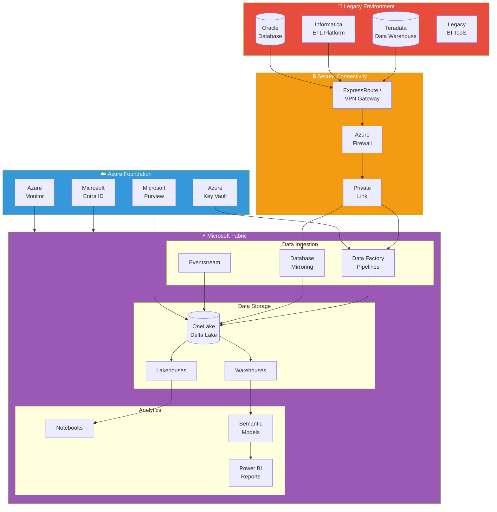
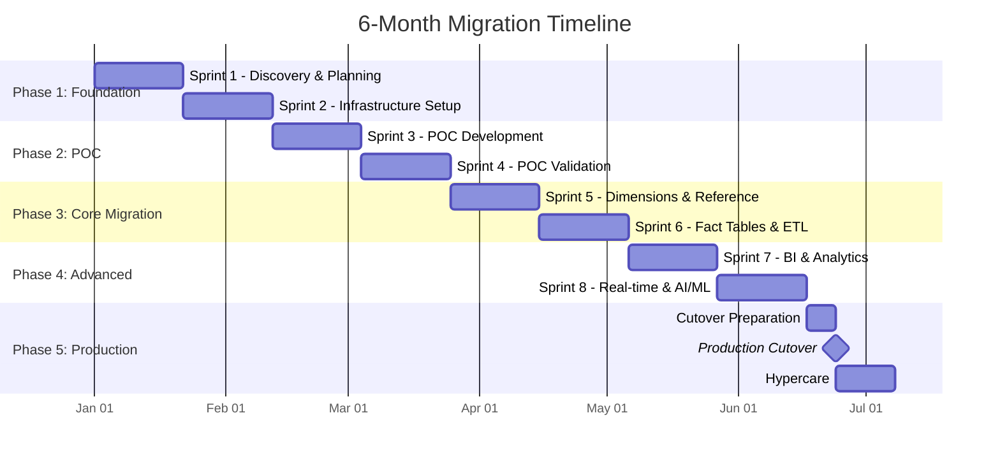
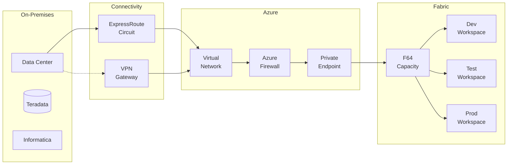
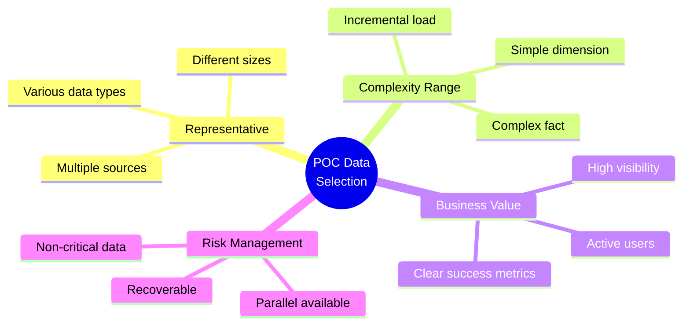
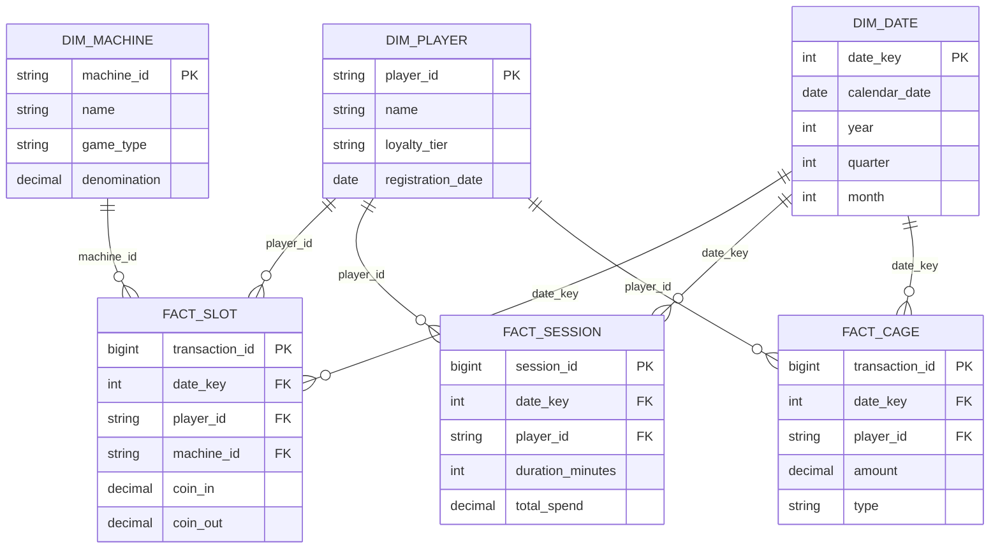
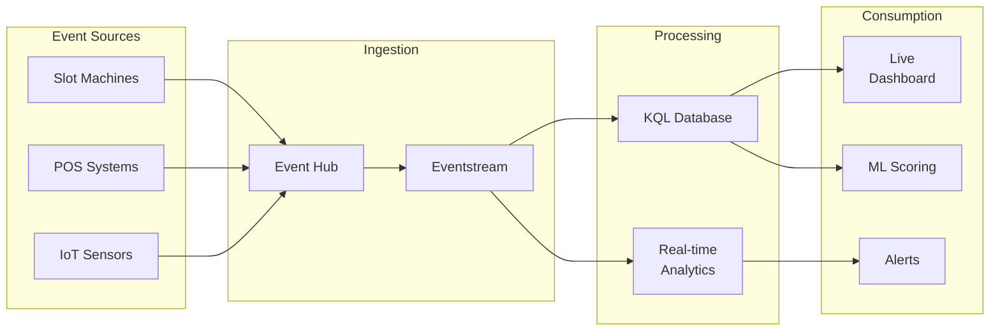
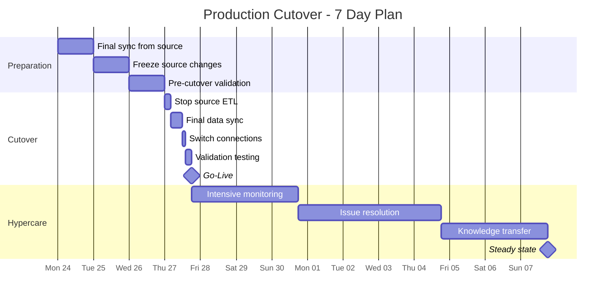
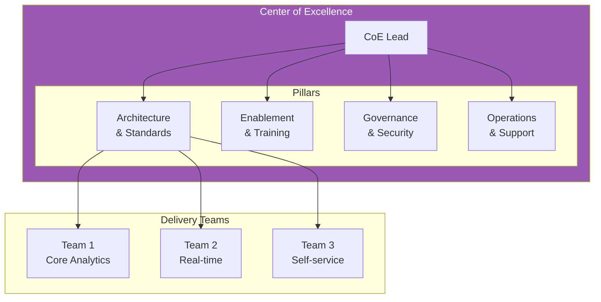

# 📋 Tutorial 13: Enterprise Migration Planning & Delivery

<div align="center">


</div>

> 🏠 **[Home](../../README.md)** > 📖 **[Tutorials](../README.md)** > 📋 **Migration Planning**

---

## 📋 Tutorial 13: Enterprise Migration Planning & Delivery

| | |
|---|---|
| **Difficulty** | ⭐⭐⭐⭐ Expert |
| **Scope** | Full Migration Guide |
| **Focus** | Planning, Execution, Production |

---

### 📊 Progress Tracker

```
┌────────┬────────┬────────┬────────┬────────┬────────┬────────┬────────┬────────┬────────┬────────┬────────┬────────┬────────┐
│   00   │   01   │   02   │   03   │   04   │   05   │   06   │   07   │   08   │   09   │   10   │   11   │   12   │   13   │
│ SETUP  │ BRONZE │ SILVER │  GOLD  │  RT    │  PBI   │ PIPES  │  GOV   │ MIRROR │  AI/ML │TERADATA│  SAS   │ CI/CD  │PLANNING│
├────────┼────────┼────────┼────────┼────────┼────────┼────────┼────────┼────────┼────────┼────────┼────────┼────────┼────────┤
│   ✅   │   ✅   │   ✅   │   ✅   │   ✅   │   ✅   │   ✅   │   ✅   │   ✅   │   ✅   │   ✅   │   ✅   │   ✅   │  🔵   │
└────────┴────────┴────────┴────────┴────────┴────────┴────────┴────────┴────────┴────────┴────────┴────────┴────────┴────────┘
                                                                                                                        ▲
                                                                                                                   YOU ARE HERE
                                                                                                               FINAL TUTORIAL
```

| Navigation | |
|---|---|
| ⬅️ **Previous** | [12-CI/CD DevOps](../12-cicd-devops/README.md) |
| ➡️ **Next** | [Tutorials Home](../README.md) |

---

## 📖 Overview

This comprehensive guide provides everything needed to plan, execute, and deliver a **full enterprise migration** from legacy data platforms (Teradata, Informatica, Oracle, etc.) to **Microsoft Fabric**. It includes:

- **6-month migration timeline** with 3-week sprint cadence
- **POC to Production** complete journey
- **Enterprise considerations**: VPN, ExpressRoute, access control, security
- **Center of Excellence** establishment
- **Organizational change management**
- **Best practices and lessons learned**

This guide is designed for Data Platform Architects, Program Managers, and Technical Leads responsible for large-scale data modernization initiatives.

---

## 🎯 Migration Objectives

### Business Objectives

| Objective | Target | Measurement |
|-----------|--------|-------------|
| **Cost Reduction** | 40-60% TCO reduction | Annual infrastructure spend |
| **Time to Insight** | 10x faster analytics | Query response time, report refresh |
| **Operational Efficiency** | 50% less maintenance | Support tickets, manual interventions |
| **Data Democratization** | 3x more users | Active analytics users |
| **Innovation Enablement** | New AI/ML capabilities | Use cases enabled |

### Technical Objectives

| Objective | Target | Measurement |
|-----------|--------|-------------|
| **Data Migration** | 100% data accuracy | Row counts, checksums |
| **Workload Migration** | 95% queries functional | Query success rate |
| **Performance** | ≤120% of source | Benchmark query times |
| **Availability** | 99.9% uptime | SLA compliance |
| **Security** | Zero breaches | Security incidents |

---

## 🏗️ Migration Architecture



---

## 📅 6-Month Migration Timeline

### Sprint Cadence

| Sprint | Duration | Focus |
|--------|----------|-------|
| Each Sprint | 3 weeks | Deliverable-focused |
| Total Sprints | 8 sprints | 24 weeks |
| Buffer | 2 weeks | Contingency |
| **Total** | **26 weeks** | **6 months** |

### Timeline Overview



---

## 📊 Sprint-by-Sprint Breakdown

### Sprint 1: Discovery & Planning (Weeks 1-3)

**Objectives:**
- Complete inventory assessment
- Establish project governance
- Define migration scope and priorities
- Set up project infrastructure

**Deliverables:**

| Deliverable | Owner | Status |
|-------------|-------|--------|
| Current state assessment report | Data Architect | ☐ |
| Migration scope document | Project Manager | ☐ |
| Risk register | Project Manager | ☐ |
| Resource plan | Project Manager | ☐ |
| Communication plan | Change Manager | ☐ |
| Project charter signed | Executive Sponsor | ☐ |

**Key Activities:**

```
Week 1:
├── Kickoff meeting with stakeholders
├── Inventory Teradata databases and sizes
├── Catalog Informatica workflows
├── Document current BI landscape
└── Identify data owners and SMEs

Week 2:
├── Complexity scoring of all objects
├── Dependency mapping
├── Performance baseline capture
├── Security and compliance review
└── Infrastructure requirements gathering

Week 3:
├── Prioritization workshop
├── Migration wave planning
├── Risk assessment workshop
├── Project plan finalization
└── Governance model approval
```

**Sprint 1 Checklist:**

- [ ] Teradata inventory complete (databases, tables, sizes)
- [ ] Informatica workflow catalog created
- [ ] Dependency matrix documented
- [ ] Complexity scores assigned
- [ ] Migration waves defined
- [ ] Project plan approved
- [ ] Governance structure established
- [ ] Communication plan distributed

---

### Sprint 2: Infrastructure Setup (Weeks 4-6)

**Objectives:**
- Provision Azure and Fabric infrastructure
- Establish secure connectivity
- Configure identity and access
- Set up development environments

**Deliverables:**

| Deliverable | Owner | Status |
|-------------|-------|--------|
| Azure subscription configured | Cloud Architect | ☐ |
| Fabric capacity provisioned | Fabric Admin | ☐ |
| ExpressRoute/VPN established | Network Engineer | ☐ |
| Entra ID groups created | Identity Admin | ☐ |
| Key Vault configured | Security Engineer | ☐ |
| Dev/Test/Prod workspaces created | Fabric Admin | ☐ |

**Infrastructure Components:**



**Connectivity Requirements:**

| Requirement | Specification | Notes |
|-------------|---------------|-------|
| **Bandwidth** | 1 Gbps minimum | 10 Gbps for large migrations |
| **Latency** | < 50ms | Round-trip to Azure region |
| **Availability** | 99.9% SLA | Redundant circuits recommended |
| **Security** | Encrypted | IPsec or ExpressRoute private peering |
| **Ports** | 1433, 443 | SQL and HTTPS |

**ExpressRoute Setup:**

```powershell
# Create ExpressRoute circuit (Azure CLI)
az network express-route create \
  --name "ER-Fabric-Migration" \
  --resource-group "rg-fabric-connectivity" \
  --location "eastus2" \
  --bandwidth 1000 \
  --peering-location "Washington DC" \
  --sku-family MeteredData \
  --sku-tier Standard

# Create private peering
az network express-route peering create \
  --circuit-name "ER-Fabric-Migration" \
  --resource-group "rg-fabric-connectivity" \
  --peering-type AzurePrivatePeering \
  --peer-asn 65001 \
  --primary-peer-subnet "10.0.0.0/30" \
  --secondary-peer-subnet "10.0.0.4/30" \
  --vlan-id 100
```

**Access Control Matrix:**

| Role | Dev | Test | Prod |
|------|-----|------|------|
| Fabric Admin | Admin | Admin | Admin |
| Data Engineers | Contributor | Contributor | Viewer |
| Data Analysts | Contributor | Viewer | Viewer |
| BI Developers | Member | Member | Viewer |
| Business Users | - | - | Viewer |

**Sprint 2 Checklist:**

- [ ] Azure subscription active with Fabric enabled
- [ ] Fabric F64 capacity provisioned
- [ ] ExpressRoute circuit active OR VPN gateway connected
- [ ] Firewall rules configured
- [ ] Entra ID groups created and assigned
- [ ] Key Vault provisioned with secrets
- [ ] Dev workspace created with Git integration
- [ ] Test workspace created
- [ ] Prod workspace created (empty)
- [ ] Self-Hosted Integration Runtime installed (if needed)
- [ ] Connectivity tested end-to-end

---

### Sprint 3: POC Development (Weeks 7-9)

**Objectives:**
- Migrate 3-5 representative tables
- Convert sample ETL workflows
- Build initial semantic model
- Validate technical approach

**POC Scope:**

| Category | Items | Complexity |
|----------|-------|------------|
| Dimension Tables | 2 | Low-Medium |
| Fact Tables | 2 | Medium-High |
| ETL Workflows | 3 | Medium |
| Reports | 2 | Low |

**POC Data Selection Criteria:**



**POC Technical Activities:**

```
Week 7:
├── Create Bronze Lakehouse
├── Configure Teradata connector
├── Migrate DIM_PLAYER table
├── Migrate DIM_MACHINE table
├── Set up initial Data Pipeline
└── Document data mapping

Week 8:
├── Create Silver Lakehouse
├── Develop cleansing notebook
├── Migrate FACT_SLOT_TRANSACTIONS (sample)
├── Convert first Informatica workflow
├── Implement incremental load pattern
└── Performance benchmarking

Week 9:
├── Create Gold Lakehouse
├── Build aggregation notebook
├── Create semantic model
├── Build 2 sample reports
├── End-to-end testing
└── POC documentation
```

**Sprint 3 Checklist:**

- [ ] Bronze Lakehouse created
- [ ] Silver Lakehouse created
- [ ] Gold Lakehouse created
- [ ] 2+ dimension tables migrated
- [ ] 1+ fact table migrated (sample data)
- [ ] 2+ ETL workflows converted
- [ ] Semantic model created
- [ ] 2+ reports functional
- [ ] Data validation passed
- [ ] Performance baseline captured

---

### Sprint 4: POC Validation & Planning (Weeks 10-12)

**Objectives:**
- Validate POC results with stakeholders
- Capture lessons learned
- Refine migration approach
- Plan core migration waves

**Validation Activities:**

| Activity | Participants | Outcome |
|----------|--------------|---------|
| Technical Review | Data Engineers, Architects | Technical sign-off |
| Data Quality Review | Data Stewards | Accuracy validation |
| Performance Review | DBAs, Analysts | Performance acceptance |
| Business Review | Business Owners | Business sign-off |
| Security Review | Security Team | Security approval |
| Executive Review | Sponsors | Go/No-Go decision |

**POC Success Criteria:**

| Metric | Target | Actual | Status |
|--------|--------|--------|--------|
| Data Accuracy | 100% match | | ☐ |
| Query Performance | ≤120% of source | | ☐ |
| ETL Duration | ≤100% of source | | ☐ |
| Report Refresh | <30 seconds | | ☐ |
| User Acceptance | 80% approval | | ☐ |

**Sprint 4 Deliverables:**

- [ ] POC Results Report
- [ ] Lessons Learned Document
- [ ] Refined Migration Plan
- [ ] Updated Timeline and Estimates
- [ ] Resource Requirements (refined)
- [ ] Go/No-Go Decision
- [ ] Core Migration Wave Plan

---

### Sprint 5: Dimensions & Reference Data (Weeks 13-15)

**Objectives:**
- Migrate all dimension tables
- Migrate reference data
- Establish master data patterns
- Implement data quality framework

**Migration Scope:**

| Table Type | Count | Priority | Approach |
|------------|-------|----------|----------|
| Type 1 Dimensions | 15 | High | Full refresh |
| Type 2 Dimensions | 8 | High | SCD pattern |
| Reference Tables | 25 | High | Full refresh |
| Lookup Tables | 12 | Medium | Full refresh |

**Dimension Migration Pattern:**

```python
# Fabric Notebook: Dimension Migration Pattern
from pyspark.sql.functions import *
from delta.tables import DeltaTable

def migrate_dimension(
    source_table: str,
    target_table: str,
    key_columns: list,
    scd_type: int = 1
):
    """
    Migrate dimension table with SCD handling.

    Args:
        source_table: Source Teradata table
        target_table: Target Fabric table
        key_columns: Business key columns
        scd_type: 1 for overwrite, 2 for history
    """
    # Read from source
    df_source = spark.read \
        .format("jdbc") \
        .option("url", teradata_url) \
        .option("dbtable", source_table) \
        .load()

    # Add metadata
    df_source = df_source \
        .withColumn("_load_timestamp", current_timestamp()) \
        .withColumn("_source_system", lit("Teradata"))

    if scd_type == 1:
        # Type 1: Full overwrite
        df_source.write \
            .mode("overwrite") \
            .format("delta") \
            .saveAsTable(target_table)

    elif scd_type == 2:
        # Type 2: Merge with history
        df_source = df_source \
            .withColumn("_valid_from", current_timestamp()) \
            .withColumn("_valid_to", lit(None).cast("timestamp")) \
            .withColumn("_is_current", lit(True))

        if spark.catalog.tableExists(target_table):
            delta_table = DeltaTable.forName(spark, target_table)

            # Close old records
            delta_table.alias("target").merge(
                df_source.alias("source"),
                " AND ".join([f"target.{k} = source.{k}" for k in key_columns]) +
                " AND target._is_current = true"
            ).whenMatchedUpdate(set={
                "_valid_to": "source._valid_from",
                "_is_current": "false"
            }).execute()

            # Insert new records
            df_source.write.mode("append").saveAsTable(target_table)
        else:
            df_source.write \
                .mode("overwrite") \
                .format("delta") \
                .saveAsTable(target_table)

    # Optimize
    spark.sql(f"OPTIMIZE {target_table}")

    return spark.table(target_table).count()
```

**Sprint 5 Checklist:**

- [ ] All dimension tables migrated
- [ ] Reference data migrated
- [ ] Data quality checks implemented
- [ ] Row counts validated
- [ ] Business key integrity verified
- [ ] SCD patterns working correctly
- [ ] Documentation updated

---

### Sprint 6: Fact Tables & ETL (Weeks 16-18)

**Objectives:**
- Migrate all fact tables
- Convert Informatica workflows to Data Factory
- Implement incremental load patterns
- Establish scheduling and monitoring

**Fact Table Migration Strategy:**

| Table Size | Approach | Parallelism |
|------------|----------|-------------|
| < 10 GB | Full load | 4 partitions |
| 10-100 GB | Partitioned load | 8 partitions |
| 100 GB - 1 TB | Incremental with backfill | 16 partitions |
| > 1 TB | Chunked incremental | 32+ partitions |

**Informatica to Data Factory Mapping:**

| Informatica Component | Data Factory Equivalent |
|----------------------|------------------------|
| Mapping | Data Flow |
| Workflow | Pipeline |
| Session | Activity |
| Worklet | Sub-pipeline |
| Source/Target | Linked Service + Dataset |
| Transformation | Transformation in Data Flow |
| Expression | Derived Column |
| Filter | Filter Transformation |
| Joiner | Join Transformation |
| Aggregator | Aggregate Transformation |
| Router | Conditional Split |
| Lookup | Lookup Transformation |
| Sequence Generator | Surrogate Key |

**ETL Conversion Example:**

```json
{
  "name": "pl_daily_slot_transactions",
  "properties": {
    "description": "Converted from Informatica wf_daily_slot_load",
    "activities": [
      {
        "name": "Extract from Teradata",
        "type": "Copy",
        "inputs": [{"name": "ds_teradata_slot_trans"}],
        "outputs": [{"name": "ds_bronze_slot_trans"}],
        "typeProperties": {
          "source": {
            "type": "TeradataSource",
            "query": {
              "value": "SELECT * FROM CASINO_DW.FACT_SLOT_TRANSACTIONS WHERE transaction_date = '@{formatDateTime(pipeline().parameters.RunDate, 'yyyy-MM-dd')}'",
              "type": "Expression"
            }
          },
          "sink": {
            "type": "ParquetSink",
            "storeSettings": {
              "type": "AzureBlobFSWriteSettings"
            }
          }
        }
      },
      {
        "name": "Transform to Silver",
        "type": "SynapseNotebook",
        "dependsOn": [{"activity": "Extract from Teradata", "dependencyConditions": ["Succeeded"]}],
        "typeProperties": {
          "notebook": {"name": "nb_transform_slot_transactions"},
          "parameters": {
            "run_date": {"value": "@pipeline().parameters.RunDate", "type": "string"}
          }
        }
      },
      {
        "name": "Load to Gold",
        "type": "SynapseNotebook",
        "dependsOn": [{"activity": "Transform to Silver", "dependencyConditions": ["Succeeded"]}],
        "typeProperties": {
          "notebook": {"name": "nb_aggregate_slot_metrics"}
        }
      }
    ],
    "parameters": {
      "RunDate": {"type": "string", "defaultValue": "@utcNow('yyyy-MM-dd')"}
    }
  }
}
```

**Sprint 6 Checklist:**

- [ ] All fact tables migrated
- [ ] Historical data backfill complete
- [ ] Incremental patterns working
- [ ] Informatica workflows converted (80%+)
- [ ] Pipelines scheduled
- [ ] Monitoring alerts configured
- [ ] Data quality gates implemented
- [ ] Performance optimized (OPTIMIZE, Z-ORDER)

---

### Sprint 7: BI & Analytics (Weeks 19-21)

**Objectives:**
- Build production semantic models
- Migrate all reports and dashboards
- Establish self-service analytics
- Train business users

**Semantic Model Design:**



**Report Migration Approach:**

| Report Type | Approach | Tool |
|-------------|----------|------|
| Operational Dashboards | Rebuild | Power BI |
| Executive Scorecards | Rebuild | Power BI |
| Ad-hoc Analysis | Self-service | Power BI Desktop |
| Paginated Reports | Migrate | Power BI Paginated |
| Embedded Analytics | Rebuild | Power BI Embedded |

**Sprint 7 Checklist:**

- [ ] Semantic models created
- [ ] All reports migrated
- [ ] Dashboards rebuilt
- [ ] Row-level security configured
- [ ] Report schedules configured
- [ ] User training completed
- [ ] Self-service enabled
- [ ] Documentation updated

---

### Sprint 8: Real-time & AI/ML (Weeks 22-24)

**Objectives:**
- Implement real-time streaming
- Deploy ML models
- Enable advanced analytics
- Final integration testing

**Real-time Architecture:**



**ML Model Deployment:**

| Model | Purpose | Deployment |
|-------|---------|------------|
| Churn Prediction | Identify at-risk players | Batch scoring |
| Fraud Detection | Real-time fraud alerts | Streaming |
| Jackpot Forecasting | Capacity planning | Scheduled |
| Player Segmentation | Marketing | Weekly refresh |

**Sprint 8 Checklist:**

- [ ] Eventstream configured
- [ ] KQL database created
- [ ] Real-time dashboards working
- [ ] ML models deployed
- [ ] Alerting configured
- [ ] Integration testing complete
- [ ] Performance testing complete
- [ ] Security testing complete

---

## 🚀 Production Cutover

### Cutover Timeline



### Cutover Checklist

**T-7 Days: Preparation**

- [ ] Final UAT sign-off obtained
- [ ] Cutover runbook reviewed and approved
- [ ] Rollback plan documented and tested
- [ ] Communication sent to all stakeholders
- [ ] Support team briefed
- [ ] Monitoring dashboards ready
- [ ] War room scheduled

**T-3 Days: Final Preparation**

- [ ] Source system change freeze confirmed
- [ ] Full backup of source completed
- [ ] Full backup of target completed
- [ ] All team members confirmed available
- [ ] Escalation contacts verified
- [ ] Test cutover completed (dry run)

**T-0: Cutover Day**

| Time | Activity | Owner | Status |
|------|----------|-------|--------|
| 00:00 | Stop all source ETL jobs | ETL Lead | ☐ |
| 00:30 | Verify no active transactions | DBA | ☐ |
| 01:00 | Execute final data sync | Data Engineer | ☐ |
| 05:00 | Final sync complete | Data Engineer | ☐ |
| 05:30 | Row count validation | QA Lead | ☐ |
| 06:00 | Checksum validation | QA Lead | ☐ |
| 06:30 | Switch application connections | App Lead | ☐ |
| 07:00 | Start Fabric ETL jobs | ETL Lead | ☐ |
| 07:30 | Validate ETL execution | ETL Lead | ☐ |
| 08:00 | Report validation | BI Lead | ☐ |
| 08:30 | Business validation | Business SME | ☐ |
| 09:00 | **GO-LIVE DECISION** | Project Manager | ☐ |
| 09:30 | Announce go-live | Communications | ☐ |

**T+1 to T+14: Hypercare**

- [ ] 24/7 monitoring active
- [ ] Daily health check meetings
- [ ] Issue triage and resolution
- [ ] Performance monitoring
- [ ] User feedback collection
- [ ] Documentation updates
- [ ] Knowledge transfer sessions
- [ ] Transition to BAU support

---

## 🏢 Center of Excellence

### CoE Structure



### CoE Responsibilities

| Pillar | Responsibilities |
|--------|------------------|
| **Architecture & Standards** | Design patterns, naming conventions, code reviews, technology decisions |
| **Enablement & Training** | Training programs, documentation, office hours, onboarding |
| **Governance & Security** | Access policies, data classification, compliance, auditing |
| **Operations & Support** | Monitoring, incident response, capacity planning, optimization |

### CoE Artifacts

| Artifact | Purpose | Owner |
|----------|---------|-------|
| Architecture Decision Records | Document key decisions | Architecture |
| Coding Standards Guide | Consistency in development | Architecture |
| Onboarding Playbook | New team member ramp-up | Enablement |
| Training Curriculum | Skill development | Enablement |
| Data Classification Policy | Security compliance | Governance |
| Access Request Process | Access control | Governance |
| Monitoring Runbook | Operational procedures | Operations |
| Incident Response Plan | Issue resolution | Operations |

---

## 🔒 Security & Compliance

### Security Architecture

```mermaid
flowchart TB
    subgraph Identity["Identity & Access"]
        ENTRA[Microsoft<br/>Entra ID]
        COND[Conditional<br/>Access]
        PIM[Privileged<br/>Identity Mgmt]
    end

    subgraph Network["Network Security"]
        PLINK[Private<br/>Link]
        FW[Firewall]
        NSG[Network<br/>Security Groups]
    end

    subgraph Data["Data Security"]
        ENCRYPT[Encryption<br/>at Rest]
        TLS[Encryption<br/>in Transit]
        RLS[Row-Level<br/>Security]
        DDM[Dynamic Data<br/>Masking]
    end

    subgraph Compliance["Compliance"]
        PURVIEW[Microsoft<br/>Purview]
        AUDIT[Audit<br/>Logging]
        DLP[Data Loss<br/>Prevention]
    end

    ENTRA --> COND --> PIM
    PLINK --> FW --> NSG
    ENCRYPT --> TLS --> RLS --> DDM
    PURVIEW --> AUDIT --> DLP

    style Identity fill:#3498db,color:#fff
    style Network fill:#e74c3c,color:#fff
    style Data fill:#27ae60,color:#fff
    style Compliance fill:#f39c12,color:#fff
```



### Access Control Matrix

| Role | Workspace | Lakehouse | Warehouse | Semantic Model | Reports |
|------|-----------|-----------|-----------|----------------|---------|
| Platform Admin | Admin | Admin | Admin | Admin | Admin |
| Data Engineer | Member | ReadWrite | ReadWrite | Read | Read |
| Data Analyst | Member | Read | Read | ReadWrite | ReadWrite |
| BI Developer | Member | Read | Read | ReadWrite | ReadWrite |
| Business User | Viewer | - | - | Read | Read |
| Executive | Viewer | - | - | Read | Read |

### Compliance Requirements

| Regulation | Requirement | Implementation |
|------------|-------------|----------------|
| **GDPR** | Data privacy | Purview data classification, DLP policies |
| **SOX** | Financial controls | Audit logging, access reviews |
| **PCI-DSS** | Payment data | Encryption, network segmentation |
| **Gaming (NIGC MICS)** | Gaming compliance | CTR/SAR reporting, audit trails |

---

## 📊 Success Metrics

### KPIs Dashboard

| Category | Metric | Target | Current |
|----------|--------|--------|---------|
| **Data Migration** | Tables migrated | 100% | |
| | Row count accuracy | 100% | |
| | Checksum validation | 100% | |
| **ETL Migration** | Workflows converted | 100% | |
| | Job success rate | 99.9% | |
| | Processing time | ≤100% of source | |
| **Performance** | Query performance | ≤120% of source | |
| | Report refresh | <30 seconds | |
| | Dashboard load | <5 seconds | |
| **Adoption** | Active users | 100% of target | |
| | Self-service reports | 50+ created | |
| | Training completion | 100% | |
| **Operations** | System availability | 99.9% | |
| | Incident resolution | <4 hours | |
| | User satisfaction | >80% | |

---

## 🔧 Troubleshooting Guide

### Common Issues

| Issue | Symptoms | Resolution |
|-------|----------|------------|
| Connection timeout | JDBC errors, slow queries | Check ExpressRoute, increase timeout |
| Memory errors | Spark OOM exceptions | Increase cluster size, partition data |
| Data mismatch | Row count differences | Check filters, timezone handling |
| Performance degradation | Slow queries | Run OPTIMIZE, check query plans |
| Authentication failures | 401/403 errors | Verify service principal, refresh tokens |
| Pipeline failures | Activity errors | Check logs, verify connections |

### Escalation Path

```
Level 1: Self-service (documentation, FAQ)
    ↓
Level 2: CoE Support (office hours, tickets)
    ↓
Level 3: Platform Team (urgent issues)
    ↓
Level 4: Microsoft Support (product issues)
```

---

## 📚 Resources

### Documentation

| Document | Purpose |
|----------|---------|
| [Migration Assessment Template](../10-teradata-migration/templates/migration_assessment.md) | Initial assessment |
| [Migration Checklist](../10-teradata-migration/templates/migration_checklist.md) | Execution tracking |
| [CI/CD Guide](../12-cicd-devops/README.md) | Deployment automation |
| [SQL Translation](../10-teradata-migration/scripts/sql_translation_templates.sql) | SQL conversion |

### Training

| Course | Audience | Duration |
|--------|----------|----------|
| Fabric Fundamentals | All | 4 hours |
| Data Engineering | Engineers | 16 hours |
| BI Development | Analysts | 8 hours |
| Administration | Admins | 8 hours |

---

## 🎉 Summary

This comprehensive migration guide provides:

- ✅ 6-month timeline with 8 sprints
- ✅ POC to Production complete journey
- ✅ Enterprise connectivity (ExpressRoute, VPN)
- ✅ Security and compliance framework
- ✅ Center of Excellence structure
- ✅ Detailed checklists for each phase
- ✅ Production cutover runbook
- ✅ Hypercare and steady-state operations

---

## 🧭 Navigation

| ⬅️ Previous | ⬆️ Up | ➡️ Next |
|------------|------|--------|
| [12-CI/CD DevOps](../12-cicd-devops/README.md) | [Tutorials Index](../README.md) | [Tutorials Home](../README.md) |
