# Tutorial 14: Security & Network Configuration

<div align="center">


</div>

> **[Home](../../README.md)** > **[Tutorials](../README.md)** > **Security & Network Configuration**

---

## Tutorial 14: Security & Network Configuration


*Source: [Security in Microsoft Fabric](https://learn.microsoft.com/en-us/fabric/security/security-overview)*

| | |
|---|---|
| **Difficulty** | Advanced |
| **Time** | 2-3 hours |
| **Focus** | Security, Networking, Compliance |

---

### Progress Tracker

<div align="center">

<table>
<thead>
<tr>
<th align="center" width="5%">Tutorial</th>
<th align="left" width="40%">Name</th>
<th align="center" width="15%">Status</th>
<th align="center" width="15%">Duration</th>
<th align="center" width="15%">Difficulty</th>
</tr>
</thead>
<tbody>
<tr>
<td align="center">00</td>
<td><a href="../00-environment-setup/README.md">Environment Setup</a></td>
<td align="center"></td>
<td align="center">45-60 min</td>
<td align="center">Beginner</td>
</tr>
<tr>
<td align="center">01</td>
<td><a href="../01-bronze-layer/README.md">Bronze Layer</a></td>
<td align="center"></td>
<td align="center">60-90 min</td>
<td align="center">Beginner</td>
</tr>
<tr>
<td align="center">02</td>
<td><a href="../02-silver-layer/README.md">Silver Layer</a></td>
<td align="center"></td>
<td align="center">60-90 min</td>
<td align="center">Intermediate</td>
</tr>
<tr>
<td align="center">03</td>
<td><a href="../03-gold-layer/README.md">Gold Layer</a></td>
<td align="center"></td>
<td align="center">90-120 min</td>
<td align="center">Intermediate</td>
</tr>
<tr>
<td align="center">04</td>
<td><a href="../04-real-time-analytics/README.md">Real-Time Analytics</a></td>
<td align="center"></td>
<td align="center">90-120 min</td>
<td align="center">Advanced</td>
</tr>
<tr>
<td align="center">05</td>
<td><a href="../05-direct-lake-powerbi/README.md">Direct Lake & Power BI</a></td>
<td align="center"></td>
<td align="center">60-90 min</td>
<td align="center">Intermediate</td>
</tr>
<tr>
<td align="center">06</td>
<td><a href="../06-data-pipelines/README.md">Data Pipelines</a></td>
<td align="center"></td>
<td align="center">60-90 min</td>
<td align="center">Intermediate</td>
</tr>
<tr>
<td align="center">07</td>
<td><a href="../07-governance-purview/README.md">Governance & Purview</a></td>
<td align="center"></td>
<td align="center">60-90 min</td>
<td align="center">Intermediate</td>
</tr>
<tr>
<td align="center">08</td>
<td><a href="../08-database-mirroring/README.md">Database Mirroring</a></td>
<td align="center"></td>
<td align="center">60-90 min</td>
<td align="center">Intermediate</td>
</tr>
<tr>
<td align="center">09</td>
<td><a href="../09-advanced-ai-ml/README.md">Advanced AI/ML</a></td>
<td align="center"></td>
<td align="center">90-120 min</td>
<td align="center">Advanced</td>
</tr>
<tr>
<td align="center">10</td>
<td><a href="../10-teradata-migration/README.md">Teradata Migration</a></td>
<td align="center"></td>
<td align="center">2-3 hours</td>
<td align="center">Advanced</td>
</tr>
<tr>
<td align="center">11</td>
<td><a href="../11-sas-connectivity/README.md">SAS Connectivity</a></td>
<td align="center"></td>
<td align="center">90 min</td>
<td align="center">Intermediate</td>
</tr>
<tr>
<td align="center">12</td>
<td><a href="../12-cicd-devops/README.md">CI/CD DevOps</a></td>
<td align="center"></td>
<td align="center">2-3 hours</td>
<td align="center">Advanced</td>
</tr>
<tr>
<td align="center">13</td>
<td><a href="../13-migration-planning/README.md">Migration Planning</a></td>
<td align="center"></td>
<td align="center">4 hours</td>
<td align="center">Expert</td>
</tr>
<tr style="background-color: #e3f2fd;">
<td align="center"><strong>14</strong></td>
<td><strong>Security & Network Configuration</strong></td>
<td align="center"></td>
<td align="center">2-3 hours</td>
<td align="center">Advanced</td>
</tr>
<tr>
<td align="center">15</td>
<td><a href="../15-cost-management/README.md">Cost Management</a></td>
<td align="center"></td>
<td align="center">1-2 hours</td>
<td align="center">Intermediate</td>
</tr>
<tr>
<td align="center">16</td>
<td><a href="../16-monitoring-alerting/README.md">Monitoring & Alerting</a></td>
<td align="center"></td>
<td align="center">1-2 hours</td>
<td align="center">Intermediate</td>
</tr>
<tr>
<td align="center">17</td>
<td><a href="../17-disaster-recovery/README.md">Disaster Recovery</a></td>
<td align="center"></td>
<td align="center">2 hours</td>
<td align="center">Advanced</td>
</tr>
<tr>
<td align="center">18</td>
<td><a href="../18-performance-optimization/README.md">Performance Optimization</a></td>
<td align="center"></td>
<td align="center">2-3 hours</td>
<td align="center">Advanced</td>
</tr>
<tr>
<td align="center">19</td>
<td><a href="../19-capstone-project/README.md">Capstone Project</a></td>
<td align="center"></td>
<td align="center">4-6 hours</td>
<td align="center">Expert</td>
</tr>
</tbody>
</table>

</div>

| Navigation | |
|---|---|
| **Previous** | [13-Migration Planning](../13-migration-planning/README.md) |
| **Next** | [15-Cost Management](../15-cost-management/README.md) |

---

## Overview

This tutorial provides comprehensive guidance on implementing enterprise-grade security and network configuration for Microsoft Fabric in a casino/gaming environment. You will learn how to protect sensitive player data, implement row-level and object-level security, configure private connectivity, and ensure compliance with gaming industry regulations including PCI-DSS and NIGC MICS.

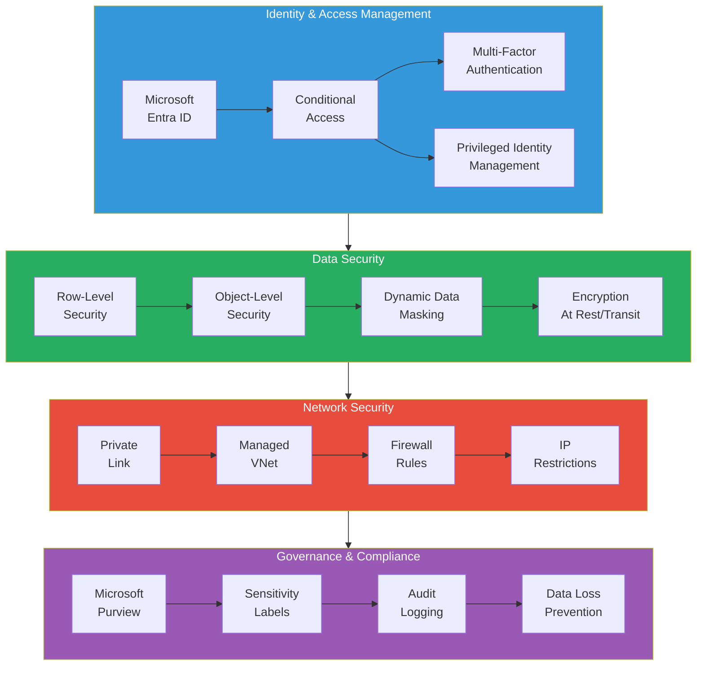

---

## Learning Objectives

By the end of this tutorial, you will be able to:

- [ ] Implement Row-Level Security (RLS) for casino player data segmentation
- [ ] Configure Object-Level Security (OLS) to protect sensitive columns
- [ ] Apply Dynamic Data Masking for PII protection
- [ ] Set up sensitivity labels with Microsoft Purview integration
- [ ] Configure Private Endpoints and Private Link for secure connectivity
- [ ] Implement Managed VNet for Fabric workloads
- [ ] Configure firewall rules and IP restrictions
- [ ] Establish Service Principal security with least-privilege access
- [ ] Implement Conditional Access policies for Fabric
- [ ] Configure encryption at rest and in transit
- [ ] Set up comprehensive audit logging for compliance
- [ ] Address casino/gaming compliance requirements (PCI-DSS, NIGC MICS)

---

## Casino/Gaming Compliance Context

Casino and gaming operations handle highly regulated data requiring strict security controls:

| Regulation | Scope | Key Requirements |
|------------|-------|------------------|
| **PCI-DSS** | Payment card data | Encryption, access controls, network segmentation |
| **NIGC MICS** | Gaming operations | Audit trails, data retention, access controls |
| **FinCEN/BSA** | Financial transactions | CTR/SAR reporting, AML monitoring |
| **State Gaming** | Varies by jurisdiction | Specific reporting, retention requirements |
| **GDPR/CCPA** | Player PII | Consent, data minimization, right to erasure |
| **IRS W-2G** | Gambling winnings | Reporting for wins > $1,200 (slots) |

> **Warning:** Failure to properly secure casino data can result in regulatory fines, license revocation, and criminal penalties. This tutorial provides foundational guidance; always consult your compliance and legal teams.

---

## Security Architecture Overview

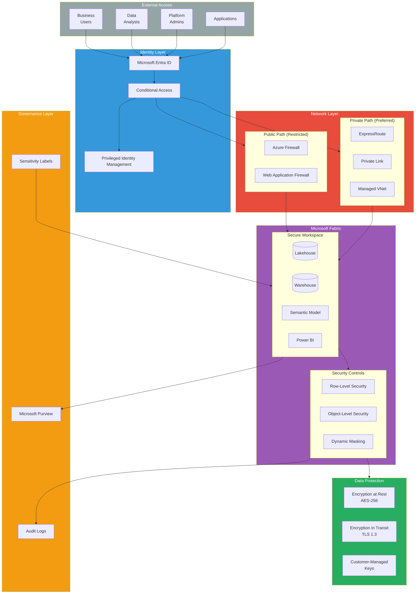

---

## Prerequisites

Before starting, ensure you have:

- [ ] Completed [Tutorial 07: Governance & Purview](../07-governance-purview/README.md)
- [ ] Microsoft Fabric capacity (F64 or higher recommended)
- [ ] Fabric Admin or Workspace Admin permissions
- [ ] Microsoft Entra ID Global Administrator or Privileged Role Administrator (for Conditional Access)
- [ ] Azure subscription Owner or Contributor (for Private Link configuration)
- [ ] Understanding of casino data models (players, transactions, compliance tables)
- [ ] Access to Azure Key Vault for secret management

---

## Step 1: Row-Level Security (RLS) Implementation

Row-Level Security restricts data access at the row level based on user identity. This is critical for casino operations where different regions, properties, or player segments require access isolation.

### 1.1 RLS Architecture for Casino Data

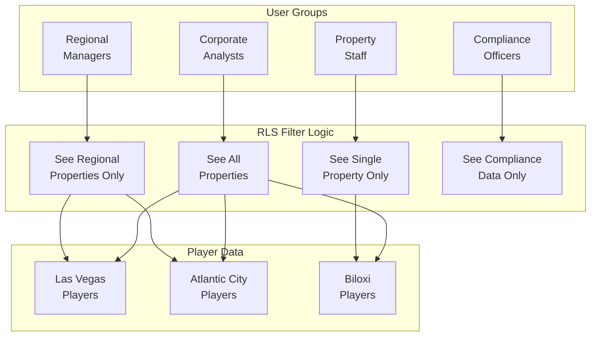

### 1.2 Create RLS Roles in Semantic Model

In your Power BI Semantic Model, create security roles using DAX.

**Step 1: Open Power BI Desktop and load your semantic model**

**Step 2: Navigate to Modeling > Manage Roles**

**Step 3: Create the following roles:**

#### Role: Property Access

```dax
// Table: DIM_PROPERTY
// Filters data to properties assigned to the user

[property_id] IN
    PATHCONTAINS(
        LOOKUPVALUE(
            'User_Property_Access'[assigned_properties],
            'User_Property_Access'[user_email],
            USERPRINCIPALNAME()
        ),
        [property_id]
    )
```

#### Role: Regional Access

```dax
// Table: DIM_PROPERTY
// Filters data to properties in assigned regions

[region_code] IN
    SELECTCOLUMNS(
        FILTER(
            'User_Region_Access',
            'User_Region_Access'[user_email] = USERPRINCIPALNAME()
        ),
        "Region", 'User_Region_Access'[region_code]
    )
```

#### Role: Player Tier Access

```dax
// Table: DIM_PLAYER
// Restricts access based on player loyalty tier
// High-value players (Diamond/Platinum) visible only to authorized users

IF(
    CONTAINS(
        FILTER(
            'User_Tier_Access',
            'User_Tier_Access'[user_email] = USERPRINCIPALNAME()
        ),
        'User_Tier_Access'[tier_access], "ALL"
    ),
    TRUE(),
    NOT([loyalty_tier] IN {"Diamond", "Platinum", "Seven Stars"})
)
```

#### Role: Compliance Full Access

```dax
// Table: FACT_COMPLIANCE_TRANSACTIONS
// Full access for compliance officers - no filter needed
// But restrict to compliance-related tables only

TRUE()

// Apply this role ONLY to compliance-related tables
// Other tables should have FALSE() to hide them completely
```

### 1.3 Create User-Property Mapping Table

Create a mapping table in your Lakehouse to control property access.

```sql
-- Create user access mapping table in Fabric Warehouse
CREATE TABLE security.user_property_access (
    user_email NVARCHAR(256) NOT NULL,
    property_id NVARCHAR(20) NOT NULL,
    access_level NVARCHAR(50) DEFAULT 'READ',
    granted_date DATE DEFAULT GETDATE(),
    granted_by NVARCHAR(256),
    expiry_date DATE,
    PRIMARY KEY (user_email, property_id)
);

-- Insert sample access mappings
INSERT INTO security.user_property_access VALUES
    ('alice.analyst@casino.com', 'LV001', 'READ', '2024-01-01', 'admin@casino.com', NULL),
    ('alice.analyst@casino.com', 'LV002', 'READ', '2024-01-01', 'admin@casino.com', NULL),
    ('bob.manager@casino.com', 'AC001', 'ADMIN', '2024-01-01', 'admin@casino.com', NULL),
    ('compliance.team@casino.com', '*', 'AUDIT', '2024-01-01', 'admin@casino.com', NULL);

-- Create regional mapping
CREATE TABLE security.user_region_access (
    user_email NVARCHAR(256) NOT NULL,
    region_code NVARCHAR(20) NOT NULL,
    access_level NVARCHAR(50) DEFAULT 'READ',
    PRIMARY KEY (user_email, region_code)
);

INSERT INTO security.user_region_access VALUES
    ('regional.west@casino.com', 'WEST', 'ADMIN'),
    ('regional.west@casino.com', 'SOUTHWEST', 'READ'),
    ('regional.east@casino.com', 'EAST', 'ADMIN'),
    ('regional.east@casino.com', 'SOUTHEAST', 'READ');
```

### 1.4 Dynamic RLS with USERPRINCIPALNAME()

For more complex scenarios, use dynamic RLS with lookup tables.

```python
# Fabric Notebook: Create RLS lookup view
from pyspark.sql.functions import col, lit

# Read user access table
df_access = spark.table("security.user_property_access")

# Create flattened view for Power BI
df_access_flat = df_access.select(
    col("user_email"),
    col("property_id"),
    col("access_level")
).where(
    (col("expiry_date").isNull()) |
    (col("expiry_date") > lit("current_date()"))
)

# Write to Gold layer for semantic model consumption
df_access_flat.write \
    .mode("overwrite") \
    .format("delta") \
    .saveAsTable("gold.v_user_property_access")

print(f"Created access view with {df_access_flat.count()} active mappings")
```

### 1.5 Test RLS Configuration

```dax
// DAX Query to test RLS in Power BI Desktop
// Use "View as Role" feature

EVALUATE
SUMMARIZE(
    FACT_SLOT_TRANSACTIONS,
    DIM_PROPERTY[property_name],
    "Total_Coin_In", SUM(FACT_SLOT_TRANSACTIONS[coin_in]),
    "Transaction_Count", COUNTROWS(FACT_SLOT_TRANSACTIONS)
)

// Expected: Only properties accessible to current user should appear
```

---

## Step 2: Object-Level Security (OLS)

Object-Level Security hides sensitive columns from unauthorized users, even if they can see the row. Critical for protecting PII like SSN, payment card numbers, and addresses.

### 2.1 OLS Architecture

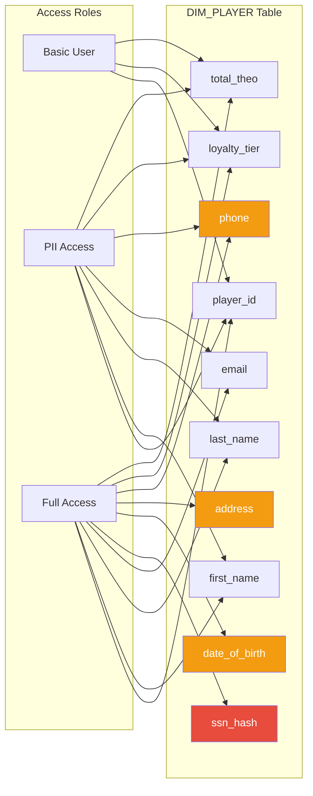

### 2.2 Implement OLS in Semantic Model

**Using Tabular Editor or XMLA endpoint:**

```json
{
  "name": "OLS_PII_Restricted",
  "modelPermission": "read",
  "tablePermissions": [
    {
      "name": "DIM_PLAYER",
      "columnPermissions": [
        {
          "name": "ssn_hash",
          "metadataPermission": "none"
        },
        {
          "name": "date_of_birth",
          "metadataPermission": "none"
        },
        {
          "name": "address_line_1",
          "metadataPermission": "none"
        },
        {
          "name": "address_line_2",
          "metadataPermission": "none"
        },
        {
          "name": "postal_code",
          "metadataPermission": "none"
        }
      ]
    }
  ]
}
```

### 2.3 OLS via TMSL Script

```json
{
  "createOrReplace": {
    "object": {
      "database": "Casino Analytics Model",
      "role": "PII_Restricted"
    },
    "role": {
      "name": "PII_Restricted",
      "modelPermission": "read",
      "tablePermissions": [
        {
          "name": "DIM_PLAYER",
          "columnPermissions": [
            {
              "name": "ssn_hash",
              "metadataPermission": "none"
            },
            {
              "name": "date_of_birth",
              "metadataPermission": "none"
            },
            {
              "name": "full_address",
              "metadataPermission": "none"
            }
          ]
        },
        {
          "name": "FACT_FINANCIAL_TRANSACTIONS",
          "columnPermissions": [
            {
              "name": "card_number_masked",
              "metadataPermission": "none"
            },
            {
              "name": "bank_account_hash",
              "metadataPermission": "none"
            }
          ]
        }
      ]
    }
  }
}
```

### 2.4 Column-Level Security Matrix

| Column | Basic User | Analyst | Compliance | Admin |
|--------|------------|---------|------------|-------|
| player_id | Read | Read | Read | Read |
| first_name | Hidden | Read | Read | Read |
| last_name | Hidden | Read | Read | Read |
| email | Hidden | Masked | Read | Read |
| ssn_hash | Hidden | Hidden | Read | Read |
| date_of_birth | Hidden | Hidden | Read | Read |
| address | Hidden | Hidden | Read | Read |
| phone | Hidden | Masked | Read | Read |
| loyalty_tier | Read | Read | Read | Read |
| total_theo | Read | Read | Read | Read |

---

## Step 3: Dynamic Data Masking

Dynamic Data Masking provides real-time obfuscation of sensitive data without modifying the underlying storage.

### 3.1 Data Masking Patterns

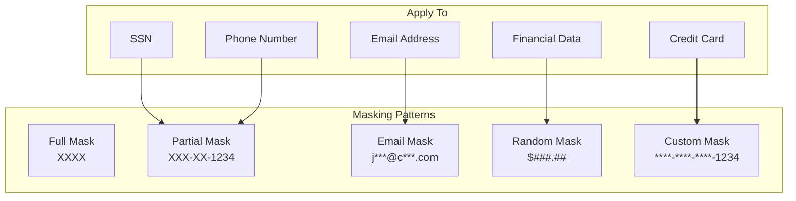

### 3.2 Implement Masking in Fabric Warehouse

```sql
-- Create masked views in Fabric Warehouse

-- Player PII Masked View
CREATE VIEW gold.v_player_masked AS
SELECT
    player_id,
    first_name,
    -- Mask last name: show first letter only
    LEFT(last_name, 1) + REPLICATE('*', LEN(last_name) - 1) AS last_name,
    -- Mask email: j***@domain.com
    LEFT(email, 1) + '***@' +
        SUBSTRING(email, CHARINDEX('@', email) + 1, LEN(email)) AS email,
    -- Mask SSN: ***-**-1234
    '***-**-' + RIGHT(ssn_last_four, 4) AS ssn_masked,
    -- Mask phone: (***) ***-1234
    '(***) ***-' + RIGHT(phone, 4) AS phone_masked,
    -- Mask DOB: Show year only
    YEAR(date_of_birth) AS birth_year,
    -- Mask address: Show city/state only
    city + ', ' + state_code AS location,
    -- Non-sensitive fields pass through
    loyalty_tier,
    registration_date,
    total_lifetime_theo,
    player_rating
FROM gold.dim_player;

-- Financial Transaction Masked View
CREATE VIEW gold.v_financial_txn_masked AS
SELECT
    transaction_id,
    transaction_date,
    player_id,
    -- Mask card number: ****-****-****-1234
    '****-****-****-' + RIGHT(card_number, 4) AS card_masked,
    -- Mask bank account: ******1234
    REPLICATE('*', LEN(bank_account) - 4) + RIGHT(bank_account, 4) AS bank_masked,
    transaction_type,
    -- Show amount ranges instead of exact values for non-compliance
    CASE
        WHEN amount < 1000 THEN 'Under $1K'
        WHEN amount < 10000 THEN '$1K - $10K'
        WHEN amount < 50000 THEN '$10K - $50K'
        ELSE 'Over $50K'
    END AS amount_range,
    -- Only compliance sees exact amounts
    NULL AS exact_amount,
    property_id
FROM gold.fact_financial_transactions;

-- Compliance Full Access View (no masking)
CREATE VIEW compliance.v_financial_txn_full AS
SELECT *
FROM gold.fact_financial_transactions
WHERE 1=1; -- Full access for compliance role
```

### 3.3 Masking in PySpark Notebooks

```python
# Fabric Notebook: Apply masking during Silver to Gold transformation
from pyspark.sql.functions import (
    col, lit, concat, substring, length,
    regexp_replace, sha2, when, expr
)

def apply_pii_masking(df, mask_level="standard"):
    """
    Apply PII masking based on access level.

    Args:
        df: Input DataFrame with PII columns
        mask_level: "standard" (masked), "full" (no masking), "minimal" (heavy masking)

    Returns:
        DataFrame with masked columns
    """

    if mask_level == "full":
        # No masking for compliance/admin
        return df

    # Email masking: j***@domain.com
    df = df.withColumn(
        "email_masked",
        concat(
            substring(col("email"), 1, 1),
            lit("***@"),
            expr("substring(email, instr(email, '@') + 1)")
        )
    )

    # Phone masking: (***) ***-1234
    df = df.withColumn(
        "phone_masked",
        concat(
            lit("(***) ***-"),
            substring(col("phone"), -4, 4)
        )
    )

    # SSN masking: ***-**-1234
    df = df.withColumn(
        "ssn_masked",
        concat(
            lit("***-**-"),
            substring(col("ssn"), -4, 4)
        )
    )

    # Address masking: City, State only
    df = df.withColumn(
        "location_masked",
        concat(col("city"), lit(", "), col("state"))
    )

    # Credit card masking: ****-****-****-1234
    df = df.withColumn(
        "card_masked",
        concat(
            lit("****-****-****-"),
            substring(col("card_number"), -4, 4)
        )
    )

    if mask_level == "minimal":
        # Extra masking for minimal access
        df = df.withColumn("email_masked", lit("***@***.***"))
        df = df.withColumn("phone_masked", lit("(***)***-****"))
        df = df.withColumn("first_name", lit("***"))
        df = df.withColumn("last_name", lit("***"))

    # Drop original PII columns
    columns_to_drop = ["email", "phone", "ssn", "address_line_1",
                       "address_line_2", "card_number"]

    for col_name in columns_to_drop:
        if col_name in df.columns:
            df = df.drop(col_name)

    return df

# Apply masking to player data
df_players = spark.table("silver.player_master")
df_players_masked = apply_pii_masking(df_players, mask_level="standard")

# Save masked version for standard users
df_players_masked.write \
    .mode("overwrite") \
    .format("delta") \
    .saveAsTable("gold.player_masked")

print("Created masked player table for standard access")
```

---

## Step 4: Sensitivity Labels & Purview Integration

### 4.1 Sensitivity Label Framework

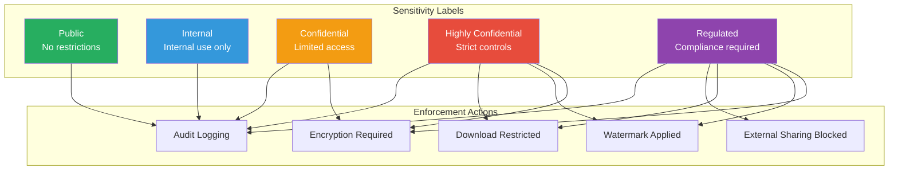

### 4.2 Configure Sensitivity Labels

**Step 1: Access Microsoft Purview Compliance Portal**

Navigate to [compliance.microsoft.com](https://compliance.microsoft.com) > Information Protection > Labels

**Step 2: Create Casino-Specific Labels**

| Label Name | Description | Scope | Encryption |
|------------|-------------|-------|------------|
| **Public** | Publicly available information | All | None |
| **Internal - General** | Internal business data | All | None |
| **Confidential - Player Data** | Player PII and preferences | Files, Emails | Required |
| **Confidential - Financial** | Financial transaction data | Files, Emails | Required |
| **Highly Confidential - Compliance** | CTR, SAR, regulatory filings | Files only | Required |
| **Regulated - Gaming** | NIGC MICS covered data | Files only | Required |

**Step 3: Label Policy Configuration**

```json
{
  "labelPolicy": {
    "name": "Casino Data Classification",
    "description": "Sensitivity labels for casino data assets",
    "labels": [
      {
        "name": "Confidential - Player Data",
        "protection": {
          "encryptionEnabled": true,
          "contentExpiration": "Never",
          "allowOfflineAccess": true,
          "offlineAccessDays": 7
        },
        "contentMarking": {
          "watermarkEnabled": true,
          "watermarkText": "CONFIDENTIAL - PLAYER DATA",
          "headerEnabled": true,
          "headerText": "Classification: Confidential"
        },
        "autoLabeling": {
          "enabled": true,
          "sensitiveInfoTypes": [
            "U.S. Social Security Number (SSN)",
            "Credit Card Number",
            "U.S. Driver's License Number"
          ]
        }
      }
    ],
    "scopedLabels": {
      "powerBI": true,
      "fabric": true,
      "sharePoint": true
    }
  }
}
```

### 4.3 Apply Labels to Fabric Assets

**In Fabric Portal:**

1. Navigate to your workspace
2. Select the Lakehouse or Semantic Model
3. Click **Settings** > **Sensitivity label**
4. Select appropriate label

**Programmatically via REST API:**

```python
# Apply sensitivity labels via Fabric REST API
import requests
import json

def apply_sensitivity_label(workspace_id: str, item_id: str, label_id: str, token: str):
    """
    Apply sensitivity label to a Fabric item.

    Args:
        workspace_id: Fabric workspace GUID
        item_id: Item (Lakehouse, Semantic Model) GUID
        label_id: Sensitivity label GUID
        token: Bearer token for authentication
    """

    url = f"https://api.fabric.microsoft.com/v1/workspaces/{workspace_id}/items/{item_id}/sensitivityLabel"

    headers = {
        "Authorization": f"Bearer {token}",
        "Content-Type": "application/json"
    }

    payload = {
        "labelId": label_id
    }

    response = requests.put(url, headers=headers, json=payload)

    if response.status_code == 200:
        print(f"Successfully applied label to item {item_id}")
    else:
        print(f"Error applying label: {response.text}")

    return response

# Example usage
workspace_id = "your-workspace-guid"
lakehouse_id = "your-lakehouse-guid"
confidential_label_id = "label-guid-for-confidential-player-data"

apply_sensitivity_label(workspace_id, lakehouse_id, confidential_label_id, access_token)
```

### 4.4 Label-Based Access Controls

| Label | Who Can Access | Download | Share Externally | Retention |
|-------|---------------|----------|------------------|-----------|
| Public | Everyone | Yes | Yes | Standard |
| Internal | All employees | Yes | No | Standard |
| Confidential - Player | Authorized staff | Restricted | No | 7 years |
| Confidential - Financial | Finance + Compliance | Audit trail | No | 7 years |
| Highly Confidential - Compliance | Compliance only | No | No | 10 years |
| Regulated - Gaming | Gaming license holders | Audit trail | No | Per regulation |

---

## Step 5: Private Endpoints & Private Link

### 5.1 Private Network Architecture

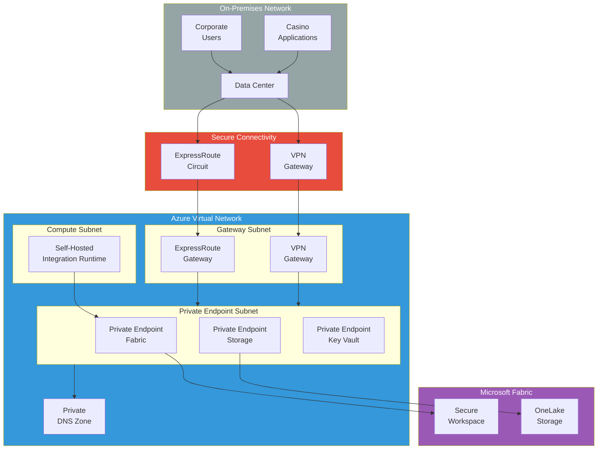

### 5.2 Configure Private Link for Fabric

**Prerequisites:**
- Azure VNet with appropriate subnets
- ExpressRoute or VPN connectivity (for on-premises)
- Private DNS zone for Fabric

**Step 1: Create Private Endpoint**

```bash
# Azure CLI: Create Private Endpoint for Fabric

# Variables
RESOURCE_GROUP="rg-casino-fabric-networking"
VNET_NAME="vnet-casino-hub"
SUBNET_NAME="snet-private-endpoints"
LOCATION="eastus2"
PE_NAME="pe-fabric-casino"
FABRIC_RESOURCE_ID="/subscriptions/{sub-id}/resourceGroups/{rg}/providers/Microsoft.Fabric/capacities/{capacity-name}"

# Create Private Endpoint
az network private-endpoint create \
  --name $PE_NAME \
  --resource-group $RESOURCE_GROUP \
  --vnet-name $VNET_NAME \
  --subnet $SUBNET_NAME \
  --private-connection-resource-id $FABRIC_RESOURCE_ID \
  --group-id "fabric" \
  --connection-name "${PE_NAME}-connection" \
  --location $LOCATION

# Create Private DNS Zone
az network private-dns zone create \
  --resource-group $RESOURCE_GROUP \
  --name "privatelink.fabric.microsoft.com"

# Link DNS Zone to VNet
az network private-dns link vnet create \
  --resource-group $RESOURCE_GROUP \
  --zone-name "privatelink.fabric.microsoft.com" \
  --name "link-fabric-dns" \
  --virtual-network $VNET_NAME \
  --registration-enabled false

# Create DNS record for Private Endpoint
az network private-endpoint dns-zone-group create \
  --resource-group $RESOURCE_GROUP \
  --endpoint-name $PE_NAME \
  --name "fabric-dns-group" \
  --private-dns-zone "privatelink.fabric.microsoft.com" \
  --zone-name "fabric"
```

**Step 2: Configure Private DNS Resolution**

```bash
# Configure conditional forwarder for on-premises DNS
# On your on-premises DNS server, add conditional forwarder:

# For Windows DNS:
# Add-DnsServerConditionalForwarderZone -Name "privatelink.fabric.microsoft.com" -MasterServers 10.0.0.4

# For BIND:
# zone "privatelink.fabric.microsoft.com" {
#     type forward;
#     forwarders { 10.0.0.4; };  # Azure DNS resolver IP
# };
```

### 5.3 Managed VNet Configuration

**Enable Managed VNet for Fabric Workspace:**

1. Navigate to Fabric Admin Portal
2. Select **Tenant Settings** > **Network Security**
3. Enable **Managed Virtual Network**
4. Configure allowed outbound destinations

```json
{
  "managedVNetSettings": {
    "enabled": true,
    "allowedOutboundRules": [
      {
        "name": "AllowOnPremSQL",
        "type": "PrivateEndpoint",
        "destination": "/subscriptions/{sub}/resourceGroups/{rg}/providers/Microsoft.Sql/servers/{server}"
      },
      {
        "name": "AllowStorageAccount",
        "type": "PrivateEndpoint",
        "destination": "/subscriptions/{sub}/resourceGroups/{rg}/providers/Microsoft.Storage/storageAccounts/{account}"
      },
      {
        "name": "AllowKeyVault",
        "type": "PrivateEndpoint",
        "destination": "/subscriptions/{sub}/resourceGroups/{rg}/providers/Microsoft.KeyVault/vaults/{vault}"
      }
    ],
    "defaultOutboundAccess": "Deny"
  }
}
```

---

## Step 6: Firewall Rules & IP Restrictions

### 6.1 IP Restriction Architecture

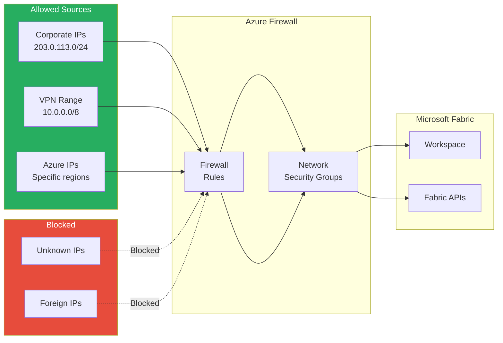

### 6.2 Configure Tenant-Level IP Restrictions

**In Fabric Admin Portal:**

1. Navigate to **Admin Portal** > **Tenant Settings**
2. Find **Azure Private Link** section
3. Enable **Block Public Internet Access**
4. Add allowed IP ranges

```powershell
# PowerShell: Configure Fabric tenant settings (requires admin consent)

# Connect to Fabric Admin
Connect-PowerBIServiceAccount

# Get current tenant settings
$tenantSettings = Get-PowerBITenantSetting

# Configure IP restrictions
$ipSettings = @{
    "blockPublicAccess" = $true
    "allowedIpRanges" = @(
        "203.0.113.0/24",    # Corporate HQ
        "198.51.100.0/24",   # Branch offices
        "10.0.0.0/8"          # Internal VPN range
    )
    "allowAzureServices" = $true
}

# Apply settings
Set-PowerBITenantSetting -Setting "AzurePrivateLink" -Value $ipSettings
```

### 6.3 Workspace-Level Access Controls

```python
# Configure workspace access via REST API
import requests

def configure_workspace_access(workspace_id: str, settings: dict, token: str):
    """
    Configure workspace-level security settings.
    """

    url = f"https://api.fabric.microsoft.com/v1/workspaces/{workspace_id}/settings"

    headers = {
        "Authorization": f"Bearer {token}",
        "Content-Type": "application/json"
    }

    response = requests.patch(url, headers=headers, json=settings)
    return response

# Workspace security settings
security_settings = {
    "licenseMode": "Fabric",
    "defaultDatasetStorageFormat": "Large",
    "workspaceV2Settings": {
        "blockAccessFromPublicNetworks": True,
        "allowServicePrincipals": True,
        "allowedServicePrincipals": [
            "spn-fabric-etl@casino.com",
            "spn-fabric-reports@casino.com"
        ],
        "allowGuestAccess": False
    }
}

configure_workspace_access(workspace_id, security_settings, token)
```

---

## Step 7: Service Principal Security

### 7.1 Service Principal Architecture

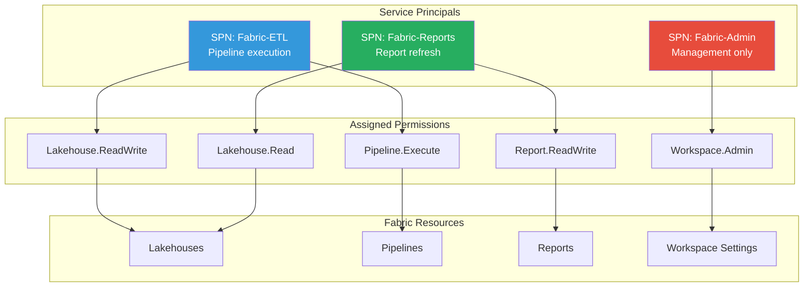

### 7.2 Create Least-Privilege Service Principals

```bash
# Azure CLI: Create service principals with minimal permissions

# ETL Service Principal
az ad sp create-for-rbac \
  --name "spn-casino-fabric-etl" \
  --role "Contributor" \
  --scopes "/subscriptions/{sub-id}/resourceGroups/rg-casino-fabric" \
  --years 2

# Store credentials in Key Vault
az keyvault secret set \
  --vault-name "kv-casino-secrets" \
  --name "spn-fabric-etl-secret" \
  --value "{client-secret}"

# Report Refresh Service Principal (read-only)
az ad sp create-for-rbac \
  --name "spn-casino-fabric-reports" \
  --role "Reader" \
  --scopes "/subscriptions/{sub-id}/resourceGroups/rg-casino-fabric" \
  --years 2
```

### 7.3 Assign Fabric Workspace Permissions

```powershell
# PowerShell: Assign service principal to Fabric workspace

# Connect to Fabric
Connect-PowerBIServiceAccount

# Get workspace
$workspace = Get-PowerBIWorkspace -Name "casino-fabric-poc"

# Add ETL service principal as Member
Add-PowerBIWorkspaceUser `
  -Id $workspace.Id `
  -UserPrincipalName "spn-casino-fabric-etl@casino.onmicrosoft.com" `
  -AccessRight "Member"

# Add Reports service principal as Viewer
Add-PowerBIWorkspaceUser `
  -Id $workspace.Id `
  -UserPrincipalName "spn-casino-fabric-reports@casino.onmicrosoft.com" `
  -AccessRight "Viewer"
```

### 7.4 Service Principal Rotation Policy

```python
# Python: Automated credential rotation
from azure.identity import ClientSecretCredential
from azure.keyvault.secrets import SecretClient
from datetime import datetime, timedelta
import logging

def rotate_service_principal_secret(
    tenant_id: str,
    client_id: str,
    key_vault_url: str,
    secret_name: str
):
    """
    Rotate service principal secret and update Key Vault.
    """

    from azure.graphrbac import GraphRbacManagementClient
    from azure.graphrbac.models import PasswordCredential

    # Generate new secret
    new_secret = generate_secure_secret()
    expiry_date = datetime.utcnow() + timedelta(days=90)

    # Update in Azure AD
    graph_client = GraphRbacManagementClient(credential, tenant_id)

    password_cred = PasswordCredential(
        value=new_secret,
        end_date=expiry_date
    )

    graph_client.service_principals.update_password_credentials(
        client_id,
        [password_cred]
    )

    # Update Key Vault
    kv_client = SecretClient(vault_url=key_vault_url, credential=credential)
    kv_client.set_secret(secret_name, new_secret)

    logging.info(f"Rotated secret for {client_id}, expires {expiry_date}")

    return True
```

---

## Step 8: Conditional Access Policies

### 8.1 Conditional Access Architecture

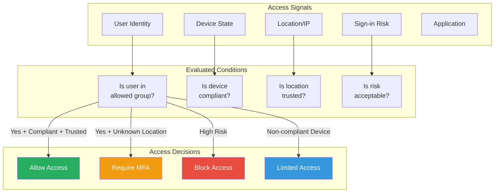

### 8.2 Create Fabric-Specific Conditional Access Policies

**Policy 1: Require MFA for Fabric Access**

```json
{
  "displayName": "Casino-Fabric-RequireMFA",
  "state": "enabled",
  "conditions": {
    "applications": {
      "includeApplications": [
        "00000009-0000-0000-c000-000000000000"
      ]
    },
    "users": {
      "includeGroups": [
        "sg-fabric-users"
      ]
    },
    "locations": {
      "includeLocations": [
        "All"
      ],
      "excludeLocations": [
        "TrustedLocations"
      ]
    }
  },
  "grantControls": {
    "operator": "OR",
    "builtInControls": [
      "mfa"
    ]
  }
}
```

**Policy 2: Block Access from Non-Compliant Devices**

```json
{
  "displayName": "Casino-Fabric-RequireCompliantDevice",
  "state": "enabled",
  "conditions": {
    "applications": {
      "includeApplications": [
        "00000009-0000-0000-c000-000000000000"
      ]
    },
    "users": {
      "includeGroups": [
        "sg-fabric-analysts",
        "sg-fabric-engineers"
      ]
    },
    "platforms": {
      "includePlatforms": [
        "windows",
        "macOS"
      ]
    }
  },
  "grantControls": {
    "operator": "AND",
    "builtInControls": [
      "compliantDevice",
      "mfa"
    ]
  }
}
```

**Policy 3: Block Compliance Data Access Outside Secure Network**

```json
{
  "displayName": "Casino-Fabric-ComplianceDataRestricted",
  "state": "enabled",
  "conditions": {
    "applications": {
      "includeApplications": [
        "00000009-0000-0000-c000-000000000000"
      ]
    },
    "users": {
      "includeGroups": [
        "sg-compliance-officers"
      ]
    },
    "locations": {
      "includeLocations": [
        "All"
      ],
      "excludeLocations": [
        "CorporateHQ",
        "SecureVPN"
      ]
    },
    "clientAppTypes": [
      "browser",
      "mobileAppsAndDesktopClients"
    ]
  },
  "grantControls": {
    "operator": "OR",
    "builtInControls": [
      "block"
    ]
  },
  "sessionControls": {
    "signInFrequency": {
      "value": 1,
      "type": "hours"
    }
  }
}
```

### 8.3 Named Locations for Casino Properties

```powershell
# PowerShell: Create named locations for Conditional Access

# Connect to Microsoft Graph
Connect-MgGraph -Scopes "Policy.ReadWrite.ConditionalAccess"

# Create named location for HQ
$hqLocation = @{
    "@odata.type" = "#microsoft.graph.ipNamedLocation"
    displayName = "Casino-HQ-LasVegas"
    isTrusted = $true
    ipRanges = @(
        @{
            "@odata.type" = "#microsoft.graph.iPv4CidrRange"
            cidrAddress = "203.0.113.0/24"
        }
    )
}

New-MgIdentityConditionalAccessNamedLocation -BodyParameter $hqLocation

# Create named location for each property
$properties = @(
    @{ Name = "Casino-LV001-Bellagio"; CIDR = "203.0.114.0/24" },
    @{ Name = "Casino-AC001-Borgata"; CIDR = "203.0.115.0/24" },
    @{ Name = "Casino-BX001-Beau"; CIDR = "203.0.116.0/24" }
)

foreach ($prop in $properties) {
    $location = @{
        "@odata.type" = "#microsoft.graph.ipNamedLocation"
        displayName = $prop.Name
        isTrusted = $true
        ipRanges = @(
            @{
                "@odata.type" = "#microsoft.graph.iPv4CidrRange"
                cidrAddress = $prop.CIDR
            }
        )
    }
    New-MgIdentityConditionalAccessNamedLocation -BodyParameter $location
}
```

---

## Step 9: Encryption Configuration

### 9.1 Encryption Architecture

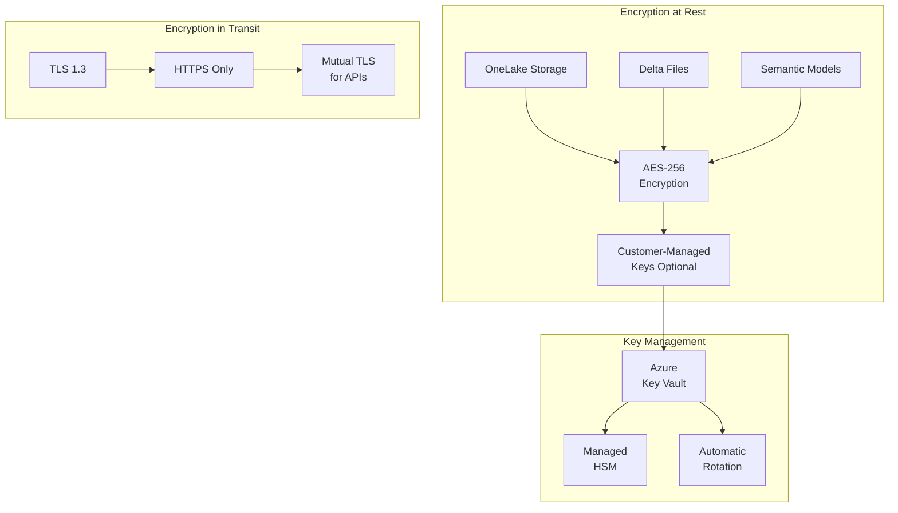

### 9.2 Configure Customer-Managed Keys (CMK)

```bash
# Azure CLI: Set up Customer-Managed Keys for Fabric

# Create Key Vault with HSM protection
az keyvault create \
  --name "kv-casino-fabric-cmk" \
  --resource-group "rg-casino-security" \
  --location "eastus2" \
  --sku "premium" \
  --enable-purge-protection true \
  --retention-days 90

# Create encryption key
az keyvault key create \
  --vault-name "kv-casino-fabric-cmk" \
  --name "fabric-encryption-key" \
  --kty RSA \
  --size 4096 \
  --ops encrypt decrypt wrapKey unwrapKey

# Get key identifier
KEY_ID=$(az keyvault key show \
  --vault-name "kv-casino-fabric-cmk" \
  --name "fabric-encryption-key" \
  --query "key.kid" -o tsv)

echo "Key ID: $KEY_ID"

# Enable automatic key rotation
az keyvault key rotation-policy update \
  --vault-name "kv-casino-fabric-cmk" \
  --name "fabric-encryption-key" \
  --value @rotation-policy.json
```

**rotation-policy.json:**

```json
{
  "lifetimeActions": [
    {
      "trigger": {
        "timeAfterCreate": "P90D"
      },
      "action": {
        "type": "Rotate"
      }
    },
    {
      "trigger": {
        "timeBeforeExpiry": "P30D"
      },
      "action": {
        "type": "Notify"
      }
    }
  ],
  "attributes": {
    "expiryTime": "P1Y"
  }
}
```

### 9.3 TLS Configuration Verification

```python
# Python: Verify TLS configuration for Fabric endpoints
import ssl
import socket
from datetime import datetime

def check_tls_config(hostname: str, port: int = 443):
    """
    Verify TLS configuration for Fabric endpoint.
    """
    context = ssl.create_default_context()

    with socket.create_connection((hostname, port)) as sock:
        with context.wrap_socket(sock, server_hostname=hostname) as ssock:
            cert = ssock.getpeercert()
            cipher = ssock.cipher()
            version = ssock.version()

            print(f"Host: {hostname}")
            print(f"TLS Version: {version}")
            print(f"Cipher Suite: {cipher[0]}")
            print(f"Cipher Bits: {cipher[2]}")
            print(f"Certificate Issuer: {cert['issuer']}")
            print(f"Certificate Expiry: {cert['notAfter']}")

            # Verify TLS 1.2 or higher
            assert version in ['TLSv1.2', 'TLSv1.3'], f"Insecure TLS version: {version}"

            # Verify strong cipher
            assert cipher[2] >= 256, f"Weak cipher strength: {cipher[2]}"

            print("TLS configuration verified successfully")
            return True

# Check Fabric endpoints
endpoints = [
    "api.fabric.microsoft.com",
    "app.fabric.microsoft.com",
    "onelake.dfs.fabric.microsoft.com"
]

for endpoint in endpoints:
    check_tls_config(endpoint)
```

---

## Step 10: Audit Logging & Compliance

### 10.1 Audit Architecture

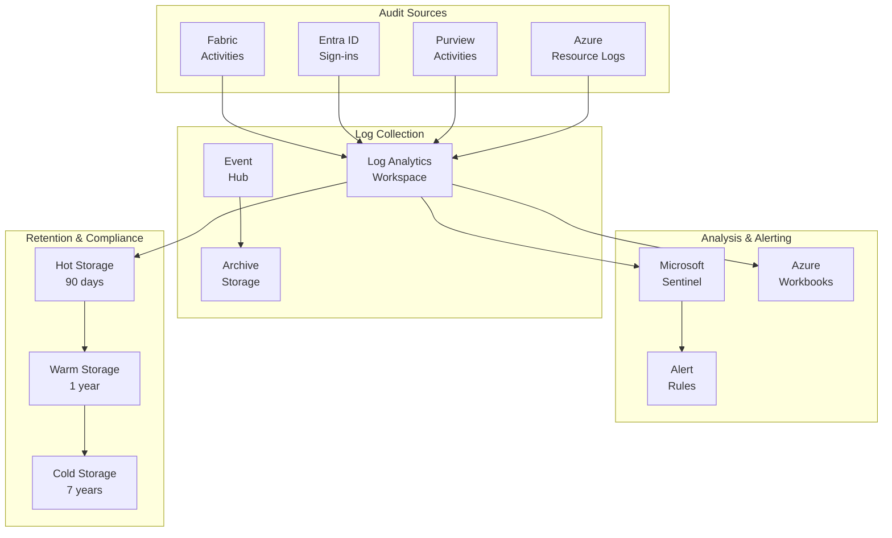

### 10.2 Configure Unified Audit Logging

```powershell
# PowerShell: Enable comprehensive audit logging

# Connect to services
Connect-ExchangeOnline
Connect-AzAccount

# Enable unified audit logging
Set-AdminAuditLogConfig -UnifiedAuditLogIngestionEnabled $true

# Configure audit log retention (E5 required for extended retention)
$auditLogConfig = @{
    RecordType = @(
        "PowerBIAudit",
        "FabricAudit",
        "PurviewAudit",
        "AzureActiveDirectory"
    )
    RetentionPeriod = 365  # 1 year
}

# Create audit retention policy
New-UnifiedAuditLogRetentionPolicy `
  -Name "Casino-Fabric-Audit-Retention" `
  -Description "7-year retention for casino compliance" `
  -RecordTypes $auditLogConfig.RecordType `
  -RetentionDuration SevenYears `
  -Priority 100
```

### 10.3 Create Compliance Audit Queries

```kusto
// KQL: Compliance audit queries for Log Analytics

// Query 1: All Fabric access by compliance-relevant tables
FabricAudit
| where TimeGenerated > ago(24h)
| where Activity in ("ViewReport", "ReadData", "ExportData")
| where ObjectName contains "compliance" or ObjectName contains "ctr" or ObjectName contains "sar"
| project TimeGenerated, UserId, Activity, ObjectName, ClientIP, UserAgent
| sort by TimeGenerated desc

// Query 2: Suspicious after-hours access
FabricAudit
| where TimeGenerated > ago(7d)
| extend Hour = datetime_part("hour", TimeGenerated)
| where Hour < 6 or Hour > 22  // Outside business hours
| where Activity in ("ExportData", "DownloadReport", "CopyData")
| summarize AccessCount = count() by UserId, Activity, bin(TimeGenerated, 1d)
| where AccessCount > 5

// Query 3: Failed access attempts
SigninLogs
| where TimeGenerated > ago(24h)
| where AppDisplayName == "Microsoft Fabric"
| where ResultType != 0  // Failed sign-ins
| project TimeGenerated, UserPrincipalName, IPAddress, Location, ResultDescription
| summarize FailedAttempts = count() by UserPrincipalName, IPAddress
| where FailedAttempts > 3

// Query 4: Sensitive data access report
FabricAudit
| where TimeGenerated > ago(30d)
| where Activity == "ReadData"
| where ObjectName has_any ("player", "ssn", "financial", "compliance")
| summarize
    TotalAccess = count(),
    UniqueUsers = dcount(UserId),
    FirstAccess = min(TimeGenerated),
    LastAccess = max(TimeGenerated)
    by ObjectName
| order by TotalAccess desc

// Query 5: Data export tracking (for DLP)
FabricAudit
| where TimeGenerated > ago(7d)
| where Activity in ("ExportData", "DownloadReport", "CopyToClipboard")
| where ObjectName has_any ("player", "financial", "compliance")
| project TimeGenerated, UserId, Activity, ObjectName, DataSize, ClientIP
| order by TimeGenerated desc
```

### 10.4 Automated Compliance Reports

```python
# Python: Generate automated compliance reports
from azure.monitor.query import LogsQueryClient
from azure.identity import DefaultAzureCredential
from datetime import datetime, timedelta
import pandas as pd

def generate_compliance_report(workspace_id: str, days: int = 30):
    """
    Generate monthly compliance report for casino data access.
    """
    credential = DefaultAzureCredential()
    client = LogsQueryClient(credential)

    end_time = datetime.utcnow()
    start_time = end_time - timedelta(days=days)

    queries = {
        "total_access": """
            FabricAudit
            | where TimeGenerated between(datetime({start}) .. datetime({end}))
            | summarize TotalEvents = count() by Activity
        """,
        "user_activity": """
            FabricAudit
            | where TimeGenerated between(datetime({start}) .. datetime({end}))
            | summarize
                AccessCount = count(),
                UniqueObjects = dcount(ObjectName)
                by UserId
            | top 50 by AccessCount
        """,
        "sensitive_access": """
            FabricAudit
            | where TimeGenerated between(datetime({start}) .. datetime({end}))
            | where ObjectName has_any ("compliance", "ctr", "sar", "player_pii")
            | summarize
                AccessCount = count()
                by UserId, ObjectName, Activity
        """,
        "export_events": """
            FabricAudit
            | where TimeGenerated between(datetime({start}) .. datetime({end}))
            | where Activity in ("ExportData", "DownloadReport")
            | project TimeGenerated, UserId, ObjectName, DataSize
        """
    }

    report = {}

    for name, query in queries.items():
        formatted_query = query.format(
            start=start_time.isoformat(),
            end=end_time.isoformat()
        )
        response = client.query_workspace(workspace_id, formatted_query)
        report[name] = pd.DataFrame(response.tables[0].rows,
                                    columns=[c.name for c in response.tables[0].columns])

    # Generate summary
    summary = {
        "report_period": f"{start_time.date()} to {end_time.date()}",
        "total_events": report["total_access"]["TotalEvents"].sum(),
        "unique_users": report["user_activity"]["UserId"].nunique(),
        "sensitive_data_accesses": len(report["sensitive_access"]),
        "export_events": len(report["export_events"]),
        "generated_at": datetime.utcnow().isoformat()
    }

    return report, summary

# Generate and save report
report, summary = generate_compliance_report(log_analytics_workspace_id, days=30)

print("Compliance Report Summary:")
print(f"  Period: {summary['report_period']}")
print(f"  Total Events: {summary['total_events']}")
print(f"  Unique Users: {summary['unique_users']}")
print(f"  Sensitive Data Accesses: {summary['sensitive_data_accesses']}")
print(f"  Export Events: {summary['export_events']}")
```

---

## Step 11: Gaming Industry Compliance Mapping

### 11.1 PCI-DSS Compliance Controls

| PCI-DSS Requirement | Fabric Implementation | Tutorial Section |
|---------------------|----------------------|------------------|
| **1. Firewall Configuration** | Private Link, Managed VNet, IP restrictions | Step 5, Step 6 |
| **2. Vendor Defaults** | Custom service principals, no default passwords | Step 7 |
| **3. Protect Stored Data** | Encryption at rest (AES-256), CMK | Step 9 |
| **4. Encrypt Transmission** | TLS 1.3 for all connections | Step 9 |
| **5. Anti-virus** | Azure Defender for Cloud integration | Azure Security |
| **6. Secure Systems** | Managed service, automatic patching | Platform |
| **7. Restrict Access** | RLS, OLS, RBAC, least privilege | Steps 1-3, 7 |
| **8. Identify Users** | Entra ID, MFA, Conditional Access | Step 8 |
| **9. Physical Security** | Azure datacenter controls | Microsoft responsibility |
| **10. Track Access** | Unified audit logging, Sentinel | Step 10 |
| **11. Test Security** | Regular security assessments | Operations |
| **12. Security Policy** | Documented policies, training | Governance |

### 11.2 NIGC MICS Controls

| MICS Requirement | Fabric Implementation | Notes |
|------------------|----------------------|-------|
| **Access Controls** | RLS by property, role-based access | Restrict by gaming license |
| **Audit Trails** | 7-year retention, immutable logs | Regulatory requirement |
| **Data Integrity** | Delta Lake ACID transactions | Prevents unauthorized changes |
| **Separation of Duties** | Distinct roles for cage, slots, compliance | Role-based access |
| **Change Management** | Git integration, approval workflows | CI/CD controls |
| **Reporting Requirements** | CTR/SAR automated generation | Gold layer views |

### 11.3 Compliance Validation Checklist

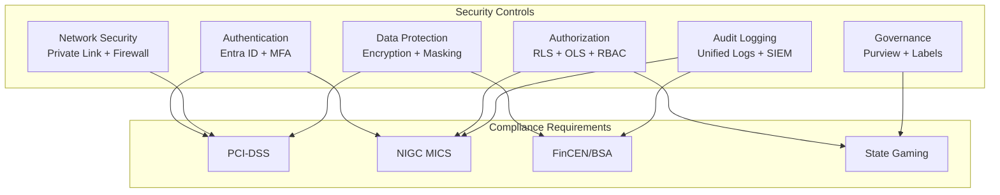

---

## Validation Checklist

Before moving to the next tutorial, verify:

- [ ] **RLS Configured** - Row-Level Security implemented for player and property data
- [ ] **OLS Configured** - Object-Level Security hiding sensitive columns (SSN, cards)
- [ ] **Data Masking Active** - Dynamic masking applied to PII in Gold layer views
- [ ] **Sensitivity Labels Applied** - All Fabric assets properly labeled
- [ ] **Private Link Configured** - Private endpoints established for Fabric access
- [ ] **Firewall Rules Active** - IP restrictions enforced at tenant level
- [ ] **Service Principals Secured** - Least-privilege access, secrets in Key Vault
- [ ] **Conditional Access Policies** - MFA and device compliance enforced
- [ ] **Encryption Verified** - TLS 1.3 in transit, AES-256 at rest confirmed
- [ ] **Audit Logging Enabled** - Unified logging with 7-year retention
- [ ] **Compliance Mapping Complete** - PCI-DSS and NIGC requirements addressed

<details>
<summary>How to verify each item</summary>

### RLS Configured
```dax
// In Power BI Desktop, use "View as Role" to test:
// 1. Open semantic model
// 2. Modeling > View as > Select role
// 3. Verify data filters correctly
```

### OLS Configured
```dax
// Test OLS by querying restricted column
EVALUATE
SELECTCOLUMNS(DIM_PLAYER, "SSN", [ssn_hash])
// Should return error for restricted roles
```

### Private Link Configured
```bash
# Verify private endpoint resolution
nslookup api.fabric.microsoft.com
# Should resolve to private IP (10.x.x.x)
```

### Audit Logging Enabled
```kusto
// Query Log Analytics
FabricAudit
| where TimeGenerated > ago(1h)
| count
// Should return > 0
```

</details>

---

## Troubleshooting

| Issue | Symptoms | Solution |
|-------|----------|----------|
| RLS not filtering | Users see all data | Verify role membership, check DAX filter syntax |
| OLS not hiding columns | Sensitive columns visible | Confirm metadataPermission = "none" in role definition |
| Private Link connection fails | Timeout errors | Check DNS resolution, verify NSG rules |
| Conditional Access blocking valid users | Access denied | Review policy conditions, check named locations |
| Audit logs missing | No entries in Log Analytics | Verify diagnostic settings, check retention policies |
| CMK encryption fails | Key not found errors | Verify Key Vault access policies, check key permissions |
| Service principal auth fails | 401/403 errors | Rotate secret, verify workspace permissions |

---

## Best Practices

### Security Implementation

| Practice | Description | Priority |
|----------|-------------|----------|
| **Defense in Depth** | Layer multiple security controls | Critical |
| **Least Privilege** | Grant minimum required permissions | Critical |
| **Zero Trust** | Verify explicitly, assume breach | High |
| **Encryption Everywhere** | Encrypt data at rest and in transit | Critical |
| **Audit Everything** | Log all access and changes | Critical |
| **Regular Reviews** | Quarterly access and policy reviews | High |

### Casino/Gaming Specific

| Practice | Description |
|----------|-------------|
| **Property Isolation** | Use RLS to enforce property-level data separation |
| **Compliance Officer Access** | Create dedicated role with full audit access |
| **CTR/SAR Protection** | Apply highest sensitivity labels to compliance data |
| **Gaming License Verification** | Integrate with HR system for license status |
| **Regulatory Audit Preparation** | Maintain exportable audit reports |
| **Incident Response Plan** | Document security incident procedures |

---

## Summary

Congratulations! You have successfully implemented enterprise-grade security for Microsoft Fabric in a casino/gaming environment:

- Implemented Row-Level Security for property and player data segmentation
- Configured Object-Level Security to protect sensitive columns
- Applied Dynamic Data Masking for PII protection
- Set up sensitivity labels with Microsoft Purview integration
- Configured Private Link and Managed VNet for secure connectivity
- Established firewall rules and IP restrictions
- Secured service principals with least-privilege access
- Implemented Conditional Access policies with MFA
- Configured encryption at rest and in transit
- Set up comprehensive audit logging for compliance
- Addressed PCI-DSS and NIGC MICS requirements

Your Fabric environment now meets enterprise security standards for the regulated casino/gaming industry.

---

## Next Steps

Continue to **[Tutorial 15: Cost Management](../15-cost-management/README.md)** to learn how to monitor, optimize, and control Microsoft Fabric costs.

---

## Additional Resources

| Resource | Link |
|----------|------|
| Microsoft Fabric Security Documentation | [Microsoft Learn](https://learn.microsoft.com/fabric/security/) |
| Row-Level Security in Power BI | [RLS Guide](https://learn.microsoft.com/power-bi/enterprise/service-admin-rls) |
| Object-Level Security | [OLS Documentation](https://learn.microsoft.com/analysis-services/tabular-models/object-level-security) |
| Azure Private Link | [Private Link Overview](https://learn.microsoft.com/azure/private-link/private-link-overview) |
| Conditional Access | [CA Documentation](https://learn.microsoft.com/azure/active-directory/conditional-access/) |
| Microsoft Purview | [Purview Documentation](https://learn.microsoft.com/purview/) |
| PCI-DSS Compliance | [PCI Security Standards](https://www.pcisecuritystandards.org/) |
| NIGC MICS Standards | [NIGC Website](https://www.nigc.gov/compliance/minimum-internal-control-standards) |

---

## Navigation

| Previous | Up | Next |
|----------|-----|------|
| [13-Migration Planning](../13-migration-planning/README.md) | [Tutorials Index](../README.md) | [15-Cost Optimization](../15-cost-optimization/README.md) |

---

> **Questions or issues?** Open an issue in the [GitHub repository](https://github.com/your-repo/issues).
