# Tutorial 15: Cost Management & Capacity Optimization

<div align="center">


</div>

> **[Home](../../index.md)** > **[Tutorials](../index.md)** > **Cost Management & Capacity Optimization**

---

## Tutorial 15: Cost Management & Capacity Optimization


*Source: [Microsoft Fabric Licenses](https://learn.microsoft.com/en-us/fabric/enterprise/licenses)*

| | |
|---|---|
| **Difficulty** | Intermediate |
| **Time** | 2 hours |
| **Focus** | FinOps, Capacity Planning, Cost Governance |

---

### Progress Tracker

<div align="center">

<table>
<thead>
<tr>
<th align="center" width="5%">Tutorial</th>
<th align="left" width="30%">Name</th>
<th align="center" width="10%">Status</th>
<th align="center" width="10%">Duration</th>
<th align="center" width="15%">Difficulty</th>
</tr>
</thead>
<tbody>
<tr>
<td align="center">00</td>
<td><a href="../00-environment-setup/README.md">Environment Setup</a></td>
<td align="center"></td>
<td align="center">45-60 min</td>
<td align="center">Beginner</td>
</tr>
<tr>
<td align="center">01</td>
<td><a href="../01-bronze-layer/README.md">Bronze Layer</a></td>
<td align="center"></td>
<td align="center">60-90 min</td>
<td align="center">Beginner</td>
</tr>
<tr>
<td align="center">02</td>
<td><a href="../02-silver-layer/README.md">Silver Layer</a></td>
<td align="center"></td>
<td align="center">60-90 min</td>
<td align="center">Intermediate</td>
</tr>
<tr>
<td align="center">03</td>
<td><a href="../03-gold-layer/README.md">Gold Layer</a></td>
<td align="center"></td>
<td align="center">90-120 min</td>
<td align="center">Intermediate</td>
</tr>
<tr>
<td align="center">04</td>
<td><a href="../04-real-time-analytics/README.md">Real-Time Analytics</a></td>
<td align="center"></td>
<td align="center">90-120 min</td>
<td align="center">Advanced</td>
</tr>
<tr>
<td align="center">05</td>
<td><a href="../05-direct-lake-powerbi/README.md">Direct Lake & Power BI</a></td>
<td align="center"></td>
<td align="center">60-90 min</td>
<td align="center">Intermediate</td>
</tr>
<tr>
<td align="center">06</td>
<td><a href="../06-data-pipelines/README.md">Data Pipelines</a></td>
<td align="center"></td>
<td align="center">60-90 min</td>
<td align="center">Intermediate</td>
</tr>
<tr>
<td align="center">07</td>
<td><a href="../07-governance-purview/README.md">Governance & Purview</a></td>
<td align="center"></td>
<td align="center">60-90 min</td>
<td align="center">Intermediate</td>
</tr>
<tr>
<td align="center">08</td>
<td><a href="../08-database-mirroring/README.md">Database Mirroring</a></td>
<td align="center"></td>
<td align="center">60-90 min</td>
<td align="center">Intermediate</td>
</tr>
<tr>
<td align="center">09</td>
<td><a href="../09-advanced-ai-ml/README.md">Advanced AI/ML</a></td>
<td align="center"></td>
<td align="center">90-120 min</td>
<td align="center">Advanced</td>
</tr>
<tr>
<td align="center">10</td>
<td><a href="../10-teradata-migration/README.md">Teradata Migration</a></td>
<td align="center"></td>
<td align="center">120-180 min</td>
<td align="center">Advanced</td>
</tr>
<tr>
<td align="center">11</td>
<td><a href="../11-sas-connectivity/README.md">SAS Connectivity</a></td>
<td align="center"></td>
<td align="center">60-90 min</td>
<td align="center">Intermediate</td>
</tr>
<tr>
<td align="center">12</td>
<td><a href="../12-cicd-devops/README.md">CI/CD & DevOps</a></td>
<td align="center"></td>
<td align="center">90-120 min</td>
<td align="center">Advanced</td>
</tr>
<tr>
<td align="center">13</td>
<td><a href="../13-migration-planning/README.md">Migration Planning</a></td>
<td align="center"></td>
<td align="center">60-90 min</td>
<td align="center">Intermediate</td>
</tr>
<tr>
<td align="center">14</td>
<td><a href="../14-security-networking/README.md">Security & Compliance</a></td>
<td align="center"></td>
<td align="center">90-120 min</td>
<td align="center">Advanced</td>
</tr>
<tr style="background-color: #e8f5e9;">
<td align="center"><strong>15</strong></td>
<td><strong><a href="../15-cost-optimization/README.md">Cost Management & Capacity Optimization</a></strong></td>
<td align="center"></td>
<td align="center">2 hours</td>
<td align="center">Intermediate</td>
</tr>
<tr>
<td align="center">16</td>
<td><a href="../16-performance-tuning/README.md">Performance Tuning</a></td>
<td align="center"></td>
<td align="center">90-120 min</td>
<td align="center">Advanced</td>
</tr>
<tr>
<td align="center">17</td>
<td><a href="../17-disaster-recovery/README.md">Disaster Recovery</a></td>
<td align="center"></td>
<td align="center">60-90 min</td>
<td align="center">Advanced</td>
</tr>
<tr>
<td align="center">18</td>
<td><a href="../18-monitoring/README.md">Monitoring & Alerting</a></td>
<td align="center"></td>
<td align="center">60-90 min</td>
<td align="center">Intermediate</td>
</tr>
<tr>
<td align="center">19</td>
<td><a href="../19-advanced-scenarios/README.md">Advanced Scenarios</a></td>
<td align="center"></td>
<td align="center">120-180 min</td>
<td align="center">Advanced</td>
</tr>
</tbody>
</table>

<p><em>Click any tutorial name to navigate directly to it</em></p>

</div>

---

| Navigation | |
|---|---|
| **Previous** | [14-Security & Compliance](../14-security-networking/README.md) |
| **Next** | [16-Performance Tuning](../16-performance-tuning/README.md) |

---

## Overview

This tutorial provides comprehensive guidance on managing costs and optimizing capacity utilization in Microsoft Fabric. You will learn how to right-size your Fabric capacity, implement automation for cost savings, set up monitoring dashboards, and establish chargeback models for your organization.

Effective cost management is critical for any data platform. Microsoft Fabric's consumption-based pricing model offers flexibility but requires careful monitoring and optimization to maximize value while controlling spend.


---

## Learning Objectives

By the end of this tutorial, you will be able to:

- [ ] Understand Fabric capacity SKUs and Capacity Units (CUs)
- [ ] Configure and use the Capacity Metrics app for monitoring
- [ ] Implement capacity pause/resume automation using PowerShell and Logic Apps
- [ ] Set up cost monitoring dashboards and budget alerts
- [ ] Design chargeback and cost allocation models
- [ ] Apply optimization strategies for compute, storage, and queries
- [ ] Compare reserved capacity vs. pay-as-you-go pricing
- [ ] Estimate costs for POC and production deployments
- [ ] Configure multi-workspace capacity sharing effectively

---

## Capacity Architecture

Understanding how Fabric capacity works is fundamental to cost optimization.


### Capacity Units Explained

Capacity Units (CUs) are the fundamental compute resource in Microsoft Fabric. All workloads consume CUs, which are pooled across a capacity.

| Concept | Description |
|---------|-------------|
| **Capacity Unit (CU)** | Measure of compute power; 1 CU = baseline processing capability |
| **CU Pooling** | All workloads share the same CU pool within a capacity |
| **Bursting** | Temporary use of additional CUs beyond allocation (up to limits) |
| **Smoothing** | CU usage averaged over time windows to prevent throttling |
| **Throttling** | Reduced performance when sustained usage exceeds capacity |

---

## Prerequisites

Before starting this tutorial, ensure you have:

- [ ] Completed [Tutorial 00: Environment Setup](../00-environment-setup/README.md)
- [ ] Fabric Admin or Capacity Admin role
- [ ] Access to Azure portal for capacity management
- [ ] PowerShell 7.0+ with Az module installed
- [ ] Azure subscription Owner or Contributor role (for automation setup)
- [ ] Understanding of basic Fabric workload types

> **Note:** Some sections require elevated permissions. Work with your Fabric administrator if you don't have direct access.

---

## Step 1: Understand Fabric Capacity SKUs and Pricing

### 1.1 Fabric Capacity SKU Reference

Microsoft Fabric offers capacity SKUs ranging from F2 to F2048. Each SKU provides a specific number of Capacity Units.

| SKU | Capacity Units | Equivalent Power BI | Hourly Rate (PAYG)* | Monthly Est.* | Best For |
|-----|----------------|---------------------|---------------------|---------------|----------|
| **F2** | 2 CUs | - | ~$0.36/hr | ~$262 | Dev/Test, POC |
| **F4** | 4 CUs | - | ~$0.72/hr | ~$525 | Small workloads |
| **F8** | 8 CUs | - | ~$1.44/hr | ~$1,050 | Development |
| **F16** | 16 CUs | - | ~$2.88/hr | ~$2,100 | Small production |
| **F32** | 32 CUs | - | ~$5.76/hr | ~$4,200 | Medium workloads |
| **F64** | 64 CUs | P1 | ~$11.52/hr | ~$8,400 | Production POC |
| **F128** | 128 CUs | P2 | ~$23.04/hr | ~$16,800 | Enterprise |
| **F256** | 256 CUs | P3 | ~$46.08/hr | ~$33,600 | Large enterprise |
| **F512** | 512 CUs | P4 | ~$92.16/hr | ~$67,200 | Heavy workloads |
| **F1024** | 1024 CUs | P5 | ~$184.32/hr | ~$134,400 | Very large |
| **F2048** | 2048 CUs | - | ~$368.64/hr | ~$268,800 | Massive scale |

> **Note:** Prices are approximate and vary by region. Check [Azure Pricing Calculator](https://azure.microsoft.com/pricing/calculator/) for current rates. Monthly estimates assume 730 hours (24/7 operation).

### 1.2 CU Consumption by Workload Type

Different Fabric workloads consume CUs at different rates:


| Workload | CU Consumption Pattern | Optimization Opportunity |
|----------|------------------------|--------------------------|
| **Spark Jobs** | High burst, then idle | Schedule during off-peak |
| **DW Queries** | Variable, user-driven | Query optimization, caching |
| **Real-Time Analytics** | Steady stream | Right-size KQL resources |
| **Data Factory** | Scheduled bursts | Batch during off-peak |
| **Power BI Refresh** | Periodic spikes | Stagger refresh schedules |
| **Power BI Queries** | User-driven peaks | Direct Lake reduces refresh |

### 1.3 POC vs Production Cost Estimation

#### Casino POC Cost Estimate (3-Day Workshop)

| Resource | Configuration | Daily Cost | 3-Day Total |
|----------|---------------|------------|-------------|
| Fabric Capacity | F64 (8 hrs/day active) | ~$92 | ~$276 |
| OneLake Storage | 100 GB | ~$0.72 | ~$2.16 |
| Eventstream | 1M events/day | ~$15 | ~$45 |
| **Total POC** | | | **~$325** |

#### Casino Production Cost Estimate (Monthly)

| Resource | Configuration | Monthly Cost | Annual Cost |
|----------|---------------|--------------|-------------|
| Fabric Capacity | F64 (24/7) | ~$8,400 | ~$100,800 |
| Fabric Capacity | F64 (Reserved 1-yr) | ~$5,880 | ~$70,560 |
| OneLake Storage | 5 TB | ~$36 | ~$432 |
| Eventstream | 100M events/day | ~$1,500 | ~$18,000 |
| Mirroring | 500 GB source | ~$250 | ~$3,000 |
| **Total (PAYG)** | | **~$10,186** | **~$122,232** |
| **Total (Reserved)** | | **~$7,666** | **~$91,992** |
| **Savings with Reserved** | | **~$2,520** | **~$30,240** |

> **Tip:** Reserved capacity offers up to 30% savings for committed workloads. Consider for production deployments with predictable usage.

---

## Step 2: Configure Capacity Metrics App

The Microsoft Fabric Capacity Metrics app provides detailed insights into capacity utilization.

### 2.1 Install the Capacity Metrics App

1. Navigate to [Microsoft AppSource](https://appsource.microsoft.com/)
2. Search for **"Microsoft Fabric Capacity Metrics"**
3. Click **Get it now**
4. Select your workspace for installation
5. Configure the connection to your Fabric capacity

### 2.2 Key Metrics to Monitor


### 2.3 Understanding the Metrics Dashboard

| Metric | Description | Target Range | Action if Outside |
|--------|-------------|--------------|-------------------|
| **CU Utilization** | % of CUs used | 40-70% average | Scale up if >80%, down if <30% |
| **Interactive CU %** | CUs for queries | <50% | Optimize queries if higher |
| **Background CU %** | CUs for jobs | <70% | Reschedule if higher |
| **Throttling** | Delayed operations | 0 events | Scale up or optimize |
| **Overload Minutes** | Time over capacity | <5 min/day | Investigate workloads |

### 2.4 Create Custom Monitoring Views

```python
# Fabric Notebook: Capacity Metrics Analysis
# ==========================================
# Connect to Capacity Metrics data for custom analysis

from pyspark.sql.functions import col, avg, max as spark_max, sum as spark_sum
from pyspark.sql.functions import window, date_trunc
from datetime import datetime, timedelta

# Read capacity metrics (if exported to Lakehouse)
df_metrics = spark.table("admin.capacity_metrics")

# Daily CU utilization summary
df_daily = df_metrics \
    .withColumn("date", date_trunc("day", col("timestamp"))) \
    .groupBy("date") \
    .agg(
        avg("cu_utilization_pct").alias("avg_utilization"),
        spark_max("cu_utilization_pct").alias("peak_utilization"),
        spark_sum("throttling_events").alias("total_throttling")
    ) \
    .orderBy("date")

display(df_daily)

# Identify peak usage hours
df_hourly = df_metrics \
    .withColumn("hour", date_trunc("hour", col("timestamp"))) \
    .groupBy("hour") \
    .agg(avg("cu_utilization_pct").alias("avg_cu_pct")) \
    .orderBy(col("avg_cu_pct").desc())

print("Peak Usage Hours:")
df_hourly.show(10)
```

---

## Step 3: Implement Capacity Pause/Resume Automation

One of the most effective cost-saving strategies is automatically pausing capacity during non-business hours.

### 3.1 Cost Savings from Pause/Resume

```mermaid
gantt
    title Capacity Usage Schedule (Casino POC)
    dateFormat HH:mm
    axisFormat %H:%M

    section Weekday
    Active (Business Hours)    :active, 08:00, 12h
    Paused (Night)            :done, 20:00, 12h

    section Weekend
    Paused (Saturday)         :done, 00:00, 24h
    Paused (Sunday)           :done, 00:00, 24h
```



| Schedule | Monthly Hours | F64 Cost (PAYG) | Savings vs 24/7 |
|----------|---------------|-----------------|-----------------|
| 24/7 Always On | 730 hrs | ~$8,400 | - |
| Business Hours (12h x 5 days) | 260 hrs | ~$2,995 | 64% |
| Extended (16h x 5 days + 8h weekend) | 400 hrs | ~$4,608 | 45% |
| Dev/Test (8h x 5 days) | 173 hrs | ~$1,993 | 76% |

### 3.2 PowerShell Automation Script

Create a PowerShell script for capacity management:

```powershell
# ============================================================
# Fabric Capacity Pause/Resume Automation
# ============================================================
# File: Manage-FabricCapacity.ps1
# Purpose: Automate capacity pause/resume for cost savings
# ============================================================

param(
    [Parameter(Mandatory=$true)]
    [ValidateSet("Pause", "Resume", "Status")]
    [string]$Action,

    [Parameter(Mandatory=$true)]
    [string]$SubscriptionId,

    [Parameter(Mandatory=$true)]
    [string]$ResourceGroupName,

    [Parameter(Mandatory=$true)]
    [string]$CapacityName
)

# Import Azure module
Import-Module Az.Accounts
Import-Module Az.Resources

# Connect to Azure (use managed identity in automation)
if (-not (Get-AzContext)) {
    Connect-AzAccount -Identity
}

# Set subscription context
Set-AzContext -SubscriptionId $SubscriptionId

# Get capacity resource
$resourceId = "/subscriptions/$SubscriptionId/resourceGroups/$ResourceGroupName/providers/Microsoft.Fabric/capacities/$CapacityName"

function Get-CapacityStatus {
    $capacity = Get-AzResource -ResourceId $resourceId
    return $capacity.Properties.state
}

function Invoke-CapacityAction {
    param([string]$ActionType)

    $apiVersion = "2023-11-01"
    $actionUri = "$resourceId/$($ActionType.ToLower())?api-version=$apiVersion"

    try {
        Invoke-AzRestMethod -Path $actionUri -Method POST
        Write-Host "Successfully initiated $ActionType on capacity: $CapacityName"
    }
    catch {
        Write-Error "Failed to $ActionType capacity: $_"
        exit 1
    }
}

# Execute requested action
switch ($Action) {
    "Status" {
        $status = Get-CapacityStatus
        Write-Host "Capacity '$CapacityName' is currently: $status"
    }
    "Pause" {
        $status = Get-CapacityStatus
        if ($status -eq "Active") {
            Invoke-CapacityAction -ActionType "suspend"
            Write-Host "Capacity pause initiated. May take 1-2 minutes to complete."
        }
        else {
            Write-Host "Capacity is already paused or in transition. Current state: $status"
        }
    }
    "Resume" {
        $status = Get-CapacityStatus
        if ($status -eq "Paused") {
            Invoke-CapacityAction -ActionType "resume"
            Write-Host "Capacity resume initiated. May take 2-3 minutes to complete."
        }
        else {
            Write-Host "Capacity is already active or in transition. Current state: $status"
        }
    }
}

# Output final status
Start-Sleep -Seconds 10
$finalStatus = Get-CapacityStatus
Write-Host "Final capacity state: $finalStatus"
```

### 3.3 Azure Automation Runbook Setup

1. **Create Azure Automation Account:**

```powershell
# Create Automation Account for scheduled capacity management
$automationAccountName = "aa-fabric-capacity-mgmt"
$resourceGroup = "rg-fabric-casino-poc"
$location = "eastus2"

New-AzAutomationAccount `
    -ResourceGroupName $resourceGroup `
    -Name $automationAccountName `
    -Location $location `
    -AssignSystemIdentity

# Grant Contributor role to the managed identity
$automationAccount = Get-AzAutomationAccount -ResourceGroupName $resourceGroup -Name $automationAccountName
$principalId = $automationAccount.Identity.PrincipalId

New-AzRoleAssignment `
    -ObjectId $principalId `
    -RoleDefinitionName "Contributor" `
    -Scope "/subscriptions/$subscriptionId/resourceGroups/$resourceGroup"
```

2. **Create Runbook:**

```powershell
# Import the runbook
$runbookName = "Manage-FabricCapacity"
$runbookPath = "./Manage-FabricCapacity.ps1"

Import-AzAutomationRunbook `
    -ResourceGroupName $resourceGroup `
    -AutomationAccountName $automationAccountName `
    -Name $runbookName `
    -Type PowerShell `
    -Path $runbookPath `
    -Published
```

3. **Create Schedules:**

```powershell
# Schedule: Pause at 8 PM weekdays
New-AzAutomationSchedule `
    -ResourceGroupName $resourceGroup `
    -AutomationAccountName $automationAccountName `
    -Name "Pause-Weekday-Evening" `
    -StartTime (Get-Date "20:00").AddDays(1) `
    -WeekInterval 1 `
    -DaysOfWeek Monday,Tuesday,Wednesday,Thursday,Friday `
    -TimeZone "Eastern Standard Time"

# Schedule: Resume at 7 AM weekdays
New-AzAutomationSchedule `
    -ResourceGroupName $resourceGroup `
    -AutomationAccountName $automationAccountName `
    -Name "Resume-Weekday-Morning" `
    -StartTime (Get-Date "07:00").AddDays(1) `
    -WeekInterval 1 `
    -DaysOfWeek Monday,Tuesday,Wednesday,Thursday,Friday `
    -TimeZone "Eastern Standard Time"

# Link schedules to runbook
$params = @{
    "Action" = "Pause"
    "SubscriptionId" = $subscriptionId
    "ResourceGroupName" = $resourceGroup
    "CapacityName" = "fabric-casino-poc"
}

Register-AzAutomationScheduledRunbook `
    -ResourceGroupName $resourceGroup `
    -AutomationAccountName $automationAccountName `
    -RunbookName $runbookName `
    -ScheduleName "Pause-Weekday-Evening" `
    -Parameters $params
```

### 3.4 Logic Apps Alternative

For a no-code solution, use Azure Logic Apps:


**Logic App ARM Template:**

```json
{
    "$schema": "https://schema.management.azure.com/schemas/2019-04-01/deploymentTemplate.json#",
    "contentVersion": "1.0.0.0",
    "parameters": {
        "logicAppName": {
            "type": "string",
            "defaultValue": "la-fabric-capacity-scheduler"
        },
        "capacityResourceId": {
            "type": "string"
        }
    },
    "resources": [
        {
            "type": "Microsoft.Logic/workflows",
            "apiVersion": "2019-05-01",
            "name": "[parameters('logicAppName')]",
            "location": "[resourceGroup().location]",
            "identity": {
                "type": "SystemAssigned"
            },
            "properties": {
                "definition": {
                    "$schema": "https://schema.management.azure.com/providers/Microsoft.Logic/schemas/2016-06-01/workflowdefinition.json#",
                    "triggers": {
                        "Recurrence": {
                            "type": "Recurrence",
                            "recurrence": {
                                "frequency": "Day",
                                "interval": 1,
                                "schedule": {
                                    "hours": ["7", "20"],
                                    "minutes": [0]
                                },
                                "timeZone": "Eastern Standard Time"
                            }
                        }
                    },
                    "actions": {
                        "Get_Current_Hour": {
                            "type": "Compose",
                            "inputs": "@int(formatDateTime(utcNow(), 'HH'))"
                        },
                        "Check_Business_Hours": {
                            "type": "If",
                            "expression": {
                                "and": [
                                    {
                                        "greaterOrEquals": ["@outputs('Get_Current_Hour')", 7]
                                    },
                                    {
                                        "less": ["@outputs('Get_Current_Hour')", 20]
                                    }
                                ]
                            },
                            "actions": {
                                "Resume_Capacity": {
                                    "type": "Http",
                                    "inputs": {
                                        "method": "POST",
                                        "uri": "[concat('https://management.azure.com', parameters('capacityResourceId'), '/resume?api-version=2023-11-01')]",
                                        "authentication": {
                                            "type": "ManagedServiceIdentity"
                                        }
                                    }
                                }
                            },
                            "else": {
                                "actions": {
                                    "Pause_Capacity": {
                                        "type": "Http",
                                        "inputs": {
                                            "method": "POST",
                                            "uri": "[concat('https://management.azure.com', parameters('capacityResourceId'), '/suspend?api-version=2023-11-01')]",
                                            "authentication": {
                                                "type": "ManagedServiceIdentity"
                                            }
                                        }
                                    }
                                }
                            }
                        }
                    }
                }
            }
        }
    ]
}
```

---

## Step 4: Set Up Cost Monitoring and Budget Alerts

### 4.1 Azure Cost Management Integration

Configure Azure Cost Management to track Fabric spending:


### 4.2 Create Cost Budgets

```powershell
# Create monthly budget for Fabric resources
$budgetName = "budget-fabric-casino-poc"
$resourceGroup = "rg-fabric-casino-poc"
$monthlyLimit = 10000  # $10,000 monthly limit

# Define budget
$budget = @{
    "properties" = @{
        "category" = "Cost"
        "amount" = $monthlyLimit
        "timeGrain" = "Monthly"
        "timePeriod" = @{
            "startDate" = (Get-Date -Day 1).ToString("yyyy-MM-dd")
            "endDate" = (Get-Date).AddYears(1).ToString("yyyy-MM-dd")
        }
        "filter" = @{
            "dimensions" = @{
                "name" = "ResourceGroup"
                "operator" = "In"
                "values" = @($resourceGroup)
            }
        }
        "notifications" = @{
            "Actual_GreaterThan_50_Percent" = @{
                "enabled" = $true
                "operator" = "GreaterThan"
                "threshold" = 50
                "contactEmails" = @("finance@casino.com", "dataplatform@casino.com")
                "thresholdType" = "Actual"
            }
            "Actual_GreaterThan_80_Percent" = @{
                "enabled" = $true
                "operator" = "GreaterThan"
                "threshold" = 80
                "contactEmails" = @("finance@casino.com", "dataplatform@casino.com", "cto@casino.com")
                "thresholdType" = "Actual"
            }
            "Forecasted_GreaterThan_100_Percent" = @{
                "enabled" = $true
                "operator" = "GreaterThan"
                "threshold" = 100
                "contactEmails" = @("finance@casino.com", "cto@casino.com")
                "thresholdType" = "Forecasted"
            }
        }
    }
}

# Create budget via REST API
$subscriptionId = (Get-AzContext).Subscription.Id
$uri = "https://management.azure.com/subscriptions/$subscriptionId/resourceGroups/$resourceGroup/providers/Microsoft.Consumption/budgets/$($budgetName)?api-version=2023-05-01"

Invoke-AzRestMethod -Uri $uri -Method PUT -Payload ($budget | ConvertTo-Json -Depth 10)
```

### 4.3 Budget Alert Thresholds

| Threshold | Action | Recipients |
|-----------|--------|------------|
| 50% Actual | Informational email | Finance, Data Platform Team |
| 80% Actual | Warning email, review usage | Finance, Data Platform, CTO |
| 100% Forecasted | Urgent review, consider pause | Finance, CTO, Executive |
| 90% Actual | Automatic capacity pause (optional) | Automation |

### 4.4 Cost Analysis Queries

Use Azure Cost Management to analyze spending patterns:

```kusto
// KQL Query: Fabric cost by service meter
CostManagementData
| where ResourceGroup == "rg-fabric-casino-poc"
| where ServiceName contains "Fabric"
| summarize TotalCost = sum(Cost) by MeterName, bin(UsageDate, 1d)
| order by UsageDate desc, TotalCost desc

// Top cost drivers
CostManagementData
| where TimeGenerated > ago(30d)
| where ResourceGroup == "rg-fabric-casino-poc"
| summarize
    TotalCost = sum(Cost),
    AvgDailyCost = avg(Cost)
    by MeterName
| order by TotalCost desc
| take 10
```

---

## Step 5: Implement Chargeback and Cost Allocation

### 5.1 Chargeback Model Design


### 5.2 Tag-Based Cost Allocation

Apply Azure tags for cost tracking:

```powershell
# Apply cost allocation tags to Fabric capacity
$tags = @{
    "CostCenter" = "CC-1001-DataPlatform"
    "Environment" = "Production"
    "Project" = "CasinoAnalytics"
    "Owner" = "DataPlatformTeam"
    "Department" = "IT"
}

$resourceId = "/subscriptions/$subscriptionId/resourceGroups/$resourceGroup/providers/Microsoft.Fabric/capacities/fabric-casino-poc"

Update-AzTag -ResourceId $resourceId -Tag $tags -Operation Merge
```

### 5.3 Workspace-Based Allocation Report

```python
# Fabric Notebook: Generate Chargeback Report
# ============================================

from pyspark.sql.functions import col, sum as spark_sum, round as spark_round
from datetime import datetime
import pandas as pd

# Configuration
MONTHLY_CAPACITY_COST = 8400  # F64 monthly cost

# Workspace CU usage data (from Capacity Metrics)
# In production, read from exported metrics
workspace_usage = [
    ("casino-gaming-prod", "Gaming Analytics", 2800),
    ("casino-compliance", "Compliance", 1750),
    ("casino-marketing", "Marketing BI", 1400),
    ("casino-finance", "Finance Reporting", 1050),
    ("casino-dev", "Development", 700),
    ("casino-sandbox", "Sandbox/POC", 300),
]

df_usage = spark.createDataFrame(
    workspace_usage,
    ["workspace_name", "department", "cu_hours_used"]
)

# Calculate allocation
total_cu_hours = df_usage.agg(spark_sum("cu_hours_used")).collect()[0][0]

df_chargeback = df_usage \
    .withColumn("usage_pct", spark_round(col("cu_hours_used") / total_cu_hours * 100, 2)) \
    .withColumn("allocated_cost", spark_round(col("cu_hours_used") / total_cu_hours * MONTHLY_CAPACITY_COST, 2))

# Display chargeback report
print("=" * 70)
print(f"FABRIC CAPACITY CHARGEBACK REPORT - {datetime.now().strftime('%B %Y')}")
print("=" * 70)
print(f"Total Capacity Cost: ${MONTHLY_CAPACITY_COST:,.2f}")
print(f"Total CU Hours Used: {total_cu_hours:,}")
print("-" * 70)

df_chargeback.orderBy(col("allocated_cost").desc()).show()

# Summary by department
df_dept = df_chargeback \
    .groupBy("department") \
    .agg(
        spark_sum("cu_hours_used").alias("total_cu_hours"),
        spark_sum("allocated_cost").alias("total_cost")
    ) \
    .orderBy(col("total_cost").desc())

print("\nDEPARTMENT SUMMARY:")
df_dept.show()

# Export to CSV for finance
df_chargeback.toPandas().to_csv(
    f"Files/reports/chargeback_{datetime.now().strftime('%Y%m')}.csv",
    index=False
)
```

### 5.4 Chargeback Report Template

| Workspace | Department | CU Hours | Usage % | Monthly Cost |
|-----------|------------|----------|---------|--------------|
| casino-gaming-prod | Gaming Analytics | 2,800 | 35.0% | $2,940.00 |
| casino-compliance | Compliance | 1,750 | 21.9% | $1,837.50 |
| casino-marketing | Marketing BI | 1,400 | 17.5% | $1,470.00 |
| casino-finance | Finance Reporting | 1,050 | 13.1% | $1,102.50 |
| casino-dev | Development | 700 | 8.8% | $735.00 |
| casino-sandbox | Sandbox/POC | 300 | 3.8% | $315.00 |
| **TOTAL** | | **8,000** | **100%** | **$8,400.00** |

---

## Step 6: Optimization Strategies

### 6.1 Compute Optimization


#### Right-Sizing Decision Matrix

| Current Utilization | Throttling | Recommendation |
|---------------------|------------|----------------|
| <30% average | None | Scale DOWN one tier |
| 30-60% average | None | Optimal - maintain |
| 60-80% average | Rare | Monitor closely |
| 80%+ average | Frequent | Scale UP one tier |
| Spiky (10-90%) | During peaks | Consider pause/resume |

### 6.2 Query Optimization for CU Reduction

```python
# Fabric Notebook: Query Optimization Examples
# =============================================

# BAD: Full table scan
df_bad = spark.sql("""
    SELECT * FROM bronze.slot_transactions
    WHERE YEAR(event_timestamp) = 2024
""")

# GOOD: Partition pruning with proper predicate
df_good = spark.sql("""
    SELECT machine_id, event_type, coin_in, coin_out
    FROM bronze.slot_transactions
    WHERE event_date >= '2024-01-01' AND event_date < '2025-01-01'
""")

# BAD: Expensive window function on large dataset
df_bad2 = spark.sql("""
    SELECT *,
        ROW_NUMBER() OVER (PARTITION BY player_id ORDER BY event_timestamp DESC) as rn
    FROM bronze.player_sessions
""")

# GOOD: Pre-filter before window function
df_good2 = spark.sql("""
    WITH recent_sessions AS (
        SELECT * FROM bronze.player_sessions
        WHERE event_date >= CURRENT_DATE - 30
    )
    SELECT *,
        ROW_NUMBER() OVER (PARTITION BY player_id ORDER BY event_timestamp DESC) as rn
    FROM recent_sessions
""")

# BAD: Repeated expensive subqueries
# GOOD: Use temporary views or cache
df_base = spark.table("gold.player_metrics").cache()
df_summary = df_base.groupBy("tier").agg(...)
df_detail = df_base.filter(...)
df_base.unpersist()  # Release cache when done
```

### 6.3 Storage Optimization

```python
# Fabric Notebook: Delta Lake Storage Optimization
# ================================================

from delta.tables import DeltaTable

# 1. OPTIMIZE: Compact small files (reduces read I/O and CU usage)
spark.sql("""
    OPTIMIZE bronze.slot_transactions
    WHERE event_date >= current_date() - 7
""")

# 2. VACUUM: Remove old files (reduces storage costs)
spark.sql("""
    VACUUM bronze.slot_transactions
    RETAIN 168 HOURS  -- 7 days retention
""")

# 3. Z-ORDER: Co-locate related data (improves query performance)
spark.sql("""
    OPTIMIZE bronze.slot_transactions
    ZORDER BY (machine_id, event_date)
""")

# 4. Check table statistics
df_stats = spark.sql("""
    DESCRIBE DETAIL bronze.slot_transactions
""")
display(df_stats.select(
    "numFiles", "sizeInBytes", "numPartitions"
))

# 5. Analyze column statistics for better query planning
spark.sql("""
    ANALYZE TABLE gold.player_summary
    COMPUTE STATISTICS FOR ALL COLUMNS
""")
```

### 6.4 Workload Scheduling

Schedule heavy workloads during off-peak hours:

```python
# Data Factory Pipeline: Off-Peak Processing Schedule
# ====================================================

# Configuration in pipeline JSON
pipeline_config = {
    "name": "pl_nightly_etl_processing",
    "properties": {
        "activities": [
            {
                "name": "Bronze to Silver Transformation",
                "type": "SparkJob",
                "description": "Heavy transformation - scheduled for 2 AM"
            },
            {
                "name": "Gold Aggregations",
                "type": "SparkJob",
                "description": "Aggregate calculations - after Silver completes"
            },
            {
                "name": "OPTIMIZE Delta Tables",
                "type": "SparkJob",
                "description": "Storage optimization - end of batch window"
            }
        ]
    },
    "trigger": {
        "type": "ScheduleTrigger",
        "recurrence": {
            "frequency": "Day",
            "interval": 1,
            "startTime": "2024-01-01T02:00:00Z",  # 2 AM UTC
            "timeZone": "Eastern Standard Time"
        }
    }
}
```

---

## Step 7: Burst Capacity and Smoothing

### 7.1 Understanding Burst Behavior


### 7.2 Smoothing Behavior

| Scenario | CU Usage | Smoothing Effect | Recommendation |
|----------|----------|------------------|----------------|
| Short burst (<1 hr) | 2x capacity | Absorbed, minimal impact | Acceptable |
| Medium burst (2-4 hrs) | 2x capacity | Partial smoothing | Monitor closely |
| Sustained high usage | 1.5x capacity for 8+ hrs | Throttling likely | Scale up |
| Overnight batch | 2x capacity off-peak | Fully smoothed by business hours | Optimal pattern |

### 7.3 Burst Monitoring Query

```kusto
// KQL: Monitor burst usage patterns
CapacityMetrics
| where TimeGenerated > ago(7d)
| summarize
    AvgCU = avg(CUUtilization),
    MaxCU = max(CUUtilization),
    BurstEvents = countif(CUUtilization > 100)
    by bin(TimeGenerated, 1h)
| where MaxCU > 100
| order by TimeGenerated desc
```

---

## Step 8: Reserved Capacity vs Pay-As-You-Go

### 8.1 Cost Comparison


### 8.2 Break-Even Analysis

| Usage Pattern | PAYG Monthly | Reserved Monthly | Break-Even |
|---------------|--------------|------------------|------------|
| 24/7 Production | $8,400 | $5,880 | Immediate |
| 12 hrs/day (60%) | $5,040 | $5,880 | Never (PAYG wins) |
| 16 hrs/day (67%) | $5,600 | $5,880 | Nearly break-even |
| 18 hrs/day (75%) | $6,300 | $5,880 | Month 4 |
| 20 hrs/day (83%) | $7,000 | $5,880 | Month 2 |

### 8.3 Decision Framework


---

## Step 9: Multi-Workspace Capacity Sharing

### 9.1 Capacity Sharing Architecture


### 9.2 Best Practices for Sharing

| Practice | Benefit | Implementation |
|----------|---------|----------------|
| **Separate Prod/Dev** | Prevent dev from impacting prod | Different capacities or time-based scheduling |
| **Stagger Refreshes** | Reduce peak CU usage | Schedule Power BI refreshes 15 min apart |
| **Off-Peak ETL** | Max CU availability for users | Run pipelines 2 AM - 6 AM |
| **Monitor per Workspace** | Identify cost drivers | Use Capacity Metrics app filters |

### 9.3 Workspace Assignment Script

```powershell
# Assign workspace to Fabric capacity
$workspaceName = "casino-prod"
$capacityId = "xxxxxxxx-xxxx-xxxx-xxxx-xxxxxxxxxxxx"

# Get workspace ID
$workspace = Get-PowerBIWorkspace -Name $workspaceName
$workspaceId = $workspace.Id

# Assign to capacity using Fabric Admin API
$body = @{
    "capacityId" = $capacityId
} | ConvertTo-Json

Invoke-PowerBIRestMethod `
    -Url "admin/groups/$workspaceId/AssignToCapacity" `
    -Method Post `
    -Body $body
```

---

## Validation Checklist

Before considering cost optimization complete, verify:

- [ ] **Capacity Metrics App Installed** - Dashboard accessible and showing data
- [ ] **Pause/Resume Automation Deployed** - Schedules verified and tested
- [ ] **Budget Alerts Configured** - At least 50%, 80%, and 100% thresholds set
- [ ] **Chargeback Model Defined** - Allocation method documented and agreed
- [ ] **Query Optimization Applied** - Top 10 queries reviewed for efficiency
- [ ] **Storage Optimization Scheduled** - OPTIMIZE and VACUUM in nightly jobs
- [ ] **Workload Scheduling Implemented** - Heavy ETL moved to off-peak
- [ ] **Reserved Capacity Evaluated** - Decision documented with ROI analysis

<details>
<summary>How to verify each item</summary>

### Capacity Metrics App Verification
```powershell
# Check if app is installed
Get-PowerBIApp -Name "Microsoft Fabric Capacity Metrics"
```

### Automation Verification
```powershell
# Test capacity pause (during non-business hours)
.\Manage-FabricCapacity.ps1 -Action Status -SubscriptionId $subId -ResourceGroupName $rg -CapacityName $cap

# Verify automation schedules
Get-AzAutomationSchedule -ResourceGroupName $rg -AutomationAccountName $aaName
```

### Budget Alert Verification
```powershell
# List budgets
Get-AzConsumptionBudget -ResourceGroupName $rg
```

### Query Optimization Check
```python
# Review query execution times
df_queries = spark.sql("""
    SELECT query_text, execution_time_ms, rows_scanned
    FROM system.query_history
    WHERE execution_time_ms > 60000  -- > 1 minute
    ORDER BY execution_time_ms DESC
    LIMIT 10
""")
display(df_queries)
```

</details>

---

## Troubleshooting

### Common Issues

| Issue | Cause | Resolution |
|-------|-------|------------|
| Capacity won't pause | Active workloads running | Wait for jobs to complete or cancel them |
| Budget alerts not firing | Wrong scope or threshold | Verify resource group filter and email addresses |
| Metrics app shows no data | Permissions issue | Grant Capacity Admin role to service principal |
| Throttling despite low average | Burst patterns | Review hourly metrics, consider scheduling |
| High storage costs | Too many small files | Run OPTIMIZE more frequently |
| Chargeback numbers off | Missing workspace data | Ensure all workspaces export metrics |

### Diagnostic Queries

```python
# Fabric Notebook: Cost Optimization Diagnostics
# ==============================================

# 1. Check for runaway queries
print("Long-running queries in last 24 hours:")
spark.sql("""
    SELECT
        query_id,
        user_name,
        start_time,
        duration_seconds,
        rows_scanned,
        bytes_scanned
    FROM system.query_log
    WHERE start_time > current_timestamp() - INTERVAL 24 HOURS
    AND duration_seconds > 300
    ORDER BY duration_seconds DESC
    LIMIT 20
""").show(truncate=False)

# 2. Storage efficiency check
print("\nTables with many small files:")
for table in spark.catalog.listTables("bronze"):
    try:
        detail = spark.sql(f"DESCRIBE DETAIL bronze.{table.name}").collect()[0]
        if detail.numFiles > 1000:
            print(f"  {table.name}: {detail.numFiles} files, {detail.sizeInBytes/1e9:.2f} GB")
    except:
        pass

# 3. Unused tables (candidates for archival)
print("\nTables not accessed in 30+ days:")
spark.sql("""
    SELECT
        table_name,
        last_access_time,
        size_bytes / 1e9 as size_gb
    FROM system.table_access_history
    WHERE last_access_time < current_timestamp() - INTERVAL 30 DAYS
    ORDER BY size_bytes DESC
    LIMIT 20
""").show()
```

---

## Best Practices

### Cost Governance

1. **Establish Ownership** - Assign cost owners to each workspace/project
2. **Set Budgets Early** - Configure alerts before heavy usage begins
3. **Review Monthly** - Schedule monthly cost review meetings
4. **Document Decisions** - Record reserved capacity and scaling choices
5. **Train Users** - Educate analysts on query efficiency

### Optimization Priorities

| Priority | Action | Effort | Savings Potential |
|----------|--------|--------|-------------------|
| 1 | Pause/Resume Automation | Low | 40-70% |
| 2 | Right-Size Capacity | Low | 20-50% |
| 3 | Reserved Capacity (if eligible) | Low | 30% |
| 4 | Query Optimization | Medium | 10-30% |
| 5 | Workload Scheduling | Medium | 15-25% |
| 6 | Storage Optimization | Medium | 5-15% |

### Anti-Patterns to Avoid

- **Over-provisioning** - Starting with F256 when F64 would suffice
- **Always-On Dev** - Leaving development capacity running 24/7
- **Ignoring Metrics** - Not reviewing capacity utilization regularly
- **Manual Operations** - Pausing/resuming manually instead of automation
- **Single-Tenant Thinking** - Not considering multi-workspace sharing

---

## Summary

Congratulations! You have completed the Cost Management & Capacity Optimization tutorial. You have learned to:

- Understand Fabric capacity SKUs and Capacity Unit consumption
- Configure and use the Capacity Metrics app for monitoring
- Implement capacity pause/resume automation for significant savings
- Set up cost monitoring dashboards and budget alerts
- Design chargeback and cost allocation models for your organization
- Apply optimization strategies for compute, storage, and queries
- Evaluate reserved capacity vs. pay-as-you-go options
- Estimate costs for POC and production casino analytics deployments

---

## Next Steps

Continue to **[Tutorial 16: Performance Tuning](../16-performance-tuning/README.md)** to learn advanced techniques for optimizing query performance, Spark job efficiency, and real-time analytics throughput.

---

## Additional Resources

- [Microsoft Fabric Pricing](https://azure.microsoft.com/pricing/details/microsoft-fabric/)
- [Azure Pricing Calculator](https://azure.microsoft.com/pricing/calculator/)
- [Capacity Metrics App Documentation](https://learn.microsoft.com/fabric/enterprise/metrics-app)
- [Fabric Capacity Administration](https://learn.microsoft.com/fabric/admin/capacity-settings)
- [Azure Cost Management Best Practices](https://learn.microsoft.com/azure/cost-management-billing/costs/cost-management-best-practices)
- [Fabric Reserved Capacity](https://learn.microsoft.com/fabric/enterprise/buy-subscription)
- [Pause and Resume Fabric Capacity](https://learn.microsoft.com/fabric/admin/pause-resume)

---

## Navigation

| Previous | Up | Next |
|----------|-----|------|
| [14-Security & Compliance](../14-security-networking/README.md) | [Tutorials Index](../index.md) | [16-Performance Tuning](../16-performance-tuning/README.md) |

---

> **Questions or issues?** Open an issue in the [GitHub repository](https://github.com/frgarofa/Suppercharge_Microsoft_Fabric/issues).
