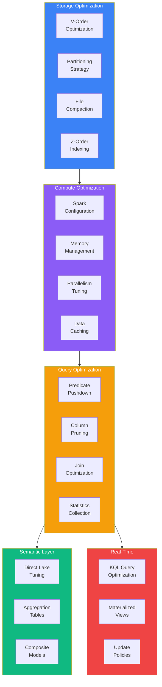
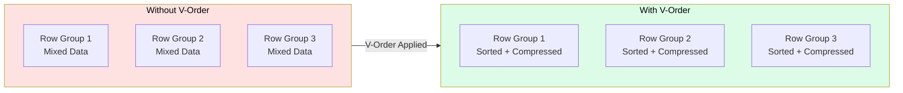
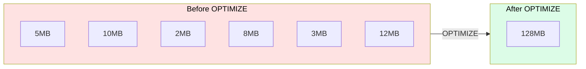
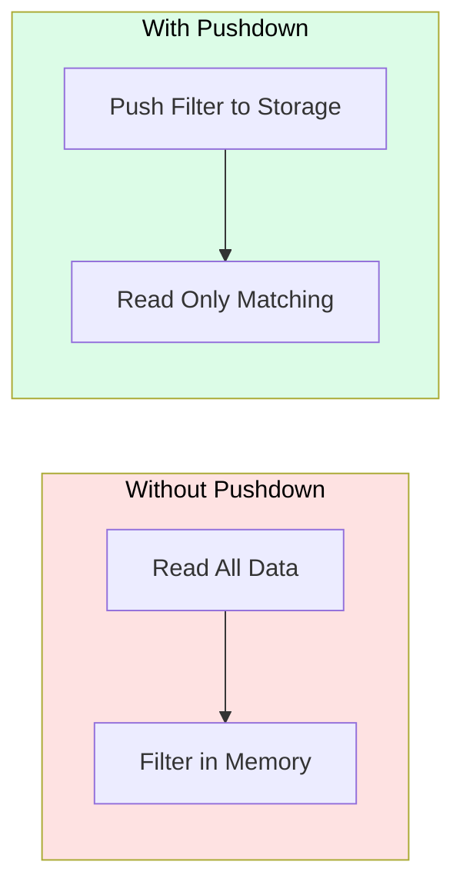
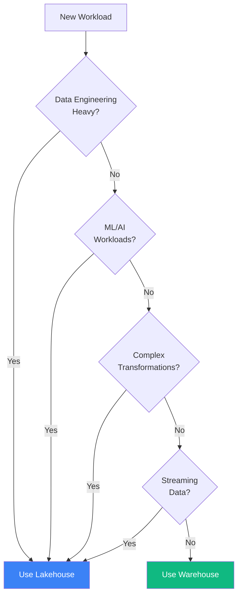
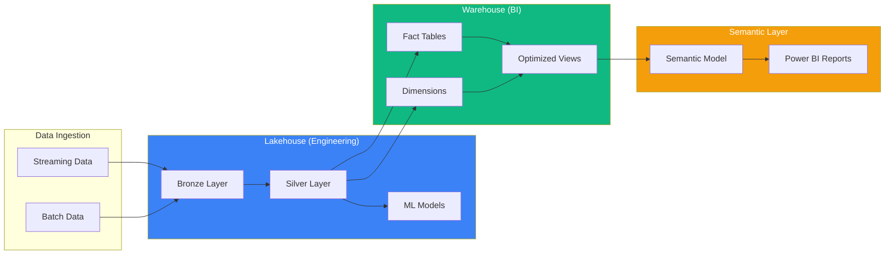
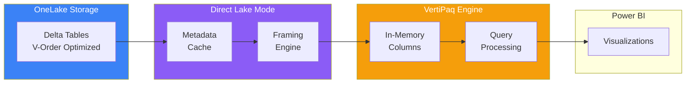
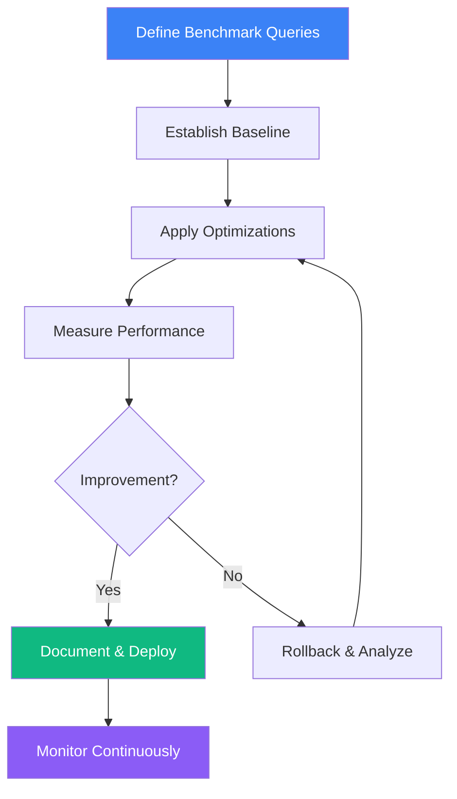

# Tutorial 16: Performance Tuning & Optimization

<div align="center">


</div>

> **[Home](../../index.md)** > **[Tutorials](../index.md)** > **Performance Tuning**

---

## Tutorial 16: Performance Tuning & Optimization

| | |
|---|---|
| **Difficulty** | Advanced |
| **Time** | 2.5 hours |
| **Focus** | Performance, Optimization, Benchmarking |

---

### Progress Tracker

```
+---------+---------+---------+---------+---------+---------+---------+---------+---------+---------+
|   00    |   01    |   02    |   03    |   04    |   05    |   06    |   07    |   08    |   09    |
|  SETUP  |  BRONZE |  SILVER |  GOLD   |   RT    |   PBI   |  PIPES  |   GOV   |  MIRROR |  AI/ML  |
+---------+---------+---------+---------+---------+---------+---------+---------+---------+---------+
|         |         |         |         |         |         |         |         |         |         |
+---------+---------+---------+---------+---------+---------+---------+---------+---------+---------+

+---------+---------+---------+---------+---------+---------+---------+---------+---------+---------+
|   10    |   11    |   12    |   13    |   14    |   15    |   16    |   17    |   18    |   19    |
| TERADATA|   SAS   |  CI/CD  | PLANNING| SECURITY|  COST   |  PERF   | MONITOR | DISASTER|    E2E  |
+---------+---------+---------+---------+---------+---------+---------+---------+---------+---------+
|         |         |         |         |         |         |         |         |         |         |
+---------+---------+---------+---------+---------+---------+---------+---------+---------+---------+
                                                              ^
                                                         YOU ARE HERE
```

| Navigation | |
|---|---|
| **Previous** | [15-Cost Management](../15-cost-optimization/README.md) |
| **Next** | [17-Monitoring & Alerting](../17-monitoring-alerting/README.md) |

---

## Overview

This tutorial provides comprehensive guidance on **optimizing performance** across all Microsoft Fabric workloads. You will learn techniques for tuning Delta Lake tables, optimizing Spark configurations, improving query performance, and establishing performance baselines for your casino analytics platform.

Performance optimization in Microsoft Fabric spans multiple layers:
- **Storage Layer** - V-Order, partitioning, file compaction
- **Compute Layer** - Spark configuration, resource allocation
- **Query Layer** - Predicate pushdown, join optimization
- **Semantic Layer** - Direct Lake tuning, aggregations
- **Real-Time Layer** - KQL query optimization

---

## Learning Objectives

By the end of this tutorial, you will be able to:

- [ ] Implement V-Order optimization for Delta Lake tables
- [ ] Design effective partitioning strategies for casino data
- [ ] Apply file compaction and Z-Order for multi-column queries
- [ ] Optimize Spark configurations for different workload types
- [ ] Tune Direct Lake semantic models for faster Power BI reports
- [ ] Implement caching strategies for frequently accessed data
- [ ] Optimize KQL queries for real-time analytics
- [ ] Establish performance baselines and benchmarking practices
- [ ] Choose between Lakehouse and Warehouse for specific workloads
- [ ] Monitor and continuously improve query performance

---

## Performance Optimization Architecture



---

## Prerequisites

Before starting this tutorial, ensure you have:

- [ ] Completed [Tutorial 00-03](../00-environment-setup/README.md) (Environment through Gold Layer)
- [ ] Bronze, Silver, and Gold Lakehouses with data loaded
- [ ] At least 1 million rows in slot telemetry tables
- [ ] Access to Fabric workspace with Contributor permissions
- [ ] Basic understanding of Delta Lake and Spark

> **Tip:** Performance tuning is most effective with realistic data volumes. If you have less than 1 million rows, generate additional test data using the data generators.

---

## Step 1: V-Order Optimization for Delta Lake

### 1.1 Understanding V-Order


*Source: [Delta Lake table optimization and V-Order](https://learn.microsoft.com/en-us/fabric/data-engineering/delta-optimization-and-v-order)*

V-Order is a Fabric-specific write optimization that applies special sorting, row group distribution, and compression to Parquet files. It provides:

- **15-50% faster reads** for analytical queries
- **Reduced storage costs** through better compression
- **Optimized for Direct Lake** mode in Power BI



### 1.2 Enable V-Order for Tables

V-Order is enabled by default in Fabric, but you can explicitly control it:

```python
# Cell 1: Check V-Order Status
# ============================
# Verify V-Order is enabled for your tables

from delta.tables import DeltaTable

# Check table properties
table_name = "gold_slot_performance"
delta_table = DeltaTable.forName(spark, table_name)

# Get table properties
properties = delta_table.detail().select("properties").collect()[0][0]
print(f"Table: {table_name}")
print(f"Properties: {properties}")

# V-Order should be enabled by default in Fabric
# Property: delta.parquet.vorder.enabled = true
```

```python
# Cell 2: Create V-Order Optimized Table
# ======================================
# Explicitly create a table with V-Order optimization

df_slot_perf = spark.table("silver_slot_enriched") \
    .groupBy("machine_id", "game_type", "denomination") \
    .agg(
        F.count("*").alias("total_spins"),
        F.sum("coin_in").alias("total_coin_in"),
        F.sum("coin_out").alias("total_coin_out"),
        F.avg("hold_percentage").alias("avg_hold_pct")
    )

# Write with V-Order enabled (default in Fabric)
df_slot_perf.write \
    .format("delta") \
    .mode("overwrite") \
    .option("delta.parquet.vorder.enabled", "true") \
    .saveAsTable("gold_slot_performance_vorder")

print("Table created with V-Order optimization")
```

### 1.3 V-Order Performance Comparison

```python
# Cell 3: Benchmark V-Order Performance
# =====================================
# Compare query performance with and without V-Order

import time

def benchmark_query(table_name: str, query_desc: str, iterations: int = 5):
    """Benchmark a query against a table."""
    times = []

    for i in range(iterations):
        spark.catalog.clearCache()

        start = time.time()
        df = spark.sql(f"""
            SELECT
                machine_id,
                SUM(coin_in) as total_coin_in,
                SUM(coin_out) as total_coin_out,
                COUNT(*) as spin_count
            FROM {table_name}
            WHERE event_date >= '2024-01-01'
            GROUP BY machine_id
            ORDER BY total_coin_in DESC
            LIMIT 100
        """)
        df.collect()
        elapsed = time.time() - start
        times.append(elapsed)

    avg_time = sum(times) / len(times)
    min_time = min(times)
    max_time = max(times)

    print(f"{query_desc}:")
    print(f"  Average: {avg_time:.3f}s | Min: {min_time:.3f}s | Max: {max_time:.3f}s")

    return avg_time

# Benchmark both tables
time_without = benchmark_query("gold_slot_performance", "Without V-Order")
time_with = benchmark_query("gold_slot_performance_vorder", "With V-Order")

improvement = ((time_without - time_with) / time_without) * 100
print(f"\nPerformance Improvement: {improvement:.1f}%")
```

---

## Step 2: Partitioning Strategies

### 2.1 Partitioning Decision Matrix

| Data Type | Recommended Partition | Rationale |
|-----------|----------------------|-----------|
| **Slot Telemetry** | `event_date` | Time-series queries, daily aggregations |
| **Player Activity** | `event_date` | Session analysis by date |
| **Financial Transactions** | `transaction_date` | Daily reconciliation |
| **Player Profiles** | `loyalty_tier` | Segment-based analysis |
| **Compliance Data** | `report_date`, `report_type` | Regulatory reporting |

### 2.2 Partition by Date (Most Common)

```python
# Cell 4: Date-Based Partitioning
# ===============================
# Optimal for time-series data like slot telemetry

from pyspark.sql import functions as F

# Read source data
df_telemetry = spark.table("bronze_slot_telemetry")

# Add partition column if not exists
df_partitioned = df_telemetry \
    .withColumn("event_date", F.to_date("event_timestamp"))

# Write with date partitioning
df_partitioned.write \
    .format("delta") \
    .mode("overwrite") \
    .partitionBy("event_date") \
    .option("delta.parquet.vorder.enabled", "true") \
    .saveAsTable("silver_slot_telemetry_partitioned")

print("Table partitioned by event_date")

# Verify partition structure
partitions = spark.sql("""
    DESCRIBE DETAIL silver_slot_telemetry_partitioned
""").select("numFiles", "sizeInBytes").collect()[0]

print(f"Number of files: {partitions[0]}")
print(f"Total size: {partitions[1] / (1024*1024):.2f} MB")
```

### 2.3 Multi-Level Partitioning

```python
# Cell 5: Multi-Level Partitioning
# ================================
# For large tables with multiple access patterns

# Casino floor data partitioned by date and region
df_floor = spark.table("bronze_floor_activity")

df_floor_partitioned = df_floor \
    .withColumn("event_date", F.to_date("event_timestamp")) \
    .withColumn("region", F.col("floor_section"))

# Write with hierarchical partitioning
df_floor_partitioned.write \
    .format("delta") \
    .mode("overwrite") \
    .partitionBy("event_date", "region") \
    .saveAsTable("silver_floor_activity_partitioned")

# Query benefits from partition pruning
spark.sql("""
    SELECT *
    FROM silver_floor_activity_partitioned
    WHERE event_date = '2024-01-15'
      AND region = 'HIGH_LIMIT'
""").explain(True)  # Shows partition pruning in plan
```

### 2.4 Partition by Player Tier

```python
# Cell 6: Tier-Based Partitioning
# ===============================
# For player analytics with tier-based access patterns

df_player = spark.table("silver_player_enriched")

# Partition by loyalty tier for tier-specific analysis
df_player.write \
    .format("delta") \
    .mode("overwrite") \
    .partitionBy("loyalty_tier") \
    .option("delta.parquet.vorder.enabled", "true") \
    .saveAsTable("gold_player_by_tier")

# Verify partition distribution
spark.sql("""
    SELECT
        loyalty_tier,
        COUNT(*) as player_count
    FROM gold_player_by_tier
    GROUP BY loyalty_tier
    ORDER BY player_count DESC
""").show()
```

### 2.5 Partitioning Best Practices

| Practice | Recommendation |
|----------|---------------|
| **Partition Column Cardinality** | 10-10,000 distinct values |
| **Partition Size** | Target 100MB - 1GB per partition |
| **Over-Partitioning** | Avoid too many small files |
| **Under-Partitioning** | Avoid single huge partitions |
| **Query Alignment** | Partition on frequently filtered columns |

---

## Step 3: File Compaction and OPTIMIZE

### 3.1 Understanding Small File Problem



### 3.2 OPTIMIZE Command

```python
# Cell 7: File Compaction with OPTIMIZE
# =====================================
# Compact small files into larger, more efficient files

# Check current file count before optimization
before_stats = spark.sql("""
    DESCRIBE DETAIL silver_slot_telemetry_partitioned
""").select("numFiles", "sizeInBytes").collect()[0]

print(f"Before OPTIMIZE:")
print(f"  Files: {before_stats[0]}")
print(f"  Size: {before_stats[1] / (1024*1024):.2f} MB")
print(f"  Avg file size: {before_stats[1] / before_stats[0] / (1024*1024):.2f} MB")

# Run OPTIMIZE
spark.sql("""
    OPTIMIZE silver_slot_telemetry_partitioned
""")

# Check after optimization
after_stats = spark.sql("""
    DESCRIBE DETAIL silver_slot_telemetry_partitioned
""").select("numFiles", "sizeInBytes").collect()[0]

print(f"\nAfter OPTIMIZE:")
print(f"  Files: {after_stats[0]}")
print(f"  Size: {after_stats[1] / (1024*1024):.2f} MB")
print(f"  Avg file size: {after_stats[1] / after_stats[0] / (1024*1024):.2f} MB")

reduction = ((before_stats[0] - after_stats[0]) / before_stats[0]) * 100
print(f"\nFile count reduction: {reduction:.1f}%")
```

### 3.3 OPTIMIZE with WHERE Clause

```python
# Cell 8: Incremental OPTIMIZE
# ============================
# Optimize only recent partitions for efficiency

from datetime import datetime, timedelta

# Calculate date range for recent data
end_date = datetime.now().strftime('%Y-%m-%d')
start_date = (datetime.now() - timedelta(days=7)).strftime('%Y-%m-%d')

# Optimize only recent partitions
spark.sql(f"""
    OPTIMIZE silver_slot_telemetry_partitioned
    WHERE event_date >= '{start_date}'
      AND event_date <= '{end_date}'
""")

print(f"Optimized partitions from {start_date} to {end_date}")
```

### 3.4 Z-Order for Multi-Column Queries

Z-Order co-locates related data in the same files, improving query performance when filtering on multiple columns.

```python
# Cell 9: Z-Order Optimization
# ============================
# Optimize for multi-column query patterns

# Z-Order by frequently filtered columns together
spark.sql("""
    OPTIMIZE gold_slot_performance
    ZORDER BY (machine_id, game_type)
""")

print("Z-Order applied on machine_id and game_type")

# This benefits queries like:
# SELECT * FROM gold_slot_performance
# WHERE machine_id = 'SLOT-001' AND game_type = 'VIDEO_POKER'
```

### 3.5 OPTIMIZE Scheduling

```python
# Cell 10: Automated OPTIMIZE Pipeline
# ====================================
# Schedule OPTIMIZE as part of data pipeline

def optimize_table_with_logging(table_name: str, zorder_columns: list = None):
    """Optimize a Delta table with logging."""
    import time

    start = time.time()

    # Get before stats
    before = spark.sql(f"DESCRIBE DETAIL {table_name}").collect()[0]

    # Build OPTIMIZE command
    if zorder_columns:
        zorder_clause = f"ZORDER BY ({', '.join(zorder_columns)})"
        spark.sql(f"OPTIMIZE {table_name} {zorder_clause}")
    else:
        spark.sql(f"OPTIMIZE {table_name}")

    # Get after stats
    after = spark.sql(f"DESCRIBE DETAIL {table_name}").collect()[0]

    elapsed = time.time() - start

    print(f"Table: {table_name}")
    print(f"  Duration: {elapsed:.2f}s")
    print(f"  Files: {before['numFiles']} -> {after['numFiles']}")
    print(f"  Size: {before['sizeInBytes']/(1024*1024):.2f}MB -> {after['sizeInBytes']/(1024*1024):.2f}MB")

    return {
        "table": table_name,
        "duration_seconds": elapsed,
        "files_before": before['numFiles'],
        "files_after": after['numFiles']
    }

# Example: Optimize multiple tables
tables_to_optimize = [
    ("gold_slot_performance", ["machine_id", "game_type"]),
    ("gold_player_360", ["player_id"]),
    ("gold_daily_revenue", ["revenue_date", "property_id"])
]

for table_name, zorder_cols in tables_to_optimize:
    try:
        optimize_table_with_logging(table_name, zorder_cols)
    except Exception as e:
        print(f"Error optimizing {table_name}: {e}")
```

---

## Step 4: Query Optimization Patterns

### 4.1 Predicate Pushdown



```python
# Cell 11: Predicate Pushdown Verification
# ========================================
# Ensure filters are pushed down to storage layer

# Good: Filter pushed to storage
query_good = """
    SELECT machine_id, SUM(coin_in) as total_coin_in
    FROM silver_slot_telemetry_partitioned
    WHERE event_date = '2024-01-15'
      AND machine_id LIKE 'SLOT-001%'
    GROUP BY machine_id
"""

# Explain shows partition pruning and filter pushdown
print("Query Execution Plan:")
spark.sql(query_good).explain(True)

# Look for:
# - PartitionFilters: [event_date = 2024-01-15]
# - PushedFilters: [machine_id LIKE 'SLOT-001%']
```

### 4.2 Column Pruning

```python
# Cell 12: Column Pruning Best Practices
# ======================================
# Select only needed columns to reduce I/O

# Bad: SELECT * reads all columns
query_bad = """
    SELECT *
    FROM silver_slot_telemetry_partitioned
    WHERE event_date = '2024-01-15'
"""

# Good: Select only needed columns
query_good = """
    SELECT
        machine_id,
        event_timestamp,
        coin_in,
        coin_out
    FROM silver_slot_telemetry_partitioned
    WHERE event_date = '2024-01-15'
"""

# Compare read bytes
import time

# Test SELECT *
spark.catalog.clearCache()
start = time.time()
df_bad = spark.sql(query_bad)
df_bad.write.format("noop").mode("overwrite").save()
time_bad = time.time() - start

# Test SELECT specific columns
spark.catalog.clearCache()
start = time.time()
df_good = spark.sql(query_good)
df_good.write.format("noop").mode("overwrite").save()
time_good = time.time() - start

print(f"SELECT *:           {time_bad:.3f}s")
print(f"SELECT columns:     {time_good:.3f}s")
print(f"Improvement:        {((time_bad - time_good) / time_bad) * 100:.1f}%")
```

### 4.3 Join Optimization

```python
# Cell 13: Join Optimization Strategies
# =====================================
# Optimize joins for casino analytics queries

from pyspark.sql import functions as F

# Read tables
df_transactions = spark.table("silver_slot_transactions")
df_players = spark.table("silver_player_profile")
df_machines = spark.table("dim_slot_machines")

# Strategy 1: Broadcast small tables
# For tables < 10MB, broadcast to all executors
df_result = df_transactions.join(
    F.broadcast(df_machines),
    on="machine_id",
    how="inner"
)

# Strategy 2: Filter before join
# Reduce data volume before expensive joins
df_filtered = df_transactions.filter(
    F.col("event_date") == "2024-01-15"
)

df_result = df_filtered.join(
    df_players,
    on="player_id",
    how="inner"
)

# Strategy 3: Use join hints
df_result = df_transactions.hint("merge").join(
    df_players,
    on="player_id",
    how="inner"
)

# View execution plan
df_result.explain(True)
```

### 4.4 Aggregate Optimization

```python
# Cell 14: Aggregation Optimization
# =================================
# Optimize GROUP BY and window functions

# Pre-aggregate at lower granularity
# Instead of aggregating raw telemetry every time,
# create summary tables

# Hourly slot summary
df_hourly = spark.sql("""
    SELECT
        machine_id,
        date_trunc('hour', event_timestamp) as event_hour,
        COUNT(*) as spin_count,
        SUM(coin_in) as total_coin_in,
        SUM(coin_out) as total_coin_out,
        SUM(CASE WHEN is_jackpot THEN 1 ELSE 0 END) as jackpot_count
    FROM silver_slot_telemetry_partitioned
    GROUP BY
        machine_id,
        date_trunc('hour', event_timestamp)
""")

df_hourly.write \
    .format("delta") \
    .mode("overwrite") \
    .partitionBy("event_hour") \
    .saveAsTable("gold_slot_hourly_summary")

print("Hourly summary table created for faster aggregations")
```

---

## Step 5: Lakehouse vs Warehouse Decision Matrix


*Source: [OneLake, the OneDrive for data](https://learn.microsoft.com/en-us/fabric/onelake/onelake-overview)*

### 5.1 Workload Comparison

| Criteria | Lakehouse | Warehouse |
|----------|-----------|-----------|
| **Query Language** | Spark SQL, Python | T-SQL |
| **Data Format** | Delta Lake (Parquet) | Proprietary |
| **Best For** | Data engineering, ML, exploration | BI, ad-hoc queries, reporting |
| **Concurrency** | High (Spark) | Very High (distributed query) |
| **Query Patterns** | Complex transforms, joins | Star schema, aggregations |
| **Direct Lake** | Yes (native) | Yes (via SQL endpoint) |
| **Cost Model** | Compute Units (CU) | Compute Units (CU) |

### 5.2 When to Use Lakehouse



### 5.3 When to Use Warehouse

```python
# Cell 15: Warehouse for BI-Optimized Queries
# ===========================================
# Create optimized tables in Warehouse for reporting

# In Fabric Warehouse SQL:
"""
-- Create dimension table with clustered columnstore
CREATE TABLE dim_player (
    player_id VARCHAR(50) NOT NULL,
    player_name VARCHAR(200),
    loyalty_tier VARCHAR(20),
    enrollment_date DATE,
    home_property VARCHAR(50),
    player_segment VARCHAR(50)
);

-- Create fact table with distribution
CREATE TABLE fact_slot_activity (
    activity_id BIGINT NOT NULL,
    player_id VARCHAR(50),
    machine_id VARCHAR(50),
    activity_date DATE,
    coin_in DECIMAL(18,2),
    coin_out DECIMAL(18,2),
    theo_win DECIMAL(18,2)
)
WITH (
    DISTRIBUTION = HASH(player_id),
    CLUSTERED COLUMNSTORE INDEX
);

-- Create statistics for query optimization
CREATE STATISTICS stat_player_id ON fact_slot_activity(player_id);
CREATE STATISTICS stat_activity_date ON fact_slot_activity(activity_date);
"""

print("Warehouse tables optimized for star schema queries")
```

### 5.4 Hybrid Architecture



---

## Step 6: Direct Lake Performance Tuning

### 6.1 Direct Lake Architecture


*Source: [Direct Lake overview](https://learn.microsoft.com/en-us/fabric/get-started/direct-lake-overview)*



### 6.2 Direct Lake Optimization Checklist

| Optimization | Description | Impact |
|--------------|-------------|--------|
| **V-Order Enabled** | Faster column reads | High |
| **Small Files Eliminated** | OPTIMIZE regularly | High |
| **Partition Pruning** | Use date partitions | Medium |
| **Column Selection** | Only needed columns | Medium |
| **Row-Level Security** | Apply at model level | Low |

### 6.3 Framing Optimization

```python
# Cell 16: Optimize Tables for Direct Lake
# ========================================
# Prepare tables for optimal Direct Lake performance

# List of tables used by Direct Lake semantic model
direct_lake_tables = [
    "gold_player_360",
    "gold_slot_performance",
    "gold_daily_revenue",
    "dim_calendar",
    "dim_property",
    "dim_slot_machine"
]

for table in direct_lake_tables:
    print(f"\nOptimizing {table} for Direct Lake...")

    # 1. Run OPTIMIZE with V-Order
    spark.sql(f"OPTIMIZE {table}")

    # 2. Check file statistics
    stats = spark.sql(f"DESCRIBE DETAIL {table}").collect()[0]
    print(f"  Files: {stats['numFiles']}")
    print(f"  Size: {stats['sizeInBytes'] / (1024*1024):.2f} MB")
    print(f"  Avg file size: {stats['sizeInBytes'] / max(stats['numFiles'], 1) / (1024*1024):.2f} MB")

    # 3. Warn if too many small files
    avg_size_mb = stats['sizeInBytes'] / max(stats['numFiles'], 1) / (1024*1024)
    if avg_size_mb < 50:
        print(f"  WARNING: Average file size ({avg_size_mb:.2f} MB) is small. Consider more aggressive OPTIMIZE.")

print("\nDirect Lake optimization complete")
```

### 6.4 Semantic Model Aggregations

```dax
// DAX Measure with Aggregation Awareness
// ======================================
// Create aggregation tables for common patterns

// In Power BI Desktop or Fabric Semantic Model:

// 1. Create aggregation table for daily revenue
Daily Revenue Agg =
SUMMARIZE(
    fact_SlotActivity,
    dim_Calendar[Date],
    dim_Property[PropertyID],
    "Total Coin In", SUM(fact_SlotActivity[CoinIn]),
    "Total Coin Out", SUM(fact_SlotActivity[CoinOut]),
    "Total Theo Win", SUM(fact_SlotActivity[TheoWin]),
    "Spin Count", COUNT(fact_SlotActivity[ActivityID])
)

// 2. Set aggregation behavior
// In Model view, select aggregation table
// Map columns to detail table
// Set aggregation type (Sum, Count, etc.)
```

---

## Step 7: Spark Configuration Tuning


*Source: [Configure Apache Spark in Microsoft Fabric](https://learn.microsoft.com/en-us/fabric/data-engineering/spark-compute)*

### 7.1 Key Spark Configurations

| Configuration | Default | Recommendation | Use Case |
|---------------|---------|----------------|----------|
| `spark.sql.shuffle.partitions` | 200 | 2x CPU cores | Shuffle operations |
| `spark.sql.files.maxPartitionBytes` | 128MB | 256MB for large files | File reading |
| `spark.sql.autoBroadcastJoinThreshold` | 10MB | 50MB for small dims | Broadcast joins |
| `spark.sql.adaptive.enabled` | true | true | Adaptive query execution |
| `spark.databricks.delta.optimizeWrite.enabled` | true | true | Write optimization |

### 7.2 Configure Spark Session

```python
# Cell 17: Spark Configuration for Casino Analytics
# =================================================
# Optimize Spark settings for casino workloads

# View current configuration
print("Current Spark Configuration:")
print(f"  shuffle.partitions: {spark.conf.get('spark.sql.shuffle.partitions')}")
print(f"  maxPartitionBytes: {spark.conf.get('spark.sql.files.maxPartitionBytes')}")
print(f"  autoBroadcastJoinThreshold: {spark.conf.get('spark.sql.autoBroadcastJoinThreshold')}")
print(f"  adaptive.enabled: {spark.conf.get('spark.sql.adaptive.enabled')}")

# Configure for large slot telemetry processing
spark.conf.set("spark.sql.shuffle.partitions", "400")  # For F64 capacity
spark.conf.set("spark.sql.files.maxPartitionBytes", "268435456")  # 256MB
spark.conf.set("spark.sql.autoBroadcastJoinThreshold", "52428800")  # 50MB
spark.conf.set("spark.sql.adaptive.enabled", "true")
spark.conf.set("spark.sql.adaptive.coalescePartitions.enabled", "true")
spark.conf.set("spark.databricks.delta.optimizeWrite.enabled", "true")
spark.conf.set("spark.databricks.delta.autoCompact.enabled", "true")

print("\nUpdated Spark Configuration:")
print(f"  shuffle.partitions: {spark.conf.get('spark.sql.shuffle.partitions')}")
print(f"  maxPartitionBytes: {spark.conf.get('spark.sql.files.maxPartitionBytes')}")
print(f"  autoBroadcastJoinThreshold: {spark.conf.get('spark.sql.autoBroadcastJoinThreshold')}")
```

### 7.3 Workload-Specific Configurations

```python
# Cell 18: Workload-Specific Spark Configs
# ========================================
# Configure based on workload type

def configure_for_workload(workload_type: str):
    """Configure Spark for specific workload types."""

    configs = {
        "batch_ingestion": {
            "spark.sql.shuffle.partitions": "200",
            "spark.databricks.delta.optimizeWrite.enabled": "true",
            "spark.databricks.delta.autoCompact.enabled": "true",
            "spark.sql.files.maxPartitionBytes": "134217728"  # 128MB
        },
        "aggregation": {
            "spark.sql.shuffle.partitions": "400",
            "spark.sql.adaptive.enabled": "true",
            "spark.sql.adaptive.coalescePartitions.enabled": "true",
            "spark.sql.autoBroadcastJoinThreshold": "104857600"  # 100MB
        },
        "ml_training": {
            "spark.sql.shuffle.partitions": "100",
            "spark.sql.execution.arrow.pyspark.enabled": "true",
            "spark.sql.execution.arrow.maxRecordsPerBatch": "50000",
            "spark.driver.maxResultSize": "4g"
        },
        "interactive": {
            "spark.sql.shuffle.partitions": "50",
            "spark.sql.adaptive.enabled": "true",
            "spark.sql.adaptive.localShuffleReader.enabled": "true",
            "spark.databricks.delta.stalenessLimit": "1h"
        }
    }

    if workload_type not in configs:
        print(f"Unknown workload type: {workload_type}")
        return

    print(f"Configuring Spark for {workload_type}...")
    for key, value in configs[workload_type].items():
        spark.conf.set(key, value)
        print(f"  {key} = {value}")

# Example: Configure for aggregation workload
configure_for_workload("aggregation")
```

---

## Step 8: Caching Strategies

### 8.1 Caching Options in Fabric

| Cache Type | Scope | Persistence | Use Case |
|------------|-------|-------------|----------|
| **Result Cache** | Query | Session | Repeated queries |
| **Dataset Cache** | Table/DataFrame | Session | Iterative processing |
| **Delta Cache** | Files | Disk | Frequently accessed data |
| **Direct Lake Cache** | Semantic Model | Memory | Power BI queries |

### 8.2 DataFrame Caching

```python
# Cell 19: DataFrame Caching for Iterative Processing
# ===================================================
# Cache frequently accessed DataFrames

# Read dimension tables that will be used multiple times
df_players = spark.table("dim_player")
df_machines = spark.table("dim_slot_machine")
df_calendar = spark.table("dim_calendar")

# Cache small dimension tables
df_players.cache()
df_machines.cache()
df_calendar.cache()

# Force materialization
df_players.count()
df_machines.count()
df_calendar.count()

print("Dimension tables cached:")
print(f"  Players: {df_players.count():,} rows")
print(f"  Machines: {df_machines.count():,} rows")
print(f"  Calendar: {df_calendar.count():,} rows")

# View cache status
print("\nCache Status:")
for (id, rdd) in spark.sparkContext._jsc.sc().getRDDStorageInfo():
    print(f"  RDD {id}: {rdd.memSize()} bytes in memory")
```

### 8.3 Persist with Storage Level

```python
# Cell 20: Persist with Custom Storage Levels
# ============================================
# Choose appropriate storage level based on data size

from pyspark import StorageLevel

# For data that fits in memory
df_high_value_players = spark.sql("""
    SELECT * FROM gold_player_360
    WHERE lifetime_value > 10000
""")
df_high_value_players.persist(StorageLevel.MEMORY_AND_DISK)

# For large data with serialization
df_all_transactions = spark.table("silver_slot_transactions")
df_all_transactions.persist(StorageLevel.MEMORY_AND_DISK_SER)

print("Persisted DataFrames:")
print(f"  High-value players: {df_high_value_players.count():,} rows")
print(f"  All transactions: {df_all_transactions.count():,} rows")

# Clean up when done
# df_high_value_players.unpersist()
# df_all_transactions.unpersist()
```

### 8.4 Delta Cache

```python
# Cell 21: Delta Cache Configuration
# ==================================
# Enable Delta caching for frequently accessed tables

# Delta cache is automatic in Fabric, but you can optimize

# Check if Delta cache is being used
spark.sql("""
    SELECT
        table_name,
        cached_bytes,
        last_accessed
    FROM system.delta_cache_info
    ORDER BY last_accessed DESC
""").show(truncate=False)

# Warm the cache for critical tables
critical_tables = [
    "gold_player_360",
    "gold_slot_performance",
    "fact_daily_revenue"
]

for table in critical_tables:
    print(f"Warming cache for {table}...")
    spark.sql(f"SELECT COUNT(*) FROM {table}").collect()

print("\nDelta cache warmed for critical tables")
```

---

## Step 9: Real-Time Query Optimization (KQL)

### 9.1 KQL Query Best Practices

| Practice | Bad Example | Good Example |
|----------|-------------|--------------|
| **Filter Early** | `Table \| project cols \| where condition` | `Table \| where condition \| project cols` |
| **Limit Results** | `Table \| summarize ...` | `Table \| summarize ... \| take 1000` |
| **Use Materialized Views** | Repeat complex query | Use `materialized_view()` |
| **Index Usage** | Full table scan | Use indexed columns |

### 9.2 Optimized KQL for Casino Real-Time

```kql
// KQL Query Optimization Examples
// ================================

// Bad: Late filtering
SlotEvents
| project machine_id, event_type, coin_in, event_time
| where event_time > ago(1h)
| where machine_id startswith "SLOT-001"

// Good: Early filtering
SlotEvents
| where event_time > ago(1h)
| where machine_id startswith "SLOT-001"
| project machine_id, event_type, coin_in, event_time

// ================================

// Optimized real-time slot monitoring
SlotEvents
| where event_time > ago(5m)
| summarize
    spin_count = count(),
    total_coin_in = sum(coin_in),
    total_coin_out = sum(coin_out),
    jackpot_count = countif(is_jackpot == true),
    avg_hold_pct = avg(hold_percentage)
    by machine_id, bin(event_time, 1m)
| order by event_time desc
| take 100

// ================================

// Player session real-time tracking
PlayerSessions
| where session_start > ago(30m)
| summarize
    active_sessions = dcount(session_id),
    total_coin_in = sum(session_coin_in),
    avg_session_duration = avg(session_duration_minutes)
    by loyalty_tier, bin(session_start, 5m)
| order by session_start desc

// ================================

// Jackpot alert query (optimized for low latency)
SlotEvents
| where event_time > ago(1m)
| where is_jackpot == true
| project
    event_time,
    machine_id,
    player_id,
    jackpot_amount = coin_out,
    game_type
| order by event_time desc
| take 10
```

### 9.3 Materialized Views for Real-Time

```kql
// Create materialized view for hourly aggregations
// This pre-computes results for faster queries

.create materialized-view with (
    lookback = 24h,
    autoUpdateSchema = true
) SlotHourlyStats on table SlotEvents
{
    SlotEvents
    | summarize
        spin_count = count(),
        total_coin_in = sum(coin_in),
        total_coin_out = sum(coin_out),
        unique_players = dcount(player_id)
        by machine_id, bin(event_time, 1h)
}

// Query the materialized view (much faster)
SlotHourlyStats
| where event_time > ago(24h)
| summarize
    daily_spins = sum(spin_count),
    daily_coin_in = sum(total_coin_in)
    by machine_id
| top 10 by daily_coin_in desc
```

---

## Step 10: Benchmarking and Baseline Establishment

### 10.1 Benchmark Framework



### 10.2 Benchmark Query Suite

```python
# Cell 22: Performance Benchmark Suite
# ====================================
# Standard queries for performance measurement

import time
import pandas as pd
from typing import Dict, List

class PerformanceBenchmark:
    """Casino analytics performance benchmark suite."""

    def __init__(self, spark_session):
        self.spark = spark_session
        self.results = []

    def run_query(self, name: str, query: str, iterations: int = 3) -> Dict:
        """Run a query multiple times and collect metrics."""
        times = []

        for i in range(iterations):
            self.spark.catalog.clearCache()

            start = time.time()
            df = self.spark.sql(query)
            row_count = df.count()
            elapsed = time.time() - start
            times.append(elapsed)

        result = {
            "query_name": name,
            "avg_time_seconds": sum(times) / len(times),
            "min_time_seconds": min(times),
            "max_time_seconds": max(times),
            "row_count": row_count,
            "iterations": iterations
        }

        self.results.append(result)
        return result

    def run_benchmark_suite(self) -> pd.DataFrame:
        """Run all benchmark queries."""

        queries = {
            "slot_daily_summary": """
                SELECT
                    event_date,
                    COUNT(*) as spin_count,
                    SUM(coin_in) as total_coin_in,
                    SUM(coin_out) as total_coin_out
                FROM silver_slot_telemetry_partitioned
                WHERE event_date >= date_sub(current_date(), 30)
                GROUP BY event_date
                ORDER BY event_date
            """,

            "player_360_lookup": """
                SELECT *
                FROM gold_player_360
                WHERE player_id IN (
                    SELECT player_id
                    FROM gold_player_360
                    ORDER BY lifetime_value DESC
                    LIMIT 100
                )
            """,

            "machine_performance": """
                SELECT
                    machine_id,
                    game_type,
                    SUM(coin_in) as total_coin_in,
                    AVG(hold_percentage) as avg_hold
                FROM gold_slot_performance
                GROUP BY machine_id, game_type
                ORDER BY total_coin_in DESC
                LIMIT 50
            """,

            "revenue_trend": """
                SELECT
                    revenue_date,
                    property_id,
                    SUM(gaming_revenue) as total_gaming,
                    SUM(food_beverage_revenue) as total_fb
                FROM gold_daily_revenue
                WHERE revenue_date >= date_sub(current_date(), 90)
                GROUP BY revenue_date, property_id
                ORDER BY revenue_date, property_id
            """,

            "compliance_check": """
                SELECT
                    player_id,
                    SUM(CASE WHEN amount >= 10000 THEN 1 ELSE 0 END) as ctr_count,
                    SUM(amount) as total_amount
                FROM silver_financial_transactions
                WHERE transaction_date >= date_sub(current_date(), 30)
                GROUP BY player_id
                HAVING SUM(amount) >= 10000
            """
        }

        print("Running Performance Benchmark Suite")
        print("=" * 60)

        for name, query in queries.items():
            print(f"\nRunning: {name}")
            result = self.run_query(name, query)
            print(f"  Avg: {result['avg_time_seconds']:.3f}s | Rows: {result['row_count']:,}")

        return pd.DataFrame(self.results)

# Run benchmarks
benchmark = PerformanceBenchmark(spark)
results_df = benchmark.run_benchmark_suite()

print("\n" + "=" * 60)
print("BENCHMARK RESULTS SUMMARY")
print("=" * 60)
print(results_df.to_string(index=False))
```

### 10.3 Save Baseline Results

```python
# Cell 23: Save Benchmark Baseline
# ================================
# Store baseline for comparison after optimizations

from datetime import datetime

# Add metadata to results
results_df["run_timestamp"] = datetime.now()
results_df["environment"] = "production"
results_df["fabric_capacity"] = "F64"
results_df["optimization_version"] = "baseline"

# Convert to Spark DataFrame and save
df_baseline = spark.createDataFrame(results_df)

df_baseline.write \
    .format("delta") \
    .mode("append") \
    .option("mergeSchema", "true") \
    .saveAsTable("admin_performance_baselines")

print("Baseline saved to admin_performance_baselines")

# View historical baselines
spark.sql("""
    SELECT
        query_name,
        optimization_version,
        avg_time_seconds,
        run_timestamp
    FROM admin_performance_baselines
    ORDER BY run_timestamp DESC
""").show(truncate=False)
```

### 10.4 Performance Comparison

```python
# Cell 24: Compare Before/After Optimizations
# ===========================================
# Compare performance across optimization versions

def compare_performance():
    """Compare performance across optimization versions."""

    comparison = spark.sql("""
        WITH baseline AS (
            SELECT query_name, avg_time_seconds as baseline_time
            FROM admin_performance_baselines
            WHERE optimization_version = 'baseline'
        ),
        optimized AS (
            SELECT query_name, avg_time_seconds as optimized_time
            FROM admin_performance_baselines
            WHERE optimization_version = 'optimized_v1'
        )
        SELECT
            b.query_name,
            b.baseline_time,
            o.optimized_time,
            ROUND((b.baseline_time - o.optimized_time) / b.baseline_time * 100, 1)
                as improvement_pct
        FROM baseline b
        JOIN optimized o ON b.query_name = o.query_name
        ORDER BY improvement_pct DESC
    """)

    print("=" * 70)
    print("PERFORMANCE COMPARISON: BASELINE vs OPTIMIZED")
    print("=" * 70)
    comparison.show(truncate=False)

    # Calculate overall improvement
    overall = spark.sql("""
        SELECT
            optimization_version,
            AVG(avg_time_seconds) as avg_query_time,
            SUM(avg_time_seconds) as total_time
        FROM admin_performance_baselines
        GROUP BY optimization_version
        ORDER BY optimization_version
    """)

    print("\nOVERALL SUMMARY:")
    overall.show(truncate=False)

compare_performance()
```

---

## Performance Optimization Summary Table

| Technique | Target | Improvement | When to Apply |
|-----------|--------|-------------|---------------|
| **V-Order** | Storage | 15-50% reads | All tables |
| **Partitioning** | Storage | 10-100x for filtered queries | Large tables (>1M rows) |
| **OPTIMIZE** | Storage | 2-10x fewer files | After bulk inserts |
| **Z-Order** | Storage | 2-5x for multi-column | Frequently co-filtered columns |
| **Column Pruning** | Query | 20-80% I/O reduction | All queries |
| **Predicate Pushdown** | Query | 10-100x for filtered | Partition/indexed columns |
| **Broadcast Joins** | Query | 2-10x join performance | Small dimension tables |
| **Caching** | Compute | 5-100x repeated queries | Iterative processing |
| **Spark Config** | Compute | 10-50% overall | Workload-specific |
| **Direct Lake Tuning** | BI | 2-5x report refresh | Power BI models |

---

## Validation Checklist

Before moving to the next tutorial, verify:

- [ ] **V-Order Enabled** - All Gold tables have V-Order optimization
- [ ] **Partitioning Applied** - Large tables partitioned by date/key
- [ ] **Files Optimized** - OPTIMIZE run on all major tables
- [ ] **Z-Order Applied** - Multi-column tables have Z-Order
- [ ] **Query Plans Verified** - Predicate pushdown confirmed
- [ ] **Baseline Established** - Performance metrics saved
- [ ] **Spark Configured** - Optimal settings for workload
- [ ] **Direct Lake Ready** - Tables prepared for semantic model

<details>
<summary>Verification Commands</summary>

### Verify V-Order

```python
# Check V-Order is enabled
for table in ["gold_player_360", "gold_slot_performance"]:
    props = DeltaTable.forName(spark, table).detail() \
        .select("properties").collect()[0][0]
    vorder = props.get("delta.parquet.vorder.enabled", "not set")
    print(f"{table}: V-Order = {vorder}")
```

### Check File Statistics

```python
# Verify file compaction
for table in ["gold_player_360", "gold_slot_performance"]:
    stats = spark.sql(f"DESCRIBE DETAIL {table}").collect()[0]
    avg_size = stats["sizeInBytes"] / max(stats["numFiles"], 1) / (1024*1024)
    status = "OK" if avg_size > 50 else "NEEDS OPTIMIZE"
    print(f"{table}: {stats['numFiles']} files, {avg_size:.1f} MB avg - {status}")
```

### Validate Predicate Pushdown

```python
# Check query plan shows filter pushdown
query = """
    SELECT * FROM silver_slot_telemetry_partitioned
    WHERE event_date = '2024-01-15'
    LIMIT 10
"""
spark.sql(query).explain(True)
# Look for "PartitionFilters" and "PushedFilters" in plan
```

</details>

---

## Troubleshooting

| Issue | Symptom | Solution |
|-------|---------|----------|
| Slow queries after OPTIMIZE | Query time increased | Check Z-Order columns, may need different ordering |
| Out of memory | Job fails with OOM | Reduce shuffle partitions, increase node memory |
| Partition skew | One partition slow | Rebalance data or use salting |
| Cache not working | Repeated queries slow | Check cache size, use MEMORY_AND_DISK |
| Direct Lake fallback | Import mode triggered | Check table size, optimize parquet files |
| Small file problem | Thousands of tiny files | Run OPTIMIZE more frequently |

---

## Best Practices

1. **Measure First** - Establish baselines before optimizing
2. **Optimize Incrementally** - One change at a time, measure impact
3. **Monitor Continuously** - Track query performance over time
4. **Automate Maintenance** - Schedule OPTIMIZE and VACUUM
5. **Right-Size Partitions** - 100MB-1GB per partition
6. **Use V-Order Always** - Enable by default in Fabric
7. **Cache Wisely** - Cache dimension tables, not fact tables
8. **Configure for Workload** - Different settings for batch vs. interactive
9. **Document Changes** - Track what optimizations were applied
10. **Review Regularly** - Revisit as data volumes grow

---

## Summary

You have successfully learned to optimize performance across Microsoft Fabric:

- Implemented V-Order optimization for Delta Lake tables
- Designed effective partitioning strategies for casino data
- Applied file compaction with OPTIMIZE and Z-Order
- Configured Spark for optimal performance
- Tuned Direct Lake for Power BI semantic models
- Implemented caching strategies for iterative workloads
- Optimized KQL queries for real-time analytics
- Established performance baselines and benchmarking practices

---

## Next Steps

Continue to **[Tutorial 17: Monitoring & Alerting](../17-monitoring-alerting/README.md)** to learn how to monitor your optimized Fabric environment and set up proactive alerting.

---

## Additional Resources

### Microsoft Documentation
- [Delta Lake Optimization](https://learn.microsoft.com/fabric/data-engineering/delta-optimization)
- [V-Order in Fabric](https://learn.microsoft.com/fabric/data-engineering/delta-optimization-v-order)
- [Direct Lake Performance](https://learn.microsoft.com/fabric/get-started/direct-lake-overview)
- [Spark Configuration](https://learn.microsoft.com/fabric/data-engineering/spark-compute)
- [KQL Best Practices](https://learn.microsoft.com/azure/data-explorer/kusto/query/best-practices)

### Delta Lake Resources
- [Delta Lake OPTIMIZE](https://docs.delta.io/latest/optimizations-oss.html)
- [Z-Order Clustering](https://docs.delta.io/latest/optimizations-oss.html#z-ordering-multi-dimensional-clustering)
- [Partition Best Practices](https://delta.io/blog/2023-01-25-delta-lake-small-file-compaction-optimize/)

### Performance Tuning Guides
- [Spark Performance Tuning](https://spark.apache.org/docs/latest/sql-performance-tuning.html)
- [Power BI Optimization](https://learn.microsoft.com/power-bi/guidance/power-bi-optimization)

---

## Navigation

| Previous | Up | Next |
|----------|-----|------|
| [15-Cost Management](../15-cost-optimization/README.md) | [Tutorials Index](../index.md) | [17-Monitoring & Alerting](../17-monitoring-alerting/README.md) |

---

> **Questions or issues?** Open an issue in the [GitHub repository](https://github.com/frgarofa/Suppercharge_Microsoft_Fabric/issues).
