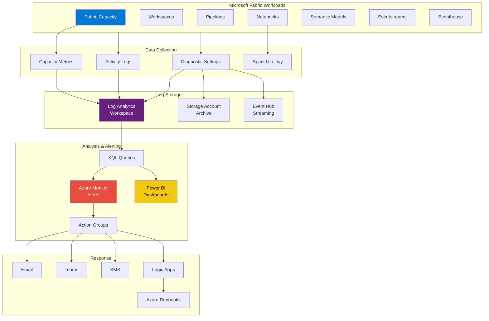
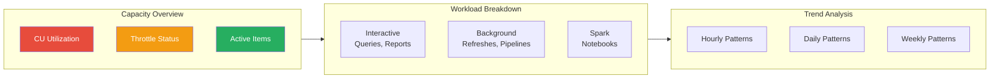
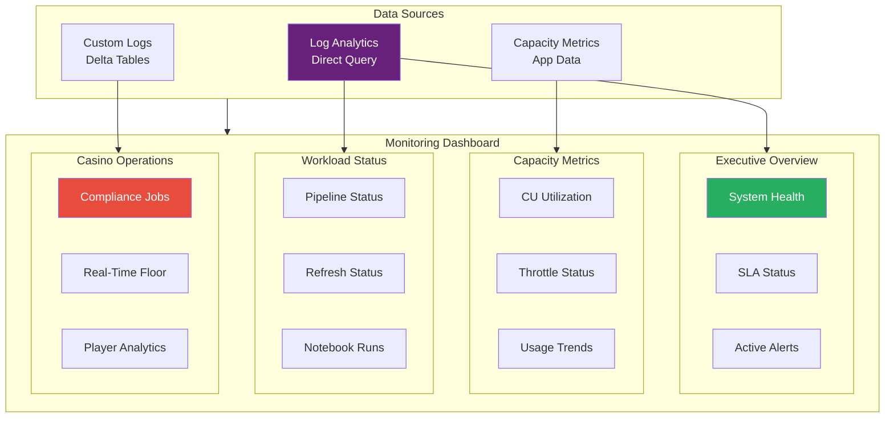
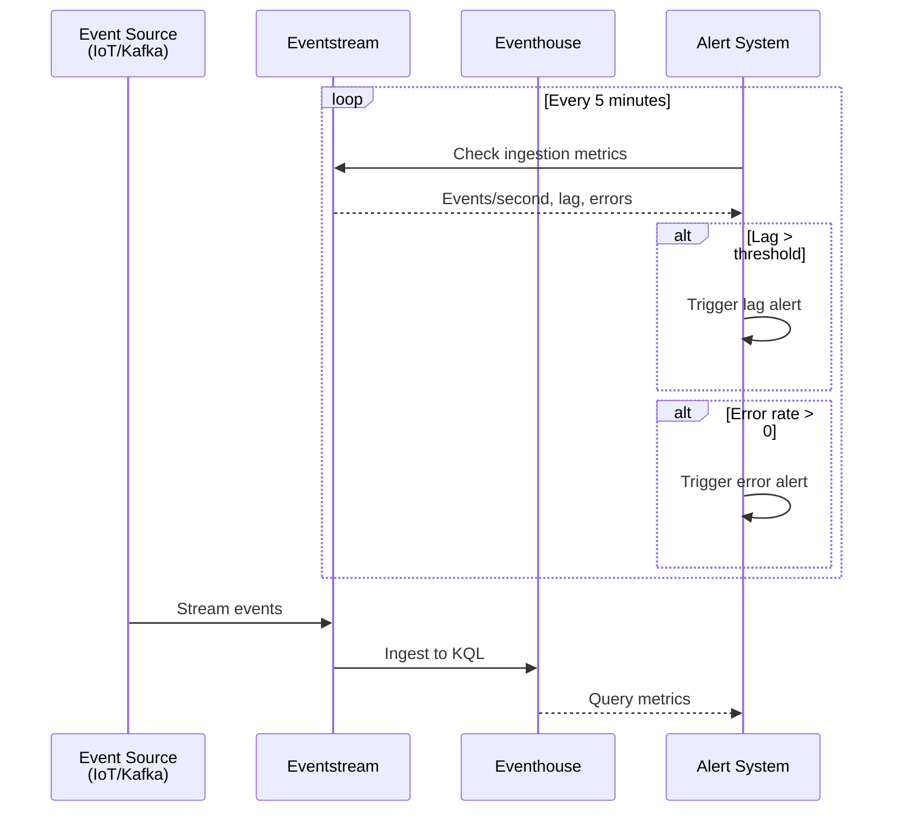
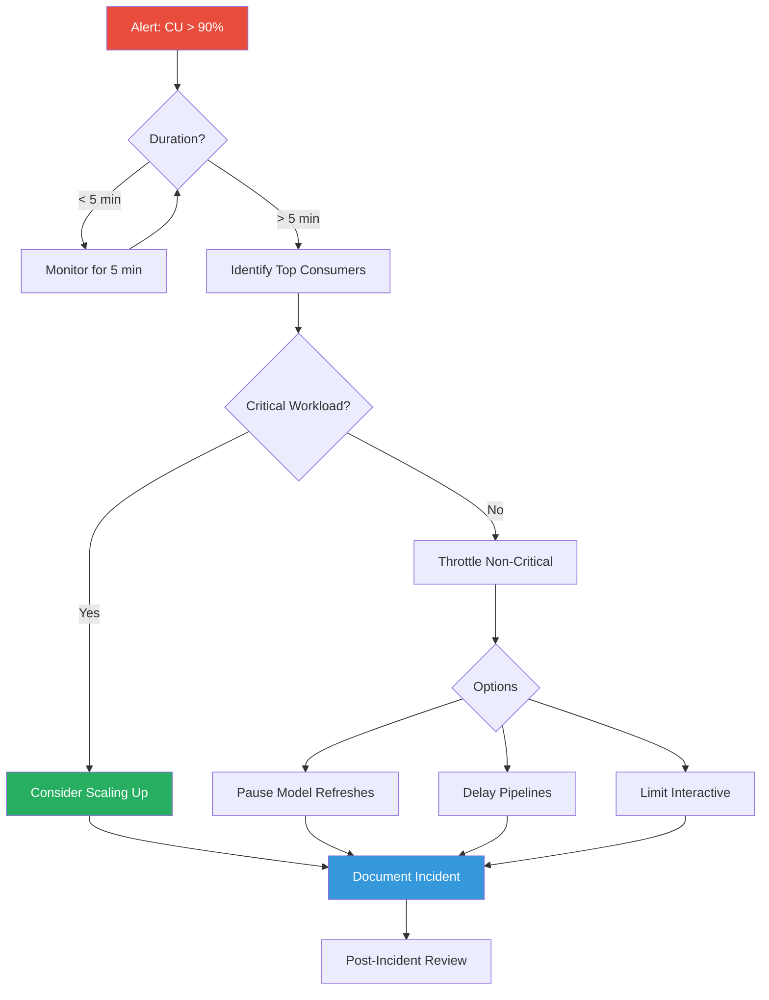

# Tutorial 17: Monitoring and Observability for Microsoft Fabric

<div align="center">


</div>

> **[Home](../../README.md)** > **[Tutorials](../README.md)** > **Monitoring & Observability**

---

## Tutorial 17: Monitoring and Observability

| | |
|---|---|
| **Difficulty** | Intermediate |
| **Time** | 120 minutes |
| **Focus** | Monitoring, Alerting, Diagnostics |

---

### Progress Tracker

```
+---------+---------+---------+---------+---------+---------+---------+---------+---------+---------+
|   00    |   01    |   02    |   03    |   04    |   05    |   06    |   07    |   08    |   09    |
|  SETUP  |  BRONZE | SILVER  |  GOLD   |   RT    |   PBI   |  PIPES  |   GOV   | MIRROR  |  AI/ML  |
+---------+---------+---------+---------+---------+---------+---------+---------+---------+---------+
|   [x]   |   [x]   |   [x]   |   [x]   |   [x]   |   [x]   |   [x]   |   [x]   |   [x]   |   [x]   |
+---------+---------+---------+---------+---------+---------+---------+---------+---------+---------+

+---------+---------+---------+---------+---------+---------+---------+---------+---------+---------+
|   10    |   11    |   12    |   13    |   14    |   15    |   16    |   17    |   18    |   19    |
|TERADATA |   SAS   |  CI/CD  |PLANNING | SECURITY| TESTING |  PERF   | MONITOR | SHARING | CAPSTONE|
+---------+---------+---------+---------+---------+---------+---------+---------+---------+---------+
|   [x]   |   [x]   |   [x]   |   [x]   |   [x]   |   [x]   |   [x]   |  [*]    |   [ ]   |   [ ]   |
+---------+---------+---------+---------+---------+---------+---------+---------+---------+---------+
                                                                          ^
                                                                     YOU ARE HERE
```

| Navigation | |
|---|---|
| **Previous** | [16-Performance Optimization](../16-performance-tuning/README.md) |
| **Next** | [18-Data Sharing](../18-data-sharing/README.md) |

---

## Overview

This tutorial provides comprehensive guidance on implementing **monitoring and observability** for Microsoft Fabric environments. You will learn how to monitor capacity utilization, track pipeline and notebook performance, configure alerts, analyze logs, and build custom monitoring dashboards for your casino analytics platform.

Effective monitoring ensures:
- **Proactive issue detection** before user impact
- **Capacity planning** based on actual utilization
- **Compliance auditing** for gaming regulations
- **Cost optimization** through resource tracking
- **SLA management** with measurable metrics

---

## Learning Objectives

By the end of this tutorial, you will be able to:

- [ ] Configure Microsoft Fabric Capacity Metrics app
- [ ] Set up Azure Monitor integration for Fabric workloads
- [ ] Create Log Analytics workspace for centralized logging
- [ ] Build custom monitoring dashboards in Power BI
- [ ] Monitor key metrics: CU utilization, query duration, refresh failures
- [ ] Configure Azure Monitor alerts with action groups
- [ ] Analyze diagnostic logs and activity logs
- [ ] Use Spark UI for notebook debugging and optimization
- [ ] Implement real-time monitoring for Eventstreams
- [ ] Create incident response playbooks for casino operations

---

## Monitoring Architecture



---

## Prerequisites

Before starting this tutorial, ensure you have:

- [ ] Completed [Tutorial 00-06](../00-environment-setup/README.md) (Foundation through Pipelines)
- [ ] Fabric capacity with Admin access
- [ ] Azure subscription with Contributor role
- [ ] Log Analytics workspace (or permissions to create one)
- [ ] Power BI Pro or PPU license for dashboard creation
- [ ] Basic understanding of KQL (Kusto Query Language)

> **Note:** Some monitoring features require Fabric capacity Admin permissions. Coordinate with your tenant administrator if needed.

---

## Step 1: Microsoft Fabric Capacity Metrics App

### 1.1 Install the Capacity Metrics App

The **Microsoft Fabric Capacity Metrics** app provides out-of-the-box monitoring for capacity utilization.

1. Navigate to [Microsoft AppSource](https://appsource.microsoft.com)
2. Search for "Microsoft Fabric Capacity Metrics"
3. Click **Get it now**
4. Select your workspace for installation
5. Connect to your Fabric capacity

**Alternative Installation via Fabric Portal:**

1. Open [Fabric Portal](https://app.fabric.microsoft.com)
2. Navigate to **Settings** > **Admin portal**
3. Select **Capacity settings**
4. Click on your capacity
5. Select **Metrics app** > **Install**

### 1.2 Key Metrics in the App

| Metric | Description | Threshold |
|--------|-------------|-----------|
| **CU Utilization %** | Compute Units consumed | Warning: >70%, Critical: >90% |
| **Throttling Events** | Times capacity was throttled | Any occurrence needs investigation |
| **Overload Minutes** | Minutes in overloaded state | Should be minimal |
| **Interactive vs Background** | Workload distribution | Balance based on priority |
| **Timepoint Analysis** | CU usage over time | Identify peak usage patterns |

### 1.3 Capacity Metrics Dashboard Overview



### 1.4 Understanding CU Consumption

```
Casino POC - Typical CU Distribution:

+----------------------------------+
|          CU CONSUMPTION          |
+----------------------------------+
| Semantic Model Refresh    35%    |
| Pipeline Execution        25%    |
| Notebook/Spark Jobs       20%    |
| Interactive Queries       15%    |
| Real-Time Analytics        5%    |
+----------------------------------+
| Total Daily CU Budget    100%    |
+----------------------------------+
```

---

## Step 2: Azure Monitor Integration

### 2.1 Create Log Analytics Workspace

**Azure Portal:**

1. Navigate to **Azure Portal** > **Create a resource**
2. Search for "Log Analytics Workspace"
3. Click **Create**

**Configuration:**

| Setting | Value |
|---------|-------|
| **Subscription** | Your Azure subscription |
| **Resource Group** | `rg-fabric-monitoring` |
| **Name** | `law-fabric-casino-poc` |
| **Region** | Same as Fabric capacity |
| **Pricing Tier** | Per GB (recommended) |

**Azure CLI:**

```bash
# Create resource group
az group create \
  --name rg-fabric-monitoring \
  --location eastus2

# Create Log Analytics workspace
az monitor log-analytics workspace create \
  --resource-group rg-fabric-monitoring \
  --workspace-name law-fabric-casino-poc \
  --location eastus2 \
  --sku PerGB2018 \
  --retention-time 90
```

**PowerShell:**

```powershell
# Create resource group
New-AzResourceGroup -Name "rg-fabric-monitoring" -Location "eastus2"

# Create Log Analytics workspace
New-AzOperationalInsightsWorkspace `
  -ResourceGroupName "rg-fabric-monitoring" `
  -Name "law-fabric-casino-poc" `
  -Location "eastus2" `
  -Sku "PerGB2018" `
  -RetentionInDays 90
```

### 2.2 Configure Diagnostic Settings for Fabric

**Enable Diagnostics via Azure Portal:**

1. Navigate to your **Fabric Capacity** in Azure Portal
2. Select **Diagnostic settings** under Monitoring
3. Click **+ Add diagnostic setting**

**Diagnostic Setting Configuration:**

| Setting | Value |
|---------|-------|
| **Name** | `ds-fabric-to-loganalytics` |
| **Logs** | All categories enabled |
| **Metrics** | AllMetrics |
| **Destination** | Log Analytics workspace |
| **Workspace** | `law-fabric-casino-poc` |

**Available Log Categories:**

| Category | Description |
|----------|-------------|
| **Engine** | Query engine operations |
| **AllMetrics** | Capacity-level metrics |
| **Audit** | Security and access events |

**Azure CLI:**

```bash
# Get Fabric capacity resource ID
CAPACITY_ID=$(az resource show \
  --resource-group rg-fabric \
  --resource-type "Microsoft.Fabric/capacities" \
  --name "fabric-casino-poc" \
  --query id -o tsv)

# Get Log Analytics workspace ID
LA_WORKSPACE_ID=$(az monitor log-analytics workspace show \
  --resource-group rg-fabric-monitoring \
  --workspace-name law-fabric-casino-poc \
  --query id -o tsv)

# Create diagnostic setting
az monitor diagnostic-settings create \
  --name "ds-fabric-to-loganalytics" \
  --resource "$CAPACITY_ID" \
  --workspace "$LA_WORKSPACE_ID" \
  --logs '[{"category": "Engine", "enabled": true}, {"category": "Audit", "enabled": true}]' \
  --metrics '[{"category": "AllMetrics", "enabled": true}]'
```

### 2.3 Configure Power BI Audit Logs

Power BI audit logs provide detailed tracking of user activities:

1. Navigate to **Microsoft 365 Admin Center**
2. Go to **Settings** > **Org settings** > **Services**
3. Select **Power BI**
4. Enable **Audit logs**

**Export to Log Analytics via Sentinel or Defender:**

```powershell
# Configure audit log export using Microsoft Graph
$params = @{
    displayName = "Export Power BI Audit Logs"
    logTypes = @("PowerBIActivity")
    destination = @{
        logAnalyticsWorkspaceId = "/subscriptions/{sub-id}/resourceGroups/rg-fabric-monitoring/providers/Microsoft.OperationalInsights/workspaces/law-fabric-casino-poc"
    }
}
```

---

## Step 3: KQL Queries for Log Analytics

### 3.1 Capacity Utilization Queries

**Query: CU Utilization Over Time**

```kql
// Fabric Capacity CU Utilization - Last 24 Hours
FabricCapacityMetrics
| where TimeGenerated >= ago(24h)
| where MetricName == "CUUtilization"
| summarize
    AvgUtilization = avg(MetricValue),
    MaxUtilization = max(MetricValue),
    MinUtilization = min(MetricValue)
    by bin(TimeGenerated, 1h)
| order by TimeGenerated desc
| render timechart
    with (title="CU Utilization (24 Hours)")
```

**Query: Throttling Events**

```kql
// Identify Throttling Events
FabricCapacityMetrics
| where TimeGenerated >= ago(7d)
| where MetricName == "ThrottlingCount"
| where MetricValue > 0
| summarize
    ThrottleCount = sum(MetricValue),
    ThrottleMinutes = count()
    by bin(TimeGenerated, 1h)
| order by ThrottleMinutes desc
| take 50
```

**Query: Overloaded Periods**

```kql
// Capacity Overload Analysis
FabricCapacityMetrics
| where TimeGenerated >= ago(7d)
| where MetricName == "OverloadMinutes"
| where MetricValue > 0
| summarize
    TotalOverloadMinutes = sum(MetricValue)
    by bin(TimeGenerated, 1d), WorkspaceName
| order by TotalOverloadMinutes desc
```

### 3.2 Pipeline Monitoring Queries

**Query: Pipeline Run Status**

```kql
// Pipeline Execution Summary - Last 7 Days
FabricPipelineRuns
| where TimeGenerated >= ago(7d)
| summarize
    SuccessCount = countif(Status == "Succeeded"),
    FailedCount = countif(Status == "Failed"),
    InProgressCount = countif(Status == "InProgress"),
    CancelledCount = countif(Status == "Cancelled"),
    TotalRuns = count(),
    AvgDurationSeconds = avg(DurationSeconds)
    by PipelineName
| extend
    SuccessRate = round(100.0 * SuccessCount / TotalRuns, 2),
    AvgDurationMinutes = round(AvgDurationSeconds / 60, 2)
| project
    PipelineName,
    TotalRuns,
    SuccessRate,
    FailedCount,
    AvgDurationMinutes
| order by FailedCount desc
```

**Query: Failed Pipeline Analysis**

```kql
// Failed Pipeline Details
FabricPipelineRuns
| where TimeGenerated >= ago(24h)
| where Status == "Failed"
| project
    TimeGenerated,
    PipelineName,
    WorkspaceName,
    ErrorMessage,
    DurationSeconds,
    ActivityName
| order by TimeGenerated desc
```

**Query: Long-Running Pipelines**

```kql
// Identify Long-Running Pipelines
FabricPipelineRuns
| where TimeGenerated >= ago(7d)
| where Status == "Succeeded"
| where DurationSeconds > 1800  // > 30 minutes
| summarize
    AvgDuration = avg(DurationSeconds),
    MaxDuration = max(DurationSeconds),
    RunCount = count()
    by PipelineName
| extend
    AvgDurationMinutes = round(AvgDuration / 60, 1),
    MaxDurationMinutes = round(MaxDuration / 60, 1)
| order by MaxDurationMinutes desc
```

### 3.3 Semantic Model Refresh Queries

**Query: Refresh Status Summary**

```kql
// Semantic Model Refresh Summary
PowerBIDatasetRefresh
| where TimeGenerated >= ago(7d)
| summarize
    SuccessCount = countif(RefreshStatus == "Completed"),
    FailedCount = countif(RefreshStatus == "Failed"),
    TotalRefreshes = count(),
    AvgDurationMinutes = avg(DurationSeconds) / 60
    by DatasetName, WorkspaceName
| extend SuccessRate = round(100.0 * SuccessCount / TotalRefreshes, 2)
| order by FailedCount desc
```

**Query: Refresh Failure Details**

```kql
// Failed Refresh Analysis
PowerBIDatasetRefresh
| where TimeGenerated >= ago(24h)
| where RefreshStatus == "Failed"
| project
    TimeGenerated,
    DatasetName,
    WorkspaceName,
    ErrorMessage,
    RefreshType,
    DurationSeconds
| order by TimeGenerated desc
```

### 3.4 Query Performance Monitoring

**Query: Slow Queries Analysis**

```kql
// Identify Slow DAX/SQL Queries
FabricQueryEvents
| where TimeGenerated >= ago(24h)
| where DurationMs > 10000  // > 10 seconds
| summarize
    Count = count(),
    AvgDurationMs = avg(DurationMs),
    MaxDurationMs = max(DurationMs)
    by QueryType, DatasetName, UserPrincipalName
| order by MaxDurationMs desc
| take 50
```

**Query: Query Error Analysis**

```kql
// Query Errors by Type
FabricQueryEvents
| where TimeGenerated >= ago(7d)
| where QueryStatus == "Error"
| summarize ErrorCount = count() by ErrorCode, ErrorMessage
| order by ErrorCount desc
| take 20
```

### 3.5 Casino-Specific Compliance Queries

**Query: Compliance Job Monitoring**

```kql
// Compliance Pipeline Execution Status
FabricPipelineRuns
| where TimeGenerated >= ago(24h)
| where PipelineName has_any ("compliance", "ctr", "sar", "aml", "kyc")
| summarize
    LastRun = max(TimeGenerated),
    Status = arg_max(TimeGenerated, Status),
    Duration = arg_max(TimeGenerated, DurationSeconds)
    by PipelineName
| extend
    HoursSinceLastRun = datetime_diff('hour', now(), LastRun),
    AlertLevel = case(
        Status != "Succeeded", "CRITICAL",
        HoursSinceLastRun > 24, "WARNING",
        "OK"
    )
| project
    PipelineName,
    LastRun,
    Status,
    HoursSinceLastRun,
    AlertLevel
| order by AlertLevel
```

**Query: CTR Threshold Monitoring**

```kql
// Cash Transactions Approaching CTR Threshold ($10,000)
// This would query a custom table if you're logging transaction summaries
FabricCustomLogs
| where TimeGenerated >= ago(1h)
| where LogType == "TransactionAggregate"
| where TotalCashIn >= 8000 or TotalCashOut >= 8000
| project
    TimeGenerated,
    PlayerId,
    TotalCashIn,
    TotalCashOut,
    AlertLevel = case(
        TotalCashIn >= 10000 or TotalCashOut >= 10000, "CTR_REQUIRED",
        TotalCashIn >= 9000 or TotalCashOut >= 9000, "APPROACHING_CTR",
        "MONITOR"
    )
| order by TimeGenerated desc
```

---

## Step 4: Configure Azure Monitor Alerts

### 4.1 Create Action Groups

Action groups define who gets notified and how.

**Azure Portal:**

1. Navigate to **Azure Monitor** > **Alerts**
2. Click **Action groups** > **+ Create**

**Action Group Configuration:**

| Setting | Value |
|---------|-------|
| **Subscription** | Your subscription |
| **Resource Group** | `rg-fabric-monitoring` |
| **Action Group Name** | `ag-fabric-alerts` |
| **Display Name** | `Fabric Alerts` |

**Notification Types:**

| Type | Configuration | Use Case |
|------|---------------|----------|
| **Email** | `fabric-team@casino.com` | All alerts |
| **SMS** | `+1-555-123-4567` | Critical only |
| **Azure Mobile App** | Team members | All alerts |
| **Voice Call** | On-call number | Critical only |

**Actions (Automations):**

| Action | Purpose |
|--------|---------|
| **Logic App** | Custom notification workflows |
| **Azure Function** | Automated remediation |
| **Webhook** | Integration with ticketing systems |
| **ITSM** | ServiceNow/Jira integration |

**PowerShell - Create Action Group:**

```powershell
# Create action group with email notification
$emailReceiver = New-AzActionGroupReceiver `
    -Name "FabricTeamEmail" `
    -EmailAddress "fabric-team@casino.com" `
    -EmailReceiver

$smsReceiver = New-AzActionGroupReceiver `
    -Name "OnCallSMS" `
    -CountryCode "1" `
    -PhoneNumber "5551234567" `
    -SmsReceiver

New-AzActionGroup `
    -ResourceGroupName "rg-fabric-monitoring" `
    -Name "ag-fabric-alerts" `
    -ShortName "FabricAG" `
    -Receiver $emailReceiver, $smsReceiver `
    -Location "Global"
```

### 4.2 Create Alert Rules

**Alert 1: High CU Utilization**

```powershell
# Alert when CU utilization exceeds 85%
$condition = New-AzMetricAlertRuleV2Criteria `
    -MetricName "CUUtilization" `
    -Operator GreaterThan `
    -Threshold 85 `
    -TimeAggregation Average

Add-AzMetricAlertRuleV2 `
    -Name "alert-high-cu-utilization" `
    -ResourceGroupName "rg-fabric-monitoring" `
    -WindowSize 00:15:00 `
    -Frequency 00:05:00 `
    -TargetResourceId "/subscriptions/{sub}/resourceGroups/rg-fabric/providers/Microsoft.Fabric/capacities/fabric-casino-poc" `
    -Condition $condition `
    -ActionGroupId "/subscriptions/{sub}/resourceGroups/rg-fabric-monitoring/providers/Microsoft.Insights/actionGroups/ag-fabric-alerts" `
    -Severity 2 `
    -Description "Fabric capacity CU utilization exceeds 85%"
```

**Alert 2: Pipeline Failure**

```kql
// Log Analytics Alert Query - Pipeline Failures
FabricPipelineRuns
| where TimeGenerated >= ago(15m)
| where Status == "Failed"
| summarize FailureCount = count() by PipelineName
| where FailureCount > 0
```

**Alert Configuration:**

| Setting | Value |
|---------|-------|
| **Alert rule name** | `alert-pipeline-failure` |
| **Severity** | 1 - Error |
| **Evaluation frequency** | Every 5 minutes |
| **Lookback period** | Last 15 minutes |
| **Threshold** | Greater than 0 |

**Alert 3: Semantic Model Refresh Failure**

```kql
// Log Analytics Alert Query - Refresh Failures
PowerBIDatasetRefresh
| where TimeGenerated >= ago(15m)
| where RefreshStatus == "Failed"
| project DatasetName, WorkspaceName, ErrorMessage, TimeGenerated
```

**Alert 4: Capacity Throttling**

```kql
// Log Analytics Alert Query - Throttling Detected
FabricCapacityMetrics
| where TimeGenerated >= ago(5m)
| where MetricName == "ThrottlingCount"
| where MetricValue > 0
| summarize ThrottleEvents = sum(MetricValue)
| where ThrottleEvents > 0
```

### 4.3 Alert Rule Summary

| Alert Name | Severity | Condition | Action |
|------------|----------|-----------|--------|
| High CU Utilization | Warning (2) | CU > 85% for 15 min | Email team |
| Critical CU Utilization | Critical (1) | CU > 95% for 5 min | Email + SMS + Teams |
| Pipeline Failure | Error (1) | Any failure | Email team |
| Compliance Pipeline Failure | Critical (0) | CTR/SAR pipeline fail | Email + SMS + Call |
| Refresh Failure | Warning (2) | Model refresh fails | Email team |
| Throttling Detected | Warning (2) | Any throttle event | Email team |
| Storage Growth | Info (3) | Storage > 80% | Email admin |

---

## Step 5: Custom Monitoring Dashboard

### 5.1 Power BI Dashboard Architecture



### 5.2 Dashboard DAX Measures

**Measure: Pipeline Success Rate**

```dax
Pipeline Success Rate =
VAR SuccessCount =
    CALCULATE(
        COUNTROWS('PipelineRuns'),
        'PipelineRuns'[Status] = "Succeeded"
    )
VAR TotalCount = COUNTROWS('PipelineRuns')
RETURN
    DIVIDE(SuccessCount, TotalCount, 0) * 100
```

**Measure: Average CU Utilization**

```dax
Avg CU Utilization =
AVERAGE('CapacityMetrics'[CUUtilization])
```

**Measure: Compliance Job Health**

```dax
Compliance Health Status =
VAR LastCTRRun =
    CALCULATE(
        MAX('PipelineRuns'[EndTime]),
        'PipelineRuns'[PipelineName] = "CTR_Daily_Job"
    )
VAR HoursSinceRun =
    DATEDIFF(LastCTRRun, NOW(), HOUR)
VAR LastStatus =
    CALCULATE(
        SELECTEDVALUE('PipelineRuns'[Status]),
        'PipelineRuns'[EndTime] = LastCTRRun
    )
RETURN
    SWITCH(TRUE(),
        LastStatus <> "Succeeded", "CRITICAL",
        HoursSinceRun > 24, "WARNING",
        "HEALTHY"
    )
```

**Measure: SLA Compliance Percentage**

```dax
SLA Compliance % =
VAR OnTimeRefreshes =
    CALCULATE(
        COUNTROWS('RefreshHistory'),
        'RefreshHistory'[DurationMinutes] <= 30,
        'RefreshHistory'[Status] = "Completed"
    )
VAR TotalRefreshes =
    COUNTROWS('RefreshHistory')
RETURN
    DIVIDE(OnTimeRefreshes, TotalRefreshes, 0) * 100
```

### 5.3 Key Visuals for Dashboard

**Visual 1: System Health Card**

```
+----------------------------------+
|        SYSTEM HEALTH             |
|          HEALTHY                 |
|           99.8%                  |
|      Uptime Last 30 Days         |
+----------------------------------+
```

**Visual 2: CU Utilization Gauge**

```
+----------------------------------+
|      CU UTILIZATION              |
|                                  |
|    [=====>         ] 62%         |
|    Current / 100% Capacity       |
|                                  |
|    Avg: 58%  Peak: 87%           |
+----------------------------------+
```

**Visual 3: Pipeline Status Matrix**

```
+----------------------------------------------+
| PIPELINE STATUS (Last 24 Hours)              |
+----------------------------------------------+
| Pipeline           | Runs | Success | Failed |
+----------------------------------------------+
| Bronze Ingestion   |  24  |   24    |   0    |
| Silver Transform   |  12  |   11    |   1    |
| Gold Aggregation   |   6  |    6    |   0    |
| CTR Compliance     |   1  |    1    |   0    |
| Player Analytics   |   4  |    4    |   0    |
+----------------------------------------------+
| TOTAL              |  47  |   46    |   1    |
+----------------------------------------------+
```

---

## Step 6: Spark UI for Notebook Debugging

### 6.1 Accessing Spark UI

**From Fabric Portal:**

1. Open your **Notebook**
2. Run a Spark job
3. Click on the **Spark Jobs** tab at the bottom
4. Click **View Spark UI** for detailed analysis

**Spark UI Sections:**

| Tab | Purpose | Key Metrics |
|-----|---------|-------------|
| **Jobs** | Overall job status | Duration, stages, tasks |
| **Stages** | Stage-level details | Shuffle read/write, task distribution |
| **Storage** | Cached RDDs/DataFrames | Memory usage, cache hits |
| **Environment** | Spark configuration | Settings, classpath |
| **Executors** | Executor health | Memory, cores, task stats |
| **SQL** | Query execution plans | DAG visualization |

### 6.2 Common Performance Issues in Spark UI

**Issue 1: Data Skew**

```
Symptoms in Spark UI:
- One task takes much longer than others
- Uneven data distribution across partitions

Solution:
```

```python
# Repartition by a more uniform key
df = df.repartition(200, "player_id")

# Or use salting for hot keys
from pyspark.sql.functions import concat, lit, col, rand

df_salted = df.withColumn(
    "salted_key",
    concat(col("hot_key"), lit("_"), (rand() * 10).cast("int"))
)
```

**Issue 2: Shuffle Spill to Disk**

```
Symptoms in Spark UI:
- "Shuffle Spill (Disk)" > 0 in stage details
- Slow stage completion

Solution:
```

```python
# Increase executor memory or reduce partition size
spark.conf.set("spark.sql.shuffle.partitions", 400)
spark.conf.set("spark.executor.memory", "8g")
```

**Issue 3: Small Files Problem**

```
Symptoms:
- Many small input files
- Long file listing time

Solution:
```

```python
# Compact files before processing
df.coalesce(100).write.mode("overwrite").parquet("path")

# Or use Delta Lake OPTIMIZE
spark.sql("OPTIMIZE lakehouse.bronze_slot_telemetry")
```

### 6.3 Notebook Performance Logging

**Add Performance Metrics to Notebooks:**

```python
# Cell: Performance Tracking Setup
import time
from datetime import datetime

class PerformanceTracker:
    """Track notebook cell execution performance."""

    def __init__(self):
        self.metrics = []

    def start_cell(self, cell_name: str):
        """Start timing a cell."""
        self.current_cell = cell_name
        self.start_time = time.time()

    def end_cell(self, rows_processed: int = 0):
        """End timing and record metrics."""
        duration = time.time() - self.start_time
        self.metrics.append({
            "cell_name": self.current_cell,
            "duration_seconds": round(duration, 2),
            "rows_processed": rows_processed,
            "timestamp": datetime.now().isoformat()
        })
        print(f"Cell '{self.current_cell}' completed in {duration:.2f}s ({rows_processed:,} rows)")

    def summary(self):
        """Print performance summary."""
        total_duration = sum(m["duration_seconds"] for m in self.metrics)
        total_rows = sum(m["rows_processed"] for m in self.metrics)

        print("\n" + "="*50)
        print("NOTEBOOK PERFORMANCE SUMMARY")
        print("="*50)
        for m in self.metrics:
            print(f"  {m['cell_name']}: {m['duration_seconds']}s")
        print("-"*50)
        print(f"  TOTAL: {total_duration:.2f}s, {total_rows:,} rows")
        print("="*50)

        return self.metrics

# Initialize tracker
perf = PerformanceTracker()
```

```python
# Cell: Example Usage
perf.start_cell("Read Bronze Data")

df = spark.read.table("bronze.slot_telemetry")
row_count = df.count()

perf.end_cell(row_count)
```

```python
# Cell: Final Summary
perf.summary()

# Optionally log to Delta table for historical tracking
from pyspark.sql import Row
metrics_df = spark.createDataFrame([Row(**m) for m in perf.metrics])
metrics_df.write.mode("append").saveAsTable("monitoring.notebook_performance")
```

---

## Step 7: Pipeline Monitoring

### 7.1 Pipeline Run History Analysis

**Access Pipeline Monitoring:**

1. Open your **Data Pipeline** in Fabric
2. Click **View run history**
3. Analyze individual runs

**Key Metrics to Track:**

| Metric | Description | Target |
|--------|-------------|--------|
| **Duration** | Total pipeline runtime | Within SLA |
| **Activity Count** | Number of activities | Stable |
| **Data Moved** | Rows/bytes processed | Consistent |
| **Retry Count** | Automatic retries | Zero |
| **Error Rate** | Failed activities | < 1% |

### 7.2 Pipeline Alerting Script

**PowerShell: Check Pipeline Status**

```powershell
<#
.SYNOPSIS
    Monitor Fabric pipeline runs and send alerts.
#>

param(
    [string]$WorkspaceId,
    [string]$PipelineName,
    [int]$LookbackMinutes = 60
)

# Authenticate
Connect-PowerBIServiceAccount

# Get pipeline runs
$uri = "https://api.fabric.microsoft.com/v1/workspaces/$WorkspaceId/pipelines"
$headers = @{
    "Authorization" = "Bearer $(Get-PowerBIAccessToken -AsString)"
}

$pipelines = Invoke-RestMethod -Uri $uri -Headers $headers
$targetPipeline = $pipelines.value | Where-Object { $_.displayName -eq $PipelineName }

if (-not $targetPipeline) {
    Write-Error "Pipeline '$PipelineName' not found"
    exit 1
}

# Get recent runs
$runsUri = "https://api.fabric.microsoft.com/v1/workspaces/$WorkspaceId/pipelines/$($targetPipeline.id)/runs"
$runs = Invoke-RestMethod -Uri $runsUri -Headers $headers

# Analyze results
$recentRuns = $runs.value | Where-Object {
    $runTime = [DateTime]::Parse($_.startTime)
    $runTime -gt (Get-Date).AddMinutes(-$LookbackMinutes)
}

$failedRuns = $recentRuns | Where-Object { $_.status -eq "Failed" }

if ($failedRuns.Count -gt 0) {
    Write-Host "ALERT: $($failedRuns.Count) failed pipeline runs in last $LookbackMinutes minutes!"

    foreach ($run in $failedRuns) {
        Write-Host "  - Run ID: $($run.id)"
        Write-Host "    Status: $($run.status)"
        Write-Host "    Start: $($run.startTime)"
        Write-Host "    Error: $($run.error.message)"
    }

    # Send alert (integrate with your notification system)
    # Send-AlertEmail -Subject "Pipeline Failure: $PipelineName" -Body $alertBody

    exit 1
}

Write-Host "All pipeline runs successful in last $LookbackMinutes minutes"
exit 0
```

---

## Step 8: Real-Time Monitoring for Eventstreams

### 8.1 Eventstream Health Monitoring



### 8.2 Eventstream Monitoring KQL

**Query: Ingestion Lag Monitoring**

```kql
// Monitor real-time ingestion lag
EventstreamMetrics
| where TimeGenerated >= ago(1h)
| where MetricName == "IngestionLatencyMs"
| summarize
    AvgLatencyMs = avg(MetricValue),
    P95LatencyMs = percentile(MetricValue, 95),
    MaxLatencyMs = max(MetricValue)
    by bin(TimeGenerated, 5m), StreamName
| where P95LatencyMs > 5000  // Alert if P95 > 5 seconds
```

**Query: Throughput Analysis**

```kql
// Events per second throughput
EventstreamMetrics
| where TimeGenerated >= ago(1h)
| where MetricName == "EventsReceived"
| summarize EventsPerSecond = sum(MetricValue) / 60 by bin(TimeGenerated, 1m), StreamName
| render timechart
```

### 8.3 Casino Floor Real-Time Alerts

**Slot Machine Anomaly Detection:**

```kql
// Detect unusual slot machine patterns (potential malfunction or fraud)
SlotMachineTelemetry
| where ingestion_time() >= ago(5m)
| summarize
    TotalSpins = count(),
    TotalWin = sum(win_amount),
    WinRate = countif(win_amount > 0) * 100.0 / count()
    by machine_id, bin(ingestion_time(), 1m)
| where WinRate > 80  // Unusually high win rate
    or TotalSpins > 200  // Excessive spin rate (potential bot)
    or TotalWin > 10000  // Large payouts
| project
    TimeWindow = ingestion_time(),
    machine_id,
    TotalSpins,
    WinRate,
    TotalWin,
    AlertType = case(
        WinRate > 80, "HIGH_WIN_RATE",
        TotalSpins > 200, "EXCESSIVE_SPINS",
        TotalWin > 10000, "LARGE_PAYOUT",
        "UNKNOWN"
    )
```

**Player Behavior Monitoring:**

```kql
// Monitor player session patterns for compliance
PlayerSessions
| where ingestion_time() >= ago(1h)
| summarize
    SessionDuration = datetime_diff('minute', max(event_time), min(event_time)),
    TotalWagered = sum(wager_amount),
    TotalWon = sum(win_amount)
    by player_id, session_id
| where TotalWagered > 5000  // High wagering activity
    or SessionDuration > 240  // Session > 4 hours (responsible gaming)
| project
    player_id,
    session_id,
    SessionDuration,
    TotalWagered,
    TotalWon,
    AlertType = case(
        TotalWagered > 10000, "HIGH_WAGERING",
        SessionDuration > 360, "EXTENDED_SESSION",
        "MONITOR"
    )
```

---

## Step 9: Incident Response Playbooks

### 9.1 Capacity Overload Playbook



**Step-by-Step Capacity Overload Response:**

```markdown
## INCIDENT RESPONSE: Capacity Overload

### 1. DETECTION (0-5 minutes)
- [ ] Acknowledge alert
- [ ] Open Capacity Metrics app
- [ ] Identify current CU utilization percentage
- [ ] Check for throttling events

### 2. ASSESSMENT (5-10 minutes)
- [ ] Identify top 3 consuming workloads
- [ ] Determine if workloads are critical
- [ ] Check scheduled vs. ad-hoc activities
- [ ] Review recent deployments/changes

### 3. MITIGATION (10-30 minutes)

**Option A: Non-Critical Workloads**
- [ ] Pause non-critical semantic model refreshes
- [ ] Delay scheduled pipeline runs
- [ ] Contact heavy report users

**Option B: Critical Workloads**
- [ ] Initiate capacity scale-up (if available)
- [ ] Engage capacity administrator
- [ ] Communicate to stakeholders

### 4. RESOLUTION
- [ ] Verify CU utilization returns to normal
- [ ] Re-enable paused workloads gradually
- [ ] Confirm no data loss or failures

### 5. POST-INCIDENT
- [ ] Document timeline and actions
- [ ] Identify root cause
- [ ] Update capacity planning
- [ ] Review alert thresholds
```

### 9.2 Compliance Job Failure Playbook

**Critical: CTR/SAR Pipeline Failure**

```markdown
## INCIDENT RESPONSE: Compliance Pipeline Failure

### SEVERITY: CRITICAL
### SLA: Must be resolved within 4 hours

### 1. IMMEDIATE ACTIONS (0-15 minutes)
- [ ] Acknowledge alert immediately
- [ ] Page compliance team lead
- [ ] Open pipeline run history
- [ ] Identify failure point and error message

### 2. DIAGNOSIS (15-30 minutes)
- [ ] Check data source connectivity
- [ ] Verify input data availability
- [ ] Review error logs in detail
- [ ] Check for schema changes

### 3. RESOLUTION PATHS

**Path A: Data Issue**
- [ ] Identify missing/corrupt data
- [ ] Trigger source system refresh
- [ ] Re-run pipeline with corrected data

**Path B: System Issue**
- [ ] Check Fabric capacity status
- [ ] Verify service health
- [ ] Restart failed activities
- [ ] Escalate if infrastructure issue

**Path C: Code Issue**
- [ ] Review recent code changes
- [ ] Rollback if recent deployment
- [ ] Fix and redeploy
- [ ] Trigger manual run

### 4. VERIFICATION
- [ ] Confirm successful pipeline completion
- [ ] Verify output data accuracy
- [ ] Check downstream dependencies
- [ ] Confirm compliance reports generated

### 5. DOCUMENTATION (MANDATORY)
- [ ] Log incident in compliance tracker
- [ ] Document root cause
- [ ] Note any regulatory impact
- [ ] Schedule post-mortem if required

### ESCALATION CONTACTS
- Compliance Team Lead: compliance-lead@casino.com
- Data Platform On-Call: +1-555-DATA-911
- Gaming Commission (if required): regulator@gaming.gov
```

### 9.3 Runbook Template

```markdown
## RUNBOOK: [Incident Type]

### Metadata
- **Owner:** [Team Name]
- **Last Updated:** [Date]
- **Review Frequency:** Quarterly
- **Severity:** [Critical/High/Medium/Low]

### Alert Information
- **Alert Name:** [Name from Azure Monitor]
- **Threshold:** [Condition that triggers]
- **Notification:** [Who is notified]

### Pre-Requisites
- [ ] Access to Fabric Admin portal
- [ ] Access to Azure Monitor
- [ ] Access to Log Analytics
- [ ] Required permissions: [List]

### Diagnostic Steps
1. [First diagnostic step]
2. [Second diagnostic step]
3. [Additional steps...]

### Resolution Steps
1. [First resolution step]
2. [Second resolution step]
3. [Additional steps...]

### Rollback Procedure
1. [If resolution fails, rollback step 1]
2. [Rollback step 2]

### Post-Incident Checklist
- [ ] Incident documented
- [ ] Stakeholders notified
- [ ] Root cause identified
- [ ] Prevention measures identified
- [ ] Runbook updated if needed

### Related Resources
- [Link to monitoring dashboard]
- [Link to architecture docs]
- [Link to escalation procedures]
```

---

## Step 10: SLA Tracking and Reporting

### 10.1 SLA Definition Table

| Service | Metric | Target | Measurement |
|---------|--------|--------|-------------|
| **Bronze Ingestion** | Freshness | < 15 min | Time from source to Bronze |
| **Silver Transform** | Freshness | < 1 hour | Time from Bronze to Silver |
| **Gold Aggregation** | Freshness | < 4 hours | Time from Silver to Gold |
| **Model Refresh** | Duration | < 30 min | End-to-end refresh time |
| **Report Load** | Response | < 5 sec | Time to first visual |
| **Pipeline Success** | Rate | > 99% | Successful runs / total runs |
| **Capacity Availability** | Uptime | > 99.9% | Available / total time |
| **CTR Reporting** | Timeliness | < 24 hours | From transaction to report |

### 10.2 SLA Tracking KQL Query

```kql
// Weekly SLA Compliance Report
let SLATargets = datatable(ServiceName:string, TargetMinutes:int)[
    "Bronze Ingestion", 15,
    "Silver Transform", 60,
    "Gold Aggregation", 240,
    "Model Refresh", 30
];
FabricPipelineRuns
| where TimeGenerated >= ago(7d)
| where Status == "Succeeded"
| extend DurationMinutes = DurationSeconds / 60
| join kind=inner SLATargets on $left.PipelineName == $right.ServiceName
| extend WithinSLA = DurationMinutes <= TargetMinutes
| summarize
    TotalRuns = count(),
    WithinSLARuns = countif(WithinSLA),
    AvgDuration = avg(DurationMinutes),
    P95Duration = percentile(DurationMinutes, 95)
    by ServiceName, TargetMinutes
| extend
    SLACompliance = round(100.0 * WithinSLARuns / TotalRuns, 2),
    Status = case(
        100.0 * WithinSLARuns / TotalRuns >= 99, "GREEN",
        100.0 * WithinSLARuns / TotalRuns >= 95, "YELLOW",
        "RED"
    )
| project
    ServiceName,
    TotalRuns,
    SLACompliance,
    TargetMinutes,
    AvgDuration = round(AvgDuration, 1),
    P95Duration = round(P95Duration, 1),
    Status
| order by SLACompliance asc
```

### 10.3 Weekly SLA Report Template

```
+==============================================================+
|           MICROSOFT FABRIC SLA REPORT                        |
|           Week of January 20-27, 2026                        |
+==============================================================+

EXECUTIVE SUMMARY
-----------------
Overall SLA Compliance: 98.7%
Critical Incidents: 1
Capacity Uptime: 99.95%

DETAILED METRICS
----------------
+----------------------+--------+--------+--------+--------+
| Service              | Target | Actual | SLA %  | Status |
+----------------------+--------+--------+--------+--------+
| Bronze Ingestion     | 15 min | 8 min  | 100%   | GREEN  |
| Silver Transform     | 60 min | 45 min | 99.2%  | GREEN  |
| Gold Aggregation     | 4 hrs  | 2.5 hrs| 98.5%  | GREEN  |
| Model Refresh        | 30 min | 22 min | 97.8%  | YELLOW |
| CTR Compliance       | 24 hrs | 6 hrs  | 100%   | GREEN  |
+----------------------+--------+--------+--------+--------+

INCIDENTS THIS WEEK
-------------------
1. [Jan 22, 14:30] Pipeline Failure - Silver Transform
   Duration: 45 minutes
   Impact: Delayed Gold layer refresh by 1 hour
   Root Cause: Network timeout to source system
   Resolution: Retry succeeded after network recovery

CAPACITY UTILIZATION
--------------------
Average CU: 62%
Peak CU: 89% (Jan 24, 08:00 - month-end processing)
Throttling Events: 0

RECOMMENDATIONS
---------------
1. Review Model Refresh SLA - consider optimization
2. Add buffer capacity for month-end processing
3. Implement proactive network monitoring

Report generated: 2026-01-28 06:00:00 UTC
Next review: Weekly team meeting
+==============================================================+
```

---

## Validation Checklist

Before completing this tutorial, verify:

- [ ] **Capacity Metrics App** - Installed and connected to your capacity
- [ ] **Log Analytics Workspace** - Created and receiving logs
- [ ] **Diagnostic Settings** - Configured for Fabric capacity
- [ ] **KQL Queries** - Tested and returning expected results
- [ ] **Alert Rules** - Created for critical metrics
- [ ] **Action Groups** - Configured with correct notifications
- [ ] **Monitoring Dashboard** - Built in Power BI with key visuals
- [ ] **Spark UI** - Can access and interpret performance data
- [ ] **Incident Playbooks** - Documented for key scenarios
- [ ] **SLA Definitions** - Established with tracking queries

<details>
<summary>Verification Commands</summary>

### Check Log Analytics Connection

```kql
// Verify data is flowing to Log Analytics
search *
| where TimeGenerated >= ago(1h)
| summarize count() by Type
| order by count_ desc
```

### Verify Alert Rules

```powershell
# List all alert rules in resource group
Get-AzMetricAlertRuleV2 -ResourceGroupName "rg-fabric-monitoring"
```

### Test Action Group

```powershell
# Send test notification
$actionGroupId = "/subscriptions/{sub}/resourceGroups/rg-fabric-monitoring/providers/Microsoft.Insights/actionGroups/ag-fabric-alerts"

# Trigger test via Azure Portal: Action Groups > Test action group
```

### Validate Dashboard Connectivity

```dax
// Test measure in Power BI
EVALUATE { "Dashboard connectivity test passed" }
```

</details>

---

## Troubleshooting

| Issue | Cause | Solution |
|-------|-------|----------|
| No data in Log Analytics | Diagnostic settings not configured | Enable diagnostics on Fabric capacity |
| Alerts not firing | Threshold too high or wrong metric | Review alert conditions and test |
| Capacity Metrics app error | Permission issue | Verify Fabric Admin access |
| KQL query timeout | Query too broad | Add time filters and optimize |
| Action group not sending | Email blocked or wrong address | Verify recipients and check spam |
| Spark UI not loading | Session ended | Restart notebook session |

---

## Best Practices

1. **Start with Essentials** - Monitor CU utilization, pipeline failures, and refresh status first
2. **Right-Size Alerts** - Avoid alert fatigue by setting appropriate thresholds
3. **Use Action Groups** - Centralize notification management
4. **Document Runbooks** - Have procedures ready before incidents occur
5. **Review Weekly** - Analyze trends and adjust thresholds
6. **Automate Responses** - Use Logic Apps for common remediation
7. **Archive Logs** - Keep 90+ days for compliance and analysis
8. **Test Alerts** - Regularly verify notifications are working
9. **Track SLAs** - Measure what matters to the business
10. **Continuous Improvement** - Update monitoring as workloads evolve

---

## Summary

You have learned to implement comprehensive monitoring and observability for Microsoft Fabric:

- Configured the Fabric Capacity Metrics app for real-time capacity monitoring
- Set up Azure Monitor integration with Log Analytics
- Created KQL queries for pipeline, refresh, and query analysis
- Implemented alerts with action groups for proactive notification
- Built custom Power BI dashboards for operational visibility
- Used Spark UI for notebook debugging and optimization
- Established incident response playbooks for casino operations
- Defined SLAs and created tracking mechanisms

Effective monitoring ensures your casino analytics platform operates reliably, meets compliance requirements, and provides the insights needed for continuous optimization.

---

## Next Steps

Continue to **[Tutorial 18: Data Sharing and Collaboration](../18-data-sharing/README.md)** to learn how to securely share data across teams and external partners using Fabric's collaboration features.

---

## Additional Resources

- [Microsoft Fabric Monitoring Documentation](https://learn.microsoft.com/fabric/admin/monitoring-workspace)
- [Azure Monitor Overview](https://learn.microsoft.com/azure/azure-monitor/overview)
- [Log Analytics Workspace](https://learn.microsoft.com/azure/azure-monitor/logs/log-analytics-workspace-overview)
- [KQL Reference](https://learn.microsoft.com/azure/data-explorer/kusto/query/)
- [Power BI Monitoring](https://learn.microsoft.com/power-bi/admin/service-admin-portal-monitoring)
- [Fabric Capacity Metrics App](https://learn.microsoft.com/fabric/enterprise/metrics-app)
- [Azure Monitor Alerts](https://learn.microsoft.com/azure/azure-monitor/alerts/alerts-overview)
- [Spark UI Documentation](https://spark.apache.org/docs/latest/web-ui.html)

---

## Navigation

| Previous | Up | Next |
|----------|-----|------|
| [16-Performance Optimization](../16-performance-tuning/README.md) | [Tutorials Index](../README.md) | [18-Data Sharing](../18-data-sharing/README.md) |

---

> **Questions or issues?** Open an issue in the [GitHub repository](https://github.com/your-repo/issues).
