# Tutorial 18: Data Sharing & OneLake Shortcuts

<div align="center">


</div>

> [Home](../../README.md) > [Tutorials](../README.md) > **Data Sharing & OneLake Shortcuts**

---

## Tutorial 18: Data Sharing & OneLake Shortcuts

| | |
|---|---|
| **Difficulty** | Intermediate |
| **Time** | 1.5 hours |
| **Focus** | OneLake, Shortcuts, Cross-Workspace Sharing, Multi-Tenant Architecture |

---

### Progress Tracker

```
+---------+---------+---------+---------+---------+---------+---------+---------+---------+---------+
|   00    |   01    |   02    |   03    |   04    |   05    |   06    |   07    |   08    |   09    |
|  SETUP  | BRONZE  | SILVER  |  GOLD   |   RT    |   PBI   |  PIPES  |   GOV   | MIRROR  |  AI/ML  |
+---------+---------+---------+---------+---------+---------+---------+---------+---------+---------+
|   [x]   |   [x]   |   [x]   |   [x]   |   [x]   |   [x]   |   [x]   |   [x]   |   [x]   |   [x]   |
+---------+---------+---------+---------+---------+---------+---------+---------+---------+---------+

+---------+---------+---------+---------+---------+---------+---------+---------+---------+---------+
|   10    |   11    |   12    |   13    |   14    |   15    |   16    |   17    |   18    |   19    |
|TERADATA |   SAS   |  CI/CD  |PLANNING | SECURITY|  COST   |  PERF   | MONITOR | SHARING | COPILOT |
+---------+---------+---------+---------+---------+---------+---------+---------+---------+---------+
|   [x]   |   [x]   |   [x]   |   [x]   |   [x]   |   [x]   |   [x]   |   [x]   |  [**]   |   [ ]   |
+---------+---------+---------+---------+---------+---------+---------+---------+---------+---------+
                                                                         ^
                                                                    YOU ARE HERE
```

| Navigation | |
|---|---|
| **Previous** | [17-Monitoring & Alerting](../17-monitoring-alerting/README.md) |
| **Next** | [19-Fabric Copilot & AI Features](../19-copilot-ai/README.md) |

---

## Overview

This tutorial explores **OneLake shortcuts** and **data sharing patterns** in Microsoft Fabric. You will learn how to share data across workspaces, integrate with external data sources (ADLS Gen2, Amazon S3, Google Cloud Storage), and implement multi-tenant data architectures for enterprise scenarios.

OneLake serves as Microsoft Fabric's unified data lake, providing a single logical storage layer across all Fabric workloads. Shortcuts enable data virtualization, allowing you to reference data from internal Fabric locations or external cloud storage without data duplication.

### Key Concepts

| Concept | Description |
|---------|-------------|
| **OneLake** | Unified data lake for all Fabric workloads with hierarchical namespace |
| **Shortcuts** | Virtual references to data in other locations without copying |
| **Internal Shortcuts** | References to data within Fabric (cross-workspace) |
| **External Shortcuts** | References to external cloud storage (ADLS, S3, GCS) |
| **Data Virtualization** | Access data in place without movement or duplication |

---

## Learning Objectives

By the end of this tutorial, you will be able to:

- [ ] Understand OneLake architecture and its role as a unified data lake
- [ ] Create internal shortcuts for cross-workspace data sharing
- [ ] Configure external shortcuts to ADLS Gen2, Amazon S3, and Google Cloud Storage
- [ ] Implement Dataverse shortcuts for Dynamics 365 integration
- [ ] Apply security inheritance patterns with shortcuts
- [ ] Design cross-workspace data sharing architectures
- [ ] Configure external data sharing for B2B partner scenarios
- [ ] Implement multi-tenant data patterns using shortcuts
- [ ] Apply data mesh principles with Fabric lakehouses
- [ ] Optimize shortcut performance and understand when to copy vs virtualize

---

## Architecture Overview

### OneLake Unified Data Lake Architecture

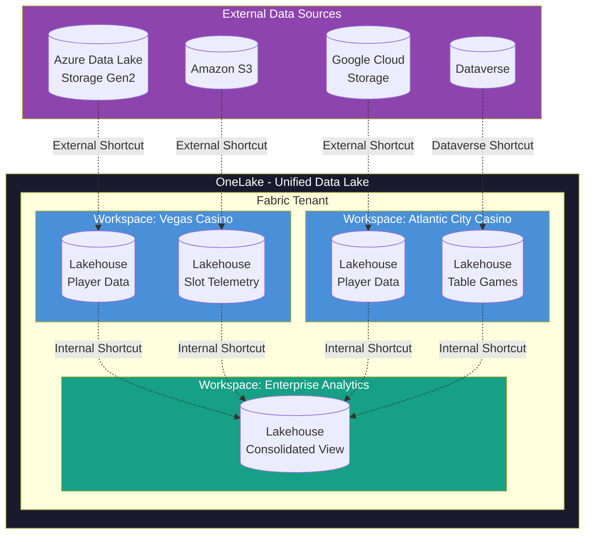

### Shortcut Types and Use Cases

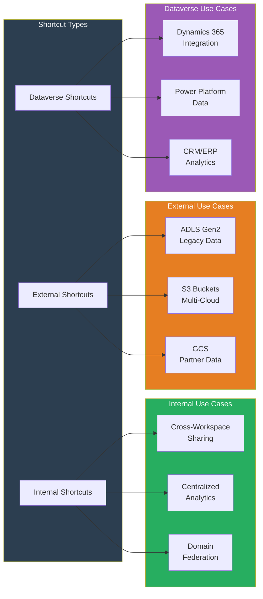

---

## Prerequisites

Before starting this tutorial, ensure you have:

- [ ] Completed [Tutorial 00: Environment Setup](../00-environment-setup/README.md)
- [ ] Completed [Tutorial 07: Governance & Purview](../07-governance-purview/README.md)
- [ ] At least two Fabric workspaces with Contributor access
- [ ] A Lakehouse with sample data (from Bronze/Silver/Gold tutorials)
- [ ] For external shortcuts:
  - [ ] Azure Storage Account with hierarchical namespace enabled (optional)
  - [ ] AWS account with S3 bucket (optional)
  - [ ] GCP project with Cloud Storage bucket (optional)
- [ ] For Dataverse shortcuts:
  - [ ] Power Platform environment with Dataverse (optional)

> **Note:** External cloud storage is optional. You can complete the internal shortcuts sections without AWS, GCP, or Azure Storage accounts.

---

## Step 1: Understanding OneLake Architecture

### 1.1 OneLake Hierarchy

OneLake organizes data in a hierarchical structure:

```
OneLake (Tenant)
  |
  +-- Workspace (Vegas Casino)
  |     |
  |     +-- Lakehouse (player_analytics)
  |     |     |
  |     |     +-- Tables/
  |     |     |     +-- dim_players
  |     |     |     +-- fact_sessions
  |     |     |
  |     |     +-- Files/
  |     |           +-- raw/
  |     |           +-- processed/
  |     |
  |     +-- Lakehouse (slot_telemetry)
  |           |
  |           +-- Tables/
  |           +-- Files/
  |
  +-- Workspace (Atlantic City Casino)
        |
        +-- Lakehouse (...)
```

### 1.2 OneLake Path Format

OneLake uses a standardized path format for accessing data:

| Component | Path Format | Example |
|-----------|-------------|---------|
| **Workspace** | `/{workspace_name}` | `/Vegas_Casino` |
| **Lakehouse** | `/{workspace}/{lakehouse}.Lakehouse` | `/Vegas_Casino/player_analytics.Lakehouse` |
| **Tables** | `/{...}/Tables/{table_name}` | `/.../Tables/dim_players` |
| **Files** | `/{...}/Files/{path}` | `/.../Files/raw/data.parquet` |

### 1.3 OneLake Endpoints

OneLake exposes multiple access endpoints:

| Endpoint | URL Pattern | Use Case |
|----------|-------------|----------|
| **DFS** | `https://onelake.dfs.fabric.microsoft.com/{path}` | ADLS Gen2 compatible |
| **Blob** | `https://onelake.blob.fabric.microsoft.com/{path}` | Azure Blob compatible |
| **Direct** | `abfss://{workspace}@onelake.dfs.fabric.microsoft.com/{item}` | Spark/Notebook access |

**Example - Accessing OneLake from Spark:**

```python
# Access a lakehouse table directly
df = spark.read.format("delta").load(
    "abfss://Vegas_Casino@onelake.dfs.fabric.microsoft.com/player_analytics.Lakehouse/Tables/dim_players"
)

# Access files in OneLake
df_raw = spark.read.parquet(
    "abfss://Vegas_Casino@onelake.dfs.fabric.microsoft.com/player_analytics.Lakehouse/Files/raw/"
)
```

---

## Step 2: Creating Internal Shortcuts (Cross-Workspace)

### 2.1 Scenario: Casino Property Data Federation

In this scenario, we have multiple casino properties with their own lakehouses, and we want to create a consolidated view in an enterprise analytics workspace.

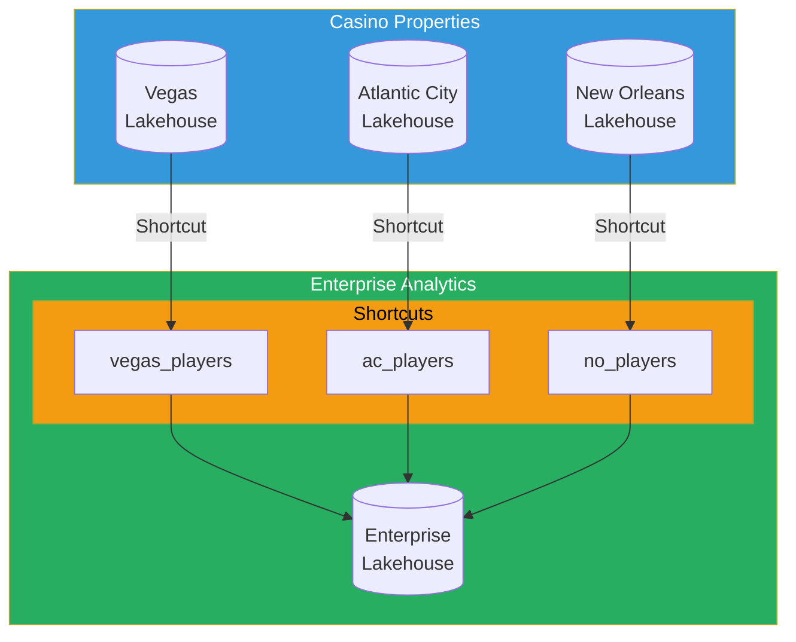

### 2.2 Creating an Internal Shortcut via UI

1. Navigate to your **Enterprise Analytics** workspace
2. Open the target **Lakehouse** where you want to create the shortcut
3. In the Lakehouse explorer, right-click on **Tables** or **Files**
4. Select **New shortcut**
5. Choose **Microsoft OneLake** as the source

**Configuration:**

| Setting | Value |
|---------|-------|
| **Source Type** | Microsoft OneLake |
| **Workspace** | Vegas Casino (source workspace) |
| **Lakehouse** | player_analytics |
| **Source Path** | Tables/dim_players |
| **Shortcut Name** | vegas_dim_players |

### 2.3 Creating Internal Shortcuts via Notebook

```python
# Fabric Notebook: Create Internal Shortcuts Programmatically

from notebookutils import mssparkutils

# Define shortcut configurations
shortcuts = [
    {
        "name": "vegas_players",
        "source_workspace": "Vegas_Casino",
        "source_lakehouse": "player_analytics",
        "source_path": "Tables/dim_players"
    },
    {
        "name": "atlantic_city_players",
        "source_workspace": "Atlantic_City_Casino",
        "source_lakehouse": "player_analytics",
        "source_path": "Tables/dim_players"
    },
    {
        "name": "new_orleans_players",
        "source_workspace": "New_Orleans_Casino",
        "source_lakehouse": "player_analytics",
        "source_path": "Tables/dim_players"
    }
]

# Get current workspace and lakehouse
current_workspace = spark.conf.get("spark.fabric.workspace.id")
target_lakehouse = "enterprise_analytics"

# Create shortcuts using Fabric REST API
import requests
import json

def create_internal_shortcut(
    target_workspace_id: str,
    target_lakehouse_name: str,
    shortcut_name: str,
    source_workspace: str,
    source_lakehouse: str,
    source_path: str
):
    """Create an internal OneLake shortcut."""

    # Get access token
    access_token = mssparkutils.credentials.getToken("pbi")

    headers = {
        "Authorization": f"Bearer {access_token}",
        "Content-Type": "application/json"
    }

    # Build shortcut payload
    payload = {
        "path": f"Tables/{shortcut_name}",
        "target": {
            "oneLake": {
                "workspaceName": source_workspace,
                "itemName": source_lakehouse,
                "path": source_path
            }
        }
    }

    # API endpoint for creating shortcuts
    url = f"https://api.fabric.microsoft.com/v1/workspaces/{target_workspace_id}/items/{target_lakehouse_name}/shortcuts"

    response = requests.post(url, headers=headers, json=payload)

    if response.status_code == 201:
        print(f"Shortcut '{shortcut_name}' created successfully")
        return True
    else:
        print(f"Failed to create shortcut: {response.text}")
        return False

# Create all shortcuts
for shortcut in shortcuts:
    create_internal_shortcut(
        target_workspace_id=current_workspace,
        target_lakehouse_name=target_lakehouse,
        shortcut_name=shortcut["name"],
        source_workspace=shortcut["source_workspace"],
        source_lakehouse=shortcut["source_lakehouse"],
        source_path=shortcut["source_path"]
    )
```

### 2.4 Querying Data Through Shortcuts

Once shortcuts are created, query them like regular tables:

```python
# Query consolidated player data from all properties
from pyspark.sql.functions import lit, col

# Read from each shortcut
df_vegas = spark.table("enterprise_analytics.vegas_players") \
    .withColumn("property", lit("Vegas"))

df_atlantic = spark.table("enterprise_analytics.atlantic_city_players") \
    .withColumn("property", lit("Atlantic City"))

df_neworleans = spark.table("enterprise_analytics.new_orleans_players") \
    .withColumn("property", lit("New Orleans"))

# Union all property data
df_all_players = df_vegas.unionByName(df_atlantic).unionByName(df_neworleans)

# Analyze across all properties
player_summary = df_all_players.groupBy("property", "loyalty_tier") \
    .count() \
    .orderBy("property", "loyalty_tier")

display(player_summary)
```

---

## Step 3: External Shortcuts to Cloud Storage

### 3.1 ADLS Gen2 Shortcuts

Azure Data Lake Storage Gen2 shortcuts are ideal for:
- Migrating existing Azure data lakes to Fabric
- Accessing legacy data without movement
- Hybrid cloud scenarios

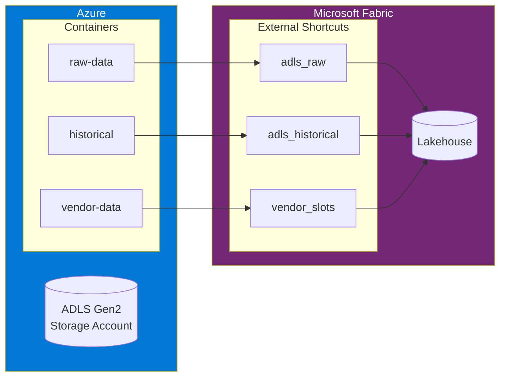

**Creating ADLS Gen2 Shortcut:**

1. In Lakehouse, click **New shortcut**
2. Select **Azure Data Lake Storage Gen2**
3. Configure connection:

| Setting | Value |
|---------|-------|
| **URL** | `https://youraccount.dfs.core.windows.net/` |
| **Authentication** | Organizational account OR Service Principal |
| **Container** | `raw-data` |
| **Sub-path** | `/casino/slot-telemetry/` |
| **Shortcut Name** | `adls_slot_data` |

### 3.2 Amazon S3 Shortcuts

S3 shortcuts enable multi-cloud data strategies:

```python
# Example: Partner slot machine data in S3

# S3 Shortcut Configuration (via UI)
# URL: s3://vendor-slot-data/
# Authentication: Access Key + Secret Key
# Path: /igt-machines/telemetry/
# Shortcut Name: igt_telemetry
```

**Creating S3 Shortcut via UI:**

1. In Lakehouse, click **New shortcut**
2. Select **Amazon S3**
3. Configure connection:

| Setting | Value |
|---------|-------|
| **URL** | `s3://vendor-slot-data/` |
| **Authentication** | Access Key and Secret Key |
| **Access Key ID** | `AKIA...` |
| **Secret Access Key** | `(stored securely)` |
| **Path** | `/igt-machines/telemetry/` |
| **Shortcut Name** | `igt_vendor_telemetry` |

### 3.3 Google Cloud Storage Shortcuts

GCS shortcuts for Google Cloud integration:

| Setting | Value |
|---------|-------|
| **URL** | `gs://partner-analytics-bucket/` |
| **Authentication** | Service Account Key |
| **Path** | `/shared/player-insights/` |
| **Shortcut Name** | `gcs_partner_insights` |

### 3.4 External Shortcut Best Practices

| Practice | Description |
|----------|-------------|
| **Use Service Principals** | Avoid personal accounts for production shortcuts |
| **Implement Least Privilege** | Grant only necessary permissions on source storage |
| **Monitor Access** | Enable logging on source storage accounts |
| **Consider Latency** | Cross-region shortcuts may have higher latency |
| **Plan for Egress** | External shortcuts incur egress charges from source clouds |

---

## Step 4: Dataverse Shortcuts

### 4.1 Dynamics 365 Integration

Dataverse shortcuts connect Fabric directly to Dynamics 365 and Power Platform data:

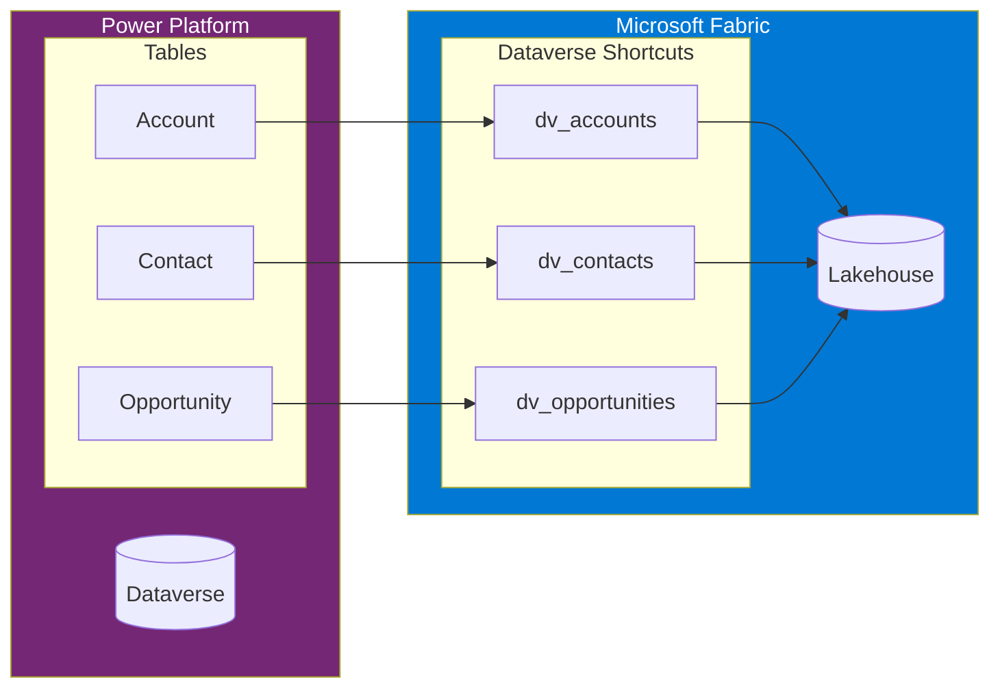

### 4.2 Creating Dataverse Shortcuts

1. In Lakehouse, click **New shortcut**
2. Select **Dataverse**
3. Authenticate with your Power Platform credentials
4. Select the environment containing your Dataverse tables
5. Choose the tables to shortcut

**Example Configuration:**

| Setting | Value |
|---------|-------|
| **Environment** | Production - Contoso Casino |
| **Table** | account |
| **Shortcut Name** | dv_crm_accounts |

### 4.3 Querying Dataverse Data

```python
# Join Dataverse CRM data with Fabric analytics

# Read player data from Fabric
df_players = spark.table("gold.gold_player_360")

# Read CRM accounts from Dataverse shortcut
df_crm = spark.table("enterprise.dv_crm_accounts")

# Join to enrich player profiles with CRM data
df_enriched = df_players.join(
    df_crm,
    df_players.crm_account_id == df_crm.accountid,
    "left"
).select(
    df_players["*"],
    df_crm.name.alias("crm_company_name"),
    df_crm.revenue.alias("crm_annual_revenue"),
    df_crm.industrycode.alias("crm_industry")
)

display(df_enriched)
```

---

## Step 5: Security and Access Control

### 5.1 Security Inheritance Model

Shortcuts inherit security from their source with additional controls:

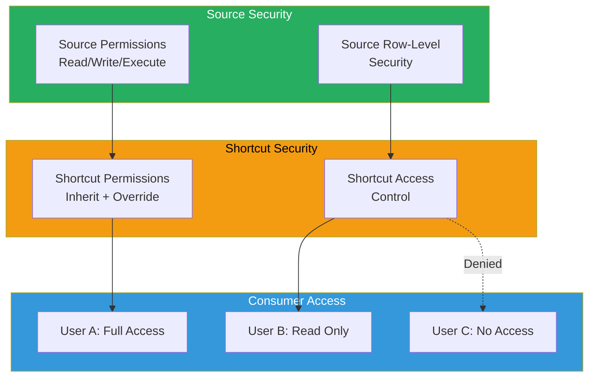

### 5.2 Permission Requirements

| Shortcut Type | Source Permission Required | Target Permission Required |
|---------------|---------------------------|---------------------------|
| **Internal OneLake** | Read on source item | Write on target lakehouse |
| **ADLS Gen2** | Storage Blob Data Reader | Write on target lakehouse |
| **Amazon S3** | s3:GetObject, s3:ListBucket | Write on target lakehouse |
| **Google Cloud Storage** | storage.objects.get | Write on target lakehouse |
| **Dataverse** | Read on Dataverse tables | Write on target lakehouse |

### 5.3 Implementing Row-Level Security with Shortcuts

```python
# Example: Implement RLS for multi-property access

# Create a security mapping table
security_mapping = [
    ("user1@casino.com", "Vegas"),
    ("user1@casino.com", "Atlantic City"),
    ("user2@casino.com", "Vegas"),
    ("user3@casino.com", "New Orleans"),
]

df_security = spark.createDataFrame(
    security_mapping,
    ["user_email", "allowed_property"]
)

# Save security mapping
df_security.write.mode("overwrite").saveAsTable("security.property_access")

# In Semantic Model, apply RLS using DAX
# Property Access =
# FILTER(
#     'All Players',
#     'All Players'[property] IN
#     SELECTCOLUMNS(
#         FILTER(
#             'Property Access',
#             'Property Access'[user_email] = USERPRINCIPALNAME()
#         ),
#         "Property", 'Property Access'[allowed_property]
#     )
# )
```

### 5.4 Auditing Shortcut Access

```python
# Query Fabric audit logs for shortcut access

# Via Power BI REST API or Fabric Admin API
# GET /admin/activityevents
# Filter: ActivityType eq 'CreateShortcut' or 'AccessShortcut'

# Example audit query
audit_events = """
SELECT
    activity_timestamp,
    user_name,
    activity_type,
    item_name,
    shortcut_source,
    result_status
FROM fabric_audit_logs
WHERE activity_type IN ('CreateShortcut', 'AccessShortcut', 'DeleteShortcut')
  AND activity_timestamp >= current_date - 30
ORDER BY activity_timestamp DESC
"""
```

---

## Step 6: Cross-Workspace Data Sharing Patterns

### 6.1 Hub-and-Spoke Architecture

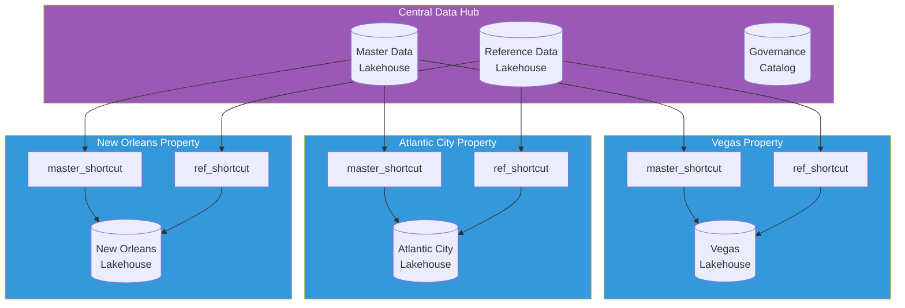

### 6.2 Data Mesh Pattern

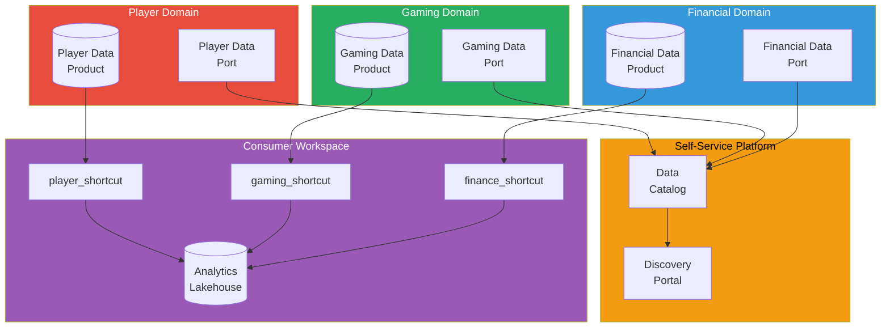

### 6.3 Implementing Hub-and-Spoke

```python
# Notebook: Configure Hub-and-Spoke Shortcuts

# Central hub publishes master data
# Spoke workspaces create shortcuts to access

# Hub workspace: enterprise-data-hub
# Hub lakehouse: master_data

# Spoke configuration
spokes = [
    {
        "workspace": "Vegas_Casino",
        "lakehouse": "property_analytics",
        "shortcuts": [
            {"name": "master_players", "source_path": "Tables/dim_player_master"},
            {"name": "master_games", "source_path": "Tables/dim_game_master"},
            {"name": "ref_calendar", "source_path": "Tables/dim_calendar"},
            {"name": "ref_geography", "source_path": "Tables/dim_geography"}
        ]
    },
    {
        "workspace": "Atlantic_City_Casino",
        "lakehouse": "property_analytics",
        "shortcuts": [
            {"name": "master_players", "source_path": "Tables/dim_player_master"},
            {"name": "master_games", "source_path": "Tables/dim_game_master"},
            {"name": "ref_calendar", "source_path": "Tables/dim_calendar"},
            {"name": "ref_geography", "source_path": "Tables/dim_geography"}
        ]
    }
]

# Deploy shortcuts to all spokes
hub_workspace = "Enterprise_Data_Hub"
hub_lakehouse = "master_data"

for spoke in spokes:
    print(f"Configuring shortcuts for {spoke['workspace']}...")
    for shortcut in spoke["shortcuts"]:
        # Create shortcut via API
        print(f"  Creating shortcut: {shortcut['name']}")
        # create_internal_shortcut(...)
```

---

## Step 7: External Data Sharing (B2B)

### 7.1 Partner/Vendor Data Sharing Scenarios

| Scenario | Pattern | Example |
|----------|---------|---------|
| **Vendor Data Ingestion** | External shortcut from vendor storage | IGT slot machine telemetry from S3 |
| **Regulatory Reporting** | Data copy to external destination | CTR reports to FinCEN ADLS |
| **Partner Analytics** | Cross-tenant sharing | Joint marketing analytics with hotel partner |
| **Franchise Data** | Multi-tenant with isolation | Franchise property data federation |

### 7.2 Architecture for Vendor Data Integration

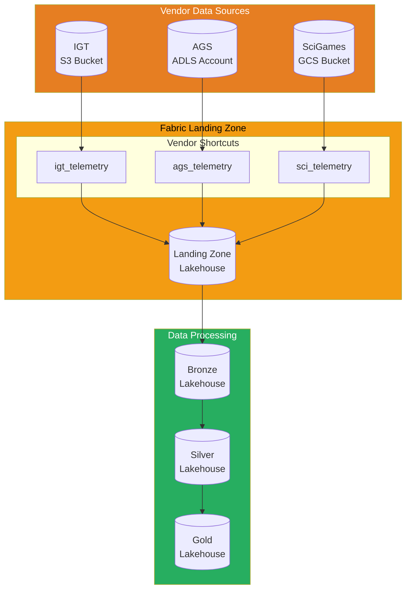

### 7.3 Configuring Vendor Shortcuts

```python
# Notebook: Configure Vendor Data Shortcuts

# Vendor 1: IGT (Amazon S3)
igt_config = {
    "name": "igt_slot_telemetry",
    "type": "s3",
    "url": "s3://igt-casino-data/",
    "path": "telemetry/2024/",
    "auth": {
        "type": "access_key",
        "key_vault_secret": "igt-s3-access-key"
    }
}

# Vendor 2: AGS (Azure Storage)
ags_config = {
    "name": "ags_game_data",
    "type": "adls_gen2",
    "url": "https://agspartnerdata.dfs.core.windows.net/",
    "container": "casino-export",
    "path": "game-analytics/",
    "auth": {
        "type": "service_principal",
        "key_vault_secret": "ags-sp-credentials"
    }
}

# Vendor 3: Scientific Games (GCS)
sci_config = {
    "name": "sci_lottery_data",
    "type": "gcs",
    "url": "gs://scigames-partner-bucket/",
    "path": "lottery/daily/",
    "auth": {
        "type": "service_account",
        "key_vault_secret": "sci-gcs-sa-key"
    }
}

# Unified vendor data processing
def process_vendor_data():
    """Process data from all vendor shortcuts."""

    # Read from each vendor shortcut
    df_igt = spark.read.parquet("Tables/igt_slot_telemetry")
    df_ags = spark.read.parquet("Tables/ags_game_data")
    df_sci = spark.read.parquet("Tables/sci_lottery_data")

    # Standardize schemas
    df_igt_std = standardize_telemetry(df_igt, "IGT")
    df_ags_std = standardize_telemetry(df_ags, "AGS")
    df_sci_std = standardize_telemetry(df_sci, "SciGames")

    # Union all vendor data
    df_unified = df_igt_std.unionByName(df_ags_std).unionByName(df_sci_std)

    # Write to bronze layer
    df_unified.write \
        .mode("append") \
        .partitionBy("vendor", "date") \
        .saveAsTable("bronze.vendor_telemetry")

    return df_unified.count()
```

### 7.4 Outbound Data Sharing

For sharing data with external partners:

```python
# Export data to partner storage (outbound)
# Note: Use Data Pipelines for scheduled exports

# Example: Export regulatory reports to FinCEN
from pyspark.sql.functions import current_date

# Prepare CTR report
df_ctr = spark.sql("""
    SELECT
        transaction_id,
        player_id,
        transaction_date,
        transaction_amount,
        transaction_type,
        property_id
    FROM gold.regulatory_transactions
    WHERE transaction_amount >= 10000
      AND transaction_date >= current_date() - 1
""")

# Write to external partner storage
df_ctr.write \
    .mode("overwrite") \
    .parquet("abfss://fincen-reports@partnerdata.dfs.core.windows.net/ctr/daily/")
```

---

## Step 8: Multi-Tenant Data Architecture

### 8.1 Multi-Tenant Patterns

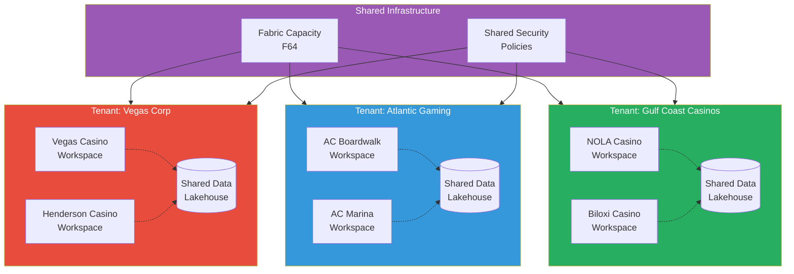

### 8.2 Tenant Isolation Strategies

| Strategy | Description | Use Case |
|----------|-------------|----------|
| **Workspace Isolation** | Separate workspaces per tenant | Strong isolation, separate billing |
| **Lakehouse Isolation** | Separate lakehouses within shared workspace | Medium isolation, shared governance |
| **Schema Isolation** | Separate schemas/folders within lakehouse | Basic isolation, shared compute |
| **RLS Isolation** | Row-level security filtering | Same data, different views |

### 8.3 Implementing Multi-Tenant Shortcuts

```python
# Notebook: Multi-Tenant Data Federation

# Tenant configuration
tenants = [
    {
        "tenant_id": "T001",
        "name": "Vegas Corp",
        "workspaces": ["Vegas_Casino", "Henderson_Casino"],
        "shared_lakehouse": "vegas_corp_shared"
    },
    {
        "tenant_id": "T002",
        "name": "Atlantic Gaming",
        "workspaces": ["AC_Boardwalk", "AC_Marina"],
        "shared_lakehouse": "atlantic_gaming_shared"
    },
    {
        "tenant_id": "T003",
        "name": "Gulf Coast Casinos",
        "workspaces": ["NOLA_Casino", "Biloxi_Casino"],
        "shared_lakehouse": "gulf_coast_shared"
    }
]

def create_tenant_shortcuts(tenant: dict):
    """Create shortcuts for tenant data federation."""

    shared_lakehouse = tenant["shared_lakehouse"]

    for workspace in tenant["workspaces"]:
        # Create shortcut from property workspace to shared lakehouse
        shortcuts = [
            {
                "name": f"{workspace.lower()}_players",
                "source_workspace": workspace,
                "source_lakehouse": "property_analytics",
                "source_path": "Tables/dim_players"
            },
            {
                "name": f"{workspace.lower()}_transactions",
                "source_workspace": workspace,
                "source_lakehouse": "property_analytics",
                "source_path": "Tables/fact_transactions"
            }
        ]

        for sc in shortcuts:
            print(f"Creating shortcut: {sc['name']} in {shared_lakehouse}")
            # create_internal_shortcut(...)

# Create shortcuts for all tenants
for tenant in tenants:
    create_tenant_shortcuts(tenant)
    print(f"Configured shortcuts for tenant: {tenant['name']}")
```

### 8.4 Cross-Tenant Analytics (Enterprise View)

```python
# Create enterprise-wide view across all tenants

# Enterprise workspace: "Enterprise_Analytics"
# Enterprise lakehouse: "all_properties"

# Create shortcuts to each tenant's shared lakehouse
enterprise_shortcuts = [
    {"name": "vegas_corp", "source": "vegas_corp_shared"},
    {"name": "atlantic_gaming", "source": "atlantic_gaming_shared"},
    {"name": "gulf_coast", "source": "gulf_coast_shared"}
]

# Query across all tenants
enterprise_summary = spark.sql("""
    SELECT
        'Vegas Corp' as tenant,
        count(*) as player_count,
        sum(lifetime_value) as total_ltv
    FROM enterprise_analytics.vegas_corp.players

    UNION ALL

    SELECT
        'Atlantic Gaming' as tenant,
        count(*) as player_count,
        sum(lifetime_value) as total_ltv
    FROM enterprise_analytics.atlantic_gaming.players

    UNION ALL

    SELECT
        'Gulf Coast' as tenant,
        count(*) as player_count,
        sum(lifetime_value) as total_ltv
    FROM enterprise_analytics.gulf_coast.players
""")

display(enterprise_summary)
```

---

## Step 9: Performance Optimization

### 9.1 Shortcut vs Copy Decision Matrix

| Factor | Use Shortcut | Use Copy |
|--------|-------------|----------|
| **Latency Sensitivity** | Low latency tolerance | High latency tolerance |
| **Data Freshness** | Need real-time data | Can tolerate stale data |
| **Query Frequency** | Occasional queries | Heavy query workload |
| **Data Volume** | Large datasets (>1TB) | Small to medium datasets |
| **Cross-Region** | Same region | Cross-region |
| **Transform Needs** | None or light | Heavy transformation |
| **Cost Optimization** | Minimize storage | Minimize egress |

### 9.2 Performance Considerations

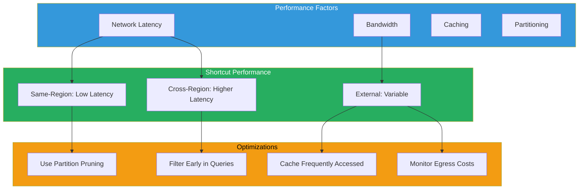

### 9.3 Query Optimization for Shortcuts

```python
# Optimize queries against shortcuts

# BAD: Full table scan across shortcut
df_bad = spark.table("shortcuts.vendor_telemetry")
result = df_bad.filter(col("date") == "2024-01-15").count()

# GOOD: Push filter to shortcut source
df_good = spark.read \
    .format("delta") \
    .load("Tables/vendor_telemetry") \
    .filter(col("date") == "2024-01-15")
result = df_good.count()

# BETTER: Use predicate pushdown with partition column
df_best = spark.sql("""
    SELECT count(*)
    FROM shortcuts.vendor_telemetry
    WHERE date = '2024-01-15'
      AND vendor = 'IGT'
""")

# Monitor query performance
spark.sql("EXPLAIN EXTENDED SELECT * FROM shortcuts.vendor_telemetry WHERE date = '2024-01-15'").show(truncate=False)
```

### 9.4 Caching Strategy

```python
# Cache frequently accessed shortcut data

# Identify hot data patterns
hot_tables = [
    "shortcuts.master_players",
    "shortcuts.ref_calendar",
    "shortcuts.ref_geography"
]

# Create cached copies for hot data
for table in hot_tables:
    df = spark.table(table)

    # Write to local lakehouse as cached copy
    df.write \
        .mode("overwrite") \
        .format("delta") \
        .saveAsTable(f"cached.{table.split('.')[1]}")

    print(f"Cached {table} locally")

# Schedule cache refresh
# Use Data Pipeline to refresh cached tables daily
```

---

## Step 10: Governance for Shared Data

### 10.1 Governance Framework

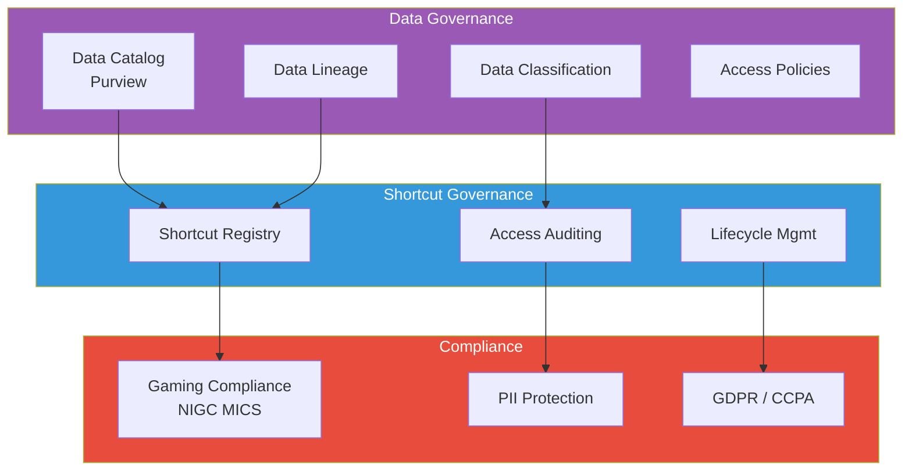

### 10.2 Shortcut Registry

Maintain a registry of all shortcuts for governance:

```python
# Notebook: Shortcut Registry Management

from pyspark.sql.functions import current_timestamp, lit
from pyspark.sql.types import StructType, StructField, StringType, TimestampType

# Shortcut registry schema
registry_schema = StructType([
    StructField("shortcut_id", StringType(), False),
    StructField("shortcut_name", StringType(), False),
    StructField("shortcut_type", StringType(), False),  # internal, adls, s3, gcs, dataverse
    StructField("target_workspace", StringType(), False),
    StructField("target_lakehouse", StringType(), False),
    StructField("source_location", StringType(), False),
    StructField("source_path", StringType(), True),
    StructField("owner", StringType(), False),
    StructField("data_classification", StringType(), False),
    StructField("created_date", TimestampType(), False),
    StructField("last_reviewed_date", TimestampType(), True),
    StructField("status", StringType(), False)  # active, deprecated, pending_review
])

# Register a new shortcut
def register_shortcut(
    shortcut_name: str,
    shortcut_type: str,
    target_workspace: str,
    target_lakehouse: str,
    source_location: str,
    source_path: str,
    owner: str,
    data_classification: str
):
    """Register a shortcut in the governance registry."""

    import uuid

    new_record = [(
        str(uuid.uuid4()),
        shortcut_name,
        shortcut_type,
        target_workspace,
        target_lakehouse,
        source_location,
        source_path,
        owner,
        data_classification,
        current_timestamp(),
        None,
        "active"
    )]

    df_new = spark.createDataFrame(new_record, registry_schema)

    # Append to registry
    df_new.write.mode("append").saveAsTable("governance.shortcut_registry")

    print(f"Registered shortcut: {shortcut_name}")

# Query registry for compliance review
def get_shortcuts_for_review(days_since_review: int = 90):
    """Get shortcuts that need compliance review."""

    return spark.sql(f"""
        SELECT *
        FROM governance.shortcut_registry
        WHERE status = 'active'
          AND (last_reviewed_date IS NULL
               OR last_reviewed_date < current_date() - {days_since_review})
        ORDER BY created_date
    """)
```

### 10.3 Lineage Tracking

```python
# Track data lineage through shortcuts

# Lineage metadata table
lineage_entries = [
    {
        "source": "s3://igt-casino-data/telemetry/",
        "shortcut": "igt_slot_telemetry",
        "target": "bronze.vendor_telemetry",
        "transformation": "raw_ingestion",
        "pipeline": "pl_vendor_ingestion"
    },
    {
        "source": "bronze.vendor_telemetry",
        "shortcut": None,
        "target": "silver.slot_transactions",
        "transformation": "cleanse_standardize",
        "pipeline": "pl_silver_transform"
    },
    {
        "source": "silver.slot_transactions",
        "shortcut": None,
        "target": "gold.slot_analytics",
        "transformation": "aggregate_metrics",
        "pipeline": "pl_gold_aggregation"
    }
]

# Visualize lineage
# Integration with Microsoft Purview provides automatic lineage tracking
```

---

## Validation Checklist

Before completing this tutorial, verify:

- [ ] **OneLake Understanding** - Can explain OneLake hierarchy and path formats
- [ ] **Internal Shortcuts** - Successfully created cross-workspace shortcuts
- [ ] **External Shortcuts** - Configured at least one external shortcut (ADLS/S3/GCS)
- [ ] **Dataverse Integration** - Understand Dataverse shortcut creation (if applicable)
- [ ] **Security Inheritance** - Verified permissions flow through shortcuts
- [ ] **Cross-Workspace Sharing** - Data accessible from target workspace
- [ ] **Query Performance** - Tested query performance through shortcuts
- [ ] **Governance Registry** - Documented shortcuts in governance registry

---

## Troubleshooting

| Issue | Cause | Solution |
|-------|-------|----------|
| Shortcut creation fails | Insufficient permissions | Verify Write access on target lakehouse |
| Data not visible | Source permissions | Ensure Read access on source data |
| Slow queries | Cross-region latency | Consider caching or data copy for hot data |
| Authentication error (ADLS) | Expired credentials | Refresh service principal or managed identity |
| S3 access denied | IAM policy mismatch | Verify S3 bucket policy allows Fabric access |
| Shortcut shows stale data | Caching | Shortcuts reflect real-time data; check source |
| Cannot delete shortcut | Items depend on it | Remove dependent items first |

---

## Best Practices

### Shortcut Design

1. **Use Descriptive Names** - Include source indication (e.g., `adls_vendor_igt_telemetry`)
2. **Document Purpose** - Maintain registry with business context
3. **Plan for Failure** - External shortcuts depend on source availability
4. **Consider Latency** - Same-region shortcuts perform better

### Security

5. **Least Privilege** - Grant minimum permissions on source and target
6. **Use Service Principals** - Avoid personal accounts for production shortcuts
7. **Audit Access** - Enable logging on all shortcut sources
8. **Classify Data** - Apply sensitivity labels through Purview

### Performance

9. **Partition Alignment** - Align partitions with query patterns
10. **Cache Hot Data** - Copy frequently accessed data locally
11. **Monitor Egress** - Track cross-region and external egress costs
12. **Optimize Queries** - Use predicate pushdown and filter early

### Governance

13. **Lifecycle Management** - Review and deprecate unused shortcuts
14. **Version Control** - Track shortcut configurations in source control
15. **Compliance Review** - Regular review for regulatory compliance
16. **Lineage Documentation** - Track data flow through shortcuts

---

## Summary

In this tutorial, you learned to:

- Understand OneLake as Fabric's unified data lake with hierarchical organization
- Create internal shortcuts for cross-workspace data sharing without duplication
- Configure external shortcuts to ADLS Gen2, Amazon S3, and Google Cloud Storage
- Integrate Dataverse data for Dynamics 365 and Power Platform connectivity
- Implement security inheritance and access control patterns
- Design hub-and-spoke and data mesh architectures using shortcuts
- Configure B2B data sharing for vendor and partner integration
- Build multi-tenant data architectures with proper isolation
- Optimize shortcut performance and understand virtualization trade-offs
- Establish governance frameworks for shared data management

---

## Next Steps

Continue to **[Tutorial 19: Fabric Copilot & AI Features](../19-copilot-ai/README.md)** to learn how to leverage AI-powered assistance for data engineering and analytics tasks in Microsoft Fabric.

**Related tutorials:**
- [Tutorial 07: Governance & Purview](../07-governance-purview/README.md) - Data governance integration
- [Tutorial 08: Database Mirroring](../08-database-mirroring/README.md) - Alternative data synchronization
- [Tutorial 10: Teradata Migration](../10-teradata-migration/README.md) - Migration patterns using shortcuts

---

## Additional Resources

### Microsoft Documentation

- [OneLake Overview](https://learn.microsoft.com/fabric/onelake/onelake-overview)
- [OneLake Shortcuts](https://learn.microsoft.com/fabric/onelake/onelake-shortcuts)
- [Create ADLS Gen2 Shortcut](https://learn.microsoft.com/fabric/onelake/create-adls-shortcut)
- [Create S3 Shortcut](https://learn.microsoft.com/fabric/onelake/create-s3-shortcut)
- [Create GCS Shortcut](https://learn.microsoft.com/fabric/onelake/create-gcs-shortcut)
- [Dataverse Shortcuts](https://learn.microsoft.com/fabric/onelake/create-dataverse-shortcut)
- [OneLake Security](https://learn.microsoft.com/fabric/onelake/onelake-security)

### Architecture Patterns

- [Data Mesh with Microsoft Fabric](https://learn.microsoft.com/azure/architecture/example-scenario/data/data-mesh-fabric)
- [Multi-Tenant SaaS on Fabric](https://learn.microsoft.com/fabric/governance/multi-tenancy)
- [Cross-Workspace Data Sharing](https://learn.microsoft.com/fabric/data-engineering/lakehouse-sharing)

### APIs and Automation

- [OneLake API Reference](https://learn.microsoft.com/rest/api/fabric/onelake)
- [Fabric REST APIs](https://learn.microsoft.com/rest/api/fabric/articles/)
- [Shortcuts API](https://learn.microsoft.com/rest/api/fabric/shortcuts)

---

## Navigation

| Previous | Up | Next |
|----------|------|--------|
| [17-Monitoring & Alerting](../17-monitoring-alerting/README.md) | [Tutorials Index](../README.md) | [19-Fabric Copilot & AI Features](../19-copilot-ai/README.md) |
