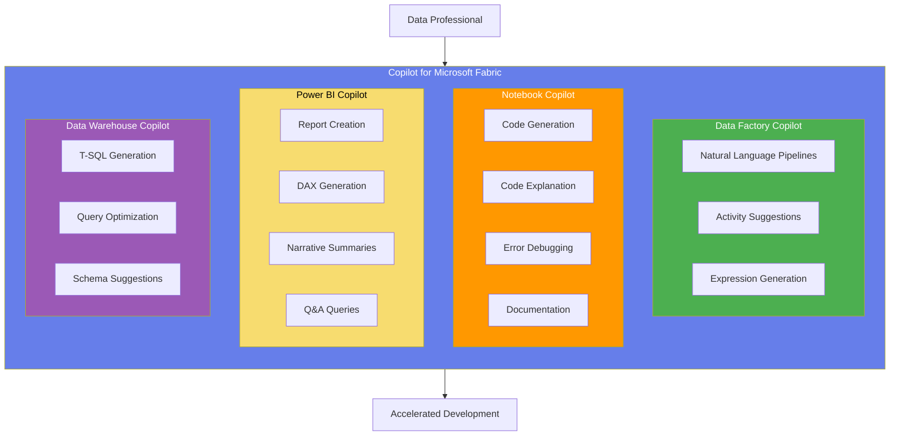
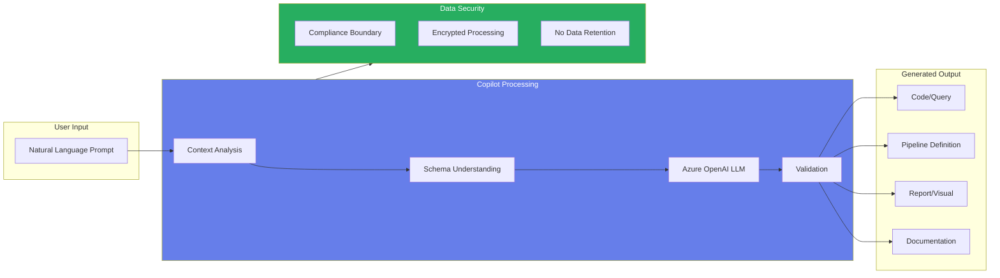
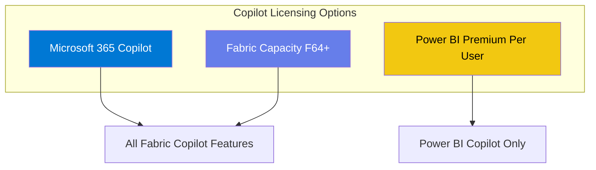
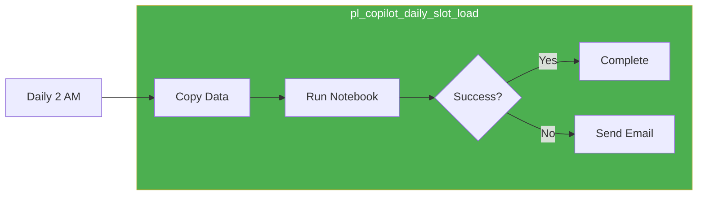
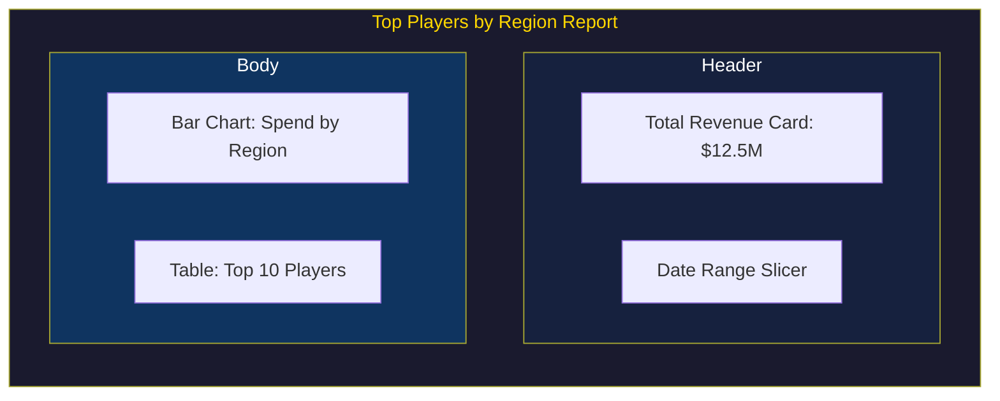
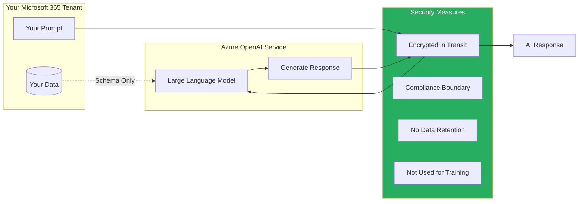
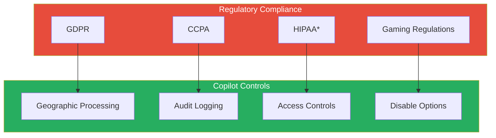
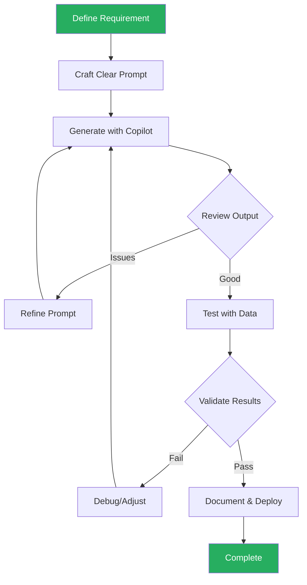

# Tutorial 19: Copilot & AI-Assisted Development for Microsoft Fabric

> **[Home](../../README.md)** > **[Tutorials](../README.md)** > **Copilot & AI-Assisted Development**

---

<div align="center">


</div>

---

## Tutorial 19: Copilot & AI-Assisted Development

| | |
|---|---|
| **Difficulty** | Beginner-Intermediate |
| **Time** | 1.5 hours |
| **Prerequisites** | Fabric workspace, Copilot licensing enabled |

---

### Progress Tracker

<div align="center">

```
+---------+---------+---------+---------+---------+---------+---------+---------+---------+---------+
|   00    |   01    |   02    |   03    |   04    |   05    |   06    |   07    |   08    |   09    |
|  SETUP  |  BRONZE |  SILVER |  GOLD   |   RT    |   PBI   |  PIPES  |   GOV   | MIRROR  |  AI/ML  |
+---------+---------+---------+---------+---------+---------+---------+---------+---------+---------+
|    V    |    V    |    V    |    V    |    V    |    V    |    V    |    V    |    V    |    V    |
+---------+---------+---------+---------+---------+---------+---------+---------+---------+---------+

+---------+---------+---------+---------+---------+---------+---------+---------+---------+---------+
|   10    |   11    |   12    |   13    |   14    |   15    |   16    |   17    |   18    |   19    |
|TERADATA |   SAS   |  CI/CD  |PLANNING |SHORTCUTS| LAKEHSE |  SPARK  | WAREHS  | SHARING | COPILOT |
+---------+---------+---------+---------+---------+---------+---------+---------+---------+---------+
|    V    |    V    |    V    |    V    |    V    |    V    |    V    |    V    |    V    |   -->   |
+---------+---------+---------+---------+---------+---------+---------+---------+---------+---------+
                                                                                              ^
                                                                                         YOU ARE HERE
                                                                                        FINAL TUTORIAL
```

</div>

| Navigation | |
|---|---|
| **Previous** | [18-Data Sharing](../18-data-sharing/README.md) |
| **Next** | [Tutorials Home](../README.md) - Series Complete! |

---

## Overview

Welcome to the **final tutorial** in the Microsoft Fabric learning series! This tutorial introduces you to **Copilot for Microsoft Fabric**, the AI-powered assistant that accelerates development across the entire Fabric platform. You will learn how to leverage natural language prompts to create pipelines, generate code, build reports, and optimize queries - dramatically reducing development time while maintaining quality.

Copilot integrates seamlessly across Fabric workloads, enabling both beginners and experts to work more efficiently. By the end of this tutorial, you will understand how to effectively use AI assistance in your daily data engineering and analytics workflows.



---

## Learning Objectives

By the end of this tutorial, you will be able to:

- [ ] Understand Copilot licensing and enablement requirements for Microsoft Fabric
- [ ] Use Copilot in Data Factory to create pipelines from natural language descriptions
- [ ] Generate PySpark and Python code in Notebooks using Copilot prompts
- [ ] Leverage Copilot to explain, debug, and document existing code
- [ ] Create Power BI reports and DAX measures using natural language
- [ ] Generate T-SQL queries in Data Warehouse with Copilot assistance
- [ ] Apply prompt engineering best practices for optimal AI responses
- [ ] Understand data privacy and security considerations when using Copilot
- [ ] Identify limitations and scenarios where manual development is preferred
- [ ] Combine AI assistance with domain expertise for casino analytics use cases

---

## Architecture Overview



---

## Prerequisites

Before starting this tutorial, ensure you have:

- [ ] **Completed previous tutorials** (00-18) or equivalent experience
- [ ] **Microsoft Fabric workspace** with at least Contributor access
- [ ] **Copilot licensing** - One of the following:
  - Microsoft 365 Copilot license
  - Fabric Copilot SKU (included in F64+)
  - Power BI Premium Per User (PPU) for Power BI Copilot
- [ ] **Copilot enabled** by tenant administrator in Fabric Admin Portal
- [ ] **Sample data available** in your Lakehouse (from previous tutorials)
- [ ] **Familiarity with** basic PySpark, SQL, and DAX concepts

> **Note:** Copilot features may be in preview and require explicit enablement. Check with your administrator if features are not visible.

### Verify Copilot Availability

1. Open your Fabric workspace
2. Create a new Notebook
3. Look for the **Copilot** icon in the toolbar
4. If not visible, contact your tenant administrator

---

## Step 1: Understanding Copilot for Microsoft Fabric

### What is Copilot?

Copilot for Microsoft Fabric is an AI-powered assistant that uses large language models (LLMs) to help you:

- **Generate code** from natural language descriptions
- **Explain existing code** in plain English
- **Debug errors** with intelligent suggestions
- **Create visualizations** from data descriptions
- **Optimize queries** for better performance

### Copilot Availability by Workload

| Workload | Copilot Features | Availability |
|----------|------------------|--------------|
| **Data Factory** | Pipeline creation, expression help | Generally Available |
| **Notebooks** | Code generation, explanation, debugging | Generally Available |
| **Power BI** | Report creation, DAX, narratives | Generally Available |
| **Data Warehouse** | T-SQL generation, optimization | Generally Available |
| **Real-Time Analytics** | KQL assistance | Preview |
| **Data Science** | Model suggestions, feature engineering | Preview |

### Licensing Requirements



### Enable Copilot (Administrator)

If you are a tenant administrator:

1. Navigate to **Fabric Admin Portal**
2. Go to **Tenant settings** > **Copilot and Azure OpenAI Service**
3. Enable the following settings:
   - Users can use Copilot and other features powered by Azure OpenAI
   - Data sent to Azure OpenAI can be processed outside your tenant's geographic region

> **Warning:** Enabling cross-region processing may have compliance implications. Review with your legal and security teams.

---

## Step 2: Copilot for Data Factory

Data Factory Copilot helps you create and modify data pipelines using natural language.

### Creating a Pipeline with Copilot

1. Open **Data Factory** in your workspace
2. Click **Create** > **Data Pipeline**
3. Name it: `pl_copilot_daily_slot_load`
4. Look for the **Copilot** button in the toolbar
5. Click to open the Copilot pane

### Casino Example: Daily Slot Data Pipeline

**Prompt:**
```
Create a pipeline that:
1. Copies slot machine data from the Bronze lakehouse to Silver lakehouse daily
2. Runs a notebook to transform and cleanse the data
3. Sends an email notification if the pipeline fails
4. Runs every day at 2 AM
```

**Copilot Response:**

Copilot will generate a pipeline with:
- Copy activity: Bronze to staging
- Notebook activity: Transformation
- Failure notification: Email on error
- Trigger: Daily schedule at 2 AM



### Activity Suggestions

When adding activities, Copilot suggests:

| Context | Suggestion |
|---------|------------|
| After Copy activity | "Add Data Flow for transformations" |
| After Notebook | "Add validation query" |
| On failure path | "Add notification activity" |
| Large data copy | "Enable parallel copy" |

### Expression Generation

**Prompt:**
```
Create an expression that gets yesterday's date in YYYY-MM-DD format
```

**Copilot Response:**
```
@formatDateTime(addDays(utcNow(), -1), 'yyyy-MM-dd')
```

### Best Practices for Data Factory Copilot

| Do | Do Not |
|---|---|
| Be specific about source and target | Use vague descriptions |
| Include data volume hints | Assume Copilot knows your data |
| Specify error handling | Forget failure scenarios |
| Request schedule details | Leave timing ambiguous |

---

## Step 3: Copilot for Notebooks

Notebook Copilot is your AI pair programmer for PySpark, Python, and SQL code.

### Accessing Notebook Copilot

1. Open a Notebook in your workspace
2. Attach to your Lakehouse
3. Click the **Copilot** icon in the toolbar
4. The Copilot chat pane opens on the right

### Code Generation: Casino Player Lifetime Value

**Prompt:**
```
Write PySpark code to calculate player lifetime value (LTV) from the slot_transactions table.
Include:
- Total coin_in and coin_out per player
- Calculate net gaming revenue (NGR) as coin_in - coin_out
- Average session duration
- Number of visits
- LTV as NGR * predicted future visits (assume 2x historical visits)
```

**Copilot Response:**

```python
from pyspark.sql import functions as F
from pyspark.sql.window import Window

# Read slot transactions
df_transactions = spark.read.table("lh_silver.slot_transactions")

# Calculate player metrics
player_ltv = df_transactions.groupBy("player_id").agg(
    F.sum("coin_in").alias("total_coin_in"),
    F.sum("coin_out").alias("total_coin_out"),
    F.avg("session_duration_minutes").alias("avg_session_duration"),
    F.countDistinct("session_id").alias("visit_count"),
    F.countDistinct(F.to_date("transaction_timestamp")).alias("unique_days")
)

# Calculate NGR and LTV
player_ltv = player_ltv.withColumn(
    "net_gaming_revenue",
    F.col("total_coin_in") - F.col("total_coin_out")
).withColumn(
    "predicted_future_visits",
    F.col("visit_count") * 2  # Assumption: 2x historical
).withColumn(
    "lifetime_value",
    F.col("net_gaming_revenue") / F.col("visit_count") * F.col("predicted_future_visits")
)

# Display results
display(player_ltv.orderBy(F.desc("lifetime_value")).limit(100))

# Save to Gold layer
player_ltv.write.format("delta").mode("overwrite").saveAsTable("lh_gold.player_lifetime_value")

print(f"Calculated LTV for {player_ltv.count()} players")
```

### Code Explanation

Select existing code and ask Copilot to explain:

**Prompt:**
```
Explain this code in simple terms
```

**Before (Complex Code):**
```python
window_spec = Window.partitionBy("player_id").orderBy("transaction_timestamp").rowsBetween(Window.unboundedPreceding, Window.currentRow)
df = df.withColumn("cumulative_spend", F.sum("coin_in").over(window_spec))
```

**Copilot Explanation:**
```
This code calculates a running total of coin_in for each player:

1. Window.partitionBy("player_id"): Groups data by player, so calculations
   are done separately for each player

2. orderBy("transaction_timestamp"): Orders transactions chronologically
   within each player's group

3. rowsBetween(unboundedPreceding, currentRow): Includes all rows from
   the beginning up to the current row

4. F.sum("coin_in").over(window_spec): Calculates cumulative sum of
   coin_in using the defined window

Result: Each row shows the total amount the player has wagered up to
that point in time.
```

### Error Debugging

When you encounter an error, Copilot can help debug:

**Error Message:**
```
AnalysisException: Column 'player_id' does not exist. Available columns: [PlayerID, TransactionDate, Amount]
```

**Prompt:**
```
Fix this error
```

**Copilot Response:**
```python
# Column names are case-sensitive. Use the actual column name:
df = df.select(
    F.col("PlayerID").alias("player_id"),  # Standardize naming
    F.col("TransactionDate").alias("transaction_date"),
    F.col("Amount").alias("amount")
)
```

### Documentation Generation

**Prompt:**
```
Generate documentation for this function including docstring, parameters, returns, and example usage
```

**Before:**
```python
def calculate_theo_win(coin_in, hold_percentage):
    return coin_in * hold_percentage
```

**After:**
```python
def calculate_theo_win(coin_in: float, hold_percentage: float) -> float:
    """
    Calculate theoretical win (house advantage) from slot machine play.

    Theoretical win represents the expected revenue the casino will earn
    from a given amount of play, based on the machine's hold percentage.

    Parameters
    ----------
    coin_in : float
        Total amount wagered by the player in dollars.
    hold_percentage : float
        The machine's hold percentage (e.g., 0.08 for 8% hold).
        This is the inverse of the payback percentage.

    Returns
    -------
    float
        Theoretical win amount in dollars.

    Examples
    --------
    >>> calculate_theo_win(1000.00, 0.08)
    80.0

    >>> calculate_theo_win(5000.00, 0.12)
    600.0

    Notes
    -----
    - Industry standard hold percentages range from 2% to 15%
    - Actual win will vary from theoretical due to variance
    - Used for player reinvestment calculations and comp ratings

    See Also
    --------
    calculate_actual_win : Calculate actual win from session data
    calculate_player_rating : Rate player based on theoretical win
    """
    return coin_in * hold_percentage
```

---

## Step 4: Copilot for Power BI

Power BI Copilot enables natural language report creation and DAX formula generation.

### Creating Reports from Prompts

1. Open **Power BI** in your workspace
2. Create a new Report connected to your semantic model
3. Click the **Copilot** button
4. Enter your request

### Casino Example: Top Players Report

**Prompt:**
```
Create a report showing top players by region with:
- A bar chart of total spend by region
- A table of top 10 players with name, loyalty tier, and total spend
- A card showing total revenue
- A slicer for date range
- Use casino theme colors (dark green and gold)
```

**Copilot Response:**

Copilot generates a report page with:



### DAX Formula Generation

**Prompt:**
```
Create a DAX measure that calculates month-over-month growth percentage for total coin_in
```

**Copilot Response:**

```dax
MoM Growth % =
VAR CurrentMonth = [Total Coin In]
VAR PreviousMonth =
    CALCULATE(
        [Total Coin In],
        DATEADD('Date'[Date], -1, MONTH)
    )
RETURN
    IF(
        PreviousMonth = 0 || ISBLANK(PreviousMonth),
        BLANK(),
        DIVIDE(CurrentMonth - PreviousMonth, PreviousMonth, 0)
    )
```

### Narrative Summaries

**Prompt:**
```
Add a narrative summary that describes the key insights from this report
```

**Copilot Response:**

```
## Key Insights - Player Performance

**Regional Performance:**
The Western region leads with $4.2M in total gaming revenue,
representing 34% of total revenue. The Eastern region follows
at $2.8M (22%).

**Top Player Trends:**
- Diamond tier players account for 45% of total revenue
- Average spend per Diamond player: $125,000
- Platinum tier shows highest growth at 18% MoM

**Notable Changes:**
Revenue increased 12% compared to last month, driven primarily
by increased visitation from loyalty program members.
```

### Q&A Natural Language Queries

Use Q&A to ask questions about your data:

| Question | Response |
|----------|----------|
| "What was total revenue last week?" | Card showing $2.4M |
| "Show me players from Nevada" | Filtered table |
| "Compare weekend vs weekday revenue" | Comparison visual |
| "Which machine type has highest hold?" | Bar chart with rankings |

---

## Step 5: Copilot for Data Warehouse

Data Warehouse Copilot assists with T-SQL query generation and optimization.

### T-SQL Generation

**Prompt:**
```
Write a query that finds players who have visited more than 10 times
in the last 30 days but have not visited in the last 7 days
(potential churn risk)
```

**Copilot Response:**

```sql
-- Players with high historical engagement showing recent disengagement
-- Potential churn risk candidates for marketing outreach

WITH PlayerVisits AS (
    SELECT
        player_id,
        COUNT(DISTINCT CAST(visit_timestamp AS DATE)) as visits_last_30_days,
        MAX(visit_timestamp) as last_visit_date
    FROM gaming.fact_player_sessions
    WHERE visit_timestamp >= DATEADD(DAY, -30, GETDATE())
    GROUP BY player_id
)
SELECT
    pv.player_id,
    p.player_name,
    p.loyalty_tier,
    p.email,
    pv.visits_last_30_days,
    pv.last_visit_date,
    DATEDIFF(DAY, pv.last_visit_date, GETDATE()) as days_since_last_visit
FROM PlayerVisits pv
INNER JOIN gaming.dim_player p ON pv.player_id = p.player_id
WHERE pv.visits_last_30_days >= 10
    AND pv.last_visit_date < DATEADD(DAY, -7, GETDATE())
ORDER BY pv.visits_last_30_days DESC;
```

### Query Optimization Suggestions

**Before (Slow Query):**
```sql
SELECT *
FROM gaming.fact_slot_transactions
WHERE YEAR(transaction_date) = 2024
AND MONTH(transaction_date) = 1
```

**Copilot Optimization:**
```sql
-- Optimized: Use date range instead of functions on columns
-- This allows the query optimizer to use indexes efficiently

SELECT
    transaction_id,
    player_id,
    machine_id,
    coin_in,
    coin_out,
    transaction_date
FROM gaming.fact_slot_transactions
WHERE transaction_date >= '2024-01-01'
    AND transaction_date < '2024-02-01'

-- Optimization notes:
-- 1. Replaced YEAR/MONTH functions with date range comparison
-- 2. Selected specific columns instead of SELECT *
-- 3. Query can now use index on transaction_date column
```

### Schema Suggestions

**Prompt:**
```
Suggest indexes for the player_sessions table to optimize
frequent queries by player_id and date range
```

**Copilot Response:**

```sql
-- Recommended indexes for player_sessions table

-- Primary query pattern: Filter by player + date range
CREATE NONCLUSTERED INDEX IX_player_sessions_player_date
ON gaming.fact_player_sessions (player_id, session_start_time)
INCLUDE (session_duration, total_spend, games_played);

-- Pattern: Date-based reporting
CREATE NONCLUSTERED INDEX IX_player_sessions_date
ON gaming.fact_player_sessions (session_start_time)
INCLUDE (player_id, total_spend);

-- Pattern: High-value player lookup
CREATE NONCLUSTERED INDEX IX_player_sessions_spend
ON gaming.fact_player_sessions (total_spend DESC)
INCLUDE (player_id, session_start_time)
WHERE total_spend > 1000;
```

---

## Step 6: AI Skills in Fabric

Beyond Copilot, Fabric offers additional AI capabilities.

### AI Skills Overview

| Feature | Description | Use Case |
|---------|-------------|----------|
| **ML Models** | Train and deploy models | Churn prediction |
| **Cognitive Services** | Pre-built AI models | Sentiment analysis |
| **AI Functions** | SQL-callable AI | Text classification |
| **Semantic Link** | Data science integration | Feature engineering |

### Using AI Functions in SQL

```sql
-- Use AI to classify player feedback sentiment
SELECT
    feedback_id,
    feedback_text,
    ai.sentiment(feedback_text) as sentiment_score,
    CASE
        WHEN ai.sentiment(feedback_text) > 0.6 THEN 'Positive'
        WHEN ai.sentiment(feedback_text) < 0.4 THEN 'Negative'
        ELSE 'Neutral'
    END as sentiment_category
FROM gaming.player_feedback;
```

### Custom AI Skills

Create custom AI skills for domain-specific tasks:

```python
# Register a custom AI skill for player categorization
from semantic_link import register_ai_skill

@register_ai_skill("categorize_player")
def categorize_player(total_spend: float, visit_frequency: int) -> str:
    """
    Categorize player based on spend and visit patterns.

    Returns: 'Whale', 'Regular', 'Casual', or 'At-Risk'
    """
    if total_spend > 100000 and visit_frequency > 20:
        return 'Whale'
    elif total_spend > 10000 and visit_frequency > 10:
        return 'Regular'
    elif visit_frequency < 3:
        return 'At-Risk'
    else:
        return 'Casual'
```

---

## Step 7: Prompt Engineering Best Practices

Effective prompts lead to better Copilot responses.

### The CLEAR Framework

| Element | Description | Example |
|---------|-------------|---------|
| **C**ontext | Provide background | "In a casino gaming environment..." |
| **L**anguage | Specify technology | "Using PySpark and Delta Lake..." |
| **E**xpectation | Define output format | "Return a DataFrame with columns..." |
| **A**ctions | List specific steps | "1. Read data, 2. Transform, 3. Save" |
| **R**estrictions | Set boundaries | "Do not modify existing tables" |

### Prompt Comparison

| Poor Prompt | Better Prompt |
|-------------|---------------|
| "Create a report" | "Create a Power BI report showing daily slot revenue trends with a line chart for the past 30 days, filtered by casino property" |
| "Write code" | "Write PySpark code that reads slot_transactions from Bronze, removes null player_ids, and writes to Silver as Delta table with ZORDER by player_id" |
| "Fix the error" | "This PySpark code throws 'Column not found' error when joining. The left table has 'player_id' and right table has 'PlayerID'. Fix the case sensitivity issue" |

### Casino-Specific Prompt Templates

**Data Pipeline:**
```
Create a Data Factory pipeline for [daily/hourly/real-time]
ingestion of [data type] from [source].
Include:
- Error handling with [retry count] retries
- [Incremental/full] load pattern
- Write to [Bronze/Silver/Gold] Lakehouse
- Partition by [date/player_id/machine_id]
- Notify [email/Teams] on [success/failure]
```

**Analytics Query:**
```
Write a [PySpark/SQL/KQL] query for [business question].
Data is in [table name] with columns: [list columns].
Output should include: [required fields].
[Any date range or filter requirements].
[Performance considerations if any].
```

**Report Visual:**
```
Create a [visual type] showing [metric] by [dimension].
Include:
- Filter by [field]
- Sort by [field] [ascending/descending]
- Show [top N] items
- Use [color scheme/theme]
- Add [tooltip details]
```

---

## Step 8: Data Privacy and Security

### How Copilot Handles Your Data



### Key Security Features

| Feature | Description |
|---------|-------------|
| **Encryption** | All data encrypted in transit and at rest |
| **No Retention** | Prompts not stored after processing |
| **No Training** | Your data never used to train models |
| **Compliance** | Respects tenant compliance boundaries |
| **RBAC** | Copilot respects existing permissions |

### Best Practices for Sensitive Data

| Do | Do Not |
|---|---|
| Use column names, not actual values | Include PII in prompts |
| Describe data patterns generically | Paste sensitive data into prompts |
| Reference table schemas | Share credentials or keys |
| Use sample/synthetic data references | Include SSN, credit cards, etc. |

### Compliance Considerations



> **Note:** *HIPAA compliance requires additional configuration. Consult Microsoft documentation.

---

## Step 9: Limitations and Considerations

### What Copilot Does Well

| Capability | Reliability |
|------------|-------------|
| Standard code patterns | High |
| Common SQL queries | High |
| Basic DAX measures | High |
| Code explanation | High |
| Documentation generation | High |
| Simple transformations | High |

### What Copilot May Struggle With

| Scenario | Recommendation |
|----------|----------------|
| Complex business logic | Break into smaller prompts |
| Domain-specific calculations | Provide formulas explicitly |
| Highly optimized queries | Review and tune manually |
| Compliance-specific code | Validate with compliance team |
| Novel patterns | Start manually, ask for refinement |

### Validation Checklist

Always validate Copilot output:

- [ ] **Correctness**: Does the logic match requirements?
- [ ] **Performance**: Is the query/code efficient?
- [ ] **Security**: Are there any security concerns?
- [ ] **Compliance**: Does it meet regulatory requirements?
- [ ] **Edge Cases**: Does it handle nulls, empty data, etc.?
- [ ] **Testing**: Have you tested with real data?

### When NOT to Use Copilot

| Scenario | Reason |
|----------|--------|
| Highly confidential calculations | Risk of prompt logging |
| Regulatory filings | Requires human verification |
| Production-critical without review | AI can make mistakes |
| Extremely complex logic | May produce incorrect code |

---

## Validation Checklist

Before completing this tutorial, verify:

- [ ] **Copilot Access** - Can access Copilot in Notebooks, Data Factory, and Power BI
- [ ] **Pipeline Creation** - Successfully created a pipeline using natural language
- [ ] **Code Generation** - Generated PySpark code for player analytics
- [ ] **Code Explanation** - Used Copilot to explain existing code
- [ ] **DAX Creation** - Generated at least one DAX measure
- [ ] **Report Building** - Created a Power BI visual using Copilot
- [ ] **SQL Generation** - Generated a T-SQL query in Data Warehouse
- [ ] **Prompt Optimization** - Improved prompt quality using CLEAR framework
- [ ] **Security Understanding** - Understand data privacy considerations
- [ ] **Limitations Awareness** - Know when to verify or avoid Copilot

---

## Troubleshooting

### Copilot Not Visible

| Issue | Solution |
|-------|----------|
| Copilot icon missing | Check if enabled by tenant admin |
| Feature grayed out | Verify Copilot license assigned |
| Only in some workspaces | Check workspace capacity SKU |
| Works intermittently | May be in preview; check service health |

### Poor Response Quality

| Issue | Solution |
|-------|----------|
| Generic/unhelpful responses | Add more context to prompt |
| Wrong syntax generated | Specify exact technology version |
| Missing requirements | Break into smaller, specific prompts |
| Incorrect column references | Include schema in prompt |

### Performance Issues

| Issue | Solution |
|-------|----------|
| Slow responses | Simplify prompt, reduce context |
| Timeouts | Break complex requests into parts |
| Rate limiting | Wait and retry; reduce frequency |

### Code Errors from Copilot

| Error Type | Resolution |
|------------|------------|
| Column not found | Verify column names; check case sensitivity |
| Syntax error | Specify language version; review generated code |
| Runtime error | Test with sample data first |
| Logic error | Review business requirements; refine prompt |

---

## Best Practices Summary

### Development Workflow with Copilot



### Top 10 Best Practices

1. **Start specific, not generic** - Detailed prompts yield better results
2. **Include context** - Mention table names, column types, business domain
3. **Review all output** - Never deploy without human review
4. **Test with real data** - Verify logic with actual scenarios
5. **Iterate prompts** - Refine based on initial results
6. **Use domain terms** - "coin_in" not just "amount"
7. **Specify output format** - DataFrame, table, visualization type
8. **Handle edge cases** - Ask about nulls, duplicates, errors
9. **Document AI assistance** - Note what was AI-generated
10. **Stay current** - Copilot capabilities evolve rapidly

---

## Summary

**Congratulations! You have completed Tutorial 19: Copilot & AI-Assisted Development!**

You have learned how to:

- Enable and access Copilot across Microsoft Fabric workloads
- Create data pipelines using natural language in Data Factory
- Generate, explain, debug, and document code in Notebooks
- Build Power BI reports and DAX measures with AI assistance
- Write and optimize T-SQL queries in Data Warehouse
- Apply prompt engineering best practices for better results
- Understand data privacy and security considerations
- Recognize Copilot limitations and when to rely on manual development

---

## Completing the Tutorial Series

### Your Journey: 20 Tutorials Complete!

```mermaid
flowchart LR
    subgraph Journey["Your Microsoft Fabric Learning Journey"]
        direction LR

        T00[00-Setup] --> T01[01-Bronze]
        T01 --> T02[02-Silver]
        T02 --> T03[03-Gold]
        T03 --> T04[04-Real-Time]
        T04 --> T05[05-Power BI]
        T05 --> T06[06-Pipelines]
        T06 --> T07[07-Governance]
        T07 --> T08[08-Mirroring]
        T08 --> T09[09-AI/ML]
        T09 --> T10[10-Teradata]
        T10 --> T11[11-SAS]
        T11 --> T12[12-CI/CD]
        T12 --> T13[13-Planning]
        T13 --> T14[14-Shortcuts]
        T14 --> T15[15-Lakehouse]
        T15 --> T16[16-Spark]
        T16 --> T17[17-Warehouse]
        T17 --> T18[18-Sharing]
        T18 --> T19[19-Copilot]
    end

    T19 --> COMPLETE[COMPLETE!]

    style T19 fill:#FFD700,color:#000
    style COMPLETE fill:#27ae60,color:#fff
```



### Skills Acquired

| Category | Skills Mastered |
|----------|-----------------|
| **Data Engineering** | Medallion architecture, Delta Lake, data pipelines |
| **Real-Time Analytics** | Eventstreams, KQL, Eventhouse |
| **Business Intelligence** | Power BI, Direct Lake, semantic models |
| **Governance** | Purview integration, lineage, security |
| **Migration** | Teradata, SAS, legacy modernization |
| **DevOps** | CI/CD, Git integration, deployment automation |
| **AI/ML** | Machine learning, Copilot, AI assistance |

### What You Built

Throughout this series, you constructed a complete casino analytics platform:

- **Bronze Layer**: Raw data ingestion from slot machines, cage operations, and player systems
- **Silver Layer**: Cleansed, validated, and enriched gaming data
- **Gold Layer**: Business-ready aggregations and KPIs
- **Real-Time**: Live casino floor monitoring and alerting
- **BI Layer**: Executive dashboards and operational reports
- **Governance**: Full data lineage and compliance tracking
- **AI/ML**: Churn prediction, player segmentation, and AI-assisted development

---

## Next Steps: Real-World Implementation

You are now ready to implement Microsoft Fabric in production!

### Immediate Actions

1. **Start Your POC**
   - Use the [3-Day Workshop Agenda](../../poc-agenda/README.md) to guide stakeholders
   - Focus on one high-value use case first
   - Demonstrate quick wins within the first week

2. **Build Your Team**
   - Establish a Center of Excellence (CoE)
   - Train team members using these tutorials
   - Create domain-specific extensions

3. **Plan Production Migration**
   - Follow the [Migration Planning Guide](../13-migration-planning/README.md)
   - Start with non-critical workloads
   - Establish monitoring and alerting

### Resources for Continued Learning

| Resource | Purpose |
|----------|---------|
| [Microsoft Learn - Fabric](https://learn.microsoft.com/fabric/) | Official documentation |
| [Fabric Community](https://community.fabric.microsoft.com/) | Peer support |
| [Fabric Blog](https://blog.fabric.microsoft.com/) | Latest updates |
| [Fabric Samples](https://github.com/microsoft/fabric-samples) | Code examples |

### Certification Path

| Certification | Focus |
|---------------|-------|
| DP-600 | Microsoft Fabric Analytics Engineer |
| PL-300 | Power BI Data Analyst |
| DP-203 | Azure Data Engineer (complementary) |

---

## Additional Resources

### Documentation

- [Copilot in Microsoft Fabric](https://learn.microsoft.com/fabric/get-started/copilot-fabric-overview)
- [Copilot for Data Factory](https://learn.microsoft.com/fabric/data-factory/copilot-data-factory-overview)
- [Copilot in Notebooks](https://learn.microsoft.com/fabric/data-engineering/copilot-notebooks-overview)
- [Copilot in Power BI](https://learn.microsoft.com/power-bi/create-reports/copilot-introduction)
- [Copilot Privacy and Security](https://learn.microsoft.com/fabric/get-started/copilot-privacy-security)

### Related Tutorials

| Tutorial | Relevance |
|----------|-----------|
| [09-Advanced AI/ML](../09-advanced-ai-ml/README.md) | ML model training and deployment |
| [06-Data Pipelines](../06-data-pipelines/README.md) | Pipeline development fundamentals |
| [05-Direct Lake & Power BI](../05-direct-lake-powerbi/README.md) | Semantic model and reporting |
| [12-CI/CD DevOps](../12-cicd-devops/README.md) | Deployment automation |

### Community and Support

- [Microsoft Fabric Ideas](https://ideas.fabric.microsoft.com/) - Feature requests
- [Stack Overflow](https://stackoverflow.com/questions/tagged/microsoft-fabric) - Technical Q&A
- [GitHub Issues](https://github.com/microsoft/fabric-samples/issues) - Sample code issues

---

## Navigation

| Previous | Up | Next |
|----------|-----|------|
| [18-Data Sharing](../18-data-sharing/README.md) | [Tutorials Index](../README.md) | [Tutorials Home](../README.md) - Complete! |

---

> **Congratulations on completing the Microsoft Fabric tutorial series!**
>
> You now have the knowledge and skills to build enterprise-grade data platforms using Microsoft Fabric. Take what you have learned and apply it to real-world challenges in your organization.
>
> **Questions or feedback?** Open an issue in the [GitHub repository](https://github.com/fgarofalo56/Suppercharge_Microsoft_Fabric/issues).
