# 📖 Tutorials

> 🏠 [Home](../README.md) > 📖 Tutorials

**Last Updated:** `2026-01-28` | **Version:** 1.1.0

---

## 📑 Table of Contents

- [🎯 Overview](#-overview)
- [🗺️ Learning Path](#️-learning-path)
- [📋 Tutorial Index](#-tutorial-index)
- [⏱️ Time Estimates](#️-time-estimates)
- [📋 Prerequisites](#-prerequisites)

---

## 🎯 Overview

This tutorial series guides you through implementing a complete Microsoft Fabric data platform for casino/gaming analytics. Starting from environment setup through advanced AI/ML, you'll learn industry best practices for medallion architecture, real-time analytics, and data governance.

### What You'll Build

```mermaid
flowchart LR
    subgraph L1["🟢 Foundation"]
        T00[00-Setup]
        T01[01-Bronze]
    end

    subgraph L2["🟡 Core"]
        T02[02-Silver]
        T03[03-Gold]
    end

    subgraph L3["🟠 Advanced"]
        T04[04-Real-Time]
        T05[05-Direct Lake]
    end

    subgraph L4["🔴 Enterprise"]
        T06[06-Pipelines]
        T07[07-Governance]
        T08[08-Mirroring]
        T09[09-AI/ML]
    end

    subgraph L5["🟣 Migration & Integration"]
        T10[10-Teradata]
        T11[11-SAS]
    end

    T00 --> T01 --> T02 --> T03 --> T04 --> T05
    T05 --> T06 --> T07 --> T08 --> T09
    T09 --> T10 --> T11
```



---

## 🗺️ Learning Path

### Recommended Order

Complete tutorials in sequence for the best learning experience:

```
╔════════╦════════╦════════╦════════╦════════╦════════╦════════╦════════╦════════╦════════╦════════╦════════╗
║   00   ║   01   ║   02   ║   03   ║   04   ║   05   ║   06   ║   07   ║   08   ║   09   ║   10   ║   11   ║
║ SETUP  ║ BRONZE ║ SILVER ║  GOLD  ║  RT    ║  PBI   ║ PIPES  ║  GOV   ║ MIRROR ║  AI/ML ║TERADATA║  SAS   ║
╠════════╬════════╬════════╬════════╬════════╬════════╬════════╬════════╬════════╬════════╬════════╬════════╣
║   ⭐   ║   ⭐   ║   ⭐   ║   ⭐   ║  ⭐⭐  ║  ⭐⭐  ║  ⭐⭐  ║  ⭐⭐  ║ ⭐⭐⭐ ║ ⭐⭐⭐ ║ ⭐⭐⭐ ║  ⭐⭐  ║
╚════════╩════════╩════════╩════════╩════════╩════════╩════════╩════════╩════════╩════════╩════════╩════════╝
 Beginner ─────────────────────────────────────────────────────────────────────────────────────► Advanced
```

---

## 📋 Tutorial Index

| Level | Tutorial | Description | Duration |
|:------|:---------|:------------|:---------|
| 🟢 **Foundation** | | | |
| | [00 - Environment Setup](./00-environment-setup/README.md) | Azure & Fabric workspace provisioning | ~1 hour |
| | [01 - Bronze Layer](./01-bronze-layer/README.md) | Raw data ingestion patterns | ~2 hours |
| 🟡 **Core** | | | |
| | [02 - Silver Layer](./02-silver-layer/README.md) | Data cleansing & validation | ~2 hours |
| | [03 - Gold Layer](./03-gold-layer/README.md) | Business aggregations & KPIs | ~2 hours |
| 🟠 **Advanced** | | | |
| | [04 - Real-Time Analytics](./04-real-time-analytics/README.md) | Eventstreams & Eventhouse | ~3 hours |
| | [05 - Direct Lake & Power BI](./05-direct-lake-powerbi/README.md) | Semantic models & reports | ~2 hours |
| 🔴 **Enterprise** | | | |
| | [06 - Data Pipelines](./06-data-pipelines/README.md) | Orchestration & scheduling | ~2 hours |
| | [07 - Governance & Purview](./07-governance-purview/README.md) | Data catalog & lineage | ~2 hours |
| | [08 - Database Mirroring](./08-database-mirroring/README.md) | SQL Server replication | ~1 hour |
| | [09 - Advanced AI/ML](./09-advanced-ai-ml/README.md) | Machine learning integration | ~3 hours |
| 🟣 **Migration & Integration** | | | |
| | [10 - Teradata Migration](./10-teradata-migration/README.md) | Teradata to Fabric migration & modernization | ~3 hours |
| | [11 - SAS Connectivity](./11-sas-connectivity/README.md) | SAS OLEDB/ODBC connectivity | ~1.5 hours |

---

## ⏱️ Time Estimates

### By Level

| Level | Tutorials | Total Time |
|:------|:----------|:-----------|
| 🟢 Foundation | 00-01 | ~3 hours |
| 🟡 Core | 02-03 | ~4 hours |
| 🟠 Advanced | 04-05 | ~5 hours |
| 🔴 Enterprise | 06-09 | ~8 hours |
| 🟣 Migration & Integration | 10-11 | ~4.5 hours |
| **Total** | All 12 | **~24.5 hours** |

### By Format

| Format | Duration | Best For |
|:-------|:---------|:---------|
| **3-Day Workshop** | 24 hours | Team training, POC kickoff |
| **Self-Paced** | 2-4 weeks | Individual learning |
| **Quick Start** | 4-6 hours | Foundation only (00-03) |

---

## 📋 Prerequisites

Before starting the tutorials, ensure you have:

- [ ] Azure subscription with Fabric enabled
- [ ] Fabric capacity (F64 recommended, F2 minimum)
- [ ] Completed the [Prerequisites Guide](../docs/PREREQUISITES.md)
- [ ] Generated sample data (optional but recommended)

> 💡 **Tip:** Start with [Tutorial 00](./00-environment-setup/README.md) to set up your environment before proceeding.

---

## 📚 Related Documentation

| Document | Description |
|:---------|:------------|
| [🏗️ Architecture](../docs/ARCHITECTURE.md) | System architecture and design |
| [🚀 Deployment Guide](../docs/DEPLOYMENT.md) | Infrastructure deployment |
| [📋 Prerequisites](../docs/PREREQUISITES.md) | Setup requirements |
| [📅 POC Agenda](../poc-agenda/README.md) | 3-Day workshop schedule |
| [📋 Templates](./templates/README.md) | Progress tracker templates |

---

[⬆️ Back to top](#-tutorials) | [🏠 Home](../README.md)

---

> 📖 **Documentation maintained by:** Microsoft Fabric POC Team
> 🔗 **Repository:** [Supercharge_Microsoft_Fabric](https://github.com/fgarofalo56/Suppercharge_Microsoft_Fabric)
